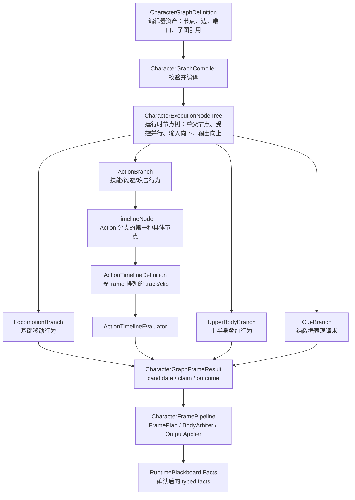
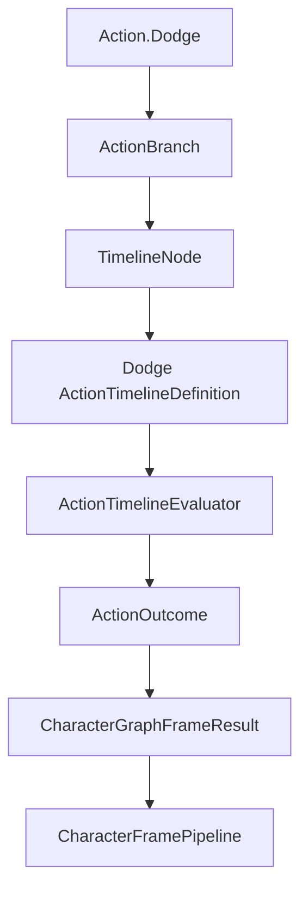

# CharacterGraph / CharacterExecutionNodeTree 目标

## 目标一句话

建立一个统一的 `CharacterGraphDefinition` 编辑器资产合同，让节点编辑器可以用图来组织角色行为；运行时第一版编译成 `CharacterExecutionNodeTree` 节点树执行结构，并继续通过现有 `CharacterFramePipeline` 统一 tick、仲裁、应用输出和写入 facts。

## 为什么要做

当前角色系统已经有 `CharacterFramePipeline`、Action Catalog、Action lifecycle、motion resolver、body claim、Animancer Presenter 和 Runtime Blackboard。缺口不是缺一条新技能管线，而是缺一个能把 Locomotion、Action、UpperBody、Cue 等行为组织到同一编辑视图里的资产合同，以及一个能被现有角色帧管线稳定消费的运行时执行树。

“图”只描述编辑器资产形态：节点、连线、端口、子图引用和 timeline 节点。正式 gameplay 不直接运行任意图。第一版运行时必须是树：每个 runtime node 只有一个父节点，输入从父节点向下传递，输出从子节点向上汇总，节点状态归节点自己持有，最终只产出候选、claim 和 outcome。

如果直接把参考项目里的节点树或 TimelinePlayer 接入运行时，会产生第二条 tick / animation / motion / blackboard 路径。目标是保留当前管线权威，只让执行树产出纯数据候选。

## 核心链路



## 概念定义

### CharacterGraphDefinition

编辑器资产合同。节点编辑器看到的是图，因为 authoring 需要节点、边、端口、子图引用、TimelineNode、未来 BehaviorTreeNode 或 StateMachineNode。

`CharacterGraphDefinition` 只保存定义，不直接移动角色、不播放动画、不写黑板、不消费输入。

### CharacterExecutionNodeTree

正式 gameplay 第一版运行结构。它由 `CharacterGraphDefinition` 编译得到，但执行语义按节点树约束：

- runtime node 只有一个父节点。
- 允许受控 parallel/composite node 在同一角色帧评估多个子分支。
- 输入只从父节点向子节点传递。
- 输出只从子节点向父节点汇总。
- 节点状态由节点自己的 runtime state 保存。
- 不允许共享 runtime node、任意合流、跨分支直接写状态或循环边。

这样做是为了让 in/out 数据流、rollback、测试和调试路径都足够明确。

### Character Branch

`LocomotionBranch`、`ActionBranch`、`UpperBodyBranch`、`CueBranch` 是顶层运行树的命名分支，不是空占位。

第一版可以只实现 Action 分支的 `TimelineNode`，但其它分支的输入、输出、空结果和诊断语义要先正式定义。

### Locomotion

基础移动行为模块，不是单纯槽位。它负责 Idle、MoveStart、MoveLoop、MoveStop、TurnBack、gait、移动方向、Run latch 和移动 facts。

第一阶段不重写 Locomotion 内部实现，而是通过正式端口把现有 Locomotion 输出接成 `LocomotionCandidate`。

### Action

动作/技能模块。负责 Dodge、Attack、Skill、HitReact 等请求、生命周期、节点树、timeline、body claim 和 action outcome。

第一阶段先实现 `ActionBranch` 的 `TimelineNode`，用 Dodge 做第一个 concrete instance。

### FullBody / UpperBody / LowerBody

这些不是 gameplay owner，而是 body/channel claim 语义。

例如 Dodge 是 Action，但它可以 claim FullBody。Aim 可以 claim UpperBody。Run 属于 Locomotion，通常输出 movement 和 base animation 候选。

### TimelineNode 与 ActionTimeline

`TimelineNode` 是 `ActionBranch` 里的具体执行节点类型。

`ActionTimelineDefinition` 是 `TimelineNode` 内部的时序数据，表达 AnimationKey、Motion、HitboxWindow、CancelWindow、Cue 等 clip。刀光、音效、hitbox window、无敌帧和 cancel window 这类时序内容优先放在 timeline 内部，不上升成顶层大树节点。

### Outcome / Candidate / Fact

`Outcome` 和 `Candidate` 是本帧候选结果，还不是最终事实。

`Fact` 是经过 `CharacterFramePipeline` 仲裁和应用后写入 `CharacterRuntimeBlackboard` 的确认结果。

节点图、执行树、timeline 和 evaluator 都不能直接写黑板。

## 第一阶段范围

第一阶段目标是建立接口和最小闭环：

1. 定义 `CharacterGraphDefinition` 编辑器资产合同。
2. 定义 `CharacterExecutionNodeTree` 运行时节点树合同。
3. 定义 Locomotion、Action、UpperBody、Cue 分支输入/输出端口。
4. 定义 `ActionBranch`、`ActionNodeDefinition` 和 `TimelineNode`。
5. 定义 `ActionTimelineDefinition`、track、clip 和 evaluator。
6. 用 Dodge 生成等价 `ActionBranch -> TimelineNode -> ActionTimeline`。
7. 将 `ActionOutcome` 继续接入现有 `CharacterFramePipeline`。
8. 保持 motion、Animancer、blackboard、body claim 主线不分裂。

第一阶段不做完整节点编辑器 UI，不重写 Locomotion，不实现完整连招、行为树、VFX/SFX/Cue 播放或真实 hitbox 结算。

## 文件夹编排

运行时代码按现有 Character module 风格组织：`Model` 放纯数据，`Runtime` 放运行时推进，`Solver` 放编译、校验和 evaluator，`Config` 放正式配置资产入口，`Diagnostics` 放诊断输出，`Contracts` 只放跨 module 的 interface。

```text
Assets/Scripts/Character/
  Graph/
    Model/
      CharacterGraphDefinition
      CharacterExecutionNodeTree
      CharacterGraphInput
      CharacterGraphState
      CharacterGraphFrameResult
      Branch definitions and ids
    Contracts/
      Character graph / branch interfaces only when another module must call them
    Solver/
      CharacterGraphCompiler
      CharacterExecutionNodeTreeValidator
      Branch output aggregation
    Runtime/
      CharacterExecutionNodeTreeRuntime
      Branch runtime state containers
    Diagnostics/
      CharacterGraphDiagnostics

  Action/
    Branch/
      Model/
        ActionBranchDefinition
        ActionNodeDefinition
        ActionTimelineNodeDefinition
        ActionBranchOutcome
      Solver/
        ActionBranchEvaluator
        ActionBranchValidator
      Runtime/
        ActionBranchRuntime state and adapters
      Diagnostics/

    Timeline/
      Model/
        ActionTimelineDefinition
        ActionTimelineTrackDefinition
        ActionTimelineClipDefinition
        ActionTimelineOutcome
        ActionTimelineValidationResult
      Solver/
        ActionTimelineEvaluator
        ActionTimelineValidator
        DodgeActionTimelineBuilder
      Config/
        Timeline authoring SO only if the Action Catalog needs asset references
      Diagnostics/

Assets/Editor/Character/
  Graph/
    CharacterGraph editor shell
    GraphView adapter / inspector / compiler preview
  Action/Timeline/
    ActionTimeline editor shell
    Track / clip view adapter
  RefImport/
    One-off Taco asset import or conversion tools, editor-only

Assets/Tests/Editor/Character/
  Graph/
  Action/Branch/
  Action/Timeline/
```

不要把 `Graph` 放进 `Action` 下面。`CharacterGraphDefinition` 是跨 Locomotion、Action、UpperBody、Cue 的顶层资产合同；`ActionBranch` 和 `ActionTimeline` 才属于 Action module。

不要把 timeline editor 代码放进 runtime 目录。timeline 的可视化是 Editor 工具，正式 gameplay 只看 `ActionTimelineDefinition` 和 evaluator 产出的 outcome。

## Ref/wly970123 复用策略

`Ref/wly970123/taco-editor` 可以复用的是 authoring 思路和部分 Editor 结构，不复用正式 runtime。

可以复用或移植的部分：

- `BaseTree / BaseNode / BaseEdge` 的资产组织思路：`[SerializeReference]` 节点列表、稳定 GUID、edge 保存起止节点和端口名、运行时建立 GUID map。
- `PropertyPort` 和 `BaseTreeView` 的端口兼容、拖线、复制粘贴、节点搜索、GraphView 操作思路。
- `Timeline / Track / Clip` 的 frame 区间、Track/Clip 分层、clip overlap/mix 校验思路。
- `TimelineFieldView / TimelineTrackView / TimelineClipView` 的编辑器交互思路。
- `TreeClip` 的“timeline 内嵌树”思路，后续可用于 TimelineNode 内嵌 SubTree，但第一版不接 runtime。

禁止复用为正式 runtime 的部分：

- `TreeRunner`
- `RunnableTree / RunnableNode` 的 Update 运行语义
- `TimelinePlayer`
- `PlayableGraph`、Animator Controller、Audio、Particle、GameObject、Cinemachine track 的直接驱动
- `TreeClip` 里的 Instantiate / Destroy / UpdateTree 执行路径
- Resources、场景对象绑定或 MonoBehaviour Update/FixedUpdate runner

推荐复用路线：

1. 第一阶段先实现自己的 `CharacterGraphDefinition`、`CharacterExecutionNodeTree`、`ActionBranch`、`ActionTimelineDefinition`，不直接依赖 Taco 命名空间。
2. 第二阶段把 Taco 的 GraphView / Timeline editor 代码作为 Editor-only adapter 迁入 `Assets/Editor/Character/...`，改成读写我们的 definition。
3. 如果需要吃 Taco 示例资产，做 `Assets/Editor/Character/RefImport` 一次性 importer，把 Taco `Timeline` / `BaseTree` 转成我们的正式 definition。
4. 所有 Ref 迁入代码必须通过静态测试确认没有进入 runtime assembly，且没有引用 `TreeRunner` / `TimelinePlayer` / PlayableGraph / Animator / Transform。

## Dodge 第一实例



Dodge 旧 variant 字段第一阶段保留为 concrete 输入，通过 adapter / builder 生成等价 timeline runtime model。`CharacterGraphDefinition`、`CharacterExecutionNodeTree`、`ActionBranch`、`ActionTimelineDefinition` 抽象层不能反向依赖 Dodge 专用类型。

## 运行时原则

- `CharacterFramePipeline` 仍是唯一角色帧权威。
- `CharacterGraphDefinition` 是编辑器资产，不是 gameplay runner。
- `CharacterExecutionNodeTree` 第一版按节点树执行，不运行任意图。
- 分支和节点只产出纯数据候选、claim 和 outcome。
- `FramePlan / BodyArbiter` 负责统一仲裁。
- `OutputApplier` 是 motion、animation、facts 的唯一副作用出口。
- `RuntimeBlackboard` 只保存确认后的 typed facts。
- Ref 中的节点资产、端口、Track/Clip、TreeClip 思路可以参考；`TreeRunner`、`TimelinePlayer` 不作为正式 runtime。

## 后续方向

1. ActionBranch 扩展更多节点：Condition、Sequence、Selector、SubGraph、StateMachineNode。
2. LightAttack 用 ActionBranch 表达 combo 分支和多段 TimelineNode。
3. Locomotion 内部逐步迁成可编辑 LocomotionBranch 子树。
4. UpperBody/Aim 通过 channel claim 进入同一个 CharacterExecutionNodeTree。
5. Cue clip 后续在表现提交模型成熟后再接正式 presentation cue submission。
6. 如果未来确实需要共享节点、合流或循环，再另开变更升级运行时图语义。

## 当前 OpenSpec

当前规划变更：

`openspec/changes/add-character-graph-contracts/`

该变更负责建立 `CharacterGraphDefinition` 编辑器资产合同、`CharacterExecutionNodeTree` 运行节点树合同、分支端口、`ActionBranch` 第一实现和 `TimelineNode / ActionTimeline` 最小闭环。
