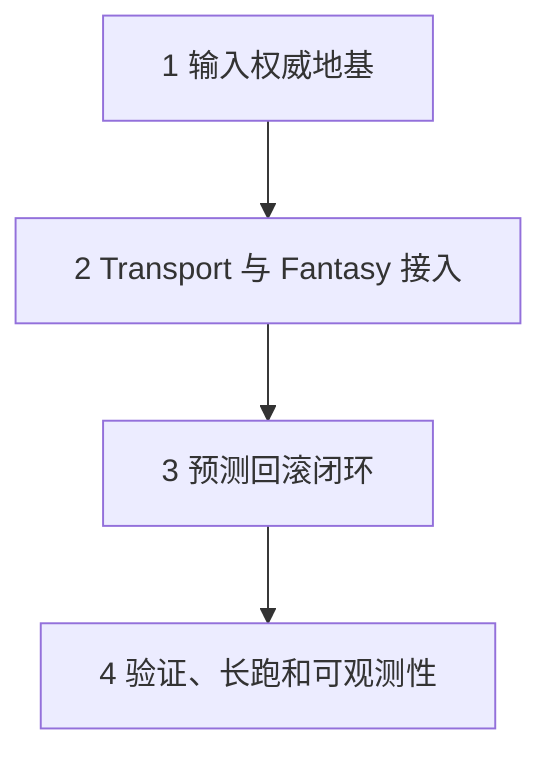

# Fantasy 预测回滚闭环建设地图

## 目标

这份地图只描述规划和实施顺序，不实现运行时代码。

最终目标是让当前 3C 角色系统在接入 Fantasy 或等价 transport 后，形成一条可以测试、可以长跑、可以诊断的预测回滚闭环：

1. 客户端采集本地输入事实。
2. 输入事实被转换为稳定的帧同步输入。
3. transport 发送输入到服务端或 fake room。
4. 服务端或 fake room 按 tick 确认多玩家输入集合。
5. 客户端在 confirmed input 到达前继续本地预测。
6. confirmed input 到达后与预测历史对比。
7. 发现分歧时恢复历史快照并重放。
8. 重放仍分叉时报告 replay nondeterminism。
9. 多端使用 strict checksum 和字段级 diagnostics 检查一致性。
10. 长跑工具输出可复现 seed、首个失败 tick 和差异字段。

它不是状态同步服务端，不是服务端角色控制器，也不是复制 `Ref/NKGMobaBasedOnET` 的 `LSF_Component`。

角色 gameplay 仍由当前 `CharacterFramePipeline` 主线推进。服务端第一阶段只做 tick/input authority、confirmed input set、session/version gate、checksum/correction 转发和诊断。

## 四个串行 Proposal

### 1. `add-frame-sync-input-authority-foundation`

输入权威地基。

这个 proposal 合并原来分散的输入帧合同、Action request 合同、confirmed input set 合同、config/version handshake 和总路线约束。

它回答：

- 什么字段能同步。
- 相机为什么不同步。
- Action request 为什么只同步输入事实，不同步动作结果。
- 服务端确认输入集合的最小单位是什么。
- 多玩家输入如何排序。
- 缺帧、重复帧、late input 如何诊断。
- 进入同步前如何检查 config/protocol/action catalog/motion profile 版本。

### 2. `add-frame-sync-transport-fantasy-adapter`

Transport 与 Fantasy 接入。

这个 proposal 合并 transport port、fake/Fantasy 共享边界、Fantasy protocol、Unity Session adapter、服务端 Handler 和 room input authority。

它回答：

- fake transport 和 Fantasy 为什么必须共用同一个 port。
- Fantasy Handler 为什么不能推进角色。
- Fantasy Entity 为什么不能泄漏进 rollback core。
- proto 应该有哪些消息类别。
- 服务端 room collector 如何只确认输入而不模拟角色。
- Unity 客户端如何把 Session send/push 转成 transport port 事件。

### 3. `add-frame-sync-prediction-rollback-closed-loop`

预测回滚闭环。

这个 proposal 合并客户端 prediction network buffer、confirmed input reconciliation、rollback/replay 接入、strict checksum 和 correction protocol。

它回答：

- pending outbound、predicted history、confirmed history、resolved input stream 如何分层。
- confirmed input 如何进入现有 `ILocalRollbackSynctestSimulation`。
- divergence tick、restore tick、replay end tick 如何确定。
- prediction correction 和 replay nondeterminism 如何区分。
- checksum 覆盖哪些 strict gameplay 字段。
- correction 是如何排队并由 simulation tick 消费，而不是 transport callback 直接写角色。

### 4. `add-frame-sync-validation-observability-soak`

验证、长跑和可观测性。

这个 proposal 合并 fake transport synctest、motion determinism audit、debug observability 和 overnight soak 输出。

它回答：

- 如何不接真实 Fantasy 先跑完整多客户端输入确认闭环。
- 如何注入 latency、reorder、duplicate、missing、late input。
- 哪些 motion source 可以承诺 strict rollback。
- 哪些 motion source 只是 presentation-only 或风险项。
- 长跑输出如何做到低噪声、可复现、可定位。
- 明天 review 时应该看哪些日志、哪些任务、哪些风险。

## GGPO 参考定位

项目内 `Ref/ggpo` 可以作为预测回滚设计参考，但不作为 Unity 运行时依赖，也不直接把 C++ GGPO 接入当前项目。

可借鉴的部分：

- `Ref/ggpo/src/lib/ggpo/sync.h|cpp`：参考它的保存帧、确认帧、检查一致性、回滚调整、递增帧语义，对应本项目第三包的 prediction/rollback closed loop。
- `Ref/ggpo/src/lib/ggpo/input_queue.h|cpp`：参考它的 input queue、frame delay、confirmed input、first incorrect frame、discard confirmed frames，对应本项目的 prediction buffer 和 confirmed history。
- `Ref/ggpo/src/lib/ggpo/timesync.h|cpp`：参考它的 frame advantage / recommended wait 思路，但本项目第一阶段只规划，不强行做动态 timesync。
- `Ref/ggpo/src/lib/ggpo/backends/synctest.*`：参考它的本地 synctest 思路，对应第四包 fake transport synctest 和 soak。
- `Ref/ggpo/src/apps/vectorwar`：参考最小 demo 如何把 input、advance、save/load、checksum 串起来。

不能照搬的部分：

- 不把 GGPO C++ 库作为 Unity runtime dependency。
- 不用 GGPO UDP backend 替代 Fantasy adapter。
- 不把 GGPO 的 P2P session 结构直接套到当前 Fantasy room authority。
- 不把 GGPO 的 game state buffer 直接等同于当前 `CharacterSimulationSnapshot`。
- 不绕过当前 `CharacterFramePipeline` 去适配 GGPO callback。

## 串行顺序

## 关键约束

- 不新增服务端角色控制器。
- 不同步相机。
- 不同步 Cinemachine、Animancer、Animator、AnimationClip、InputAction、GameObject、Transform 或场景实例引用。
- 不把 `FullBody` 写成 source、slot、graph owner 或 rollback adapter。
- 不复制 `Ref/NKGMobaBasedOnET` 的 `LSF_Component` 主线。
- 不新增独立角色控制器路径。
- 不绕过 `CharacterFramePipeline`。
- 不直接调用 `CharacterController.Move` 作为网络回滚修复。
- 不做 fallback 配置。
- 不把手动验证写进 OpenSpec `tasks.md`。

## 最终闭环定义

四个 proposal 串行完成后，闭环必须满足：

- fake transport 可以驱动两个或多个本地 client 的 confirmed input。
- 客户端可以在 confirmed input 未到达时预测推进。
- confirmed input 到达后可以检测预测分歧。
- 分歧可以通过现有 rollback/replay 主线恢复并追帧。
- 相同 resolved input 重放仍分叉时返回 replay nondeterminism。
- strict checksum 可以发现多端 gameplay 字段不一致。
- correction request 不直接写角色，而是排队进入 simulation tick。
- 长跑可以输出 seed、tick、confirmed tick、restore tick、reason 和 differences。

## 明天 Review 顺序

1. 先看 `add-frame-sync-input-authority-foundation`，确认同步字段和 confirmed input 语义没有错。
2. 再看 `add-frame-sync-transport-fantasy-adapter`，确认 Fantasy 只在 adapter 层，不侵入 rollback core。
3. 再看 `add-frame-sync-prediction-rollback-closed-loop`，确认闭环没有新建第二角色主线。
4. 最后看 `add-frame-sync-validation-observability-soak`，确认今晚可以跑长任务，明天能定位结果。

## 与当前 Specs 的对齐

- `simulation-tick-system`：所有网络输入、确认集合、快照和 correction 都使用 `SimulationTick`。
- `local-rollback-synctest-foundation`：rollback core 只依赖纯数据和 simulation adapter。
- `local-latency-reconciliation`：真实网络 confirmed input 替换本地 delayed remote input，但 reconciliation 语义不变。
- `character-frame-rollback-replay`：replay 必须复用 `CharacterFramePipeline`。
- `prediction-rollback-authority-scopes`：strict checksum 只覆盖 strict gameplay 字段，presentation drift 可诊断但不决定失败。
- `cinemachine-third-person-camera`：相机为 local-only，replay 只使用 camera basis/input intent。
