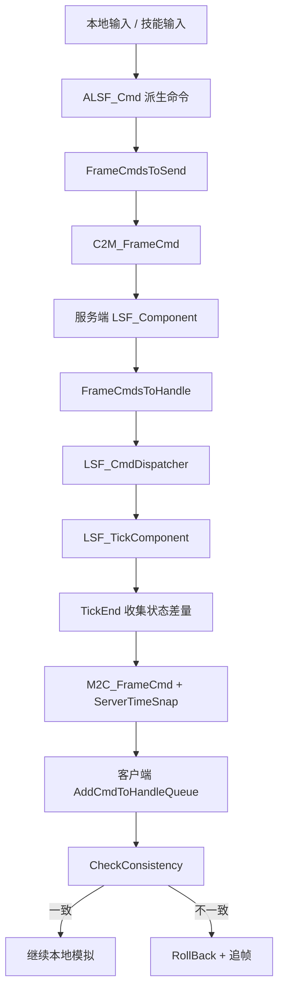

# NKGMobaBasedOnET 帧同步参考评估

## 结论

`Ref/NKGMobaBasedOnET` 值得借鉴的是状态帧同步的网络组织方式、命令队列、预测缓冲、一致性检查、追帧回滚、逻辑 Tick 与表现 Tick 分离，以及技能/黑板/ Buff 的差量快照思想。

它不适合直接搬到 3C。原因是它深度绑定 ET Entity、SERVER 条件编译、NPBehave 黑板、Box2D/寻路、protobuf-net 多态命令和 MOBA 技能语义。3C 应该吸收机制，不吸收类型体系。

对 3C 来说，正确落点不是新增服务端角色控制器，而是形成：

```text
本地输入采样
-> 确定性 Gameplay Intent
-> PredictionInputFrame / FrameSyncInputFrame
-> ConfirmedInputSet
-> CharacterFramePipeline
-> CharacterSimulationSnapshot strict hash
-> mismatch correction / rollback replay
```

## 参考项目主链路

参考项目 README 明确目标是“状态帧同步战斗系统，包含预测回滚”。实际代码里主线是：



关键文件：

- `Proto/OuterMessage_Map.proto`
- `Unity/Assets/Model/NKGMOBA/Battle/LockStepStateFrameSync/Component/LSF_Component.cs`
- `Unity/Assets/Hotfix/NKGMOBA/Battle/LockStepStateFrameSync/LSF_ComponentUtilities.cs`
- `Unity/Assets/Hotfix/NKGMOBA/Battle/M2C_FrameCmdHandler.cs`
- `Server/Hotfix/NKGMOBA/Handlers/Map/C2M_FrameCmdHandler.cs`

## 可以借鉴的机制

### 1. 命令对象化

参考项目用 `ALSF_Cmd` 作为所有帧同步命令基类，字段包括 `Frame`、`LockStepStateFrameSyncDataType`、`UnitId`。移动、技能输入、普通攻击、创建碰撞体、同步属性、同步 Buff、同步黑板都作为命令派生。

3C 可以借鉴为：

- `FrameSyncInputFrame`
- `FrameSyncCommand`
- `FrameSyncCommandType`
- `FrameSyncPlayerId`
- `FrameSyncUnitId`
- `ConfirmedInputSet`

但 3C 不应该照搬字符串 `InputTag/InputKey`。动作请求应该使用 stable id、枚举或正式 action id，例如 `Action.Dodge`、`Action.Attack.Light`。

### 2. 本地预测缓冲

参考项目客户端发送命令时，会同时放入：

- `PlayerInputCmdsBuffer`，用于本地预测和回滚重放。
- `FrameCmdsToSend`，用于本帧末尾发送给服务端。

3C 已有 input history / snapshot history，可以借鉴它的队列分工，但命名应收敛为：

- `PredictedInputHistory`
- `ConfirmedInputHistory`
- `PendingOutboundInputQueue`

不要把网络层命令队列塞进 `CharacterFramePipeline` 内部。Pipeline 只消费已经确定的 `CharacterFrameInput`。

### 3. 服务端作为帧序与输入权威

参考项目服务端收到 `C2M_FrameCmd` 后，把命令加入 `FrameCmdsToHandle`，在服务端 LSF Tick 中处理，再通过 `M2C_FrameCmd` 广播。它还携带 `ServerTimeSnap`，客户端据此估算服务端当前帧。

3C 可以借鉴：

- 服务端分配/确认 tick。
- 服务端广播 confirmed input 或 confirmed command。
- 客户端根据 confirmed tick 做回滚与追帧。
- 服务端不需要拥有一套独立的 3C 角色控制器。

### 4. TickStart / Tick / TickEnd 分相

参考项目 `ILSF_TickHandler` 把逻辑拆为：

- `LSF_TickStart`
- `LSF_Tick`
- `LSF_TickEnd`
- `LSF_CheckConsistency`
- `LSF_RollBackTick`
- `LSF_ViewTick`

这和 3C 当前 `SimulationTickPhaseOrder`、`CharacterFramePipeline`、strict/presentation snapshot scope 是能对上的。

3C 应该借鉴分相思想，而不是借鉴 ET 的 ticker dispatcher。建议映射：

| NKGMoba | 3C |
|---|---|
| `LSF_TickStart` | `ReadInput / UpdateInputBuffer / BeginFrame` |
| `LSF_Tick` | `GameplayDecision / BuildMotion / ExecuteMotion` |
| `LSF_TickEnd` | `WriteSnapshotAndEvents` |
| `LSF_CheckConsistency` | strict snapshot/hash compare |
| `LSF_RollBackTick` | `RestoreSimulationSnapshot` |
| `LSF_ViewTick` | presentation update / interpolation |

### 5. 差量快照

参考项目对 NPBehave 黑板和 Buff 做了 whole snapshot 与 delta snapshot：

- `FrameSnaps_Whole`
- `FrameSnaps_DeltaOnly`
- `NP_RuntimeTreeBBSnap.GetDifference`
- `BuffSnapInfoCollection.GetDifference`

3C 可以借鉴“每帧收集 strict 数据，再做差量/校验”的思想。不要同步黑板本身。3C 更适合把差量对象定义为：

- `CharacterFrameStrictSnapshot`
- `CharacterFrameStrictHash`
- `CharacterFrameCorrection`
- `CharacterFrameDeltaDiagnostic`

差量可以用于日志、调试和网络纠偏，但正式 gameplay 权威仍然来自 `CharacterSimulationSnapshot` 的 strict 字段。

### 6. 表现 Tick 分离

参考项目 `OnLSF_ViewTick` 独立处理视图插值，例如移动表现用 `ViewPosition` / `ViewRotation` 插值到逻辑位置。

3C 应该保留这个思想：

- gameplay tick 只决定 position/yaw/state/action/window。
- presentation tick 处理 Animancer、相机、VFX、SFX、插值。
- 回滚只回 strict gameplay 和必要 presentation restore，不把相机 smoothing 同步给网络。

### 7. 帧同步计时器

参考项目 `LSF_TimerComponent` 用 frame 而不是真实时间驱动等待、一次性计时、重复计时。

3C 后续动作窗口、取消窗口、Buff、hit stop、combo buffer 都可以借鉴这种思路：正式 gameplay 计时用 tick/frame，表现层再换算秒。

## 不建议照搬的部分

1. 不照搬 ET Entity/Component/System。
2. 不照搬 `#if SERVER` 双端编译结构。
3. 不照搬 NPBehave 黑板同步。
4. 不照搬字符串输入 `InputTag/InputKey`。
5. 不照搬 `LSF_MoveCmd` 里同步 position/rotation/speed 的口径作为 3C 输入帧。
6. 不照搬服务端完整战斗 ECS。
7. 不照搬 Box2D 碰撞同步。
8. 不照搬 KCP 和 protobuf-net 多态基类作为正式依赖。
9. 不把服务端做成新的角色运动权威路径。
10. 不把表现层相机、Animancer 状态、VFX 状态纳入帧同步。

## 和 3C 当前架构的对齐方式

### 网络输入

参考项目：

```text
LSF_PlaySkillInputCmd(InputTag, InputKey, Angle, TargetPos, TargetUnitId)
```

3C 应该变成：

```text
FrameSyncInputFrame(
  tick,
  playerId,
  moveIntent,
  lookIntent,
  runHeld,
  actionButtons,
  targetIntent,
  actionRequestIds
)
```

其中 `moveIntent` 应该是相机折算后的确定性 gameplay intent。相机不参与同步。

### 服务端职责

参考项目服务端会处理 LSF Tick 并广播状态/命令。3C 第一阶段不需要这么重。

建议 3C 服务端第一阶段只做：

- 收集输入帧。
- 排序输入帧。
- 确认 tick。
- 广播 confirmed input set。
- 转发 strict hash mismatch。
- 保留可选抽样校验接口。

### 回滚职责

参考项目按组件做 `CheckConsistency` 和 `RollBackTick`。3C 已经有更集中的 `CharacterSimulationSnapshot`。

3C 应该继续走：

```text
CaptureSimulationSnapshot
-> Compare strict fields/hash
-> RestoreSimulationSnapshot
-> replay confirmed inputs
```

不要把每个 runtime module 都变成独立回滚权威。模块可以提供 restore state，但统一快照入口应保持在角色 frame runtime adapter/core 边界。

### 技能与动作

参考项目的双端行为树技能系统适合借鉴“技能逻辑数据化”和“客户端表现节点分离”的方向，但 3C 已经有 Action domain、CommittedAction branch/timeline、body claim、channel output。

所以映射方式应该是：

| NKGMoba | 3C |
|---|---|
| Skill graph | `CharacterActionDefinitionSO` |
| NPBehave blackboard | formal action runtime facts / action local state |
| Skill input cmd | action request input frame |
| Buff snap | future status/effect strict snapshot |
| CreateCollider cmd | future hitbox/hurtbox/action spawn command |
| Client special action | presentation channel/cue |

## 建议后续 OpenSpec change

如果要正式实施，建议新建 change：

```text
add-frame-sync-network-contract
```

核心 proposal 口径：

- 建立 3C 帧同步网络 contract。
- 服务端只做帧序、输入确认、广播和校验，不新增角色控制器。
- 客户端和未来服务端校验都必须复用 `CharacterFramePipeline` 的输入/快照 contract。
- 相机不进入同步，进入同步的是相机折算后的 gameplay intent。
- strict hash 只来自 gameplay 快照字段。

建议拆成这些细任务：

1. 定义 `FrameSyncInputFrame`。
2. 定义 `ConfirmedInputSet`。
3. 定义 `FrameSyncTickStamp`。
4. 定义 `FrameSyncChecksum`。
5. 定义 `FrameSyncCorrection`。
6. 建立 `PredictionInputFrame` 到 `FrameSyncInputFrame` 的映射规则。
7. 建立 strict snapshot hash 字段表。
8. 写 fake transport 测试。
9. 写 confirmed input replay 测试。
10. 写 late input rollback 测试。
11. 写 no-camera-sync hash 测试。
12. 写 action request stable id 测试。
13. 写 move intent deterministic test。
14. 写 mismatch diagnostic 输出测试。

## 可以跑一晚上的任务

最适合长跑的不是直接接 Fantasy，而是先做 contract 和测试纵切：

1. 扫描当前 `PredictionInputFrame` 与 `CharacterFrameInput` 字段，列出能同步、不能同步、需要改名的字段。
2. 写 `add-frame-sync-network-contract` 的 proposal/design/spec/tasks。
3. 生成 strict hash 字段清单。
4. 设计 fake server confirmed-input loop。
5. 给 local rollback runner 增加 confirmed input set 场景测试。
6. 增加相机状态变化不影响 strict hash 的测试。
7. 增加动作请求 stable id 序列化测试。
8. 增加同 confirmed input 多客户端重放一致性测试。

## 最小实施路线

第一步：不接真实网络，只实现 fake confirmed input loop。

第二步：把 `PredictionInputFrame` 收敛成正式 `FrameSyncInputFrame` 或明确两者关系。

第三步：基于 `CharacterSimulationSnapshot` strict 字段生成 hash。

第四步：用两个本地模拟实例跑同一组 confirmed inputs，验证 hash 一致。

第五步：制造 late input，验证从分歧 tick restore 后 replay 能回到一致 hash。

第六步：再接 Fantasy 或其它真实 transport。

## 最重要的边界

3C 应该借鉴 NKGMoba 的状态帧同步思想，但不能让参考项目把当前架构带偏。最终边界要保持：

```text
网络层只生产 confirmed gameplay input
角色层只消费 CharacterFrameInput
运动权威只在 motion driver/executor
动作权威只在 Action domain
仲裁权威只在 CharacterFramePipeline / BodyArbiter
表现层只消费 frame output
回滚只走 CharacterSimulationSnapshot
```

只要这个边界不破，就可以大胆吸收 NKGMoba 的帧同步经验。
