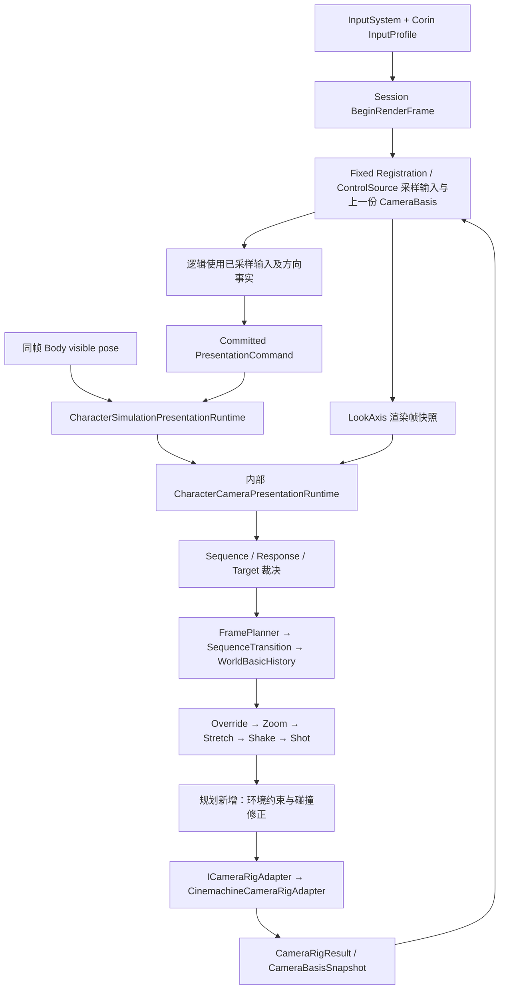

# 3C 摄像机现状与统一规划

修订：v1，2026-09-13。状态：待用户评审，未授权实施。本文不执行 OpenSpec workflow，不修改代码、资产或现行 spec。

规划窗口：`01a098bd-a5c1-7283-8aab-59736bab97f5`。实现窗口：`01a098bd-bbdf-7d50-b1cc-95339d3bbf8d`，保持 `WAITING_FOR_PLANNING_DOCUMENT`。本文不是实施指针。

## 1. 现在摄像机怎么样

当前已经有可复用的统一表现链：输入按渲染帧采集，角色表现姿态驱动相机跟随，Sequence 提供构图，Response 控制手动响应，效果修改计划，Adapter 输出给 Cinemachine。下一步应补齐这条链的能力和作者合同。

历史上的“默认轨道直接覆盖鼠标角度”已经不能作为当前问题描述：当前 `CharacterCameraFramePlanner` 使用 `m_YawOffset/m_PitchOffset`，轨道计算明确加上偏移。不能再次按旧方案改写这部分已完成的合成。

现有实现还不能等同于完整动作游戏摄像机：碰撞被明确禁止启用；Override、Shake、Shot 在编译端明确拒绝；锁定参数没有发现实际锁定求解消费者；默认构图存在单位命名和重复配置问题；跟随平滑的速度每帧被清零。当前没有取得现场运行帧，所以本文不能评价实际鼠标手感、角色在屏幕上的最终占比或穿墙出现频率。

| 业务能力 | 当前静态证据 | 本次结论 |
|---|---|---|
| 基础构图 | 默认 Track、FOV、距离、偏移均有求值 | 已有实现；作者字段语义需统一 |
| 角色跟随 | 使用 Body visible pose 与初始绑定偏移 | 保留，不能改回离散 logic Transform 跟随 |
| 鼠标视角 | 输入 Y 已反转，灵敏度 0.12，轨道角度加手动偏移 | 旧覆盖问题已修；动态采样未验证 |
| 平滑 | Pivot、Radius、Offset、FOV 使用 SmoothDamp，Rotation 使用指数插值 | 有实现，但每帧清零 SmoothDamp 速度，需修正或正式更换公式 |
| 动作镜头 | Sequence/Response/Target 请求、生命周期、Zoom/Stretch owner | 有框架与部分公式；不据此宣布每个攻击镜头都生效 |
| Shake / Shot / Override | Compiler 抛出消费者语义未闭合错误 | 当前不可用，不可仅挂资源或勾选启用 |
| 目标锁定 | 目标 Key→Transform 解析，Locking 配置关闭 | 目标换点不等于锁定、双目标构图或自动选敌 |
| 碰撞与遮挡 | Collision.Enabled=false；Projection 开启即报错 | 当前未发布正式求解能力 |
| 调试 | 有 Plan/Result/TargetSource/ProjectionRevision 与既有诊断算子 | 能看部分结果；不能完整解释原始输入、响应权、平滑和碰撞原因 |

## 2. 证据边界与工作区

### 2.1 静态证据

目录为 `D:\Unity_Project_1\3C`，分支 `main`；调查时读取到 HEAD `c8334f7ef`。工作区存在大量用户已有的生成产物、代码、配置与 prefab 修改，本文读取的是工作区内容，并非干净提交快照。

特别需要保护：

- `CharacterFixedInputTraceWorkflow.cs` 已有约 101 行增加、1 行删除，同时仍引用旧相机 Controller。后续不能为清理旧相机覆盖这份改动，必须先确认同一段代码是否仍被其它工作修改。
- `CorinGameplayLabFixedPlayer.prefab` 已修改。本文核对它的相机绑定，但不授权覆盖 prefab。
- 本次针对 Camera Runtime、CameraContracts、默认相机资产和 GameLab 相机根 prefab 的状态筛选未见相关修改；共享工作区仍可能继续变化，实施前需重新核对。

### 2.2 Unity 实时证据

本次通过本机正式 Unity MCP CLI 查询：最初列出 `3C_Client@1e41b3a3e2ded45f`、Unity `2022.3.62f2c1`。随后向该纯 hash 显式发送 `get_project_info` 时返回 HTTP 503：`No Unity instances connected`。之后 `status` 证明 HTTP 服务器仍在线，`instance list` 为空。

因此没有成功核对该实例的 `project_path`、场景、Play 状态、Console、运行时 Camera 绑定或画面。看到 Unity 进程存活不构成项目身份和 Editor 状态证据。本机 Editor.log 中有导入与编译错误历史记录，但未与当前已连接实例及当前 Console 对齐，不用于给摄像机故障归因。

本次没有进入或退出 Play，没有 Refresh/Build，没有生成测试，没有运行 batchmode，没有截图，没有伪造鼠标事件。已检查正式 CLI 的能力，未发现独立连接未注册 Editor 的命令；不注入脚本、不重启用户 Editor、不更改全局 active instance。后续连接恢复后，第一步仍是显式 hash 与项目路径复核。

### 2.3 历史线索

2026-09-11 的 GameLab 输入诊断仅用来定位代码与确认保留默认轨道的设计意图。本文关于“偏移已经相加”的结论来自本次源码。旧诊断没有成功的回放基线，不能作为本次动态验证。

## 3. 正式入口与数据如何流动

磁盘启动配置 `GameplayLabLocalFixedVariant.asset` 指向 `GameplayLabLocalFixed.prefab`，数值配置为 `fixed-q32.32`、ABI 7，并引用正式 Program、PresentationProjection、Composition。

GameLab prefab 中 `Gameplay Camera` 带 Unity Camera、CinemachineBrain、CinemachineCameraRigAdapter。Adapter 显式绑定 `Character Camera Virtual` 与 Brain；虚拟相机 Follow/LookAt 为空，使用求值后的世界位姿。Brain 序列化 `m_UpdateMethod=3`；当前 Adapter 要求 `ManualUpdate` 并主动调用 `brain.ManualUpdate()`。这些是磁盘配置，仍需实时核对场景中的实际实例。

嵌套的 `CorinGameplayLabFixedPlayer` 由 GameLab prefab 覆盖 `m_CameraRig` 引用。角色 prefab 的 `m_CameraLookInputValueId=LookAxis`，显式绑定 follow 与 `CameraAimAnchor`，额外 TargetBindings 为空；AimAnchor 在父节点局部 Y=1.25。绑定以运行初始化时的 body-relative 偏移保存，不能直接把 1.25 视为最终世界取景高度。

其中 Override、Shake、Shot 只是当前 owner 注册位置，当前启用会被拒绝。环境约束是拟新增能力，不是现有执行阶段。

输入处理细节：InputProfile 将 `MoveAxis`、`LookAxis` 与 Attack/Dodge 请求绑定到 InputAction；Look 源为 `<Pointer>/delta`，处理器已经反转 Y；Attack 源为 `<Mouse>/leftButton`。`CaptureRenderFrame` 一次读取本帧输入并锁存 CameraBasis，攻击作为请求留待逻辑消费；相机在 Presentation 读取锁存的 Vector2，不直接轮询 Mouse。禁止把技能抑制镜头实现为关闭输入采集。

移动方向使用采样时的 CameraBasis，而相机本帧输出产生下一份 Basis。这是需要明确的时间边界：不能为了“减少一帧”让固定逻辑随时读取正在变化的相机，也不能在一帧多个 logic tick 时重复累计鼠标增量。

## 4. 可见问题与业务影响

### 4.1 默认轨道已保留，但鼠标俯仰不改变轨道采样位置

默认资产的三条轨道为 `(height,radius)=(2.225,2.5)/(0.225,3.75)/(-0.775,2.2)`，ElevationRatio=0.5，PolarAngle=0，FOV=50。当前 SampleTrack 在三条轨道间连续插值，但默认配置始终采中间轨道；鼠标通过独立角度偏移旋转这个采样结果，不会推动 ElevationRatio。

这不自动构成 bug：它是一种明确的取景方式。保留当前“固定基础轨道+角度偏移”时，上下转动保持采样距离与偏移；若要上下视角同时改变距离和角色屏幕位置，需要把俯仰正式映射到轨道参数。两者只能选择一套正式语义，不能临时再叠加 FreeLook。

当前 PitchOffset 与最终 track pitch 都按同一范围夹紧，后续 EulerOffset 仍可能再改变角度。需要区分“玩家能转到的最终角度范围”与“动作演出可额外增加的角度”，再决定限幅位置；不要未经确认改掉当前已修正的角度方向。

### 4.2 跟随平滑内部状态不连续

`CameraWorldBasicHistory.Apply` 执行 SmoothDamp 后调用 `SetCurrent`，该函数每次把全部速度清零。静态上可以确认它没有保留标准连续阻尼所需的速度状态；这会改变参数所代表的运动过程。具体拖尾、帧率差异和主观迟滞程度仍需动态采样。

同一个 SmoothTime=0.15 同时约束 follow、orbit rotation、radius、offset 和 FOV。业务上，角色追踪需要平顺，鼠标转向需要及时，动作 FOV 需要保持作者曲线；这些职责不应被一个参数含糊地控制。Sequence 混合后又做整体平滑，也需要明确它是否延长作者指定的切镜时间。

### 4.3 构图字段单位与数据所有权不清

`CameraWorldBasicData.CameraToPivot = Rotation * (Offset.x,Offset.y,Radius)`，所以当前 Offset 以 Unity 世界长度参与公式。Track 字段却名为 ScreenOffsets，值包含 0.5；AspectRatio 从 authoring 编译到 payload，但当前 Planner 不消费它。不能把 0.5 宣称为屏幕中心，也不能认为换分辨率后构图已经按作者比例保持。

Profile 的 DefaultOrbitGroup 与默认 Sequence 的 CameraOrbits 重复；当前 Planner 采样 Sequence，未发现 runtime 使用 Profile 的 DefaultOrbitGroup 求位姿。DefaultSphere/DefaultFOV 又作为部分 stage 的初始值，有实际消费者，不能不分析 stage 完整性就全删。

`CameraLocateRadius`、`RotationTransitionSeconds`、`ChangeAvatarTransitionSeconds`、Locking 等字段在本次运行链搜索中未找到对应求值用途；校验、哈希和拷贝不等于业务消费。应形成字段到消费者清单，确认不用再从 schema、资产、编译和作者 UI 一起删。换人不属于此次业务范围。

### 4.4 扩展入口存在，业务能力未闭合

Sequence 编译目前支持 ByHeight、ByScreenOffset、ByTrack、EulerOffset 四类 stage；其余类型报错。MakeContextDependent、PlayLength、AspectRatio 等已编译字段需要逐项确认消费者，不能增加更多“能填但不生效”的字段。

Response 已提供 Full/Suppressed/Weighted；当前相同 priority、weight 的候选在前置 `<=` 判断中被跳过，后续 generation/action/cycle 比较无法处理完全同权候选。若业务需要稳定抢占，应统一三类 resolver 的同权规则，记录来源，不依赖字典插入顺序。

TargetResolver 解析显式 Key 对应的 Transform；Planner 将目标点作为 pivot/aim 输入使用。它没有完成“玩家和敌人同时入镜”的解法，更没有负责选择哪个敌人。镜头不能擅自搜索敌人来填补业务目标。

Zoom/Stretch 有现有资源与求值实现；Corin Profile 各注册 18 个资源。Override、Shake、Shot 注册数组为空且 Compiler 明确拒绝其消费者语义，碰撞开启会在 Projection 校验报错。不能通过删除报错来宣布完成能力。

### 4.5 调试与旧路径

CameraDebugSnapshot 当前只有 Plan、Result、TargetSource、ProjectionRevision；已有连续性、Cue 生命周期与路由诊断算子可复用，但本次没有执行它们。

`ThirdPersonCameraController` 仍保留 FreeLook 与单独的敏感度、朝向操作。Assets 的 `.prefab/.unity/.asset` 中未搜索到该脚本 GUID 的引用，但 `CharacterFixedInputTraceWorkflow` 仍通过场景搜索寻找它来记录/恢复 yaw；故目前不能只删除 Controller。清理要把诊断调用同步迁到正式相机状态入口，同时保护该文件现有改动。PerformanceCameraInputOverride 是已有诊断输入入口，本次不把它改造成正式操作输入，也不因名字像覆盖层就直接删除诊断能力。

## 5. 目标、输入输出与模块合同

完成后的业务目标：玩家能稳定观察角色、用鼠标转向、按当前观察方向移动；动作镜头在声明的时间内进入与退出；墙体限制镜头位置；作者能解释每个配置对最终画面的影响。保持单角色本地相机所有权，不把相机状态加入网络同步或确定性角色状态。

| 模块 | 正式输入 | 正式输出 | 只负责什么 |
|---|---|---|---|
| Input/control source | InputProfile、设备输入、明确焦点状态 | 一份渲染帧 Look 与供 logic 使用的输入事实 | 采样、单位和时序；不决定演出抑制 |
| Presentation runtime | committed command、Body visible pose、Look、时间上下文 | 当帧相机计划、状态诊断 | 唯一生命周期与调度边界 |
| Sequence/Response/Target resolver | 强类型请求、显式绑定 | 当前胜出请求与原因 | 权重、来源、目标有效性；不碰 Cinemachine |
| FramePlanner | 基础构图、手动角度、目标快照 | 无历史的期望构图 | 计算位置、角度、FOV；不做 Physics 查询 |
| Transition/History | 期望构图、delta、切镜/重置原因 | 连续的基础计划 | 唯一混合与平滑历史 |
| 各 Effect owner | 基础计划、资源、已提交请求 | 修正后的计划及贡献 | 效果自己的时空语义与结束行为 |
| 环境约束求解器（新增） | 效果后的计划、正式碰撞配置、环境查询端口 | 安全计划、命中与修正原因 | 限制最终位置与恢复距离；不修改角色目标 |
| Unity 环境查询实现（新增） | 查询形状、起终点、过滤条件 | 命中距离、法线、对象标识 | 封装当前 Unity Physics 场景，不作镜头业务裁决 |
| ICameraRigAdapter | 已裁决的 CameraFramePlan | 实际 CameraRigResult 与 Basis | 应用相机输出，不另起输入、目标或阻尼状态机 |
| 诊断投影 | 上述现成快照 | 作者可读视图/采样证据 | 不重新计算另一套“正确镜头” |

扩展现有合同，避免平行 CameraManager：

1. 渲染帧输入快照应可追踪 FrameId、采集值、消费值、响应模式；若支持手柄，必须区分鼠标位移与摇杆角速度。当前 Profile 是 Keyboard&Mouse，手柄不应因全局 InputActions 有绑定就被宣布支持。
2. Reset 需要说明是首次绑定、角色瞬移、回放恢复还是退出会话。手动角度是否保留、History 是否清空由明确原因决定，不能所有位置修正都默默把玩家视角归零。
3. 碰撞设置只存在于正式 Profile→Projection 链。接口名字实施时按同目录惯例定，但业务输入必须有当前位置/期望位置、检测半径或近裁剪保护体、LayerMask、Trigger 规则、自身过滤、delta 与 Reset；输出区分未命中、已修正、起点重叠/无合法空间。
4. 临时丢失战斗目标由正式目标生命周期结束请求，并按 BlendOut 返回默认 Sequence；漏绑必需目标是配置错误，继续明确失败。不能把配置错误伪装成正常解锁。
5. CameraBasis 仍从实际输出返回；用于技能方向的值必须在输入/动作事实中固定下来。是否剥离 Shake 的角度影响需要业务确认，不偷偷引入第二套无名方向源。

## 6. 并列业务取舍

以下是可选设计，不是优先级排序。草案建议用于让评审具体化；尚未视为用户确认。

| 决策 | 方案 A 与业务收益/代价 | 方案 B 与业务收益/代价 | 草案建议 |
|---|---|---|---|
| 构图和平滑由谁拥有 | 现有 Planner/History 求解，Cinemachine 负责落地；诊断能解释完整计划，需要自己维护求值 | Cinemachine 负责 orbit/damping，Planner 只表达目标；可直接使用其组件调参，但需迁移现有数据公式、收回 History 权限并改计划合同 | A，沿当前正式代码；需修订冲突 spec，不能双重平滑 |
| 鼠标俯仰与三轨道关系 | 固定采样基线+独立角度偏移；延续当前修复，观察距离稳定 | 俯仰映射 ElevationRatio；俯视/仰视自动改变距离与屏幕位置，需要重新标定手感和构图 | A；B 如被选中就完整迁移该 stage 语义 |
| Offset 的作者单位 | 正式命名为相机局部空间长度；沿用当前画面，不保证屏幕百分比恒定 | 正式采用 viewport 坐标，结合实际 FOV/宽高比/距离求解；画面位置可直接指定，所有旧偏移需标定迁移 | 未决，不能凭字段名判断旧数据含义 |
| 平滑参数模型 | 单一时间常数；作者配置少，但鼠标与跟随/镜头曲线耦合 | 分离跟随、手动旋转、构图过渡；输入及时，动作时长可控，增加少量清楚标注的参数 | B；不为每个字段无差别增加独立开关 |
| 出生与重置朝向 | 世界基准角度；固定取景可预测，但不同出生朝向可能看角色侧面 | 出生时由角色朝向建立基准，之后玩家偏移独立；更像背后起镜，需要明确定义重生/瞬移是否重建 | 未决，保持当前行为直到确认 |
| 近战镜头控制 | 自由观察，动作仅调整 FOV/距离与短时反馈；玩家控制稳定 | 锁定时围绕角色与敌人构图，限定手动修正；攻击对象清楚，但需要选敌、解锁、切换目标规则 | 两者作为明确业务状态共用同一链；是否纳入锁定由用户定 |
| Shake 的目标 | 继续按已收集来源补齐消费者证据；保留还原目标，交付依赖证据 | 为 3C 定义自己的有限振幅/频率/衰减合同并替换不适用的来源字段；实现可控，但不宣称复现原游戏 | 未决；不能保留旧来源合同却填入猜测公式 |
| 遮挡解决方式 | 碰撞与视线遮挡统一为缩短镜头距离，恢复时平滑；规则容易解释，近墙可能很近 | 碰撞限制位置，额外请求遮挡物淡出；距离更稳，但涉及材质/渲染所有权和透明排序 | A 作为完整基础能力；B 要显式增加渲染任务范围 |
| 目标锁定与瞄准 | 先声明并消费现有业务选定目标；镜头不参与选敌，边界清楚 | 新建明确的目标选择业务，提供循环切换、离开范围/死亡解锁；可形成完整锁定操作，但跨出相机求值模块 | 若要求完整锁定体验则选 B；不能以 A 冒充已完成选敌 |

碰撞不是低优先级的演出请求。无论自由、锁定还是动作特写，最终位置都先满足环境限制，再谈构图偏好；UI 焦点影响当前响应权，绝不吞掉 Attack/Dodge 的业务请求。Sequence、Response、Target 各有独立裁决域，不能用一个全局 priority 数字解释所有业务。

## 7. 实施顺序与完成定义

顺序表达依赖关系，不替用户判断业务价值。用户确认范围后，实现窗口按每步中文小提交执行，并在独立实现记录中记录改动与证据；不新增测试文件，不把人工验收写为 OpenSpec task。

### 步骤 1：固定业务合同与当前基线

确认第 6 节影响语义的选择，解决第 9 节 spec 冲突。恢复可用 Editor 连接后核对真实项目/场景/Session/CameraRig；保留当前工作区差异记录。明确输入焦点、鼠标单位、俯仰限幅、Reset 与镜头方向反馈的合同。既有角度相加、Y 反转和可见 Body pose 链不再重复修改。

完成定义：一份可下发的已确认修订明确哪些能力这轮交付、哪些仍不可用；记录当前 Program/Projection 身份，避免新源码配旧产物。

### 步骤 2：完整收敛基础摄像机

根据已选合同处理连续阻尼状态与参数职责、构图单位、默认轨道所有权和无消费者字段。Track 继续作为 Corin 默认基础资产；Profile 保留全局输入、镜头裁剪、平滑、环境配置与资源注册职责。若将基础构图全部归入 Sequence，需要补齐所有受支持 stage 的完整输入，迁移 DefaultSphere/DefaultFOV 的实际消费者后再删除重复初始化数据。

同步修改 authoring→validator/hash→compiler→payload→evaluator→资产→正式生成产物，拒绝旧 schema/Projection，不保留旧字段兼容读取。作者 UI 从同一正式字段投影，只显示有效参数及单位；共享曲线提供真实 owner 导航，不复制曲线。不要在 OnInspectorGUI 中做编译、遍历大产物或重求值。

完成定义：默认跟随、鼠标旋转、重置、构图和平滑只有一条求解路径；作者改一个正式字段可追踪到对应输出；未知能力明确报错。

### 步骤 3：接入完整碰撞与遮挡收缩

在效果求值后、Adapter 前接入唯一环境约束阶段。抽象查询与 Unity Physics 实现分离，按实际帧计划位置检测，而不只缩放某个未应用偏移的 orbit radius。为近裁剪面设置正式保护体；处理起点重叠、薄墙、急转扫过墙角和期望点无空间等情况。缩回允许及时，恢复采用独立的明确平滑；每帧恢复后仍要保证本帧合法，不能将平滑当成允许穿墙的理由。

自身角色与触发器通过正式过滤排除，不使用全场景搜索。碰撞结果不回写角色 follow/aim Transform。无可用空间时返回明确受限状态与已定义最小距离/裁剪策略，不能静默退回未约束位置。旧的“开启 collision 必然抛错”只在全链实现完成后替换为新合同校验。

完成定义：自由视角和动作效果都经过同一环境约束；目标返回无遮挡空间后距离可恢复；诊断可看期望/实际位置与修正原因。

### 步骤 4：完成用户选定的动作、受击与锁定能力

复用现有 Sequence/Response/Target 及 Zoom/Stretch。每个动作镜头必须有进入、采样、自然结束、取消、事件撤销、Owner 销毁行为；保留 EventId/source/generation/action/cycle 身份。统一同权裁决。普通攻击不自动夺走鼠标，明确声明特写才抑制或加权；受击反馈应优先可读而非无条件强制转头，此为待确认业务建议。

若授权 Shake，先选择并完成它的资源合同和求值语义，再替换对应 compiler/runtime 的拒绝点；不得用摆动角色或 FollowAnchor 伪造。Shot/Override 只有明确需要相应镜头业务时才做完整实现，否则维持明确不可用，不作为本轮完成项。

若授权锁定，必须补齐正式目标输入、角色与目标的构图约束、手动修正、目标切换/丢失退出及与演出镜头的抢占规则。Locking.Enable 不是选敌能力。瞄准需求需明确是否绑定攻击方向；业务瞄准方向只采样一次形成事实。

完成定义：本轮列出的每种业务镜头可以完整进入退出，取消后无遗留请求；未选能力在 UI/编译中明确不可用。

### 步骤 5：统一诊断并删除旧链

扩展现有 CameraDebugSnapshot/采样合同：原始和生效 Look、基础角度/手动偏移/限幅结果、当前响应、胜出与被抢占来源、时间域、混合进度、Reset 原因、效果贡献、碰撞前后计划、实际 RigResult、Projection 身份。按需采样，不给每帧制造常驻日志。

在保护用户改动的前提下，将旧输入记录/回放的朝向入口迁到正式 Presentation 状态合同，再删除 ThirdPersonCameraController 及其 meta、失效字段和无引用的旧资源。回放应区分“已固定逻辑输入的回放”与“含相机初始状态和渲染帧 Look 的镜头回放”；前者能验证动作不能自动验证相机手感。沿用现有诊断算子和正式回放入口，不创建第二套相机模拟器。

完成定义：全仓搜索不再出现已删除 Controller 的运行引用；诊断也读取正式相机链；不覆盖既有输入回放改动。若正在修改的合同与方案真实冲突，暂停冲突部分交由用户决定，独立部分继续。

## 8. 验收条件与本次未验证范围

这是用户端到端检查的完成标准，不是 OpenSpec 任务，也不要求实现者自动编写测试。

| 场景 | 应观察到的行为 | 用什么证据解释 |
|---|---|---|
| 默认进入与原地观察 | 既定基础构图存在；鼠标停下后保持指定角度，不被 track 重置 | 基础角、偏移、最终 Plan 与画面 |
| 上下极限与左右转圈 | 方向正确、限幅有明确定义，反向转动无异常滞留 | 输入、限幅前后值 |
| 相机相对移动 | 按观察方向移动，logic 采样方向稳定 | RenderFrame / logic tick / Basis 对应关系 |
| 连续走跑、急停、转向 | 角色与相机使用同帧 visible pose；平滑过程可解释 | Body pose、pivot、History 与 RigResult |
| 30/60/120 渲染帧率 | 同等鼠标位移产生约定角度；不按 logic tick 重复消费 | Look 样本次数与累计角度；具体误差阈值在合同确认时给出 |
| 暂停、慢动作、失焦与恢复 | 依正式响应/时间域处理，不积累失焦大增量，不把演出抑制变成停采集 | 时间域、焦点原因、采样值与消费值 |
| 瞬移/回放复位 | 是否保留手动角度符合 Reset 合同；无旧速度拖拽 | Reset 原因与 History 状态 |
| 攻击/取消/受击 | 已选效果出现并按生命周期结束，恢复默认视角规则明确 | 请求身份、退出原因与输出贡献 |
| 近墙/墙角/低顶/窄通道 | 相机及近裁剪保护体不穿入已声明阻挡体；恢复无反复弹跳 | 命中、期望点、修正点与画面 |
| 锁定目标死亡/失效 | 若在范围内，正式退出锁定并混合返回；漏绑目标明确报错 | Target 来源、业务退出、配置错误区分 |
| 不同宽高比 | 符合已选择的长度或 viewport 合同 | 实际宽高比、投影位置与配置单位 |

当前只完成静态调查与连接状态检查；以上动态结果全部未验证。编译成功不能替代这些条件；单帧截图不能证明时序与手感；历史回放失败不能算基线。

## 9. 与现行 spec 的对照

本次只读 `openspec/specs/character-camera-pipeline/spec.md` 及关联表现帧约束，没有读取 `openspec/project.md`，没有创建 proposal/task/spec delta。

| 对照点 | 现行约束 | 当前代码或本方案 | 处理方式 |
|---|---|---|---|
| 本地表现所有权 | Camera 是 local-only，内部 Runtime 由 Presentation 统一拥有 | 沿用 | 不把 camera runtime state 写入 simulation/network |
| Body 同帧姿态 | 相机与角色使用唯一 visible pose | 当前符合主要链路 | 保留，不能改回 logic anchor 自己插值 |
| Cinemachine 分工 | 第 169 行场景文字要求 Cinemachine 负责 position/rotation/orbit/damping | 当前 Planner/History 已计算这些，Adapter ForceCameraPosition | 实质不一致；A/B 决定后明确同步 spec，不能留两套真相 |
| 未闭合语义 | 未有来源消费者证据的 stage/公式需明确失败 | Shake/Shot/Override 按此拒绝；部分已编译字段无求值消费 | 要么补齐来源，要么由用户明确改为 3C 自有合同；不得暗中放开 |
| 效果与碰撞 | 独立 owner 按固定顺序修改计划 | 当前碰撞未实现，配置开启即拒绝 | 作为待实现缺口；保留既有统一效果边界 |
| Debug | 应能解释 response policy、source、blend 等 | 当前快照主要是 Plan/Result | 扩展现有诊断合同；不声称现状已满足全部可解释性 |
| 单角色范围 | 不包含换人、跨角色相机接管 | Profile 仍有 ChangeAvatarTransitionSeconds | 无消费者字段可清理；不借此扩展换人业务 |

源数据相关的字段删除与语义迁移必须与现行 spec 一起审阅。本文并不自行覆盖 spec；用户确认选择后，若允许实施，需明确授权同步对应文档。按项目当前规则，同步已批准的规则不等于自动启动 OpenSpec workflow。

## 10. 未决问题与不做范围

下发实现前需要确认：

1. 这一轮是否交付“基础构图/输入/平滑/碰撞/调试清理”，并同时加入受击 Shake、锁定或瞄准；这些是范围选择，不由规划者替用户判定优先级。
2. Offset 保留当前长度语义并改名，还是正式改成 viewport 构图；初始朝向与 Reset 后手动角度如何保留。
3. Shake 是来源还原还是 3C 自有表现合同；若继续来源还原，缺失消费者证据必须明示为依赖。
4. 同意 Planner/History 作为唯一构图和平滑 owner 后，是否同步修订与 Cinemachine 分工冲突的现行 spec。
5. 涉及已有修改的输入诊断文件与角色 prefab 时，以用户现有意图为准；当前动态状态未取得，真实代码冲突在实施前重新核对。

不做：另起 FreeLook/Camera.main 控制链、网络同步镜头状态、换人系统、自动引入选敌系统、无需求的 Boss 专用镜头、电影级 Shot 系统、自动材质淡出、手柄/移动端全设备支持、复刻整套 ZZZ 摄像机、另建诊断输入路径、默认编写测试、重写无关 AgentAuthoring 或动画链。

## 11. 核心源码入口

- [FramePlanner：基准轨道与手动偏移合成](D:/Unity_Project_1/3C/3cDemo/Client/3C_Client/Assets/GameScripts/Main/Runtime/Character/Camera/Solver/CharacterCameraFramePlanner.cs:23)
- [SequenceEvaluator：平滑与重置](D:/Unity_Project_1/3C/3cDemo/Client/3C_Client/Assets/GameScripts/Main/Runtime/Character/Camera/Solver/CharacterCameraSequenceEvaluator.cs:61)
- [CameraPresentationRuntime：同帧姿态、请求到最终输出](D:/Unity_Project_1/3C/3cDemo/Client/3C_Client/Assets/GameScripts/Main/Runtime/Character/Pipeline/Presentation/CharacterCameraPresentationRuntime.cs:308)
- [RigAdapter：ForceCameraPosition 与 ManualUpdate](D:/Unity_Project_1/3C/3cDemo/Client/3C_Client/Assets/GameScripts/Main/Runtime/Character/Camera/Runtime/CinemachineCameraRigAdapter.cs:56)
- [FixedInputAdapter：输入采样](D:/Unity_Project_1/3C/3cDemo/Client/3C_Client/Assets/GameScripts/Main/Runtime/Simulation/Unity/Fixed/UnityFixedCharacterInputAdapter.cs:151)
- [WorldBasicData：Offset 到世界位置公式](D:/Unity_Project_1/3C/3cDemo/Client/3C_Client/Assets/GameScripts/Main/Runtime/CameraContracts/Projection/CameraWorldBasicData.cs:32)
- [默认 Sequence 资产](D:/Unity_Project_1/3C/3cDemo/Client/3C_Client/Assets/Configs/Character/Corin/Pipeline/Presentation/Camera/CorinCameraDefaultSequence.asset)
- [Corin Profile](D:/Unity_Project_1/3C/3cDemo/Client/3C_Client/Assets/Configs/Character/Corin/Pipeline/Presentation/Camera/CorinCharacterCameraProfile.asset)
- [GameLab 相机 prefab](D:/Unity_Project_1/3C/3cDemo/Client/3C_Client/Assets/Prefabs/GameplayLab/GameplayLabLocalFixed.prefab)
- [旧输入诊断朝向入口，已有用户修改](D:/Unity_Project_1/3C/3cDemo/Client/3C_Client/Assets/GameScripts/Main/Editor/CharacterPipeline/Diagnostics/CharacterFixedInputTraceWorkflow.cs:430)
- [现行相机 spec](D:/Unity_Project_1/3C/openspec/specs/character-camera-pipeline/spec.md:163)

路径采用当前 Windows 工作区绝对路径；生成产物只作为身份与配置核对证据，实施时由正式编译入口重新生成，禁止手改大型 Projection。
