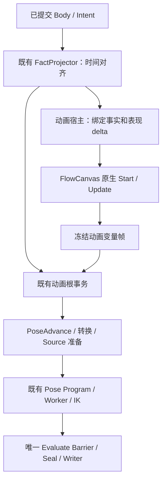

# FlowCanvas 通用事件图规划

日期：2026-09-12。修订：r1。状态：完整草案，待用户确认；未实施。

## 1. 文档身份与阅读入口

| 项目 | 内容 |
|---|---|
| 规划任务 | FlowCanvas事件图（规划窗口） |
| 规划窗口 ID | `01a095f2-ed45-7502-93f7-e9c9df0b7279` |
| 项目 | `D:/Unity_Project_1/3C` |
| 正式方案 | 本文件 |
| 代码与规范证据 | [核对记录](flowcanvas-event-graph-evidence-2026-09-12.md) |
| 唯一正式实现记录 | `D:/Unity_Project_1/3C/docs/flowcanvas-event-graph-implementation.md`；实现派生后由实现窗口创建和维护 |
| 实现关系 | `NOT_DERIVED` |
| 用户确认 | 尚未确认任何修订；不发布 `confirmed_by_user: true` 的 `PLANNING_DOCUMENT` |

本规划采用用户调用的 `dual-workflow`。没有启动新的 OpenSpec workflow，没有修改现行 spec、旧 change 或其它窗口的规划。`docs/` 已用于作者能力核对和方案取舍，本次沿用该位置。

本文件及核对记录仅由本规划窗口维护。未来实现窗口只写指定的实现记录，不修改本文件，不把聊天总结当作实施要求。用户确认完整修订后，仍须在本规划窗口显式调用 `$derive-implementation` 才能派生唯一实现窗口。

先读第 2～5 节了解业务与取舍；第 6～13 节是实现约束；第 14 节集中列出还需决定的事项。

## 2. 要做的事情

作者用已有 FlowCanvas 搭一张事件图：在更新事件发生时，读取角色速度，做计算或平滑，写入自己创建的“动画速度”变量。PoseGraph 读取这个结果，驱动 BlendSpace 或其它动画控制输入。

**FlowCanvas 已经有事件图运行能力。直接使用它，不需要再把这些节点翻译成一套新程序。** 仍需接入项目的是：谁触发更新、读取哪一帧角色数据、变量属于哪个角色、PoseGraph 怎样读取结果，以及出现错误后怎样停止。

“通用”指画布、连线、变量、计算、判断和流程执行不依赖动画业务。动画只是第一个宿主。相机、UI 或其它领域若以后使用同一基础，需要各自提供事件和数据合同；本次不顺便实现这些宿主，也不迁移 Skill。

本文件主要方案是 **N：原生 FlowCanvas 执行事件图，既有 Pose Program 执行姿势图**。这是根据用户强调直接复用后的推荐，尚不是用户对所有运行边界的确认。方案 C 保留为有实际价值的另一种选择，见第 5 节。

### 用户已明确的要求

- 优先直接复用已有 FlowCanvas，避免从零重写通用事件图框架。
- 规划作者创建变量、计算、判断、Get/Set，不能把它缩成固定的外部输入选择框。
- 通用基础与宿主事件、数据、操作及生命周期分责。
- 本轮只规划和写正式文档，不改代码、资产，不运行 Unity、Build、Play，不新增测试。
- Gameplay 事实保持唯一来源；动画曲线仍随姿势采样和混合。

### 尚未确认的内容

- 采用 N 还是 C；尤其是更新图状态与姿势提交的关系。
- 原生节点准入、首个宿主的完整类型及事件范围。
- 实际接入哪份角色内容、哪些资源和消费节点。

用户问“这个还要编译吗，不是通用了吗”是对方案前提的质疑，不能记成已经批准一个新的运行时。用户对技术类型选择表示“没懂”，不能记成同意只开放三种类型。

## 3. 作者看到什么

推荐首个动画宿主提供两个页签：`动画更新` 与既有 `AnimGraph`。它们使用同一个 FlowCanvas GraphEditor、原生导航和 Inspector，不创建第二画布或常驻字段编辑器。

一个完整例子：

1. 在“动画更新”的原生 Blackboard 新建数值变量 `动画速度`，初值 0；再建开关变量 `是否移动`，初值 false。
2. 从 `On Update` 接出执行线。读取宿主提供的角色速度和本次更新间隔。
3. 用原生数值节点计算。例如 `MoveTowards(旧动画速度, 角色速度, 响应速率 × 更新间隔)`；结果接原生 `SetVariable<float>`。
4. 从 Set 的后续执行口继续，读取刚写入的动画速度，比较阈值，再写入 `是否移动`。
5. 在 PoseGraph 的动画变量列表拖出 `动画速度` 的 Get，连接 BlendSpace 的浮点输入；在转换条件图拖出 `是否移动` 的 Get，参与条件判断。

这是作者可以自己改的逻辑。响应速率、阈值、变量名和判断方式不是宿主写死的行为；宿主只提供正式数据和调用时机。

原生计算节点的“值线”按消费时求值；Get 接在 Set 后面读到新值。需要保留旧值时，作者显式先写入另一个变量，不能把编译器缓存或图布局当作执行顺序。

### 输入、处理、输出

| 部分 | 输入 | 处理 | 输出 |
|---|---|---|---|
| 角色事实接入 | 已提交 Body/Intent 和当前表现采样时间 | 沿现有 FactProjector 做时间对齐 | 只读 `CharacterPresentationFactFrame` |
| 原生事件图 | 本次更新事件、只读事实、上次图内变量 | FlowCanvas 执行作者连线 | 该动画实例的新变量值 |
| 变量发布 | 事件执行成功后的原生 Blackboard | 按已验证映射冻结需要的值 | 带身份、版本和类型的只读动画变量帧 |
| PoseGraph | 同次采样的事实和变量帧 | 既有 Pose 编译程序推进、采样、混合、求解 | 既有最终姿势及诊断 |

`角色速度`是输入事实，不能 Set 回 Gameplay。`动画速度`是作者为表现保存的状态，可平滑、缩放或阈值化；它不是角色真实速度的新来源。

Foot Placement Weight、素材曲线和 BlendShape 值有自己的采样、混合与最终写入链，不因为也是数值就变为这张更新图的可写变量。

## 4. 当前缺口与完成定义

当前不是缺 FlowCanvas，而是缺正式的动画宿主及变量消费接口：

- 原生 `FlowScript` 能初始化节点、绑定端口并执行 `IUpdatable`；`Graph` 支持 `Manual` 和 `UpdateGraph(float)`。
- 项目现有 Skill/Pose 的作者图明确禁止启动原生 runtime。这两个禁令继续保留，不直接把现有 Pose 图改成可执行 FlowScript。
- 当前 Pose Blackboard 是参数声明的只读投影，拖拽生成 `ProgramParameterInput`。
- `CharacterPresentationProgramParameterFrame` 仅提供三个固定 motor 参数，源码同时保留 `FromBody`、`FromFact`、`FromDirect`。
- BlendSpace 编译校验和运行采样依赖这三个固定 ID；仅开放 Blackboard 的 Add/Set 并不能让它消费自建变量。
- 当前 Pose 参数端口包含 `pose.parameter` 这种参数引用语义，不能假定它已经等于任意 Float/Int/Bool 的普通值端口。

完成实现必须同时满足：

1. 作者在原生 Blackboard 创建、改名、设置初值、删除变量；GraphEditor 与 Document 对同一变量和连线有相同解释。
2. 原生事件、计算、分支、Get/Set 真正运行；不是只出现菜单，也不是在 Editor 里模拟结果。
3. 两个角色共用一份图资产，变量、原生节点历史、Reset 和故障各自隔离。
4. 更新结果同次送达 PoseGraph；BlendSpace 不再受三个固定 motor ID 限制。Bool/Int 按自身类型进入条件或合法控制端口，不借用 float 存储伪装。
5. 图未绑定、类型不匹配、变量被删、节点失败和产物过期均明确失败；没有旧参数桥补值或第二运行方式。
6. 姿势采样、Action、Foot、FBBIK、Writer 保持已有正式执行者；素材曲线不由事件图抢写。
7. 原生编辑、Document 事务、Build、正式场景观察完整接通；按第 11 节删除被替代路径。
8. 在选定的正式角色/Fixture 上完成第 13 节的运行验证。没有该证据时只能说能力实现或静态检查完成，不能说业务闭环完成。

## 5. 有价值的运行选择

这里比较的是作者体验与运行保证，不替用户决定实施先后。

| 选择 | 业务收益 | 必须承担的成本 | 与现有规范关系 |
|---|---|---|---|
| **N：原生 FlowCanvas 运行更新图** | 直接使用已安装节点的计算和流程语义；新增合规原生节点不必再写一份节点 lowering | 要接宿主、变量发布、节点准入、原生错误与调试边界；原生图内状态不会自动随 Pose 失败撤销 | 保留 Pose 唯一 Program，但需正式承认 EventGraph 是独立的表现输入生产者，修正“所有领域作者图必须编译”的笼统约束 |
| **C：复用作者节点，编译入现有动画 Program** | 动画变量可与 Pose 节点状态共同 Seal/Discard；沿用现有产物、状态布局和观察 | 每种节点及配置都需有真实编译映射；FlowCanvas 有的能力不会因此自动全部可用 | 更贴合现有 Program-only 边界；仍需扩展唯一 Pose Compiler 与类型页，不得新增平行 Compiler |

N 不会重复执行 Pose：事件图只生产输入，Pose Program 只消费输入。分裂路径的判断应看“同一份业务由谁写”，不能仅以存在两个不同职责的模块计数。与此同时，现行规范明确要求 authoring/runtime 分离，不能靠改称“输入适配”就忽略这一冲突。

### N 的状态推进规则：本草案推荐

更新图按正式表现采样时间推进。即使本次姿势因资源尚未准备好而未发布，已经成功执行的更新图仍保留自己的变量和节点状态。下一次更新继续计算，资源准备好后 Pose 消费那次新的完整变量帧。

业务效果：等待动画资源时，“动画速度”的平滑仍跟随经过的时间；它不倒退到最后一次骨骼成功写入时的值。它也不能被用作“某次 Pose 已成功显示”的证明。

这与当前 FactProjector 在进入 Pose 根事务前已推进历史的组织有相似之处，但该代码事实不是对本方案的批准。本方案新增的状态保证必须明确记录。

另一种有价值的要求是：资源未准备好时，更新图的计数、翻转状态和平滑历史也全部保持不变。如果用户需要这一语义，应选择 C，或另行完整设计原生节点状态事务。**只保存/恢复 Blackboard 不能覆盖原生 `Sequence`、计时事件、Macro 或协程状态，不能当作完成方案。** 本草案不引入通用反射快照、每帧克隆图或失败后重放图。

### C 的执行差异

若选择 C，复用同一原生作者图、节点字段和变量身份；单一能力描述增加受支持节点的 lowering，输出进入既有 `CharacterPoseCompilerModule` 的固定 Pass 结果和 Program Image。

Init/Update、值计算、分支与 Set 作为编译的控制阶段，在根事务内、PoseAdvance 前执行；变量的 Pending/Committed 页归 Program Runtime。控制流需编成有界执行块，纯值依赖在每个执行点求值，Set 后的读取不能被跨写操作缓存。原生 Sequence、Timed Split、Wait、反射调用均不能因 UI 可创建就宣称已支持。

该路线不把动画变量送入 Gameplay Semantic IR，不重做 Simulation executor，也不在编译不支持时启动 FlowCanvas runtime。选择 C 后需由本规划窗口替换第 6～12 节中 N 的生命周期要求并发布新修订，不能让实现窗口自行混合两种方式。

## 6. N 方案的模块职责

以下名称是拟定的正式代码名称，尚未存在。类型归属比拆成多少文件更重要；不要求为每个名词创建一个空接口。

| 模块 | 唯一职责 | 不能承担的事 |
|---|---|---|
| `HostEventGraph`，继承原生 `FlowScript` | 原生图资产、稳定身份、宿主合同引用、节点准入与作者适配 | 自建节点执行器、动画业务数据、第二份可写拓扑 |
| `EventGraphHostContract` | 声明事件、只读输入、允许输出和节点/成员准入；提供统一 Capability 投影 | 运行角色、重写原生算术与 Get/Set |
| `NativeEventGraphRuntime` | 创建/销毁每实例原生图、绑定宿主、手动触发、处理一次调用结果 | 自动 Unity Update、第二时钟、Pose 调度或全局事件总线 |
| `CharacterAnimationEventGraphHost` | 绑定同 Actor 的 FactFrame、表现 delta、Reset；输出动画变量帧 | 写 Gameplay、移动角色、选 Action、采样 Clip、调用 IK |
| 原生实例 Blackboard | 作者动画变量的唯一可变存储 | Gameplay Blackboard 镜像、Pose 曲线状态 |
| `CharacterAnimationVariableFrame` | 成功更新后冻结的 typed 只读值及身份，供 Pose/诊断读取 | Set、事件图状态恢复或另一份持续变量真相 |
| 既有 Pose Compiler 与 Program | 把变量引用绑定为密集句柄，按已有阶段消费 | 执行原生事件图或翻译其节点 |
| 既有 Document/Mutation 事务 | 原生图、变量及宿主引用的唯一作者写入 | 第二 EventGraph 工具入口、JSON 直编运行数据 |

通用基础放在领域无关的位置，例如 `Runtime/GraphAuthoring/EventGraphs/`；角色接入放在 `Runtime/Character/Pipeline/Animation/EventGraphs/`。不得把通用运行器写进 `Control/Authoring/FlowGraphs` 再让动画依赖 Skill 图角色或 `SimulationOperationCode`。

可以复用当前共享 Capability/Port Shape/Mutation 合同；不要求将其它领域的原生节点登记、运行器或变量系统一起迁移。

### 最小真实通用性

通用模块的接口只出现 Host/Graph/Instance/Event/Variable，不出现 Actor、Pose、Motor、AnimationChannel 或 `CharacterPresentationFactFrame`。动画宿主负责将这些业务类型转换为合同输入。不同 Actor 使用同一图和同一合同是首个实际接入验证。

跨 UI/相机等第二领域的运行接入不在本次完成声明中。通过代码依赖和合同能够证明基础没有硬编码动画，不能把未接入的第二宿主说成已经验证通用运行。

## 7. 公共合同与唯一数据来源

### 7.1 图和变量

- `HostEventGraph` 使用 FlowCanvas 原生节点、BinderConnection、Blackboard Variable 的序列化与稳定身份。变量声明、类型、初值唯一存于原生 Blackboard，不新增一份 `AnimationVariableDeclaration[]` 镜像。
- `EventGraphVariableReference` 由稳定图身份与原生 `Variable.ID` 组成。显示名只服务作者，改名保留身份；删除后创建同名变量不是恢复原变量。
- `CharacterPresentationPoseGraphAsset` 新增对所需动画更新图的精确引用；事件图不反向持有 Character Definition、Profile 或某个 Actor，因此可以复用。
- PoseGraph 只保存变量引用。动画变量列表是所绑定事件图变量的只读投影；拖到事件图可 Get/Set，拖到 PoseGraph/TransitionRule 只能 Get。
- 当前 Pose 参数中被动画变量取代的控制输入不再保存第二份初值、类型和运行提供者。必要的编译布局由原生声明派生。
- 素材参数和姿势曲线保持原有合同，不能根据 `CharacterPoseParameterUsage.Control` 就自动搬入事件图。现有 action/foot 权重也必须按真实写入者和消费者判断。

### 7.2 初始类型范围，按业务解释

这是草案默认，不是用户已选择的限制：

| 作者用途 | 原生类型与本次支持 |
|---|---|
| 动画速度、阈值、权重 | Float；事件图读写，Pose 普通数值端口和 BlendSpace 消费 |
| 是否移动、是否进入某种表现 | Bool；事件图读写，Pose 纯条件消费 |
| 动画档位、计数 | Int；事件图读写，合法条件/选择消费，保留完整 Int32 值 |
| 二维方向、三维位置/速度 | Vector2/Vector3 在事件图内沿用原生计算；通过分量输出接当前标量 Pose 输入。若要求直接接 Pose 向量口，需在同次正式 ABI 设计中明确加上 |
| 枚举、对象、集合、自定义类 | 不声称全面开放。枚举的持久身份、对象引用及可变集合需要宿主合同逐项纳入，不能以 `object` 绕过 Pose 类型页 |

对作者说明“哪些输入口能连接”；不要求作者理解 Native 页、dense index 或 CLR 泛型。类型不匹配在创建/连接/Build 的同一正式规则上定位，不运行时偷偷转换。

### 7.3 宿主输入和事件

`EventGraphHostContract` 声明稳定 HostContractId/Revision、EventId、输入 identity/type/访问权限与允许发布类型。`EventGraphInvocation` 至少包含 InstanceId、GraphRevision、InvocationId、本次 delta 和不可变宿主输入。

动画首个合同提供：初始化和更新事件；只读本次表现 delta、Grounded、水平速度、垂直速度、方向/朝向等现有正式事实。含历史的数据仍由现有 FactProjector 产生；新增作者平滑与阈值存在作者变量中。

生命周期推荐：

- 首次有效 Fact 到达后，将输入绑定到独立图实例，再以 `Graph.UpdateMode.Manual` 启动。使用原生 `StartEvent` 执行初始化，随后同次执行一次 Update。
- 由现有表现调用处调用 `UpdateGraph(animationDeltaSeconds)`；不挂 `FlowScriptController` 自动 Update，不调用无参数 `UpdateGraph()`。
- 初始准入只允许一个 Start 和一个 Update 入口。多支处理用原生有顺序的 `Split(Instant)` 明确排列，避免多个入口争写同一变量的隐含顺序。
- 原生 `UpdateEvent.updateInterval` 首个动画合同固定为 0。自行限频以后作为宿主能力整体加入，不能给它偷偷换一种含义。
- Pause/没有正表现 delta 时不触发 Update，沿用当前正式场景和时间控制。
- Body discontinuity/Actor Reset/图版本 Replacement 由宿主结束旧实例并建立新实例；原生节点状态和变量一起重建。首个有效输入上重跑初始化。
- PoseState 的进入/退出不会重置整张事件图；它们不是本次新增事件。Action、Montage、Notify 与跨对象消息也没有自动进入本合同。

### 7.4 输出与 Pose 输入

`EventGraphBindingPlan` 是 Build 生成的接口映射：图引用及版本、宿主合同版本、变量身份、精确类型、需要发布的密集列、消费者来源。它不保存重写后的 Flow 指令，不是事件图编译程序。

运行时每次成功更新，只冻结 Pose/正式观察实际需要的变量。`CharacterAnimationVariableFrame` 必须携带 Actor/Instance、图与合同版本、表现帧、Simulation sample tick、discontinuity generation 和 typed values。数据不能保存指向可变原生 Variable、List 或 Unity 对象的引用。

Pose 的 Get 编译成读取该输入帧的句柄；Build 根据变量声明校验类型，运行时根据帧身份读取。值冻结在原生更新结束后、PoseAdvance 前，同次 Pose 求值和 Worker 只读这份帧；不把原生 Blackboard 直接传入 Job。

Bool/Int 控制输入与 source-local float 曲线页分开表示。BlendSpace 输入读取其明确连接的 Float 句柄；资源轴仍拥有范围、单位和样本几何，其作者配置不能再强制一个全局 motor 参数 ID。

没有变量需求的图可以有正式空输入布局；需要变量却没有事件图/绑定必须失败。这是不同的输入合同，不是缺配置时的补值方式。

## 8. 直接复用哪些节点

| 能力 | 复用方式 | 宿主必须处理的边界 |
|---|---|---|
| GraphEditor、画布、breadcrumb、Inspector、Undo、复制粘贴 | 原样使用已有原生表面与项目写入路由 | 新图/变量进入现有 Mutation、owner 和 Capability，不另画 UI |
| `FlowScript`、原生端口、BinderConnection | 原生初始化、绑定和调用 | 每实例克隆、Manual 驱动、生命周期和错误结果 |
| `GetVariable<T>` / `SetVariable<T>` | 直接执行原生节点 | 变量可见性、只读输入、声明 ID、类型；不重写 Get/Set 执行器 |
| `SwitchBool` | 直接执行 True/False，然后 Then | 编排须保留实际顺序，不能把 Then 当第三个互斥分支 |
| `Split(Instant)` | 同次调用中按输出次序执行 | 禁止自动改写为并行任务 |
| 原生 `Sequence` | 本草案开放，直接沿用其跨次 Flip Flop 语义 | 不是“本帧执行全部分支”的 Sequence；其历史不随 Pose Discard 回退 |
| 比较、逻辑、数值计算 | 直接使用 Simplex/Reflected 原生包装器与真实方法 | 登记方法身份、typed ports、纯度和允许参数；登记不是另写一次算法 |
| 原生 Macro | 复用图资产与原生接口、调用和实例化 | 闭包、变量绑定、参数 ID、递归与生命周期进入统一校验 |
| Wait、Timed Split、协程 | FlowCanvas 有原生实现 | 首个同步动画更新合同不开放；否则快照何时完整、复位与事件重入需另定合同 |
| 全局广播、Input/Physics/Unity 生命周期事件 | FlowCanvas 有相应能力 | 本宿主不自动订阅，不能绕过正式表现时钟与输入事实 |

`SetVariable` 的加减乘等赋值模式可沿用，但首个合同拒绝 `perSecond=true`；源码在该模式读取 `Time.deltaTime`，并不保证等于宿主的表现 delta。作者显式把本次 delta 接入原生乘法，再 Set。`DeltaTimed` 等直接读取全局时间的节点同理；不复制它们做隐藏的不同语义版本。

原生 `Mathf.MoveTowards/Lerp/Clamp` 等可通过已有 reflected member 机制提供。准确签名、AOT 保留和静态调用能力须进入正式构建校验，不把编辑器里搜得到当作 Player 已验证。

节点准入必须由一份正式描述同时提供给原生菜单、Document、Validator 和 Build。新增合规原生节点只增加适配元数据与宿主约束；N 方案没有“再补一个 SimulationOperationCode”的步骤。禁止任意反射调用 Character mutation、场景对象写入或外部 I/O 来逃离宿主输出合同。

## 9. 调用顺序、失败与观察

正式接入点是 `CharacterSimulationPresentationRuntime.BeginPresentationFrame` 当前 `Project -> FromFact -> BeginPresentation` 的位置；由同一 Factory 装配宿主。替换固定参数生产后仍只调用一次 `CharacterAnimationPresentationRuntime.BeginPresentation`。

根事务内部 Action lifecycle/sample、PoseAdvance、MM、FinalizePoseState、SourceDemand、准备、Evaluate、Seal 顺序继续由引擎拥有。事件图不让作者重排这些步骤。

| 情况 | 规定结果 |
|---|---|
| Start/Update 成功 | 冻结本次完整变量帧，再允许 Pose 消费；首次 Start 的 Set 对随后 Update 可见 |
| Update 后 Source AwaitingSample | 原生更新状态保持，Pose 按既有规则结束 Pending；不得重新执行本次 Update，也不能把变量回退成旧 motor 值 |
| 原生节点抛错、读只读输入失败、输出非法 | 不发布本次变量帧，不启动本次 Pose；标记本 Actor 动画输入实例 Faulted，保留错误身份，直到显式 Reset/Replacement |
| 原生图已经部分 Set 后抛错 | 不宣称撤销了其内部状态；整个故障实例不再被消费，不能继续下一帧拼接部分结果 |
| Pose Barrier 前失败 | Pose 保持原有 Discard 规则；已成功更新的事件图不倒退，诊断区分“输入更新成功”和“姿势未提交” |
| Pose Barrier 内/后故障 | 沿现有 Actor Animation Faulted，宿主停止后续更新；不单独继续动画变量生产 |
| 同一表现调用重复进入 | 宿主一次调用身份检查拒绝重复推进，不返回上次成功结果掩盖重复调度 |
| 运行中作者图发生语义修改 | 标记正式依赖过期；停止消费并等待显式 Build 与 Replacement，不热改运行实例 |

当前原生 `Ports.cs` 在 `UNITY_EDITOR && DO_EDITOR_BINDING` 下会捕获 Flow/Value 异常并调用 `Node.Error`；Player 分支直接调用。外层 try/catch 不足以统一两者。实现须在原生 Graph/Node 错误边界提供正式的按图实例失败通知，动画宿主将其纳入当前调用结果。不得靠 Console 文本扫描、全局日志是否开启或下一帧检查节点颜色决定提交；不能复制出第二套 Ports 执行器。

首个动画宿主不允许使同步调用跨帧悬挂的原生断点继续流程。图内观察保留，暂停/单步交给正式场景控制；不能使 Editor 断点协程发布半帧变量。该限制由宿主合同明确展示与校验。

观察结果至少包含 Actor、图/变量 ID、更新帧、变量值、最后写入节点与随后 Pose completion。原生图可显示本次执行，但跨模块“已经显示到骨骼”的结论必须来自既有 Committed Pose 诊断，不能直接观察 Blackboard 后宣称最终姿势已完成。

## 10. 具体修改范围

以下路径均相对 `3cDemo/Client/3C_Client/Assets/GameScripts/Main/`，第三方与资产路径另行注明。入口文件详见核对记录；实施开始时须重新读取当前版本。

| 范围 | 修改要求 |
|---|---|
| 新 `Runtime/GraphAuthoring/EventGraphs/` 与对应 Editor 模块 | 原生事件图适配、宿主合同、实例运行、验证及 Capability；不加自有通用指令集 |
| 新 `Runtime/Character/Pipeline/Animation/EventGraphs/` | 动画宿主、变量帧、角色输入绑定、生命周期与故障接入 |
| `Runtime/Character/Pipeline/Animation/Contracts/Pose/CharacterPresentationPoseGraphAsset.cs` | 精确绑定动画更新图；可复用图与实例装配保持分开 |
| 同目录 `CharacterPoseCanvasGraph.cs`、`CharacterPoseCanvasNode.cs`、payload/contracts | 导入变量的只读列表、Get 引用和 typed port；既有 Pose 图继续禁止原生运行 |
| `Editor/CharacterSimulation/Compilation/Presentation/CharacterPoseIrCompilation.cs` 与 `PoseGraph/Definitions/` | 动画变量 Get 的唯一节点定义、纯条件读取、端口、来源和 typed lowering；不是事件图节点 lowering |
| `CharacterPoseCompilerModule.cs` 与现有 Pass、Program Image/Execution View | 给 Pose 输入分配 typed 句柄、布局和帧绑定；沿原 Pass 顺序一次 Seal，必要 ABI 同次破坏性升级 |
| `CharacterPresentationPoseSourcePlanCompiler.cs`、BlendSpace 轴绑定合同 | 删除三个固定 ID 准入，连接解析为具体变量句柄，校验类型/单位/范围 |
| `Runtime/Character/Pipeline/Presentation/CharacterPresentationRuntimeFactory.cs`、`CharacterSimulationPresentationRuntime.cs` | 装配并唯一调用事件宿主，替换 FromFact 参数桥，统一 Reset/Fault/Dispose |
| `CharacterPresentationRuntime.cs`、`Animation/PoseGraph/CharacterPoseFrameCoordinator.cs`、`Program/CharacterPoseProgramActorRuntime.cs` 与 `CharacterPoseProgramRuntime.cs` | 传递 typed 只读变量帧并在 PoseAdvance 前绑定；保留原引擎调度 |
| `Animation/Presentation/CharacterPoseStateSourceRuntime.cs`、`AnimationBlendSpacePlayerRuntime.cs`、条件求值链 | 读取同次变量；Bool/Int 条件与 Float 混合各守类型，不重复求值事件图 |
| `Editor/CharacterPipeline/Authoring/PresentationDocument/`、既有 Agent 通用服务 | 加事件图闭包、变量、布局及引用的同一 Document 投影、Reconciler、Mutation 与 Validator |
| `Runtime/Character/Pipeline/Unity/AnimationPreviewEngine.cs` 及其真实调用者 | 逐个迁移固定参数生产调用到正式输入合同；资产查看器和角色场景各守用途，不保留旧直传变量捷径 |
| `Assets/ParadoxNotion/FlowCanvas/Modules/FlowGraphs/Ports.cs` 与 Node/Graph 正式边界 | 必要的宿主失败通知和同步执行限制；通用接口，不写动画业务判断 |
| 选定正式角色/Fixture、Graph、BlendSpace 与 generated products | 通过现有作者事务做精确内容接入，最后走正式 Build；当前没有授权直接修改这些资产 |

新增模块应沿项目已有 asmdef 归属接入。当前 `ThirdPersonClient.Runtime` 已引用 FlowCanvas/NodeCanvas，不另建一份插件或拷贝源码库。

### Document 公开合同

事件图归当前 Character Presentation Document 的目标闭包，可增加 `editable/presentation/event-graphs/<canonical-id>/{graph,layout}.json`。变量使用原生稳定 ID 和 typed 默认值；节点使用正式 capability kind/字段/逻辑端口。Context 提供宿主事件、只读输入与原生节点成员目录；不能让 JSON 写 C# 类型名、反射方法文本、委托或插件私有序列化字段。

事件图数据变化、变量增加/删除与跨 Pose 引用更新必须经过同一资产事务；失败恢复同批 owner。新增文件对走既有 canonical/local identity 规则，不能添加一个专用 EventGraph apply API。

该变化新增公开图种和闭包，需按当时已发布的唯一 Document 版本整体升级。当前代码/技能描述为 v7，`integrate-native-fsm-skill-authoring` 正在规划 v8；本任务不抢占版本号。实施前由相关文档所有者确定共同 schema revision 和字段归属；不得强行留在 v7、各自创建 v8 或保留双 reader。

## 11. 迁移、删除与保护清单

| 当前内容 | 处理后的唯一去向 |
|---|---|
| `CharacterPresentationProgramParameterFrame` 三个 motor 字段、`Supports`、`FromFact`、`FromBody` | 所有真实调用者转到同一事件宿主/typed 输入后删除该类型及旧生产链 |
| `FromDirect` 和 Preview 调用 | 先辨认角色场景与独立资源查看用途。正式角色由同一宿主运行；资源查看器若需要轴输入，用其已有正式资源预览输入合同，不能保留同名旧参数帧作为备用角色路径 |
| BlendSpace 资源轴对固定 motor ID 的依赖 | 迁移为轴几何加 Player 的明确值绑定；移除旧字符串提供者注册与校验 |
| 被取代的 Pose 控制参数初值/类型与 ProgramParameterInput 引用 | 引用唯一原生变量声明，迁移 typed Get；删除已无消费者的重复声明和旧绑定 |
| 现有 Curve/Foot/BlendShape 参数 | 保留其采样、混合、Resolve 和 Final Writer 所有权；本任务不批量移走或删除 |
| 原有 Skill/Pose `OnGraphInitialize` 禁令 | 保留；新原生事件图有自己的正式类型与运行边界 |
| `CharacterPresentationFrameCoordinator` | 本轮搜索只见类型定义和构造声明，未见调用者；不作为正式接入点。若删除参数类型使它受影响，先确认全部编译条件/反射入口，再删除无消费者旧类或交回其所属任务，不并行接入第二宿主 |
| FactProjector 的历史与派生事实 | 本次不整体搬走。保留现有状态条件、MM 等消费者需要的事实；只把新作者平滑放到事件图 |
| 构建产物 | 沿精确 Definition 正式重建并标记旧版本失效；不读旧产物、不运行时补建 |

Corin 当前 `LocomotionFullBodyPoseGraph.asset` 处于未提交修改中；读到 43 个不同参数名、473 处序列化声明，其中 41 个为 BlendShape 名、2 个为 action/foot 权重。次数不能视为 473 个独立变量，参数的 `Control` 分类也不能证明它们属于更新图。根/子图重复存储的清理由原 Pose 任务负责，除非用户明确划转本任务。

仅在每个旧 ID 的现有消费者与新提供者都对应后迁移。不得按名称猜作者意图，不把当前根图改成一个空 BlendSpace 演示来完成验收。

## 12. 执行顺序与阶段出口

这些是实施顺序依赖，不是替用户排序项目优先级。默认不新增测试代码；实现/验证记录不得伪写成 OpenSpec 手动验收 task。

1. **冻结确认范围。** 用户确认 N/C、状态规则和实际内容目标；规划发布确认修订。实施前重新读 Git、现行 spec 与关联任务，只对真实交叉提出决定。出口：无未裁决的同一 owner/字段冲突。
2. **落唯一原生宿主与资产合同。** 建 `HostEventGraph`、稳定身份、宿主描述和原生实例 Manual 生命周期；保留原节点执行。出口：可从正式入口创建/保存图，每实例隔离，不触发 Unity 自动更新。
3. **接作者和 Document 全链。** 节点准入、Blackboard、变量引用、Macro 闭包、Capability、Mutation、版本和事务一起接通。出口：同一编辑从 UI 和 Document 得到一致资产语义；不先交付 UI-only 能力。
4. **接动画输入与失败边界。** 只读 Fact/delta、Start/Update、Reset、输出冻结、Editor/Player 错误通知及 Fault。出口：成功才发布完整帧，失败不继续消费；原生算法未重复实现。
5. **接 Pose typed 消费。** Get、条件、BlendSpace Player、密集输入布局、既有 Compiler/Program/Worker 及 source 接口同次改通。出口：自建变量有实际消费者，类型与同帧身份完整。
6. **迁移所有被替代调用并删除旧参数桥。** 包含真实 Preview 与已确认无消费者类；保护素材曲线链。出口：搜索不到旧固定提供者作为正式运行入口，没有两种执行模式开关。
7. **同步观察和正式构建依赖。** 变量写入/快照与 Pose completion 分开呈现；图变更正确 Stale，AOT 反射成员/泛型保留进入原发布链。出口：Editor 与目标 Player 依赖完整，不靠编辑器可用作结论。
8. **迁移选定内容并验证。** 通过正式 Document 资产事务接入实际变量与消费节点，沿正式 Build/Scene 使用。出口：第 13 节证据齐全，未通过项记录真实失败。
9. **收口。** 仅提交本任务改动，中文小步记录；正式实现记录写全删除项、检查结果和限制。用户需要审查时由本规划窗口直接读文档/代码/Git，不要求实现发送完成汇报。

第 2～7 步可以小步提交，但在没有替换全部正式调用者和完整类型链前，不得把中途代码/资产版本发布为已完成能力。每一步不靠新增 fallback 接口使半迁移版本继续工作。

## 13. 验证条件

本节定义未来验收，不声称本轮已执行。仅做规划文档的路径、内容和差异检查；没有启动 Unity。

| 条件 | 应观察到的结果 |
|---|---|
| 原生变量与连线 | 创建/改名/删变量、Get/Set、Undo/Redo、复制/Macro 与 Document 往返保持稳定 ID；被删变量的引用明确报错 |
| 同次读写 | 从初值 1 开始执行 Set(2) 后 Get，消费者读到 2；未执行分支不写值；SwitchBool 的 Then 确实位于已选分支之后 |
| 作者平滑例子 | 旧值 0、目标速度 4、响应速率 2、delta 0.1，MoveTowards 结果 0.2；同次 PoseGet/BlendSpace 读取 0.2，不再读取固定 motor 4 |
| 时钟 | 宿主 delta 与 Unity Time.deltaTime 人为不同的正式场景控制下，计算服从宿主输入；禁止的 perSecond/全局时间节点被创建或校验规则拦住 |
| 两实例 | 同图不同 Actor 有独立初值演进、Sequence 历史和 Reset；一方 Fault 不改另一方 |
| 类型 | Bool/Int 保持自身值，Int32 大值不会经 float 精度丢失；错误连线与未知变量在正式边界定位；向量内部运算与 Pose 标量出口按第 7 节执行 |
| Pose Source 未就绪 | 按选定 N 规则只推进一次更新图，保留其状态；Pose 不发布 Pending；恢复时读取最新有效采样，无旧帧重跑 |
| 失败与调试 | Editor 条件捕获和 Player 抛错均不能发布坏值；部分 Set 后故障实例停止；断点不使同步调用跨帧提交半份数据 |
| Pose 消费覆盖 | BlendSpace 使用任意合法作者 Float 引用；Bool/Int 可进入规定纯条件；相关 Player inactive/重新 relevant 时仍读取正确帧 |
| 曲线回归 | Source-local 曲线、Foot 权重、BlendShape 仍来自原采样混合；修改动画变量不能反写这些页或 Gameplay |
| 构建与替换 | 更改事件图使依赖 Stale，正式 Build 验证接口/节点/AOT；两个消费者共享同图资源仍各自实例化；Replacement 清理旧对象和订阅 |
| 实际内容闭环 | 在用户选定的正式角色/Fixture 中观察“事实 → 原生更新 → 作者变量 → Pose消费者 → 最终显示”；源码通过不代替此证据 |

目前通过 BlendSpace 脚本 GUID 在 `Assets/Configs` 检索，未找到 `CharacterAnimationBlendSpaceAsset` 的正式资产引用。本结果只覆盖该目录。本计划不捏造已有 Corin BlendSpace；实际资源与接入位置须在第 14 节明确，才能完成资产子步骤。

后续运行检查服从届时用户授权和项目规则；本计划不新增测试代码。若使用 Unity MCP，每次显式传入核对过的 `unity_instance`，在非 Play 下才做 refresh/build，宣称代码修复后重读当前 Console。若使用 dotnet/msbuild，带规定的构建服务器禁用参数并立即 shutdown。

## 14. 未决事项与关联范围

### Q1：是否采用 N 的状态规则

具体问题：动画资源暂时未准备好时，“动画速度”和图内计数是否继续随时间更新？本草案推荐继续，这样可直接沿用原生图状态；若必须同骨骼发布一起提交/撤销，选 C 并重写相应执行要求。用户尚未确认。

### Q2：当前规范及其它任务的交叉归属

N 需要正式确认原生事件图作为表现输入生产者的运行边界；不能解除 Pose/Skill 图禁令，也不能隐含允许全项目解释执行。新增 Document 图种/版本、Pose 参数与类型端口、BlendSpace 输入绑定会与其它规划交叉，详见核对记录。没有本次 OpenSpec 授权，不改它们的文档；用户确认方向后，由拥有各文档的窗口按明确归属处理，不由实现窗口自行抢改。

### Q3：实际接入的内容

应明确精确 Definition/Profile、PoseGraph、一个 Float 消费位置、一个纯条件消费位置；若坚持用 BlendSpace 展示，还需明确已有资源或创建正式资源的素材与位置。该决定影响角色运动观感，不能因例子需要就替用户改 Corin 的既有状态机或资源配置。

### Q4：节点与类型边界

第 7～8 节是一套可以执行的首个同步动画宿主范围，等待整体文档确认。如果用户需要 Wait、其它宿主事件、直接 Pose 向量口、对象/集合或全局变量，需要对具体业务说明状态/时钟/资源代价，再由本规划更新同一文档；它们不是默认承诺，也不拆成隐藏的备用模式。

## 15. 本轮交付与后续维护

本轮只新增本方案与核对记录，没有修改代码、角色资产、OpenSpec 或实现记录，没有运行构建、Unity 或测试。当前文档是待确认 r1，所有推荐均不得被实现窗口当作用户已逐项裁决。

用户确认后，本规划记录准确路径与 revision 的 `PLANNING_DOCUMENT`。随后显式 `$derive-implementation` 才能创建实现关系；实现窗口的唯一记录需包含：采用的确认 revision、实际修改与删除路径、业务输入/输出、中文小步提交、正式产物/运行证据、失败和剩余项。之后的审查由用户要求，本规划直接读取这些材料。
