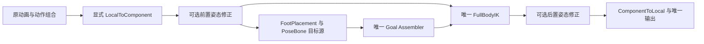

## Context

动机见 [proposal.md](proposal.md)。本设计以当前 `openspec/specs/`、`openspec/project.md` 和正式 PoseGraph 调用链为基线；工作区存在并行修改，文件名仅用于定位，不能把旧接口重新安装回来。

### 现有能力与缺口

| 现有入口 | 已有能力 | 本变更需要补齐的内容 |
|---|---|---|
| `CharacterPoseGraphCapabilityCatalog` 与 Node Definition | 节点字段、端口、角色、Mutation 与 lowering 的共享声明 | 两个修正节点、Correction Slot 和资源引用的完整声明 |
| `CharacterAnimationBlendSpaceAsset` 与 `CharacterAnimationBlendSpaceSolver` | 静态取帧样本、二维坐标、预编译权重因子 | 复用二维数学，不复用 Player 时钟来执行静态修正 |
| `CharacterModifyBonePosePayload` 与 Worker `Modify` | 单骨骼 TRS 修正、后代更新 | 一次求出多个骨骼的修正，避免重复改变父骨骼基准 |
| `CharacterAdditivePosePayload` 与编译校验 | 以 `RigReference` 为参考的 Local/Mesh 叠加 | 新样本集自己拥有中性参考；不改已正确的通用 Additive 接口 |
| `CharacterPresentationProgramParameterFrame.FromFact` | 正式运行与旧 Preview 都从 Fact 取参数 | `MovementDirection` 是世界 XZ 方向，当前乘速度后直接填入 Local 命名字段，需要统一坐标合同 |
| `CharacterPoseProgramRuntime`、Worker、Constraint、Final Publication | 一次节点求值、唯一 FBBIK 和最终写入 | 新节点进入已有编译调度、姿态页和最终发布 |

### ZZZ 与 UE 依据

2026-09-04 核对的本地输入：

- 元数据：`D:/ZZZ_Dump/PIK分析包/元数据/控制器与战斗/成员阅读版.txt`，类型 88901。
- 构建校验：同目录 `verification.json`；磁盘 `GameAssembly.dll` SHA-256 为 `4cba5d52c5fbfd478d2a9ec217075f82216780d56ad1bd1e85e4f724dcce30b4`，与会话记录一致。
- Animage 拓扑：`D:/ZZZ_Dump/PIK分析包/快照分析/20260831_120908/animation_system/graph_topology.json`。
- Corin 导出 Prefab 引用 BoneAdjust，但 AssetRipper 生成的 `BoneAdjust.cs` 是空壳，不能提供运行样本配置。

| 证据等级 | 结论 | 对设计的限制 |
|---|---|---|
| 直接静态证据 | `OnLateAnimageIK` 调用 SmoothKnee、Scatter(true)、Velocity；`LateUpdate` 调用 Scatter(false)、LiftBonesAccordingIK、PitchRollByGround | 不能把 BoneAdjust 压缩成一个固定时机的速度倾身节点 |
| 直接静态证据 | Scatter 按层标记筛选调用阶段；分别用 animDirVec/ikDirVec 计算 AnimDriven/IkDriven TRS，写回读取两套结果与 animOffsetFactor | 不宣称两次入口无条件重复修改同一层；不把两套方向替换成实际/期望速度 |
| 直接静态证据 | 存在 Master/Driven、参考坐标、样本及独立速度倾身字段 | 需要区分参数驱动和骨骼方向驱动 |
| 已有素材证据 | Run Loop 根骨局部 X 存在约 7cm 的摆幅 | 骨架摆动不等于角色对象根运动，也不能全部归因于 IK |
| 结构映射 | 主从骨方向采样接近 UE Pose Driver 的业务用途；速度倾身是另一职责 | 只借鉴职责，不声称 ZZZ 使用 UE、RBF 或同一数学 |
| 未闭合 | Corin 实际启用层、骨骼、权重、同帧回调与最终发布、完整补偿公式 | 不作为本变更的算法或验收依据 |

UE 参考：

- [Aim Offset](https://dev.epicgames.com/documentation/en-us/unreal-engine/aim-offset-in-unreal-engine)：二维参数驱动增量姿态，明确参考姿态和 Mesh Space。
- [Pose Driver](https://dev.epicgames.com/documentation/en-us/unreal-engine/pose-driver-in-unreal-engine)：源骨骼、参考空间、姿态目标与受影响骨骼可以分别声明。
- [Pose Asset](https://dev.epicgames.com/documentation/en-us/unreal-engine/animation-pose-assets-in-unreal-engine)：静态姿态可保存、从素材帧提取并与其它姿态叠加。
- [Bone Driven Controller](https://dev.epicgames.com/documentation/en-us/unreal-engine/animation-blueprint-bone-driven-controller-in-unreal-engine)：简单主从骨通道映射与样本混合具有不同用途。
- [Pose Warping](https://dev.epicgames.com/documentation/en-us/unreal-engine/pose-warping-in-unreal-engine)：Orientation Warping 示例后接 Leg IK。
- [IK Rig](https://dev.epicgames.com/documentation/en-us/unreal-engine/ik-rig-in-animation-blueprints-in-unreal-engine)：通常在大部分 locomotion 与姿态处理之后执行 IK。

## Goals / Non-Goals

**Goals:**

- 作者用两种制作方式得到同一种可保存、可引用、可撤销的静态修正数据。
- 运动参数与骨骼方向具有独立输入合同，共享采样和施加修正的计算。
- 同帧输入 Pose 是唯一基值；输出可进入既有 Foot/Goal/FBBIK 或 FBBIK 后续阶段。
- 以 Corin 验证正式装配能力；拓扑、骨骼影响和资源错误在已有正式校验入口明确报错。

**Non-Goals:**

- 不建立 Control Rig 图、控制器层级、通用约束语言、第二 Pose Runtime 或第二物理写入者。
- 不移植 ZZZ 动画/IK 双参考补偿、SmoothKnee、LiftBonesAccordingIK、PitchRollByGround 或上下楼速度公式；不恢复已否决的 `add-animation-relative-knee-response`。
- 不改变 Foot 生命周期、Anchor、Landing、WorldResidual、Goal Weight、FBBIK 数学、Gameplay 位移或网络同步。
- 不扩展全局 Additive 参考目录、不把时间动画转换成静态动画替代品、不加入隐式方向平滑或新的 Actor 历史。
- 不处理 TrainingEnemy，不新增测试代码，不把人工验收列入 tasks。

## Decisions

### 1. 两种制作入口共用静态快照

采用一份 Correction Set 保存：稳定 SetId/Revision、二维轴的标签/单位/有效范围、完整 Physical Bone 中性局部姿态、受影响 Physical Bone 集合、稳定 SampleId/坐标，以及每个样本对受影响骨骼的完整目标局部姿态。Virtual Bone 仍从正式 Rig 依赖派生，不保存另一份可写 Rig。

每份二维样本必须包含位于 `(0,0)`、与中性参考完全一致的中性样本，并具有非退化二维覆盖。每个样本完整覆盖同一受影响骨骼集合；集合外骨骼属于透传域。引用缺失、重复骨骼/坐标、非有限值、无效旋转和零/负局部缩放在正式校验时拒绝。

动画取帧由编辑器只读采样服务读取精确 Clip、时间和 Profile Rig，先形成完整候选，再通过正式样本 Mutation 一次替换目标样本。不得修改 Clip 骨骼曲线、导入设置、Foot 曲线或事件。来源 Clip/时间只保留提取出处，不成为运行依赖；重提取替换同一 SampleId，必须在提交时校验待采样 Clip 和目标样本 revision 未变化。

直接编辑修改同一份目标骨骼局部姿态。改变中性参考是整集操作：保持每个样本的局部位置差、旋转差和缩放比，统一重算目标姿态与骨骼方向标定，展示完整差异后通过同一 Mutation 提交。骨骼方向坐标随重标定发生的变化必须明确显示并重新检查覆盖，不承诺重标定前后整个输入域的插值权重完全相同。不能只换参考值而让全部修正含义悄悄变化。

| 并列方案 | 作者收益 | 代价 | 本设计采用的边界 |
|---|---|---|---|
| 持续引用原动画并实时采样 | 源动画变化直接进入效果，适合随时间变化的动作 | 需要 Player、采样、时钟和资源生命周期 | 已有 Clip/Blend Space/Additive 继续承担 |
| 提取静态快照后集中编辑 | 素材与手调可混用，运行只需样本常量 | 源动画变化后需要显式重新提取 | 本次修正样本采用此方式 |

### 2. 资源所有权沿用 Slot 与 Binding

Graph-owned `CharacterPoseCorrectionSlot` 只声明轴单位、参数域及绑定接口，不保存角色 Rig、样本或运行状态。Profile-owned `CharacterPoseCorrectionBinding` 精确引用 Slot、同 Profile 的 `CharacterPoseCorrectionSetAsset`，以及骨骼方向驱动需要的角色标定。Node 只引用 Slot 与图输入。

同一 Set 可被同 Profile 多个 Binding/Node 引用；相同 Slot 在一个 Profile 中只有一个 Binding。跨 Profile 的作者样本通过显式复制形成新的独立 owner，不共享可写子资产。删除仍被引用的 Set/Slot 时，完整目标状态必须同时解除引用，否则 preflight 失败。

业务取舍：直接在节点保存角色样本较少一层装配，但会使共享图携带角色数据；Slot/Binding 让不同角色复用图逻辑，也保持现有 source 资源的作者习惯。Correction Slot 是静态控制资源合同，不伪装为 Player 的 Source Slot，不产生 source demand、Phase 或 Foot Analysis。

### 3. 两种驱动用两个节点，共用一个计算模块

| 作者节点 | 输入 | 输出 | 不承担的业务 |
|---|---|---|---|
| `ParameterPoseCorrection` | Component Pose、X/Y typed Float 参数、权重、Correction Slot | 修正后的 Component Pose | 不读取 Transform、原始按键、Foot State 或选择当前动作 |
| `BoneDirectionPoseCorrection` | Component Pose、权重、Correction Slot；Binding 提供源骨骼、参考骨骼及局部方向轴 | 根据输入骨骼方向修正后的 Component Pose | 不把骨骼方向解释成移动速度，不读取上一帧或 IK 私有状态 |

骨骼方向从修改前输入 Pose 读取：先将源骨骼的指定局部轴变换到参考骨骼坐标，再相对中性姿态的同一标定计算 yaw/pitch；二维轴单位固定为角度。参考骨骼必须显式绑定，使用 Rig Root 也要显式选择。角度采用以中性标定为中心的连续区间，作者域不得跨越方向反转/极点；编译拒绝含歧义的样本配置，运行将可唯一测量的有限角度限制到声明域，不自动切换参考轴。输入恰好落在无法唯一确定角度的分支或极点时，节点明确产生 Invalid，不沿用旧方向。

参数节点复用声明轴单位，运动样本使用角色局部侧向/前向速度，单位为米/秒。需要别的二维量时，图显式连接其正式 typed 参数；不能在节点内自动选择实际方向、期望方向或骨骼方向。单位或轴合同不同的节点不能误用同一个 Slot。

共享模块仅负责二维求权重、参考差值和骨骼更新。一个节点只读取一份同帧输入 Pose，不携带 ZZZ 的 AnimDriven/IkDriven 双参考模式。首版没有隐藏阻尼；连续性由正式输入和作者已有明确的姿态组合表达，后续新增驱动不得修改已安装节点的含义。

业务取舍：一个带大量 mode 的节点可以少一个菜单项，但作者难以分辨输入来源、单位和依赖。两个节点使姿态方向与运动方向可分别调试；共享计算避免维护两套样本规则。

### 4. 先统一参数坐标，保留世界 Fact 的用途

现行 `CharacterPresentationFactFrame.Project` 从 `VisibleVelocity.x/z` 得到世界 `MovementDirection`，`DesiredDirection` 从 committed requested velocity 得到；这两个 Fact 的世界空间含义保持。`LocomotionPlanarBasis` 保持现有 committed 运动意图语义，不用它替代角色局部速度。

唯一 Fact Projector 使用同帧 Body 的表现朝向建立水平左右/前后基，发布显式的实际局部平面速度和期望局部平面速度。参数投影只读取这些正式 Fact；现有 `MotorLocalVelocityX/Y` 分别表示角色右向和前向速度，其中 Y 是二维前向分量，不是世界竖直 Y。消除未调用的 `FromBody` 第二套推导与正式/预览重复计算。

实施前列出所有既有参数消费者、序列化轴与生成引用。如果发现已有内容有意按世界速度使用 Local 命名参数，必须把具体资产和效果差异提交用户决定，再在同一步中迁移正确的世界参数引用；不得静默改变已经验收的内容，也不得为新节点保存绕行版本。

业务取舍：保留误命名世界参数再新增一套局部参数可以暂时缩小影响，但会长期产生同名不同义；统一正式投影可让 Blend Space 与修正节点使用一致含义，代价是必须对账既有消费者。该影响已标为破坏性表现参数修正。

### 5. 修正数学以每帧输入为基值

样本混合复用现有二维权重语义及稳定 SampleId 顺序。输入先按明确有效域限制；编译后的覆盖必须在该域内产生有限、归一的权重。任何退化配置由 Build 拒绝，不在运行时用默认姿态或最近样本救场。

对每个受影响骨骼，以中性局部姿态 `R`、混合目标局部姿态 `T`、本帧输入局部姿态 `P` 和总权重 `a` 计算：

- 位置：`P.position + a * (T.position - R.position)`。
- 旋转：目标四元数先按参考同半球求稳定混合并归一化；`delta = T.rotation * inverse(R.rotation)`；输出为 `Slerp(identity, delta, a) * P.rotation`。
- 缩放：`P.scale * Lerp(one, T.scale / R.scale, a)`，乘除逐分量进行。

中性样本或合法零权重对有效输入产生恒等结果。参数、Curve、source lineage 与可用性沿输入 Pose 透传；Correction Set 不引入 Foot Weight、Phase 或 Action Curve。Invalid 输入即使权重为零也不能伪装成有效结果。

先从修改前 Component Pose 取得全部受影响骨骼局部基值，再写局部结果，最后按 Rig 拓扑重建受影响子树和 Virtual Bone 派生依赖。骨骼方向测量也使用修改前 Pose；不能边写父骨骼边从已经变动的 Pose 推导子骨骼基值。每帧从本帧输入重算，不能叠加到上一帧最终 Transform。

业务取舍：直接写 Component 绝对目标便于固定空间控制，但容易覆盖原动画。以局部中性差值叠加保留原动画细节，也要求作者明确选择正确的中性姿态；本次固定这种样本语义，不给相同数据增加含糊的 Replace/Additive 开关。

### 6. 图决定求值顺序，末端政策只做明确约束

前置时，Goal Sources 与 FBBIK 必须引用同一修正后 Pose Value。修正不能插在目标生成与求解之间，形成目标按旧 Pose、求解按新 Pose 的混用。

节点具有明确的末端政策：

| 政策 | 作者意图 | 编译约束 |
|---|---|---|
| `PreserveSolvedEffectors` | 保留此前已完成求解的目标 | 后置写入影响集合不得与此前 FBBIK 的潜在受约束骨骼相交；包含父骨骼后代及 Virtual 依赖影响 |
| `AllowEffectorDisplacement` | 接受后处理造型带动已求解末端 | 允许该连接，但 Details/Source Map 明确列出受影响末端，不显示保足保证 |

前置节点没有此前求解目标，检查按实际拓扑进行。判断只使用编译 Rig 与 Goal Slot 合同，不能因本帧权重为零、站立或未锁脚而绕过静态约束。后置改 Root/Pelvis 即使未直接列出腿骨，也可能影响脚，必须纳入检查。

两个合法连续修正节点可以有意修改同一骨骼，以图顺序定义叠加；同一 Set 的重复骨骼、没有依赖顺序的冲突写入必须拒绝。节点不读取 GoalSet 内容、不修改 WorldResidual、不重跑 FBBIK。Constraint Result 仍表示求解器的结果，Final Publication 表示含后处理的最终结果，二者不能互相冒充。

业务取舍：前置有利于后续求解继续处理落脚，但 IK 可调整造型；后置保留作者造型，但可能移动末端。支持两种政策把取舍暴露给作者，不新增一个隐藏的保足求解器。

### 7. 作者操作与 Document 共用正式数据

Profile 是 Binding 与 Set 的配置入口；PoseGraph 的 References 提供精确导航，Details 只编辑节点自己的输入、权重和末端政策。样本编辑面板复用现有作者 Shell、骨骼选择、二维图和 typed Mutation，提供中性姿态、方向点、受影响骨骼、取帧、重新提取和删除操作。

静态样本视图只展示资产姿态供骨骼手柄编辑，不推进 Gameplay、Player、Foot 或 FBBIK，不直接写正在运行 Actor 的 Transform。静态素材提取不运行整条角色管线，重操作只由显式命令启动，不能放进 `OnInspectorGUI` 或选中刷新。

完整跑动、转弯、落脚效果观察复用 `rebuild-btsmtl-preview-with-scene-play` 的真实 Actor、输入、构建和生命周期。当前 current spec 的独立 Preview 与该 active 方向存在冲突；本变更不扩充旧 fixture，也不自行创建场景协调器。实现到完整角色观察时必须对接该正式接口；接口尚未落地应报告依赖，不以静态资产视图冒充完整预览。

样本结构及目标姿态变化使 Projection stale，须显式 Build；已有正式在线权重调参可以沿现有 Tuning owner 使用。不能因 Inspector 保存而重编译，不能直接热换 Worker 常量页。运行中编辑资格沿共享预览/作者框架的正式政策，不自行扩大 Play Mode 写权限。

Document v4 在现有 `editable/presentation/profile.json` 增加 `poseCorrectionSets` 与 `poseCorrectionBindings` 集合，在对应 `graph.json` 增加 Graph-owned `correctionSlots` 与节点 payload。集合保存稳定/local identity、完整中性/目标姿态及结构化对象引用；不新建 manifest 外目录或第二份可写文件。骨骼 Rig 正文仍在 readonly context；样本里引用 BoneId 与作者姿态不等于修改 Rig。

Agent 可以通过同一完整目标状态创建、修改和删除样本。动画提取工具产出的也是该目标状态，不把 Clip/时间出处解释为需要 Reconciler 执行的采样命令；Document 中没有 capture 指令或局部 operation 数组。人工与 Agent 最终进入同一个样本 Mutation handler、Undo、Validator、保存与 reverse export。

业务取舍：复用现有 Profile 分片可保持 Store 和事务边界简单，但大样本集会增加 Profile JSON 大小；本次以角色静态修正规模使用该结构，不先建另一套资产库或分片提交系统。

### 8. 模块输入输出与代码归属

| 模块 | 输入 → 输出 | 代码归属与处理前后 |
|---|---|---|
| 样本合同与校验 | 作者样本/绑定/Rig → 合法配置或定位错误 | `Animation/Contracts/PoseCorrection/`；拟新增独立样本、Slot、Binding 合同，避免塞进万能 Node payload |
| 静态取帧 | 精确 Clip/时间/Rig → 完整候选姿态 | `Editor/CharacterPipeline/Authoring/Animation/`；复用现有素材采样底层，不创建 Player Runtime |
| 作者编辑 | 用户操作/Document 目标 → typed Mutation | `Authoring/PoseGraph`、`AgentAuthoring`；对应新集合必须完整往返 |
| 局部事实 | committed Body/Intent → 同帧世界与局部 Fact | 现有 Fact Projector 与 Program Parameter；删除重复推导，保持现行世界 Fact |
| 节点定义 | 两种 typed payload → Capability、端口和 lowering | `Compilation/Presentation/PoseGraph/Definitions/`；注册到现有 Module，不新增平行 Registry |
| 样本编译 | Set/Binding/Slot → 参考姿态、索引、常量和影响集合 | `Compilation/Presentation/PoseGraph/`；静态数据只在正式 Build 转换 |
| 图合法性 | typed Pose/Goal 依赖 → 有序读写与末端检查 | 现有 Topology、Stage、Value/Workspace 和 Worker Batch Pass；不重排图外流程 |
| 修正求值 | 编译数据/输入 Pose/参数 → Pending Component Pose | `PoseGraph/Worker/` 的 AOT PurePose Kernel；共享数学按已安装 Family 扩展，不访问托管资产 |
| 最终结果观察 | 已提交节点/Constraint/Final 结果 → 作者只读显示 | 现有 Committed Diagnostics 与 Pose Watch；不重放节点、不扩展 Foot 评分公式 |

抽象负责作者合同、输入输出、节点依赖和资源所有权；实现负责采样、混合、姿态更新。编译发布符号、SampleId、BoneId 到运行索引的映射，Runtime 不搜索资产、显示名或骨骼 Transform。两个节点共用纯数学实现，Family payload 分别只保存各自有意义的参数/骨骼测量数据。

### 9. 现行规范与并行变更对账

| 对照项 | 当前事实/冲突 | 本提案处理 |
|---|---|---|
| `character-presentation-pose-graph` 完整拓扑 | 主链文字把 Component 控制列在 IK 前，但同 spec 又允许 FBBIK 后续节点 | 修改完整拓扑，明确前后可选控制及共同输入，保留唯一 Goal/FBBIK/Output |
| `character-animation-layer-runtime` 固定顺序 | FBBIK 后直接转 Local，没有表达显式后处理 | 修改该 Requirement，加入图中声明的后置 PurePose |
| `character-animation-presentation-authoring` | Profile/source 所有权已固定，跨资产编辑必须导航正式 owner | 增补 Correction Set/Binding/Slot 和样本编辑导航；不在共享图存角色数据 |
| `btsmtl-agent-authoring-document-sync` | 没有修正样本的可写集合；Rig 正文和生成数据只读 | 扩展现有 Profile/Graph 集合与同一 Mutation 事务，不开放 Rig/Clip 骨骼曲线 |
| `character-pose-plan-compilation` | Node Definition 与全局 Topology 分工已确定 | 新增静态样本和影响集合要求，复用当前 Pass；不用旧 Compiler Handler |
| 现行 `MotorLocalVelocityX/Y` 实现 | Local 命名与世界速度来源不一致 | 同一正式 Fact/参数链统一修正；有已验收世界空间消费者时须先提交用户决定 |
| 现行 Additive 仅 RigReference | 不支持任意中性样本，不代表已有算法错误 | 新样本集拥有中性参考；不扩大通用 Additive、不复制其原业务路径 |
| `refactor-character-pose-graph-architecture` | Worker Batch/Kernel/Scheduler 的 active 合同比部分 current Pass 文字更新 | 依赖实际已安装共享接口；不覆盖并行改动，不复制 Worker，也不以本提案归档其任务 |
| `refactor-btsmtl-authoring-architecture` | 正在拆分 Codec/Reconciler/Projection/窗口 | 把新集合接入拆分后的对应领域模块，不向旧大类恢复整块业务 |
| `rebuild-btsmtl-preview-with-scene-play` | 将替换 current 的独立 Preview/fixture 与部分 Live 写权限 | 完整效果观察明确依赖场景正式接口；该变更拥有全局迁移，本提案不双写两套预览合同 |
| Foot IK 与失败膝角实验 | Foot 正在统一目标/连续性；SmoothKnee 实验已被用户否决 | 只改上游输入/下游显式 Pose，不吸收 Foot 任务或恢复被否决算法 |
| `openspec/project.md` 固定链和目录 | 最终需补充静态修正、后置节点和新合同目录 | 实施收口时按 delta 更新当前口径；规划阶段不改正在编辑的项目文档 |

以上是本提案完成后的对账结论。当前 specs 本轮保持原样；同名 Requirement 在其它 active change 的 delta 必须在实施时保留双方有效内容，不允许机械覆盖。不存在以此提案授权修改现有已正确 Foot/IK 结果的解释。

## Risks / Trade-offs

- [局部速度修正改变既有 Blend Space 选择] → 先列出精确消费者和旧/新空间，完整迁移引用；出现已验收冲突由用户决定，不能静默推进。
- [动画素材已经包含修形，再叠骨骼样本导致重复] → 本次使用明确中性增量合同，由作者制作额外修正；ZZZ 双参考差值补偿独立列出，不能藏在当前节点里。
- [后置骨盆修改带动脚底] → 静态完整影响集合与两种末端政策明确区分，保留最终 Pose 与 Solver Result 的事实差异。
- [取帧中途 Clip 或样本变动] → 候选绑定输入 revision，提交前由同一 preflight 拒绝过期候选，不发布半份样本。
- [全局方向或骨骼方向越过角度分支] → 正式轴单位、连续域及样本覆盖校验；不自动换轴或补姿态。
- [编辑器支持了新节点但 Agent 无法保存] → 同一阶段完成 Definition、Capability、Document、Mutation、Validator 与反向导出。
- [预览重构接口尚未完成] → 对接已有变更的真实 Actor 接口；不增加旧 fixture 或私有预览 Runtime，不把缺少完整预览的状态报告为实施完成。
- [用户误把阶段输出当最终脚位置] → Pose Watch 显示节点输出，Final Publication 显示最终结果，Foot Solver 诊断保持原含义。

### 实现成本与运行成本

估算单位为熟悉项目的开发者人日，覆盖正式作者工具、编译、运行接入和 Document；不是已测工时，不含动画美术制作、ZZZ 动态采样或项目现有未完成模块的收尾。

| 可选业务范围 | 粗估 | 主要取舍 |
|---|---|---|
| 仅以素材和现有节点组合制作方向造型 | 3–6 | 作者依赖素材制作，缺少直接多骨骼样本编辑 |
| 仅直接编辑多骨骼静态修正 | 8–15 | 程序内调形方便，已有素材需人工转成配置 |
| 两种制作入口与参数驱动、显式前后放置 | 11–20 | 共用样本但需要完整导入/编辑/引用闭包 |
| 本提案：再包含骨骼方向驱动和统一角色绑定 | 14–25 | 能表达运动造型与关节方向修正，增加标定、角度域和角色绑定工作 |

若进一步移植 ZZZ 动画/IK 双参考补偿，另估 5–10 人日，并先补运行配置与公式证据；它不是上述任务中的隐藏尾项。现有预览重构未完成时，其工期不能计入或冒充本功能已完成部分。

本提案内部约分为：参数与数据合同 2–3、样本/骨骼方向数学及编译运行 4–7、取帧/直接编辑/正式观察接线 4–8、Document/装配/清理 4–7 人日。它们是工程量拆分，不替用户排列业务优先级。

静态运行成本为权重求解、受影响骨骼混合和必要的子树重建。若复用现有全样本对比较权重算法，样本数为 N 时权重部分约为 O(N²)，混合约为 O(N×B)，另加 Rig 传播范围；不能把它宣称为固定三个样本的三角插值。前后各一个节点就各执行一次。实际 CPU 时间与页容量通过已有性能入口测量，当前没有可信毫秒估计。

## Migration Plan

1. 记录实施时的代码、角色资产、参数消费者和相关 active delta 基线；确认正式 Node Definition、Worker、Document 和场景预览接口，保留并行任务已经完成的行为。
2. 在同一正式 Fact/参数链解决局部速度语义；有已验收消费者冲突则先报告精确差异，待用户裁决后完成该一致性迁移，不创建分流版本。
3. 增加样本、Slot、Binding 的完整作者合同和两个节点定义，再接入样本编译、Kernel、影响集合与端到端事务。
4. 完成人工编辑、素材提取、Document 全量往返和正式场景观察接线；不把仅有类型或可见节点当作功能完成。
5. 给 Corin 建立正式参数驱动与骨骼方向驱动的可复用样本/绑定，分别明确状态适用、节点权重与末端政策；先前置身体造型、后置受约束末端之外的修形作为示例装配，允许其它合法图连接。具体美术幅度属于内容调参，不改变本合同。
6. 通过精确 Definition 的正式 Character Build 一次发布匹配新 ABI 的 Projection，按当前目标策略提供需要的 Float32/Fixed 产品；移除本次替代的重复坐标推导和废弃字段，不修改未授权角色。
7. 复用现有编译、Validator、Document 生命周期和 OpenSpec 严格校验收口；更新 project/current spec 由后续正式实施/归档阶段承担，不在本轮提前安装。

恢复依赖小步 Git 提交和正式作者事务 Undo。若撤销已发布新 ABI，恢复匹配的整组代码、作者资产与生成产物；不保留旧 reader、运行时 fallback 或两套同时可运行的修正系统。
