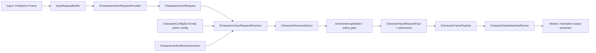

# Design: 通用 Action Request Provider / Resolver 边界

## Context
当前代码和规格已经完成了几件重要收口：

- `InputRequestBuffer` 记录 Attack、Dodge、Jump、Interact 等 buffered input request。
- 本地回滚输入帧可以把 pressed button 写入输入缓冲。
- `CommittedActionRequestSubmissionProviderCollection` 已经要求通过 provider 集合扩展候选，arbiter 主流程不得手写 Dodge、TurnBack、Attack、Jump 分支。
- `CharacterFramePipeline` 已经要求 request submission 发生在统一 pipeline 内，accepted request 进入统一状态机事实。
- Dodge 仍有专用 `DodgeActionRequest`、`DodgeActionPlanner`、`CommittedActionInputRequestBuilder.TryBuildDodgeRequest` 和 `DodgeActionRequestSubmissionProvider`，provider 当前会直接形成 `CharacterInputRequestFact` 与 `ActionInterruptRequest`。

这个设计补的是中间接口层：provider 不再直接决定 target action；resolver 才基于正式配置、当前状态和上下文，把请求解析成状态机、动画、motion 和仲裁可消费的纯数据结果。

## Goals
- 分清 `InputRequestKind`、`ActionRequestType`、动作请求和目标 action state。
- 让 Dodge、Attack、Jump 等动作以新增 provider/resolver/config 的方式扩展。
- 保持 CharacterFramePipeline、ActionInterruptArbiter、统一状态机和 output presenter 是正式主线。
- 让后续攻击实现可以并行推进，但不在输入层或 provider 层硬编码 `Attack01/02/03`。
- 让测试可以分别验证 provider、resolver、arbiter、pipeline 边界。

## Non-Goals
- 不改变 ActionInterruptArbiter 的 timing、priority、resistance 权威。
- 不实现 combo graph、hitbox、damage、network 或 root motion 权威。
- 不把所有动作配置塞进一个巨型 resolver。
- 不让 MonoBehaviour 直接触发 action state transition。

## Proposed Data Flow

## Interface Responsibilities

### InputRequestKind
`InputRequestKind` 只表示输入缓冲键。它回答“哪类输入在第几帧被按下并且什么时候过期”，不回答“进入哪个动作状态”。

### CharacterActionRequest
`CharacterActionRequest` 是 provider 输出的纯数据请求。它可以包含 request type、source input kind、origin step、expire step、priority hint、source order、variant hint 和少量值类型 payload。它不得包含 target `ActionStateId`、动画 key、motion spec、Unity object、Animancer 引用或 controller 引用。

### ICharacterActionRequestProvider
Provider 负责从输入缓冲、外部请求或 runtime facts 中提取请求候选。Provider 可以知道自己处理的是 Attack、Dodge 或 TurnBack 的来源，但它只产出 `CharacterActionRequest`，不得直接选择 `Action.Attack01`、`Action.Dodge` 或动画 key。

### ICharacterActionRequestResolver
Resolver 负责消费 `CharacterActionRequest`、`CharacterActionResolveContext` 和正式配置，输出 `CharacterResolvedAction`。Resolver 可以按 request type 路由到专用 resolver，但路由表必须可扩展，不能把 provider 或 arbiter 主流程变成 action switch。

### CharacterResolvedAction
`CharacterResolvedAction` 是仲裁和状态机可消费的纯数据结果。它可以包含 target state、request fact、interrupt request、animation request seed、motion spec seed、priority、source request 信息和消费策略。它仍然不得持有 Unity runtime object。

### ActionInterruptArbiter
Arbiter 继续只负责准入仲裁：priority、resistance、timing window、force 和 deterministic tie-break。它不负责从输入推导动作，也不负责从动作推导动画或 motion。

### CharacterFramePipeline
Pipeline 只消费 request submission 的结果和 frame output。它不得认识 Attack、Dodge、Jump 的具体解析逻辑。

## Decisions

- Decision: 保留 `InputRequestKind`。
  - Reason: 输入缓冲、预测回放和 rejected request 保留都依赖稳定输入键。删掉它会把本地预测和输入缓冲一起重写。

- Decision: 新增 request/resolver 边界，而不是让 provider 直接输出 target state。
  - Reason: Attack 的 `Attack01/02/03`、Dodge 的 directional/backstep、Jump 的地面/空中分支都需要基于当前状态和配置解析；这些不应该发生在输入层。

- Decision: Dodge 先迁移为行为保持的垂直切片。
  - Reason: Dodge 是当前唯一正式 FullBody Action，最适合验证新边界不会改变 runtime 表现。

- Decision: `add-light-attack-combo-action` 必须以后续 resolved action 为入口。
  - Reason: Attack provider 只提交 Attack 请求；Attack resolver 才根据当前 action state、combo window 和配置输出 `Attack01/02/03`。

- Decision: resolver 配置来源必须来自正式 CharacterConfigSO root 可追踪链。
  - Reason: 项目要求无 fallback 配置，且 Corin 主线需要从 root config 到 runtime 闭环。

## Risks

- Risk: 当前 `add-light-attack-combo-action` 已经按固定 `Attack01/02/03` 规划，可能诱导实现直接在 provider 层硬编码目标状态。
  - Mitigation: 本 change 明确作为前置约束，并在 spec 中要求 Attack change 消费 resolver 输出。

- Risk: 如果把所有动作逻辑放进一个 resolver，会形成新的大杂烩。
  - Mitigation: resolver 只定义 interface 和编排；每个动作的解析实现保持专用模块，面向纯数据 contract。

- Risk: Dodge 迁移可能碰到现有 rollback replay 和输入保留测试。
  - Mitigation: tasks 要求先加 provider/resolver 单测，再跑现有 Dodge、input buffer、rollback replay 定向测试。
