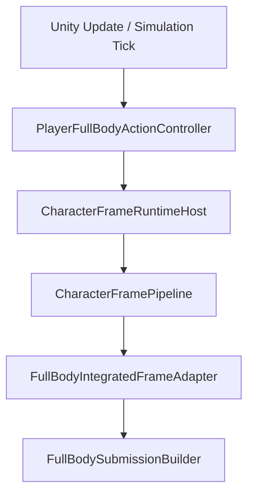
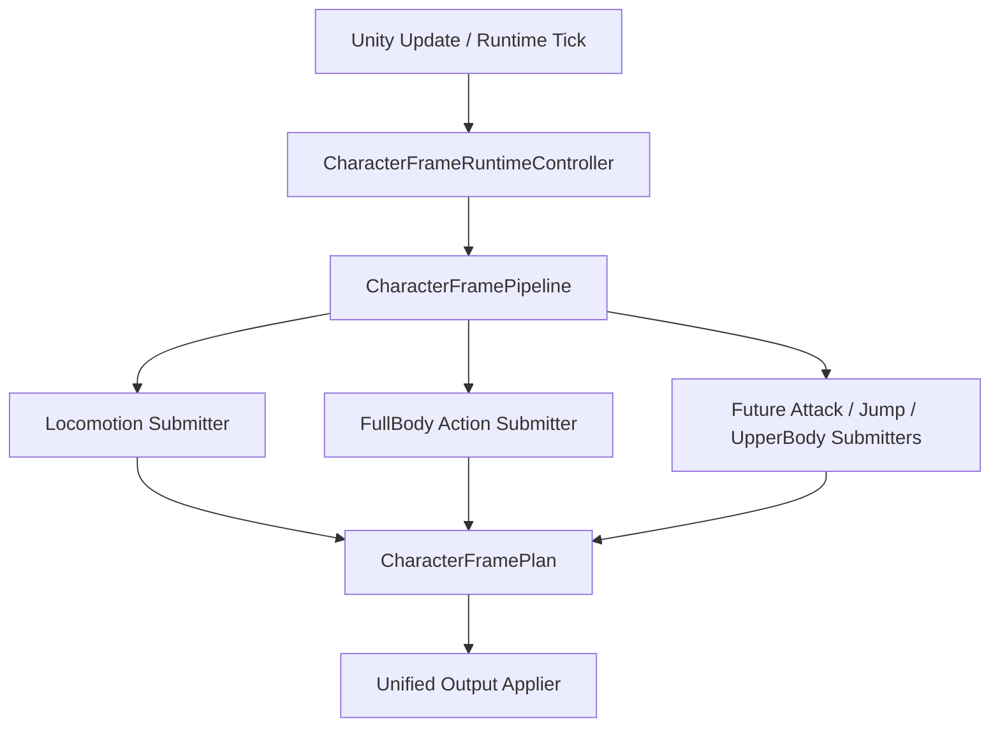

## Context
当前实现形态是：

这说明 `CharacterFramePipeline` 已经存在，但生产入口和 submitter 组合仍然挂在 FullBody 侧。目标形态是：

## Goals
- 正式 Unity/Runtime tick 入口从 FullBody controller 提升到 Character-level controller。
- Locomotion 和 FullBody Action 作为 sibling submitters 参与一帧，不再表达为 FullBody 拥有 Locomotion。
- `CharacterFramePipeline` 仍只负责编排 phase、调用 submitters、生成 plan、应用 output，不吸收业务分支。
- Corin 当前 playable 主线形成从 prefab/scene 到 runtime host、pipeline、submitter graph、output applier 的闭环。

## Non-Goals
- 不新增未来动作或未来身体层。
- 不把 Attack/Jump/UpperBody 的空实现塞进当前 runtime。
- 不创建新的 controller 主线来绕过 `CharacterFramePipeline`。
- 不让 `PlayerFullBodyActionController`、`PlayerLocomotionController` 或任何 submitter 直接执行最终 motion / animation 副作用。

## Decisions

### Decision: CharacterFrameRuntimeController 是正式 MonoBehaviour 入口
`CharacterFrameRuntimeController` 负责 Unity lifecycle、输入读取、runtime host 创建、driver 单一性校验和正式配置根引用。它不拥有业务状态机规则，不直接执行 motion，不直接播放 animation。

`PlayerFullBodyActionController` 可以保留兼容 API、配置解析帮助和诊断 view，但正式生产主线不能再从它的 `Update` 或私有 `CreateFrameRuntimeHost` 进入。

### Decision: Submitter graph 是 Character 级组合
Character 入口组合一个角色级 submitter graph。第一阶段 graph 至少包含：
- Locomotion submitter：提交移动意图、locomotion facts、基础移动候选 motion/animation。
- FullBody Action submitter：提交 action request、full-body occupancy claim、action motion/animation candidate。

未来 Attack、Jump 或 UpperBody 只通过新增 sibling submitter 或 Action provider/resolver 扩展，不修改 FullBody integrated builder。

### Decision: Legacy integrated adapter 退出 Corin 正式主线
`FullBodyIntegratedFrameAdapter` 可作为迁移兼容或测试辅助存在，但 Corin 当前正式 prefab/scene 不应依赖它作为唯一 request/output submitter。实现完成后，静态测试必须能证明生产装配不再把 integrated adapter 当成正式入口。

### Decision: Tick adapter 改为角色级
simulation tick 入口应是 `CharacterFrameRuntimeTickAdapter` 或等价角色级 adapter。旧 `FullBodyActionTickAdapter` 可以删除、标记 obsolete 或转发，但不能成为正式 tick registration owner。

### Decision: Prefab/Scene 绑定跟随入口提升
当前 Corin playable prefab/scene 必须绑定 `CharacterFrameRuntimeController` 和正式 runtime adapters。FullBody/Locomotion controller 可保留为 adapter 或 view，但它们的 `autoUpdate` 不得作为正式主线开启。

## Risks / Trade-offs
- 风险：一次性拆出 sibling submitters 可能触碰 `FullBodySubmissionBuilder` 里混合的 Locomotion、Action 和 state machine 逻辑。
  - Mitigation：先用 characterization tests 锁住 Dodge/Locomotion 行为，再逐步抽出 submitter，禁止顺手重写状态机语义。
- 风险：Prefab/Scene 修改容易把旧入口又接回来。
  - Mitigation：增加资产静态验证测试，检查 Corin 正式 prefab/scene 的入口和 autoUpdate 状态。
- 风险：active changes 仍在并行修改 request resolver。
  - Mitigation：本变更只定义 sibling submitter 与 runtime owner，不实现 Attack/Jump；与通用 action request change 只在接口边界处对齐。

## Migration Plan
1. 先用静态和行为测试暴露当前 FullBody entry 问题。
2. 引入角色级 runtime controller 和 tick adapter。
3. 将 runtime host 创建迁到角色级 controller。
4. 拆出 Locomotion submitter 与 FullBody Action submitter。
5. 让 Corin prefab/scene 正式绑定角色级 controller。
6. 将 legacy integrated adapter 从正式主线降级。

## Verification
- Unity EditMode 定向测试覆盖 frame update 入口、simulation tick 入口、Locomotion-only、Dodge active、Dodge exit 回 Locomotion。
- 静态边界测试覆盖 FullBody controller 不再创建正式 host、正式路径不使用 integrated adapter、没有第二 runner/pipeline/executor/presenter。
- C# build 通过。
- `openspec validate promote-character-frame-runtime-controller --strict --no-interactive` 通过。
