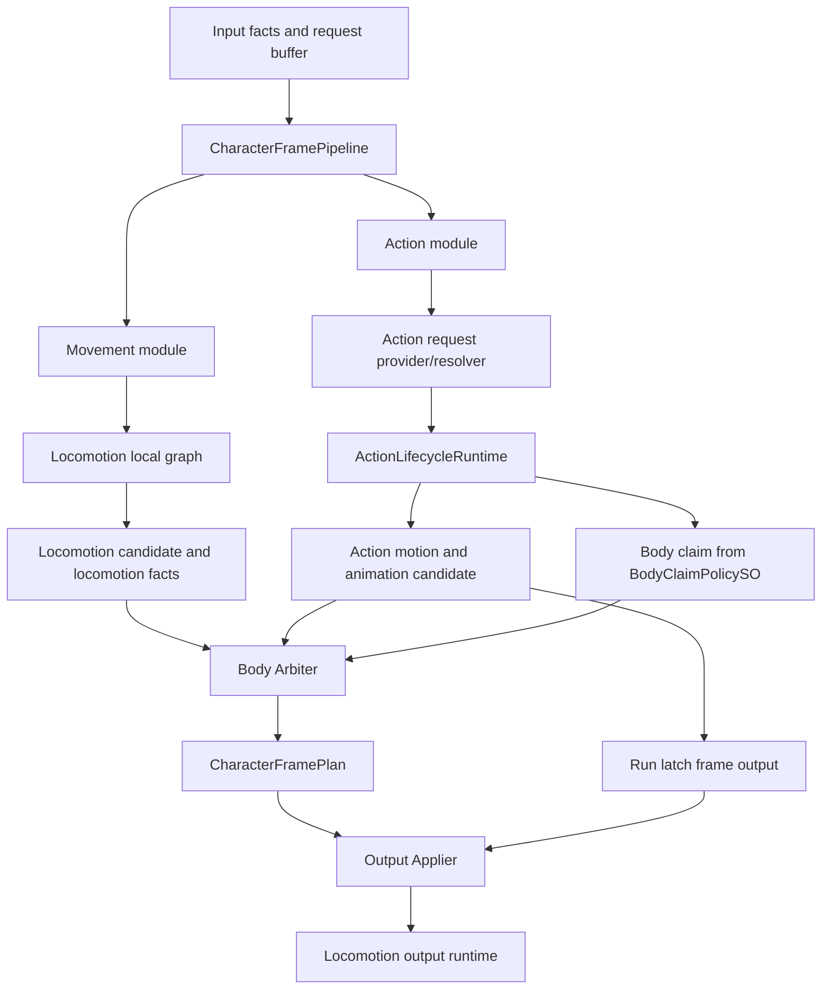

# Design: Locomotion graph 与 Action lifecycle 分离

## Current State

当前代码和配置处于过渡态：

- `FullBodyActionFrameSubmitter` 已经通过 `runtime.TickActionLifecycle(...)` 使用 `ActionLifecycleFrame`。
- `BodyClaimPolicySO` 已经作为独立 claim 规则接入角色配置根。
- `Action/FullBody` 目录已迁移到 `Action/` 领域目录。
- 旧 `Assets/Configs/3C/StateMachine/CorinStateMachine.asset` 曾含 `Action.Dodge` 状态、动作运动模块、动作动画模块和 Action/Locomotion 互跳 transition；这些语义必须从正式 Locomotion graph 迁出。
- 旧规格仍散落着 `/FullBody/Action/Dodge`、FullBody HFSM 主树和“统一状态机进入 Dodge”的口径；本变更必须把它们更新为 Action lifecycle + Locomotion local graph。
- Shift 输入同时承担 Dodge request 和 Run input fact，但 Directional Dodge 结束后的持续奔跑不能依赖继续按住 Shift，必须依赖正式 Run latch。

旧口径会让 Action lifecycle、Locomotion graph 和 FullBody HFSM 三方都能表达 Dodge，状态权威没有真正单一；Run 行为也会被误读成“按住 Shift 才能跑”。

## Target Graph

目标结构：

`Locomotion` graph 最终只包含：

- `Locomotion.Idle`
- `Locomotion.MoveStart`
- `Locomotion.MoveLoop`
- `Locomotion.MoveStop`
- `Locomotion.TurnBack`

`Action.Dodge` 不再是该图节点。它是 Action module 的 stable id 和 lifecycle state。

## Decisions

### 1. 默认状态图收窄为 Locomotion graph

默认 Corin graph 不再表达全角色状态。它只解释 Movement module 内部的 locomotion phase。

实施时可以为了 GUID 稳定先保留 `CharacterConfigSO.StateMachine` 字段名，但正式语义必须改为 `Locomotion graph`。如果后续要重命名序列化字段，另开小变更处理迁移风险。

### 2. Dodge 默认不使用 Action 局部 graph

Dodge 的 request、variant、motion spec、animation key、state time、完成和 claim 释放由 `ActionLifecycleRuntime` 或等价 action lifecycle 负责。复杂 action 可以在未来使用 Action 局部 graph，但 Dodge 不为了架构一致性强行引入 graph。

### 3. Body claim 不通过状态图层级表达

`Action.Dodge` 需要占用 full-body motion/animation 时，Action module 通过 `BodyClaimPolicySO` 解析 claim。Body Arbiter 决定是否压制 Locomotion 输出。

### 4. Backstep 恢复退出从状态图迁出

旧规格要求 Backstep 通过统一状态机 transition 回 `Locomotion.Idle` 或 `Locomotion.MoveLoop`。本变更后，Backstep 的完成、恢复窗口或动画退出事实必须归属 Action lifecycle 或后续 Action Timeline/window 数据。

Backstep 的 motion duration 只表达动作位移窗口，不等同于 lifecycle exit。无移动输入时，Backstep 必须等待当前 `Action.Dodge.Backstep` 动作动画播放完成后才能释放 claim 并回 Idle；若 motion duration 达到后存在移动输入，则可以按已批准的恢复中断规则释放到 Locomotion，且不得写 Run latch。

### 5. Locomotion 仍可 tick，但输出由 plan 采用

当 Action claim accepted 时，Locomotion graph 可以继续按批准规则更新恢复所需 facts，但 Locomotion motion/animation 输出是否采用必须由 `CharacterFramePlan` 决定。

### 6. Shift 只触发 Dodge，后续 Run 由 Run latch 决定

Shift 在输入配置中同时绑定 Run 与 Dodge：按下 Shift 可以生成 Dodge request，也可以在当帧提供 Run 输入事实。但 Directional Dodge 完成后的持续奔跑不得要求继续按住 Shift。

正式行为：

- Shift + 有移动输入：进入 Directional Dodge。
- Directional Dodge 完成帧仍有移动输入：Action motion output 请求写 Run latch，输出应用通过 Locomotion output runtime 写入 `RunLatchActive = true`，后续移动以 Run 继续，即使 Shift 已松开。
- Directional Dodge 完成帧没有移动输入：不写 Run latch，等待当前 Directional 动作动画完整播放后回 `Idle`。
- Shift + 无移动输入：进入 Backstep，等待当前 Backstep 动作动画完整播放后回 `Idle`，不写 Run latch。
- Run latch 只在停止并完成 RunEnd/Idle 收尾后清除；下一次移动从 Walk 开始。

Action facts 可以记录动作完成、位移和诊断摘要，但不能代替 Locomotion runtime 的 Run latch。Run latch 的唯一正式状态来源是 Movement/Locomotion runtime state。

## Migration Plan

1. 先补静态测试证明当前 Corin state graph 仍包含 `Action.Dodge`，让旧状态显性失败。
2. 创建 `Assets/Configs/3C/StateMachine/Locomotion/Corin/` 作为正式 Locomotion graph 目录。
3. 将当前 Corin graph 的 Locomotion 节点和 Locomotion transition 迁移到 Locomotion graph 资产。
4. 删除默认 graph 中 `Action.Dodge` 节点、动作运动模块、动作动画模块和 Action transition。
5. 确认 `CharacterConfigSO` 正式引用新的 Locomotion graph 资产，不使用 fallback。
6. 将依赖状态机 `Action.Dodge` 的测试拆成 Locomotion graph 测试和 Action lifecycle 测试。
7. 更新 rollback restore 测试，让 action lifecycle restore 而不是状态机 snapshot 表达 active Dodge。
8. 更新输入配置和输出边界测试，覆盖 Shift 同时绑定 Run 与 Dodge、Directional 完成有移动输入才写 Run latch。
9. 退役 `fullbody-hfsm-state-tree` 与 `fullbody-hfsm-tree-data` 中默认 `/FullBody/Action/Dodge` 权威口径。
10. 跑编译、OpenSpec validate、静态边界测试和相关 EditMode 测试。

## Risks

- 风险：旧测试很多，直接删除 `Action.Dodge` graph node 会造成大面积失败。
  - 缓解：先分类测试；状态机图测试改为 Locomotion，Dodge 行为测试迁到 Action lifecycle 和 pipeline arbitration。
- 风险：Backstep 恢复逻辑曾依赖状态机 transition。
  - 缓解：本变更将无输入 Backstep 退出绑定到匹配动作动画播放完成；移动输入后的恢复中断仍归 Action lifecycle，不在 Locomotion graph 中补回。
- 风险：Directional Dodge 完成时只写 Action facts，Locomotion runtime 没有收到 Run latch，导致玩家仍必须按住 Shift 才能跑。
  - 缓解：将 Run latch 写入定义为 frame output → Locomotion output runtime 的正式副作用，并用输出边界测试覆盖。
- 风险：旧 FullBody HFSM 规格继续要求 `/FullBody/Action/Dodge`，误导实现重新创建 mixed graph。
  - 缓解：在本变更中添加退役 delta，明确这些规格被 Character frame pipeline sibling module 架构取代。
- 风险：`CharacterConfigSO.StateMachine` 字段名仍然容易误导。
  - 缓解：本变更把语义和测试改为 Locomotion graph；字段重命名另开变更或作为低风险迁移任务单独执行。
- 风险：`FullBodyStateView` 仍从状态机 snapshot 派生 Action 解释。
  - 缓解：保留为兼容诊断 view，但正式 action facts 从 Action lifecycle 输出写入。

## Open Questions

- 是否在本变更内重命名 `CharacterConfigSO.StateMachine` 序列化字段为 `locomotionStateGraph`？默认不做，避免 Unity 序列化迁移扩大。
