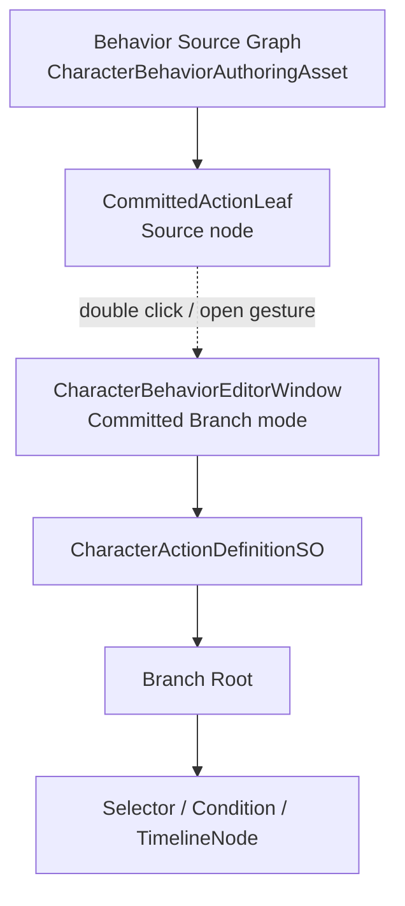

## Context
`Character Behavior Editor` 当前已经有两个编辑模式：

- `Behavior Source`：编辑角色帧 source topology，只保存 root、parallel、Locomotion leaf、CommittedAction leaf、edge 和 editor position。
- `Committed Branch`：编辑单个正式 `CharacterActionDefinitionSO` 内的 Branch Root、selector、condition 和 TimelineNode。

两者共享 `CharacterBehaviorRefPortedGraphView`，但通过不同 adapter 读写不同数据源。当前缺口是 UX 导航：设计者在 Behavior Source 图里看到 `Committed Action Leaf`，不能直接进入对应 Branch 图。

## Goals / Non-Goals
- Goals:
  - 让 Behavior Source 图中的 `CommittedActionLeaf` 成为进入 Committed Branch mode 的明确编辑器导航入口。
  - 保持 `CharacterBehaviorEditorWindow` 为唯一节点树窗口入口。
  - 保持 Behavior Source 与 Branch 的数据所有权分离。
  - 让测试证明导航不会复制或保存对方的数据。
- Non-Goals:
  - 不把 `CommittedActionLeaf` 变成 Branch Root。
  - 不把 Branch 节点嵌入 Behavior Source 图。
  - 不新增运行时 source、runtime branch 路径或 fallback 配置。
  - 不解决多 Action 选择和 Action catalog browse；本变更只处理第一版导航。

## Decisions
- Decision: 使用同一 `CharacterBehaviorEditorWindow` 的 mode 切换作为导航结果。
  - Reason: 当前 specs 已要求不新增重复 Branch 窗口，mode 切换能保持单入口。
- Decision: GraphView 提供节点 open gesture 或批准等价 open callback，单击只保持 selection。
  - Reason: Ref TreeDesigner 体验里双击/打开资产是导航语义；单击不应误触发图切换。
- Decision: 第一版导航目标使用当前 selected `CharacterActionDefinitionSO`，若为空则使用正式默认 Dodge action definition。
  - Reason: 当前 Behavior Source asset 不拥有 ActionDefinition 引用；直接新增字段会改变 authoring schema 和多 Action 语义，超出本变更。
- Decision: Behavior Source graph 和 Branch graph 不共享 adapter 状态。
  - Reason: 两张图只是 editor navigation 关系，不是 runtime 数据合并关系。

## Data Ownership

`CommittedActionLeaf` 表示角色帧里存在 CommittedAction source。它不保存 Dodge selector 或 timeline。Branch Root 表示单个 ActionDefinition 内部 branch 的固定入口。两者名称相近，但处于不同层：

- Source 层：`CommittedActionLeaf`
- Action authoring 层：`CharacterActionDefinitionSO`
- Branch 层：`Branch Root -> Selector -> Condition -> TimelineNode`

## Risks / Trade-offs
- Risk: 双击 CommittedAction leaf 后默认进入 Dodge，未来多 Action 时不够精确。
  - Mitigation: 本变更明确第一版使用当前/默认 action definition，后续多 Action catalog 选择另开 proposal。
- Risk: 导航实现误把 Behavior node id 当 Branch node id。
  - Mitigation: 测试必须覆盖 mode 切换后选中 Branch Root 或批准等价 branch 起点，并确认 source graph 不保存 branch payload。
- Risk: 双击与框选、拖拽冲突。
  - Mitigation: open gesture 必须只在 node view 上触发，且不能影响现有矩形选择、拖动和端口连线。

## Migration Plan
本变更只增加 Editor-only 导航，不迁移 runtime 数据。已有 `DefaultCharacterBehaviorAuthoring.asset` 和 `CorinDodgeActionDefinition.asset` 不需要 schema 迁移。

## Open Questions
- 多 Action 场景下，CommittedAction leaf 是否应该显示 action catalog picker、最近编辑 action，还是从 Character config 定位 action catalog？该问题不在本变更内解决。
