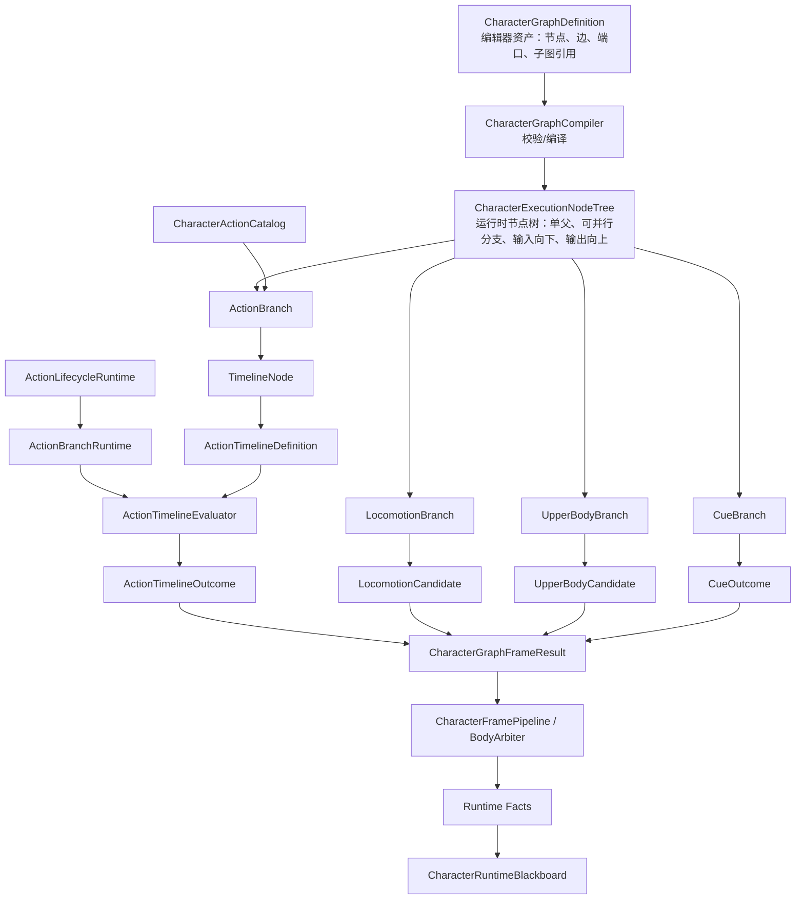

## Context
当前角色主线已经具备工业化能力系统的核心骨架：

- `CharacterFramePipeline` 是唯一角色帧 owner。
- `CharacterActionCatalog` 是 Action 逻辑配置入口。
- `ActionLifecycleRuntime` 保存 active action、state time 和播放意图身份。
- `CommittedActionFrameSubmitter` 将 resolved action、motion result、animation request、body claim 和 runtime facts 提交进角色帧管线。
- `CharacterRuntimeBlackboard` 保存已确认的 typed facts，并支持 snapshot / restore。

缺口有两层：

- 顶层缺少 `CharacterGraphDefinition` 编辑器资产合同，无法在一个编辑器窗口里统一组织 Locomotion、Action、UpperBody、Cue 等行为分支。
- 运行时缺少 `CharacterExecutionNodeTree` 合同，无法把编辑器图稳定编译成现有角色帧管线可消费的节点树执行结果。
- Action 内部缺少一层正式节点/时序表达。当前 Dodge 可以靠 duration、distance、animation key 和 motion resolver 表达，但后续 Attack、Skill、命中窗口、取消窗口、表现 cue 和节点编辑器需要一个比 Dodge 字段更通用、又不绕过管线的运行时格式。

## Goals
- 提供 `CharacterGraphDefinition` 顶层编辑器资产合同。
- 提供 `CharacterExecutionNodeTree` 第一版运行时节点树合同。
- 提供 Locomotion、Action、UpperBody、Cue 分支端口合同。
- 明确 FullBody / UpperBody 是输出 claim / channel 语义，不是 gameplay owner。
- 提供 ActionTimeline 纯数据运行时定义。
- 提供确定性 ActionTimeline evaluator。
- 明确 Outcome/Facts/Blackboard 边界。
- 让 Action lifecycle 成为 Action 分支推进位置，而不是新建 runner。
- 让 Action Catalog 成为 ActionBranch / Timeline 装配入口。
- 为后续统一节点编辑器预留编译目标。
- 第一版用 Dodge 等价行为验证框架可承载现有动作。

## Non-Goals
- 不做节点编辑器 UI。
- 不做行为树。
- 不做运行时任意有环图、共享 runtime node、隐式合流节点或跨分支直接写状态；受控 parallel/composite node 属于节点树合同。
- 不做完整连招。
- 不实现真实 hitbox、damage、VFX、SFX、camera runtime。
- 不引入 Ref 项目的正式 runner。
- 不让 ActionTimeline 直接写黑板或直接执行 Unity 副作用。

## Target Flow


## Decisions

### Decision: 编辑器是 GraphDefinition，运行时是 ExecutionNodeTree
第一版 MUST 区分 authoring 资产和 gameplay runtime。`CharacterGraphDefinition` MAY 保存节点、边、端口、子图引用和 timeline 编辑信息；正式 gameplay MUST 消费编译后的 `CharacterExecutionNodeTree` 或等价节点树 runtime model。

`CharacterExecutionNodeTree` 第一版 MUST 约束 runtime node 单父、输入向下、输出向上、状态归节点，并允许受控 parallel/composite node 在同一角色帧评估多个子分支。它 MUST NOT 支持共享 runtime node、任意合流、循环边或跨分支直接写状态。后续如需任意运行时图语义，必须另开变更并重审数据流、rollback 和调试策略。

### Decision: 第一版先建立分支端口合同
第一版 MUST 定义 Locomotion、Action、UpperBody 和 Cue 等分支端口。端口存在不等于实现完整分支；它表示统一编辑器、编译器和管线之间的正式接口已经确定。

### Decision: ActionTimeline 是 TimelineNode 的数据
`ActionTimeline` 不再作为顶层技能结构。顶层运行时结构是 `CharacterExecutionNodeTree`，Action 是其中一个分支，`TimelineNode` 是 Action 分支的第一种具体节点，`ActionTimelineDefinition` 是 TimelineNode 内部的时序数据。

### Decision: CharacterGraphDefinition 不是副作用 owner
`CharacterGraphDefinition` 不能在正式 gameplay 中自行执行副作用，也不能直接调用 Animator、Transform、Prefab、Particle、motion executor、animation presenter 或黑板写入接口。正式 gameplay 通过 `CharacterExecutionNodeTree` 输出候选和 claim，并通过角色帧管线统一应用输出。

### Decision: Locomotion 是行为分支，不是单纯槽位
Locomotion 表示基础移动行为模块，可以内部使用状态机、树或 timeline。它输出 Locomotion candidate。FullBody、UpperBody、LowerBody 等表示身体输出通道或 claim 语义，不是 Locomotion 的替代，也不是 gameplay owner。

### Decision: ActionTimeline 产出 Outcome，不写 Fact
`ActionTimelineEvaluator` 的输出是本帧候选 Outcome，例如 animation intent、motion override、hitbox window active、cancel window active 和 cue request。Fact 只能在角色帧管线应用最终输出后写入 `CharacterRuntimeBlackboard`。

### Decision: 第一版 clip kind 有意少
第一版只定义 `AnimationKey`、`Motion`、`HitboxWindow`、`CancelWindow` 和 `Cue`。这些 clip 可以证明动作时序模型成立，同时不会提前实现伤害、表现播放或完整编辑器。

### Decision: frame 是权威 tick 时间单位
ActionTimeline 的正式时间单位是 frame，并且该 frame 对齐角色 simulation tick / gameplay tick。工具层 MAY 基于 tick interval 或 frame rate 显示 seconds，但 runtime definition、evaluator、测试断言和 rollback 对比 MUST 以 frame 为权威。seconds 只能是显示或编辑辅助，不得成为 runtime 仲裁来源。

### Decision: Cue 第一版只进入 outcome 和 diagnostics
Cue 表示“这一帧有一个表现请求意图”，例如后续 VFX、SFX、camera、post-processing 或 screen effect 的触发点。当前表现层正式能力主要是 Animancer animation presenter，所以第一版 Cue 只作为 `ActionTimelineOutcome` 和 diagnostics 中的纯数据请求存在，不扩展 presentation cue submission，不播放任何表现，也不新增表现运行路径。

### Decision: 状态 window policy 不复制
`StateTimelinePolicy` 和 `StateTimelineWindowFacts` 已由现有规格和活跃变更维护。本变更的 `ActionTimeline` 可以复用 `TimelineFactId` 或等价类型化 fact 语义，但不得新增一套独立字符串 tag、状态请求策略或 interrupt window 配置。

### Decision: Dodge 是第一验证对象
Dodge 具备 duration、distance、animation key、priority、resistance 和 variant，适合证明 ActionTimeline 能表达当前已存在动作。Dodge 是框架内第一个 concrete instance，但抽象层不得反向依赖 Dodge。第一阶段保留现有 Dodge variant 作为 concrete 配置来源，通过独立 adapter / builder 生成等价 ActionTimeline runtime model；后续是否把 authoring 配置正式迁成 timeline asset 另开变更决定。

## Data Shape
建议实现时采用以下纯数据形态，具体字段可按当前代码命名微调：

```text
CharacterGraphDefinition
- LocomotionBranchDefinition
- ActionBranchDefinition
- UpperBodyBranchDefinition
- CueBranchDefinition

CharacterExecutionNodeTree
- CharacterExecutionRootNode Root
- CharacterExecutionCompositeNode / ParallelBranch
- LocomotionBranchRuntimeModel
- ActionBranchRuntimeModel
- UpperBodyBranchRuntimeModel
- CueBranchRuntimeModel

CharacterGraphInput
- source step / frame
- tick interval
- input facts snapshot
- runtime blackboard snapshot
- current action lifecycle state

CharacterGraphState
- LocomotionBranchState
- ActionBranchState
- UpperBodyBranchState
- CueBranchState

CharacterGraphFrameResult
- LocomotionCandidate
- ActionOutcome
- UpperBodyCandidate
- CueOutcome
- BodyClaim / ChannelClaim
- diagnostics

ActionBranchDefinition
- ActionStateId ActionState
- ActionNodeDefinition RootNode

ActionNodeDefinition
- ActionNodeKind Kind
- node payload

ActionTimelineNodeDefinition
- ActionTimelineDefinition Timeline

ActionTimelineDefinition
- ActionStateId ActionState
- int DurationFrames
- ActionTimelineTrackDefinition[] Tracks

ActionTimelineTrackDefinition
- ActionTimelineTrackKind Kind
- ActionTimelineClipDefinition[] Clips

ActionTimelineClipDefinition
- ActionTimelineClipKind Kind
- int StartFrame
- int EndFrame
- ActionTimelineClipPayload Payload

ActionTimelineOutcome
- int CurrentFrame
- optional animation request
- optional motion intent/spec override
- active window facts
- one-shot cue requests
- diagnostics summary
```

## Folder Layout
实现 MUST 沿用当前 Character module 的目录习惯：`Model` 放纯数据，`Runtime` 放运行时推进，`Solver` 放编译、校验和 evaluator，`Config` 放正式配置资产入口，`Diagnostics` 放诊断输出，`Contracts` 只放跨 module 的 interface。

建议目录：

```text
Assets/Scripts/Character/
  Graph/
    Model/
    Contracts/
    Solver/
    Runtime/
    Diagnostics/

  Action/
    Branch/
      Model/
      Solver/
      Runtime/
      Diagnostics/

    Timeline/
      Model/
      Solver/
      Config/
      Diagnostics/

Assets/Editor/Character/
  Graph/
  Action/Timeline/
  RefImport/

Assets/Tests/Editor/Character/
  Graph/
  Action/Branch/
  Action/Timeline/
```

`Graph` 是跨 Locomotion、Action、UpperBody、Cue 的顶层 module，不放在 `Action` 下面。`ActionBranch` 与 `ActionTimeline` 属于 Action module。节点编辑器和 timeline 编辑器属于 Editor-only implementation，不得放入 runtime 目录。

## Ref Boundary
`Ref/wly970123` 中可参考：

- `BaseTree / BaseNode / BaseEdge` 的 `[SerializeReference]` 节点列表、稳定 GUID、edge 起止节点和端口名、GUID map 思路。
- `PropertyPort` 与 `BaseTreeView` 的端口兼容、拖线、复制粘贴、节点搜索和 GraphView 操作思路。
- `Timeline / Track / Clip` 的 frame 区间、Track/Clip 分层、clip overlap/mix 校验思路。
- `TimelineFieldView / TimelineTrackView / TimelineClipView` 的编辑器交互思路。
- `TreeClip` 的 timeline 内嵌 tree 思路，后续可用于 TimelineNode 内嵌 SubTree。

不得接入为正式 runtime：

- `TreeRunner.Update`
- `RunnableTree / RunnableNode` 的 Update 运行语义
- `TimelinePlayer.FixedUpdate`
- 直接 PlayableGraph / Animator 驱动
- 直接 Audio / Particle / GameObject / Cinemachine track 驱动
- 直接 Instantiate / Destroy
- 直接 Transform/root motion 应用
- Resources、场景对象绑定或 MonoBehaviour runner

Ref 迁入路线 MUST 是 adapter-first：

1. 先实现本项目自己的 CharacterGraphDefinition / CharacterExecutionNodeTree / ActionBranch / ActionTimelineDefinition。
2. 再把 Taco editor 交互迁入 Editor-only adapter，使它读写本项目 definition，而不是让 runtime 依赖 Taco 类型。
3. 如需转换 Taco 示例资产，新增 Editor-only importer，将 Taco `Timeline` / `BaseTree` 转成本项目正式 definition。
4. 静态边界测试必须确认 Ref runtime runner、PlayableGraph、Animator、Transform 等没有进入正式 runtime。

## Migration Plan
1. 建立目录和测试目录，先落 `Graph`、`Action/Branch`、`Action/Timeline` 的 module 位置。
2. 新增 `CharacterGraphDefinition` 顶层资产合同、分支端口和 frame result 纯数据模型。
3. 新增 `CharacterExecutionNodeTree` 运行时节点树合同，并约束 runtime node 单父、受控并行分支、输入向下、输出向上。
4. 新增 `ActionBranch` 合同，并把 TimelineNode 作为第一种节点类型。
5. 新增 ActionTimeline 纯数据模型和校验。
6. 新增 ActionTimeline evaluator 和 outcome 模型。
7. 给 Action definition / catalog 增加 ActionBranch / Timeline 装配入口。
8. 让 Action lifecycle tick 时评估 active ActionBranch。
9. 将 Action outcome 合并进 frame submission 或批准的 Action candidate。
10. 用 Dodge adapter / builder 生成等价 timeline runtime model，并覆盖现有动作行为测试。
11. 增加静态边界测试，防止 CharacterGraphDefinition / CharacterExecutionNodeTree / ActionBranch / ActionTimeline 引入 Unity runtime 对象、runner 或黑板直写。
12. 后续独立 proposal 再接完整节点编辑器和 Ref 改造。

## Risks / Trade-offs
- Risk: 与 `add-configurable-state-interrupt-windows` 的状态窗口职责重叠。
  - Mitigation: 本变更只定义 Action 内部时序和 Outcome，不定义状态请求策略。
- Risk: CharacterGraphDefinition 被误实现为第二角色帧主线。
  - Mitigation: GraphDefinition 只作为资产和编译输入；正式 tick、仲裁和副作用仍在 CharacterFramePipeline。
- Risk: CharacterExecutionNodeTree 被实现成任意运行时图。
  - Mitigation: 第一版显式禁止共享 runtime node、隐式合流和循环边；只允许单父节点树和受控 parallel/composite 分支。
- Risk: ActionTimeline 变成第二状态机。
  - Mitigation: evaluator 无持久状态；持久 active action 和 state time 仍在 Action lifecycle / ActionBranchRuntime。
- Risk: 过早实现节点编辑器导致 runtime 路径分裂。
  - Mitigation: 第一版只做 runtime 框架和编译目标，不做 UI。
- Risk: Dodge 等价迁移改变现有手感。
  - Mitigation: 保留现有 Dodge variant 作为 concrete 输入，先通过 adapter / builder 生成等价 timeline runtime model，并用现有 Dodge 行为做回归基准。

