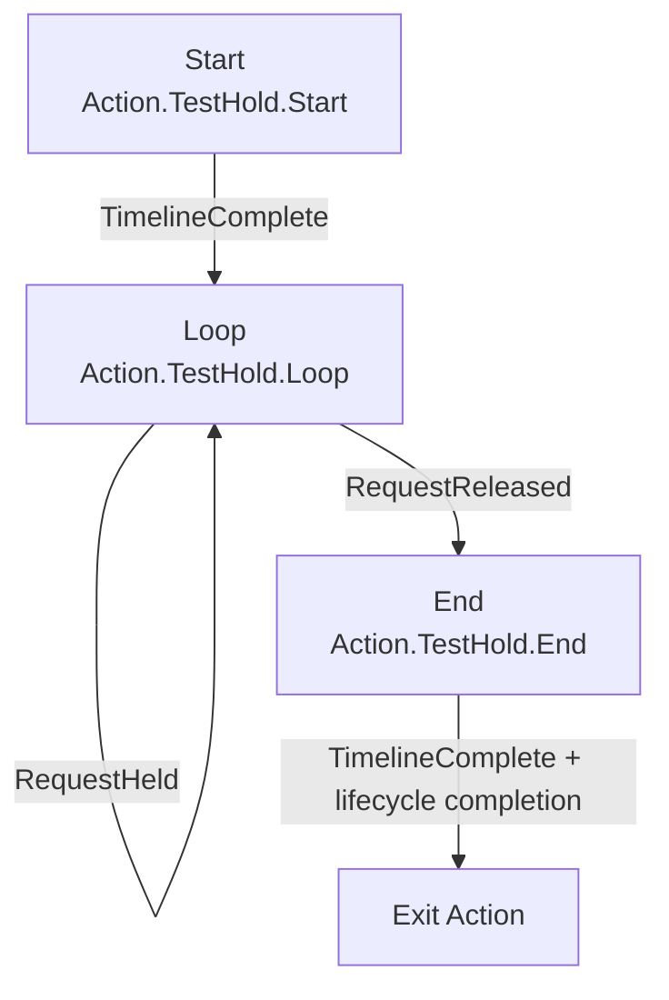
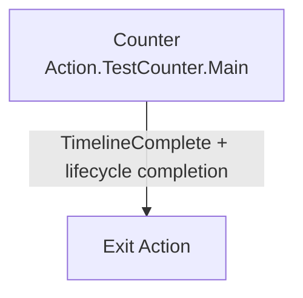
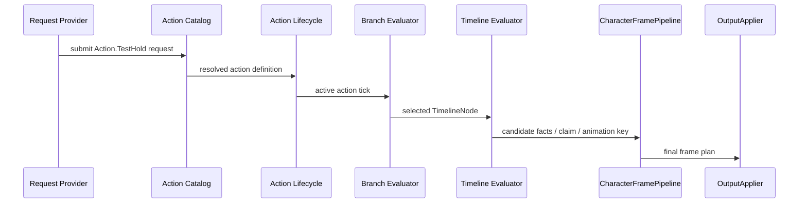

# Design: Config-Only Action Golden Path

## Context
目标框架不是让每个新 Action 都开 proposal 或写 C#，而是让普通动作可以通过 ActionDefinition、Branch、Timeline、Policy 和 Binding 直接配置。为了防止框架只服务 Dodge，需要一个不带新玩法规则的测试动作证明接口足够深。

这个 golden path 不追求好看，也不代表正式 gameplay。它是一条自动化验收链：只要 TestHold/TestCounter 能纯配置跑通，后续格挡、蓄力、简单攻击才有资格走“配置 + 测试”路线。

## Goals
- 用 `Action.TestHold` 验证单个 Action 内部 Start / Loop / End 可纯配置。
- 用 `Action.TestCounter` 验证跨 Action 跳转可通过 policy 配置。
- 验证 timeline fact、condition、request fact、body claim、animation key 和 output applier 的完整闭环。
- 验证 FullBody claim 到 `BaseSlot` / `UpperBodySlot` plan contract 的正式映射。
- 验证测试 fixture 使用正式 authoring compiler / validator / evaluator，不构造 test-only runtime 捷径。
- 静态证明不新增 `PlayerTestActionController`、runtime switch、第二 motion path 或第二 animation path。
- 为后续 Block / Attack 提供“能配置就不建 proposal”的判定标准。

## Non-Goals
- 不把 TestAction 作为正式游戏能力。
- 不新增真实 hit detection、damage、guard stamina 或 incoming hit fact source。
- 不新增泛用 Skill Editor。
- 不新增真实动画资源或 prefab 依赖。
- 不绕过当前 Action Catalog、ActionDefinition、Branch、Timeline、Policy 或 CharacterFramePipeline 主线。

## TestHold Model

### Nodes


### Expected Behavior
- TestHold request 被 accepted 后进入 `Start`。
- `Start` timeline complete 后进入 `Loop`。
- request held 时保持 `Loop`。
- request released 时进入 `End`。
- `End` timeline complete 后通过正式 Action lifecycle completion 退出 action 或回到空 action。
- `Loop` 可在指定 tick 范围输出 `window.test.counter.open`。

### Required Generic Features
- Action request provider 或 fixture provider。
- Action Catalog / ActionDefinition 查找。
- Branch selector / condition / timeline。
- `TimelineComplete` condition。
- `RequestHeld` condition。
- `RequestReleased` condition。
- timeline fact output。
- body claim output。
- animation key output。
- CharacterFramePipeline output plan。

## TestCounter Model

### Nodes


### Transition
```text
from: Action.TestHold
to: Action.TestCounter
request: Attack 或 TestCounterRequest
requiredFact: window.test.counter.open
minPriority: configured test priority
force: false unless test explicitly covers force
```

### Expected Behavior
- TestHold active 且 `window.test.counter.open` active 时提交 counter request。
- ActionInterruptArbiter 通过 matrix 编译结果接受 TestCounter。
- Action lifecycle 进入 TestCounter。
- TestCounter 的 Branch/Timeline 输出自己的 animation key 和 claim。
- TestHold Branch 不直接持有 TestCounter target。

## Fixture Strategy
第一版优先使用 EditMode fixture 构造 action definitions、branch definitions、timeline definitions、policy rows 和 fake ports。这样不会把 TestAction 混入正式 Corin gameplay 配置。

fixture 的最低要求是：测试可以在内存中构造 authoring 数据或测试资产，但必须通过正式 compiler / validator 得到 runtime definition。golden path 测试不得直接 new 出最终 runtime branch、timeline 或 policy 来绕过 authoring 编译。

允许：

- 测试 fixture 中构造 `Action.TestHold` / `Action.TestCounter` 的 authoring 数据。
- 测试 fixture 中使用 fake animation key。
- 测试 fixture 中使用 fake motion executor / fake animation port 记录 OutputApplier 调用。
- 如必须创建测试资产，资产必须位于测试或 fixture 归属目录。

禁止：

- 把 TestAction 资产挂到正式角色 prefab。
- 通过 Resources 或 sample asset fallback 注入 TestAction。
- 手搓 test-only runtime branch definition、timeline definition 或 policy runtime 作为 golden path 通过条件。
- 新增 `PlayerTestActionController`。
- 在 `CharacterFramePipeline` 中新增 TestAction 分支。
- 在 motion resolver / animation presenter 主流程中新增 TestAction switch。

## Runtime Chain


## Slot Contract Assertions
TestHold/TestCounter 可以使用 FullBody claim 证明 Action-side 全身占用，但断言必须落在正式 slot contract：

- FullBody 是 claim kind，不是 slot owner。
- FullBody claim 被采纳后，`BaseSlot` owner 必须是 Action-side owner、CommittedAction 或批准等价 owner。
- 若存在 `UpperBodySlot`，它必须能表达被 FullBody claim 压制。
- 测试不得断言 `FullBody` 是 `BaseSlotOwner`。

## Decisions

### Decision: TestHold 是最小动作闭环
`Action.TestHold` 使用 Branch 表达：

- `Start`
- `Loop`
- `End`

进入后先播放 Start；Start timeline 完成进入 Loop；request held 保持 Loop；request released 进入 End；End 完成后由正式 lifecycle completion 退出到 Locomotion 或空 Action。

### Decision: TestCounter 证明跨 Action policy
`Action.TestCounter` 不从 TestHold Branch 直接连边进入。TestHold timeline 输出 `window.test.counter.open`，policy matrix 配置 `Action.TestHold -> Action.TestCounter`，request 触发后由 interrupt arbiter accept。

### Decision: 测试资产可用 fixture
第一版可以用 EditMode fixture 构造 action definitions 和 fake animation keys，不要求创建正式 project asset。若创建测试资产，必须位于测试/fixture 归属目录，不作为 Corin 正式 gameplay 配置。

### Decision: fixture 必须走正式 compiler
Golden path 的意义是证明配置链路完整，而不是证明 runtime model 本身能被手工调用。因此 fixture 可以在内存中创建 authoring 数据，但必须通过正式 ActionDefinition、Branch、Timeline 和 Policy compiler 产出 runtime definition。

### Decision: 失败就是框架缺口
如果 TestHold/TestCounter 需要修改 `CharacterFramePipeline`、`CharacterRuntimeCore`、`ActionMotionResolver` 主流程、motion executor、presenter 或新增专用 controller，说明框架尚未完成，必须回到对应框架 proposal 补能力。

## What This Proves
- 新增普通 action 可以通过 ActionDefinition 进入 catalog。
- Branch condition 可以表达动作内部阶段。
- Timeline 可以输出 facts、animation key 和 claim。
- Policy 可以表达跨 Action 准入。
- Action lifecycle 是唯一切换 active action 的位置。
- OutputApplier 是副作用出口。

## What This Does Not Prove
- Block 的 incoming hit fact 已实现。
- Attack 的 hitbox / damage 已实现。
- Animation matching 或 Root Motion 已完整。
- 网络同步 DTO 已覆盖所有动作 payload。
- Editor UX 已足够正式动作生产使用。

## Risks / Trade-offs
- 风险：测试动作太抽象，不能覆盖 Block 需求。
  - 处理：它只证明普通动作闭环；Block 专属 facts 另行通过 fact source 扩展。
- 风险：为了测试通过写专用 TestAction resolver。
  - 处理：静态测试禁止 TestAction 专用 runtime switch，request/definition 必须走通用路径或批准等价配置 provider。
- 风险：fixture 和正式配置差距过大。
  - 处理：fixture 必须使用同一 compiler/evaluator/runtime types，不允许构造 test-only runtime model 绕过 compiler；测试资产若存在只能放在测试归属目录。
- 风险：测试只检查 FullBody claim，没检查 slot contract。
  - 处理：增加 BaseSlot owner 和 UpperBodySlot suppressed 断言，禁止把 FullBody 当 slot owner。
- 风险：fake presenter 掩盖真实 Animancer 问题。
  - 处理：本 change 只验证 Action domain 到 output ports；真实动画资源和 Animancer profile 由后续具体动作或动画 proposal 覆盖。

## Migration Plan
1. 等待或对齐前置三个框架 change。
2. 构造 TestHold branch / timeline / policy fixture。
3. 构造 TestCounter branch / timeline / policy fixture。
4. 通过 CharacterFramePipeline 推进请求和输出。
5. 增加静态边界测试。

## Test Strategy
- Branch tests 覆盖 Start -> Loop -> End。
- Condition tests 复用 `TimelineComplete`、`RequestHeld`、`RequestReleased`。
- Timeline tests 覆盖 `window.test.counter.open` 激活和消失。
- Policy tests 覆盖 TestHold -> TestCounter accept/reject。
- Pipeline tests 覆盖 Action candidate 到 final plan。
- Slot contract tests 覆盖 FullBody claim 被采纳后 `BaseSlot` owner / `UpperBodySlot` suppressed。
- Port/fake tests 覆盖 motion / animation 输出只经 OutputApplier。
- Static boundary tests 覆盖无 TestAction 专用 controller、switch、executor、presenter、Resources fallback 或正式 prefab 挂接。
