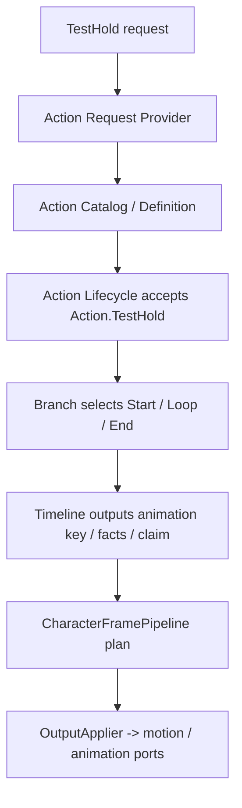
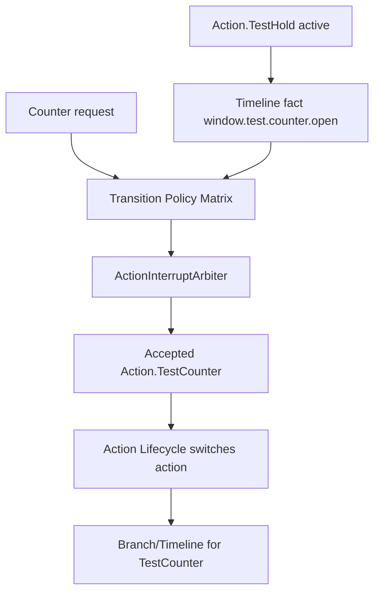

# Change: 新增纯配置 Action 金线路径

## Why
框架是否完善，不能只看 Dodge 是否还能跑；必须证明新增普通 Action 不需要新增 runtime 类、MonoBehaviour、角色帧分支、motion executor、animation presenter 或 presenter fallback。需要一个测试用金线路径，用最小动作配置验证 ActionDefinition、Branch、Timeline、Condition、Transition Policy、BodyClaim、AnimationKey 和角色帧输出的完整闭环。

本 change 的目标是给未来“格挡、蓄力、普通攻击、反击”建立判定标准：如果动作只使用既有请求、条件、timeline、policy、claim、motion spec 和 animation key 能力，就应该通过配置和测试落地，不再新开架构 proposal。

## Problem Details
- 现在框架还在迁移 Dodge 和 Timeline Authoring，容易误以为“Dodge 能跑”就代表 Action 框架完成。
- 格挡这样的动作会涉及 Start / Loop / End、长按保持、松手退出、窗口事实和跨 Action 反击。
- 如果没有 golden path，后续实现 Block 时很容易临时加 `PlayerBlockController`、Block-only resolver 或 Branch 跨 Action 边。
- Golden path 必须故意使用非正式玩法名 `Action.TestHold` / `Action.TestCounter`，避免把测试动作误当成正式游戏能力。

## What Changes
- 新增 config-only TestAction golden path，用测试资产或 fixture 配置 `Action.TestHold` 和 `Action.TestCounter`。
- Golden path MUST 使用正式 ActionDefinition / Branch / Timeline / Policy authoring compiler、validator、runtime definition 和 evaluator；不得手搓 test-only runtime model 绕过 compiler。
- `Action.TestHold` MUST 通过 Branch / Timeline / Condition 实现 Start -> Loop -> End，不新增动作专用 C# 运行时路径。
- `Action.TestCounter` MUST 通过 Action transition policy 从 `Action.TestHold` 进入，证明跨 Action 跳转走 request / interrupt / lifecycle。
- TestHold timeline MUST 能输出 `window.test.counter.open` 或批准等价测试窗口事实。
- Action runtime MUST 通过通用 request、catalog、definition、branch、timeline、policy、claim、slot contract 和 output applier 链路处理 TestHold/TestCounter。
- FullBody claim 只作为 claim kind；测试 MUST 断言最终 frame plan 使用 `BaseSlot` / `UpperBodySlot` contract，而不是把 `FullBody` 当 slot owner。
- 添加自动测试和静态边界验证，证明普通 Action 新增只需配置资产和测试 fixture。

## Target Chain


## TestCounter Chain


## Config Shape
`Action.TestHold`：

```text
ActionDefinition
  id: Action.TestHold
  claim: FullBody 或批准等价测试 claim
  branch:
    Start:
      animationKey: Action.TestHold.Start
      condition to Loop: TimelineComplete
    Loop:
      animationKey: Action.TestHold.Loop
      condition to Loop: RequestHeld
      condition to End: RequestReleased
      window fact: window.test.counter.open
    End:
      animationKey: Action.TestHold.End
      complete: TimelineComplete 后由正式 Action lifecycle 退出
```

`Action.TestCounter`：

```text
ActionDefinition
  id: Action.TestCounter
  claim: FullBody 或批准等价测试 claim
  branch:
    Counter:
      animationKey: Action.TestCounter.Main
      complete: TimelineComplete 后由正式 Action lifecycle 退出

TransitionPolicy
  from: Action.TestHold
  to: Action.TestCounter
  request: Attack 或批准等价测试 request
  requiredFact: window.test.counter.open
```

## Boundaries
- Source 层：可以使用测试 request provider 或 fixture provider，但必须走正式 Action request candidate 入口。
- Action 层：TestHold/TestCounter 只是测试动作 ID，不新增正式 Block/Attack/GuardCounter。
- Claim / Slot 层：使用现有 FullBody claim / BaseSlot 语义或批准等价测试 claim，不新增 slot。
- Channel 层：使用既有 motion/animation/fact/cue 输出，不新增专用 TestAction channel。
- Presentation Layer：使用 fake presenter / fake motion executor 或现有 port fake 验证输出路径，不新增 TestAction presenter。
- Compiler 层：fixture 必须走正式 compiler / validator，不允许构造 test-only branch definition、timeline definition 或 policy runtime 绕过 authoring 数据。

## Non-Goals
- 不实现正式 Block、Attack、GuardCounter、命中、伤害、受击、格挡耐力或 incoming hit fact source。
- 不引入新输入设备绑定作为正式玩家功能。
- 不新增真实动画资源要求；测试可使用稳定 animation key 和 fake presenter。
- 不新增 motion executor、animation presenter、blackboard writer、角色控制入口或 sample asset fallback。
- 不把 TestAction 资产放入正式 Corin gameplay 配置作为可玩能力。

## Dependency Order
1. `formalize-committed-action-authoring-toolchain` 提供通用 Action Definition / Branch Authoring。
2. `formalize-action-condition-fact-framework` 提供 `TimelineComplete`、`RequestHeld`、`RequestReleased`、`RequiredFactActive`。
3. `formalize-action-transition-policy-matrix` 提供 TestHold -> TestCounter 的跨 Action policy。
4. 本 change 最后实施，作为框架完成度验收。

## Impact
- Affected specs:
  - `action-domain-runtime`
- Dependencies:
  - `formalize-committed-action-authoring-toolchain`
  - `formalize-action-condition-fact-framework`
  - `formalize-action-transition-policy-matrix`
- Affected code after approval:
  - 测试用 action definitions / fixtures
  - Action Catalog 测试装配
  - Branch / Timeline / Transition policy tests
  - CharacterFramePipeline integration tests
  - 静态边界测试

## Success Criteria
- `Action.TestHold` 能通过通用链路完成 Start -> Loop -> End，并由正式 Action lifecycle 退出。
- `Action.TestCounter` 能通过 policy matrix 从 TestHold 进入。
- TestHold/TestCounter 不需要 `PlayerTestActionController`、TestAction 专用 MonoBehaviour、角色帧 phase、motion executor、animation presenter 或 action id switch。
- 缺少 required fact 时 TestCounter 不能进入，并输出明确 rejected decision 或 diagnostics。
- TestHold/TestCounter 的 FullBody claim 被采纳时，frame plan 断言 `BaseSlot` 由 Action-side owner 或批准等价 owner 接管，并断言 `FullBody` 不作为 slot owner。
- fake motion / fake animation ports 能证明输出只经 `CharacterFramePipeline` / OutputApplier 或批准等价出口。
- 如果实现时必须新增专用 runtime 分支，任务必须停下并回到对应框架 proposal 补能力。

## Validation
- `openspec validate add-config-only-action-golden-path --strict --no-interactive`
- 实施阶段需要定向 EditMode 测试覆盖 TestHold、TestCounter、policy transition、timeline outcome、frame pipeline 输出和静态边界。
