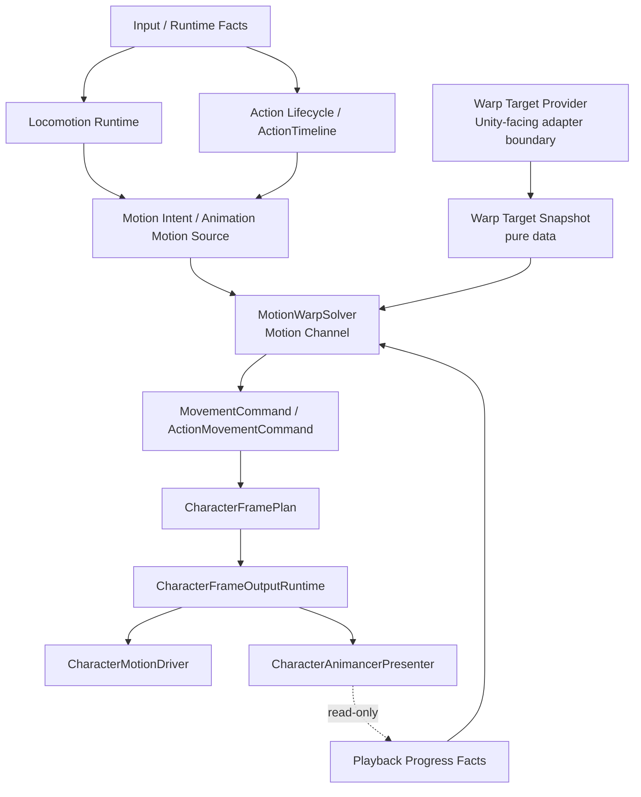

# Design: Motion Warping Solver Boundary

## Context
当前项目已有三条相关能力：

- Action 侧：`ActionTimelineEvaluator` 可以输出 Motion clip，`ActionMotionResolver` 把 `ActionMotionSpec` 转为 `ActionMovementCommand`。
- Locomotion 侧：`LocomotionMotionFactsProvider` 读取播放窗口、motion profile 和 TurnBack policy，调用 `AnimationMotionProfileSampler` / `TurnBackMotionResolver` 生成 `BasicMovementMotionFacts`。
- 输出侧：`CharacterFrameOutputRuntime` 只把最终被选择的 motion 交给 `CharacterMotionDriver` / motion executor。

这说明“层级位置”已经存在，但还没有一个正式、可扩展的 Motion Warping 抽象。若后续每个动作各自写 target 对齐、吸附、窗口采样和位移修正，会形成多个 motion solver 和多个口径。

## 六层归属
- Source：LocomotionSource、CommittedActionSource 或后续经批准的行为 source 提交 motion candidate。
- Action：`Action.Dodge`、未来 Attack、Vault、Finisher 等定义动作语义。
- Claim：动作是否占用 FullBody / UpperBody 仍由 body claim policy 决定。
- Slot：`CharacterFramePlan` 选择 BaseSlot / UpperBodySlot 的最终 owner。
- Channel：Motion Warping 属于 Motion channel solver，消费 motion intent、target snapshot、profile sample 和窗口事实。
- Presentation Layer：Animancer Presenter 只播放动画和暴露只读播放进度，不执行 warp、不决定 target、不移动角色根。

## Goals
- 给 Motion Warping 一个正式插入点：motion intent / animation motion source 之后，command 输出之前。
- 让 ActionTimeline Motion clip 可以声明 warp 需求，但 evaluator 只输出纯数据 outcome。
- 让 Locomotion 的 profile-driven motion 与 Action motion 走同一类纯数据求解合同。
- 保持最终运动权威在 `CharacterFramePlan` + output applier + motion executor。
- 为预测、回滚和后续网络同步保留纯数据状态和确定性采样边界。
- 第一版以攻击吸附和转向修正为展示 slice，验证动作窗口内的位置修正、朝向修正和统一运动出口。

## Non-Goals
- 不在本变更中实现完整 gameplay 动作。
- 不在本变更中实现目标搜索、碰撞查询、IK、VFX/SFX 或 Camera cue。
- 不把 motion executor 扩展成 solver；executor 仍只应用已经求解好的命令。
- 不把 Presenter 扩展成 solver；Presenter 仍只表现和提供只读播放事实。

## Decisions

### Decision: MotionWarpSolver 是 Motion Channel 的纯数据 solver
MotionWarpSolver 或批准的等价模块只消费纯数据：

- motion source id / action id / state id
- playback window 或 compiled local tick window
- animation motion profile sample
- current root pose snapshot
- warp target snapshot
- motion window / input lock / rotation policy

它输出纯数据 delta、yaw、distance、rotate intent 或等价 command payload。它不得调用 `CharacterController.Move`、不得写 Transform、不得读取 Animancer runtime state。

### Decision: Warp target 先由 provider 解析成 snapshot
Warp target provider 可以位于 Action/Locomotion 的 runtime adapter 边界，负责把场景目标、锁敌目标、交互点或技能目标解析成纯数据 snapshot。solver 不直接保存 Unity object reference。缺失必需 target 时返回正式错误或无效 result，不允许 fallback 到角色前方默认点继续运行。

### Decision: 第一版只消费当前 tick 的 target pose snapshot
第一版不区分静态目标和移动目标类型。provider 可以每 tick 根据当前锁敌目标、交互点或设计点生成新的 target pose snapshot，但 MotionWarpSolver 只消费本 tick 的 position、rotation / forward、source id、source step 和有效性。

这表示攻击吸附可以对移动敌人生效，但 solver 不持有 `Transform`、不缓存上一帧 target、不预测目标轨迹、不做跨 tick 追踪。后续如果需要预测、历史轨迹或网络补偿，必须通过新的 OpenSpec 批准并保持纯数据输入。

### Decision: 第一版共享 solver input/result，输出继续适配现有 command
Action 与 Locomotion 第一版共用 `MotionWarpInput` / `MotionWarpResult` 或批准的等价纯数据合同。Action 侧把 result 适配为 `ActionMovementCommand`，Locomotion 侧把 result 适配为 `MovementCommand` 或现有 movement facts。

本变更不合并 `MovementCommand` 与 `ActionMovementCommand`。command contract 的进一步收敛需要等 Action 与 Locomotion 的 motion 语义稳定后再单独评估。

### Decision: ActionTimeline 只声明 Motion intent
ActionTimeline Motion clip 可以携带 warp policy id、target binding id、motion profile id、compiled tick duration 或 motion window binding、axis mask、rotation policy 等纯数据字段。`ActionTimelineEvaluator` 仍只根据 action-local tick 判断当前 motion clip 是否命中，并输出 motion intent。target 解析、warp 求解和 command 构建发生在 Action lifecycle / submitter 后续 motion resolve 阶段。

### Decision: Locomotion 先复用现有 TurnBack 链路，再收敛抽象
TurnBack 现有路径已经满足“profile sample -> motion facts -> MovementCommand -> executor”。本变更不要求立刻重写为通用 solver，但新接口必须能把 TurnBack 作为第一类 profile-driven motion source 适配进去，避免未来为攻击、翻越、处决再复制一套 resolver。

### Decision: 依赖播放权威变更
`formalize-animation-playback-rollback-authority` 正在定义 TickSampledMotion 的播放进度和采样窗口回滚权威。本变更不得抢先重写该语义。需要 playback window 的 warp 模式必须复用该变更完成后的可恢复纯数据播放状态。

## Target Node Diagram

## Risks / Trade-offs
- 风险：Action 与 Locomotion 各自扩展，导致两个 solver。
  - Mitigation: spec 要求新 warp payload 通过统一 solver contract，现有 resolver 只能作为迁移 adapter。
- 风险：warp target provider 偷偷保存 Transform。
  - Mitigation: target provider 可以在 adapter 边界读场景，但输出给 solver 和 snapshot 的必须是纯数据。
- 风险：播放进度与 rollback 变更冲突。
  - Mitigation: implementation tasks 明确依赖 `formalize-animation-playback-rollback-authority` 的播放窗口 contract。

## Migration Plan
1. 先补纯数据模型：warp policy、target binding、target snapshot、solver input/result。
2. 用单元测试锁定 solver 不引用 Unity scene object、Animancer、Animator 或 motion executor，也不缓存 target 历史。
3. 给 ActionTimeline Motion clip 增加可选 warp payload，不改变现有 Dodge Motion clip 行为。
4. 将 `ActionMotionResolver` 增加 adapter 入口：没有 warp payload 时保持现有 distance/duration 输出，有 warp payload 时走 solver 并输出 `ActionMovementCommand`。
5. 将 TurnBack motion source 通过 adapter 映射到 solver input/result 或保持现有行为并增加边界测试，确保后续可收敛到共享 solver contract。
6. 第一版实现攻击吸附和转向修正测试，验证同一 solver result 可分别适配 Action 与 Locomotion 现有 command 出口。
7. 确保 Character frame output 仍只应用被 `CharacterFramePlan` 选择的 command。
