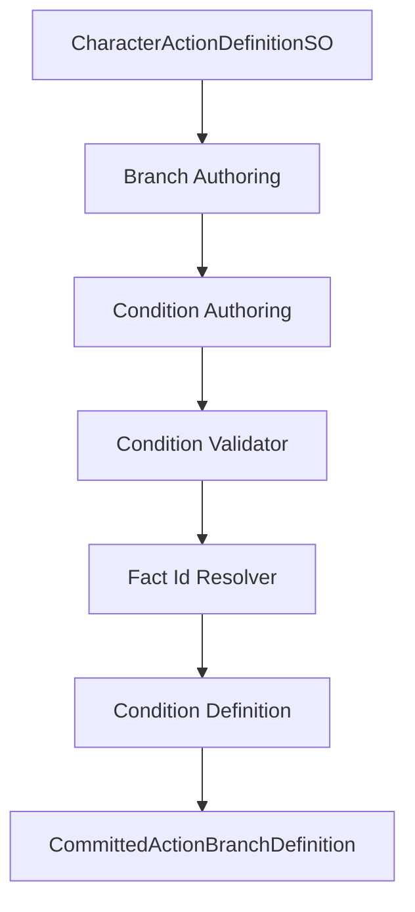
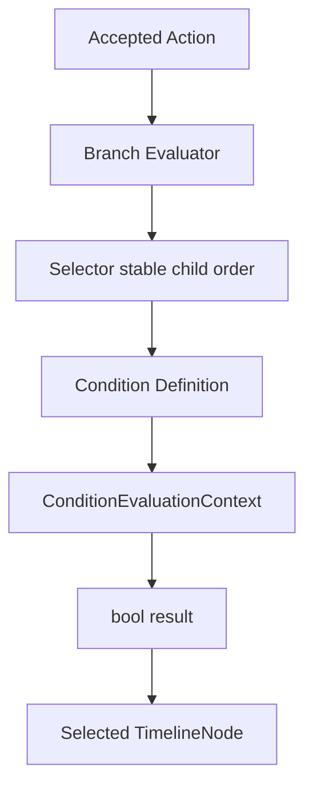
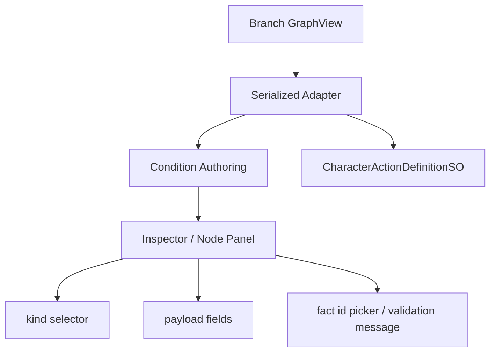

# Design: Action Condition / Fact 配置框架

## Context
Branch 的职责是“在一个已 accepted Action 内选择哪个 TimelineNode”。为了让 Block、Attack、GuardCounter、蓄力和松手释放之后能纯配置，Branch 条件必须是稳定数据，而不是每个动作往 evaluator 里加一个硬编码 if。

当前项目已经有几个关键约束：

- Action 是 `CharacterFramePipeline` 下的 sibling submitter，不是 FullBody 主状态树。
- Branch selection 发生在 Action request / interrupt 仲裁之后。
- Timeline window 和 cue 已经向“编辑器秒、运行时 tick”的方向收敛。
- 角色运行时准备走 rollback / synctest，所以 condition 不能依赖 Unity 对象、render frame 或表现层状态。

因此本设计只补齐 condition/fact 的 authoring、compiler、runtime evaluator 和 validator，不改变 Action 领域主链路。

## Goals
- 用小而稳定的 condition interface 承载常见动作节点条件。
- condition 只读取 typed facts 和纯数据 context，不直接读表现层或场景对象。
- fact id 可校验，缺失事实要诊断失败，不猜测、不 fallback。
- Branch Editor 能展示和编辑 condition kind / payload / required fact id。
- 普通动作新增时优先只改资产和测试，不改 runtime C#。
- condition runtime 能被 capture/restore 和 deterministic tests 使用。

## Non-Goals
- 不做通用蓝图、行为树、脚本语言、反射表达式或任意 C# 插件系统。
- 不一次性实现所有 Block / Attack / Counter fact source。
- 不把跨 Action 跳转塞进 Branch condition；跨 Action 仍走请求和中断策略。
- 不让 condition evaluator 执行 input consume、blackboard write、motion、animation 或 lifecycle 切换。

## Data Model

### Authoring Model
建议形态如下，实际命名可按现有目录和类型统一：

```text
CommittedActionConditionAuthoring
  kind: ActionConditionKind
  payload:
    requestKind
    requiredFactId
    actionVariant
    movementIntentMode
    timelineCompleteMode
```

约束：

- authoring model 可以是 `[Serializable]` class/struct 或批准等价 serialized model。
- payload 字段必须按 kind 校验，未使用字段不得影响 runtime 结果。
- authoring model 不保存 GraphView node、EditorWindow、scene object、ScriptableObject 之外的 runtime instance 或表现层对象。

### Runtime Model
runtime model 是 compiler 输出，建议形态如下：

```text
CommittedActionConditionDefinition
  kind: ActionConditionKind
  requestKind: stable id / enum
  requiredFactId: stable id
  actionVariant: stable id
  flags: compact pure data
```

约束：

- runtime model 必须可比较、可测试、可进入 snapshot 或 deterministic replay。
- runtime model 不持有 UnityEngine.Object，除非现行架构已有批准的纯配置 asset 引用；本 change 的 condition runtime 不需要该引用。
- compiler 对非法 payload 输出 validator error，不构造隐藏默认值。

### Evaluation Context
condition evaluator 输入是只读 context，建议包括：

```text
ConditionEvaluationContext
  acceptedActionId
  activeTimelineNodeId
  localTick
  timelineDurationTicks
  requestFacts
  activeFactSet
  locomotionFacts
  runtimeSnapshotFacts
  actionVariant
  requestFactTick
  factResolverVersion
```

允许读取：

- request held / released / pressed 等纯数据请求事实。
- timeline sampler 已确认的 active window facts。
- locomotion 提交的纯数据 facts，例如是否有 move intent。
- active action id、variant、source step、local tick、duration ticks。

请求事实约束：

- `pressed`、`held`、`released` 必须在 condition evaluator 之前由 request adapter 或测试 fixture 采样为纯数据。
- 同一 request kind 在同一个 evaluation context 中如果存在 release fact，`RequestReleased` 为 true，`RequestHeld` 必须为 false，或 evaluator 必须以 release 语义压制 held 结果。
- condition evaluator 不负责从输入设备推导 held/released，也不负责消费输入。
- request fact 必须携带 source tick 或批准等价新鲜度信息，避免上一帧 release 在后续 tick 被重复判断。

禁止读取：

- `InputAction`
- `Animator`
- `AnimancerState`
- `Transform`
- `CharacterController`
- `MonoBehaviour`
- GraphView / EditorWindow
- Unity render delta 或 editor preview time

## Condition Kinds

### Always
永远为 true。用于默认 child、fallback-free 的显式最后分支或测试 fixture。

校验：

- 不需要 payload。
- 如果同时配置无关 payload，validator 可输出 warning。

### RequestHeld
读取指定 request kind 或当前 accepted action request 的 held fact。

用于：

- 长按格挡保持 `Block.Loop`。
- 长按蓄力保持 `Charge.Loop`。
- TestHold 保持 Loop。

禁止：

- 直接读取 Input System。
- 在 evaluator 中消费输入。
- 在同一 request kind release tick 上继续返回 true。

### RequestReleased
读取指定 request kind 的 released fact。

用于：

- 松开格挡进入 `Block.End`。
- 松开蓄力进入释放节点。
- TestHold 从 Loop 进入 End。

要求：

- released fact 只在释放发生的 source tick 或批准等价逻辑 tick 上 active。
- release tick 上必须压制同一 request kind 的 held 判断，确保 `Loop -> End` 不依赖设计者手动把 Released edge 排在 Held edge 前面。

### RequiredFactActive
读取 active fact set 中是否存在指定 fact id。

用于：

- `window.counter.open`
- `window.cancel.open`
- `attack.combo.input.open`

要求：

- fact id 必须在 action/timeline authoring、runtime fact registry、测试 fixture 或批准等价 source 中声明。
- 缺失 fact id 是错误，不是 false fallback。

### TimelineComplete
使用 runtime timeline duration ticks 和当前 action-local tick 判断 timeline 是否完成。

要求：

- 不读 Animancer normalized time。
- 不读 Animator state time。
- 不读 Editor preview time。
- duration 来源必须是已编译 runtime timeline definition。
- 推荐完成边界为 `localTick >= durationTicks`；若现有 timeline evaluator 使用批准等价边界，必须在 compiler 和 evaluator 测试中保持同一口径。
- duration ticks 必须来自 seconds authoring + fixed tick compile context 或当前已批准时间权威，不得由 condition 自行换算。

### HasMoveIntent
读取 locomotion 或 input intent 的纯数据事实，判断是否存在有效移动意图。

用于：

- Dodge directional/backstep 选择。
- 后续移动中攻击、移动中格挡等配置基础。

要求：

- 不读 scene camera 或 Transform。
- 如果方向由相机相对输入计算，必须在更早 adapter 阶段已经转成纯数据。

### ActionVariantEquals
读取当前 accepted action variant。

用于：

- 同一 ActionDefinition 下按 variant 选择 TimelineNode。
- Dodge Directional / Backstep 迁移。

要求：

- variant 是稳定 ID，不是 editor display name。

## Fact Id Contract
fact id 是跨 Timeline、Condition、Policy 的稳定字符串或批准等价 ID。建议命名使用点分层：

```text
window.block.active
window.counter.open
window.attack.combo
request.guard.held
locomotion.moveIntent.active
```

校验规则：

- 不能为空。
- 同一 action definition 内重复声明同一 fact id 时必须可诊断；同语义重复可 warning，冲突 payload 必须 error。
- 不允许通过字符串 contains、前缀猜测或动态拼接补齐未知 fact。
- condition 引用的 fact id 必须能在当前编译上下文中解析。

### Shared Compile Context
Condition compiler / validator 必须消费共享 `ActionFactCompileContext`、`ActionFactIdResolver` 或批准等价对象。该对象负责聚合当前 action definition、timeline clips、request fact source、runtime fact registry、locomotion fact source 和测试 fixture 声明的 fact id。

约束：

- condition 与 transition policy matrix 必须复用同一 resolver 口径。
- resolver 的输入是纯 authoring / compile-time 数据，不读取 scene、MonoBehaviour 或 runtime blackboard。
- 同一个 fact id 在同一 compile context 中只能解析为一个稳定声明；冲突声明必须 diagnostic。
- condition compiler 不得自己维护一份只给 condition 用的 fact registry。

## Compiler Flow


compiler 只负责数据转换和错误收集。它不得调用 evaluator、lifecycle、motion executor、animation presenter 或 runtime blackboard。

## Runtime Flow


selector 仍按稳定 child 顺序选择第一个通过且可输出的 child。condition framework 不改变 selector determinism。

## Editor Flow


Editor 只能编辑 authoring 数据。Preview 必须走 compiler + evaluator 的同一条纯数据路径，不允许 Editor 直接模拟一套 branch selection。

## Decisions

### Decision: condition kind 是枚举式 typed model
第一版 condition kind 使用有限集合：

- `Always`
- `RequestHeld`
- `RequestReleased`
- `RequiredFactActive`
- `TimelineComplete`
- `HasMoveIntent`
- `ActionVariantEquals`

原因是这些足以表达 TestHold、Dodge 选择、简单 Start/Loop/End 和后续 Block 的基础形状，同时不会把 Branch Editor 变成脚本编辑器。

### Decision: fact id 是显式数据合同
`RequiredFactActive` 必须引用稳定 fact id。fact id 可以来自 Timeline window facts、request facts、runtime facts 或批准等价 source。编译或校验时必须能证明该 fact id 在 action definition、timeline policy、runtime fact registry 或测试 fixture 中存在。

### Decision: fact resolver 是共享 compile contract
Condition 和 transition policy matrix 都会引用 timeline/window facts。为了避免两个 validator 给出不同结论，fact id 声明和解析必须集中到共享 compile context 中，具体 UI 可分开，但 compile/validation 结果必须一致。

### Decision: evaluator 只读上下文
condition evaluator 的输入是纯数据 context。它不得读取 `InputAction`、`Animator`、`AnimancerState`、`Transform`、`MonoBehaviour` 或 scene object。

### Decision: condition 不接受请求、不切 Action
condition 只决定当前 accepted action 内部选择路径。即使 condition 命中 `window.counter.open`，它也只能让当前 Branch 选择某个 TimelineNode；进入 `Action.GuardCounter` 必须由 request provider + interrupt policy 完成。

### Decision: 缺失 fact 是配置错误
如果 condition 引用的 fact id 不存在，validator 必须报错，compiler 不生成可被正式 runtime 消费的半成品 branch。不允许将缺失 fact 当作 false、true 或默认窗口处理。

### Decision: release tick 压制 held
Start / Loop / End 是本框架要支持的最小动作闭环。Loop self edge 通常会使用 `RequestHeld`，Loop -> End 使用 `RequestReleased`。为了避免配置正确性依赖 edge 排列技巧，同一 request kind 的 release tick 必须让 `RequestHeld` 返回 false 或被 evaluator 等价压制。

## Risks / Trade-offs
- 风险：condition kind 太少，Block 第一版仍要写特例。
  - 处理：只在确实缺少通用 fact source 或 condition kind 时另开 proposal，不给具体动作写旁路。
- 风险：fact registry 过重。
  - 处理：第一版允许通过 action/timeline validator 聚合可声明 fact id，不要求一次性做全局数据库。
- 风险：`TimelineComplete` 与 timeline local tick 边界混淆。
  - 处理：它只读取已编译 runtime timeline duration / current local tick，不读取 Editor seconds 或 Animancer time。
- 风险：Editor preview 为了方便直接读 GraphView。
  - 处理：preview 必须先写回或构造等价 authoring model，再走 compiler/evaluator。

## Migration Plan
1. 在 branch authoring model 中加入通用 condition kind / payload。
2. 将 Dodge Directional / Backstep 选择迁到 `HasMoveIntent`、`ActionVariantEquals` 或批准等价 condition。
3. 为 TimelineNode 完成、request held/released 和 required fact 增加纯数据 evaluator。
4. Branch Editor 展示 condition kind、payload 和校验消息。
5. 增加静态边界与 EditMode 测试。

## Test Strategy
- Unit tests 覆盖每个 condition kind 的 true/false。
- Compiler tests 覆盖 authoring payload 到 runtime definition。
- Validator tests 覆盖缺失 fact、空 fact、非法 payload、重复 fact。
- Shared resolver tests 覆盖 condition 与 policy matrix 对同一 fact id 的一致解析。
- Request fact tests 覆盖 press / held / release 同 tick 和跨 tick 新鲜度。
- Branch selection tests 覆盖 selector 稳定顺序和未选中 timeline 不输出。
- Editor adapter tests 覆盖 kind/payload/fact id 写回。
- Static boundary tests 覆盖 runtime condition 不引用 UnityEditor、GraphView、Animator、Animancer、InputAction、MonoBehaviour 或 scene object。
