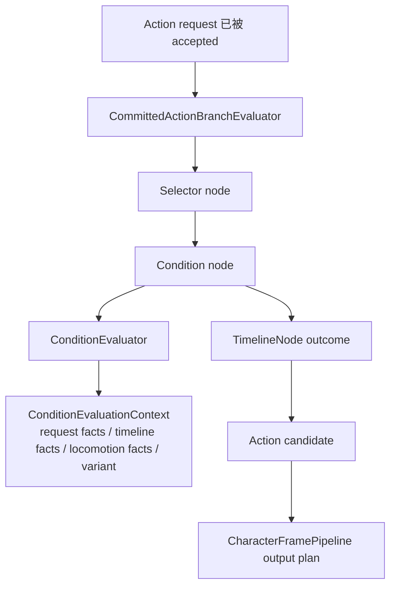
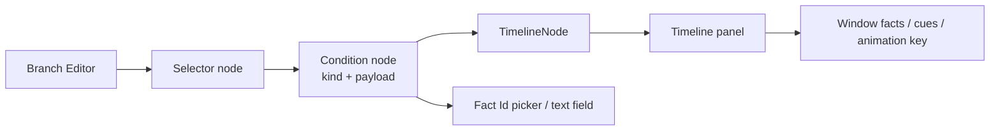

# Change: 正式化 Action 条件与事实框架

## Why
Committed Action branch 已经有 selector / condition / timeline 的运行时概念，但 condition 仍容易随具体动作扩展而写成 C# 特例。Block、Attack、GuardCounter、蓄力、长按松开、窗口反击这些动作如果每个都新增专用 condition、专用 resolver switch 或直接读某个黑板字段，Branch Editor 会逐步退化成 Animator 式蜘蛛网。

本 change 的目的不是做一个更大的状态机，而是把“当前 accepted Action 内部怎么选 TimelineNode”需要读取的条件收敛成稳定、可校验、可测试的纯数据模型。这样后续格挡、攻击、蓄力、反击等普通动作优先走配置，不因为缺少一个 condition 类型就绕到专用 MonoBehaviour 或 action id switch。

## Problem Details
- Branch 的职责是选择当前 accepted action 内的节点，例如 `Block.Start`、`Block.Loop`、`Block.End`。
- Branch 不负责接受请求，不负责跨 Action 跳转，不负责写黑板，不负责播放动画或移动角色。
- 现有 `Condition 只读上下文` spec 已经规定 condition 不能有副作用，但还没有规定 condition 的正式 authoring payload、fact id 校验和 editor 写回形态。
- 如果不补这一层，Branch Editor 会看似统一，实际每加一个动作就往 evaluator 里加一段动作专用判断，形成新的分裂路径。

## What Changes
- 新增正式 Action condition authoring / runtime model，用 typed condition kind 和纯数据 payload 表达 branch 条件。
- 新增共享 Action fact compile context / fact id resolver，让 condition 与后续 transition policy matrix 使用同一套 fact id 声明、解析和 diagnostics 口径。
- 新增 Action fact id / fact source 校验规则，让 condition 通过稳定 fact id 引用 Timeline facts、request facts、runtime facts、locomotion facts 或批准等价事实。
- 第一版 condition kind 覆盖普通动作配置所需的 `Always`、`RequestHeld`、`RequestReleased`、`RequiredFactActive`、`TimelineComplete`、`HasMoveIntent`、`ActionVariantEquals`。
- 明确 request fact 的同 tick 语义：同一 request kind 在 release tick 上 `RequestReleased` 必须胜过 `RequestHeld`，避免 Loop self edge 抢先吞掉 End edge。
- 明确 `TimelineComplete` 只基于 compiled runtime duration ticks 和 action-local tick，完成边界为 `localTick >= durationTicks` 或批准等价确定性边界。
- condition authoring MUST 编译为 runtime condition definition，runtime definition MUST 不包含 Unity scene object、GraphView object、Animator、Animancer、InputAction 或 MonoBehaviour。
- condition evaluator MUST 只读纯数据上下文，不得读 Unity scene object、Animator、Animancer、InputAction 或执行副作用。
- Branch Editor MUST 通过 serialized adapter 编辑 condition kind、payload 和 required fact id，并保存回 `CharacterActionDefinitionSO` 的通用 branch authoring。
- validator MUST 对缺失 fact id、非法 payload、无法编译的 condition 和不支持的 condition kind 给出正式错误或 warning，不允许隐藏 fallback。

## Target Runtime Chain

## Target Editor Shape

Condition node 只描述“这条内部边什么时候可选”。例如：

- `RequestHeld`：长按中保持 Loop。
- `RequestReleased`：松开后进入 End。
- `TimelineComplete`：Start 播完后进入 Loop。
- `RequiredFactActive(window.counter.open)`：当前 action 内某个窗口事实激活时允许选择某个节点。

## Boundaries
- Source 层：不新增新的 Action source；仍由 CommittedAction source 提交。
- Action 层：不新增具体 Block / Attack / GuardCounter 行为。
- Claim / Slot 层：不改变 FullBody、UpperBody、BaseSlot 或 UpperBodySlot 语义。
- Channel 层：只影响 branch selection 的条件输入；不新增 motion、animation、cue 输出通道。
- Presentation Layer：不触碰 Animancer Presenter、Timeline view runtime、VFX/SFX/Camera presenter。

## Non-Goals
- 不实现 Block、Attack、GuardCounter、命中、伤害、受击或耐力系统。
- 不新增跨 Action 跳转策略；跨 Action 关系归 `formalize-action-transition-policy-matrix`。
- 不把 condition 做成通用脚本表达式、反射表达式、C# 插件系统、行为树或蓝图。
- 不新增第二套黑板 writer、motion executor、animation presenter、角色帧入口或 Unity tick。
- 不把 `RequiredFactActive` 变成“缺失 fact 时猜测 true/false”的兼容入口。

## Dependency Order
1. 先完成或对齐 `formalize-committed-action-authoring-toolchain`，确保 `CharacterActionDefinitionSO` 使用通用 Branch Authoring。
2. 再实施本 change，把 Branch Authoring 内的 condition 补成正式 typed model。
3. `formalize-action-transition-policy-matrix` 可以复用本 change 的 fact id 校验语义，但不能反过来把跨 Action 跳转塞进 Branch condition。
4. `add-config-only-action-golden-path` 用本 change 证明 TestHold 的 Start / Loop / End 可以纯配置。

## Impact
- Affected specs:
  - `committed-action-node-selection`
- Related active changes:
  - `formalize-committed-action-authoring-toolchain`：Branch Editor 必须使用本 change 的 condition authoring / payload，而不是 Dodge 专用 condition 字段。
  - `formalize-action-transition-policy-matrix`：跨 Action policy 可复用本 change 的 fact id 校验语义。
  - `add-config-only-action-golden-path`：TestHold 使用本 change 的 held / released / timeline complete 条件。
- Affected code after approval:
  - `CommittedActionBranchDefinition` 或批准等价 runtime condition model
  - `CommittedActionBranchEvaluator` / condition evaluator
  - 通用 branch authoring model / compiler / validator
  - Branch Editor serialized adapter
  - Branch authoring / selection EditMode tests

## Success Criteria
- 普通 Start -> Loop -> End 动作不需要新增动作专用 C# condition。
- 缺失 fact id 时 validator 明确报错，compiler 不生成可被正式 runtime 消费的半成品 branch。
- condition 与 transition policy matrix 使用同一套 fact resolver；同一 fact id 在两处不能出现不同解析结果。
- Release tick 上 `RequestHeld` 不会让 Loop self edge 抢在 `RequestReleased` 前继续保持 Loop。
- evaluator 只读纯数据 context，不能写黑板、消费输入、接受请求、切 Action、执行 motion 或播放 animation。
- Branch Editor 保存 condition 修改后，`ToDefinition()` 或批准等价编译入口能看到同一份 runtime condition。
- 静态边界测试能证明 runtime condition 层不引用 UnityEditor、GraphView、Animator、Animancer、InputAction 或 scene object。

## Validation
- `openspec validate formalize-action-condition-fact-framework --strict --no-interactive`
- 实施阶段需要定向 EditMode 测试覆盖 condition 编译、每个 condition kind true/false、fact id 校验、Branch Editor 写回、selector 顺序和静态边界。
