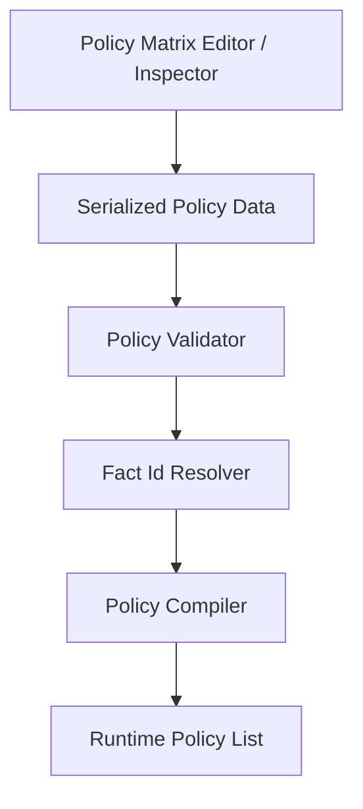
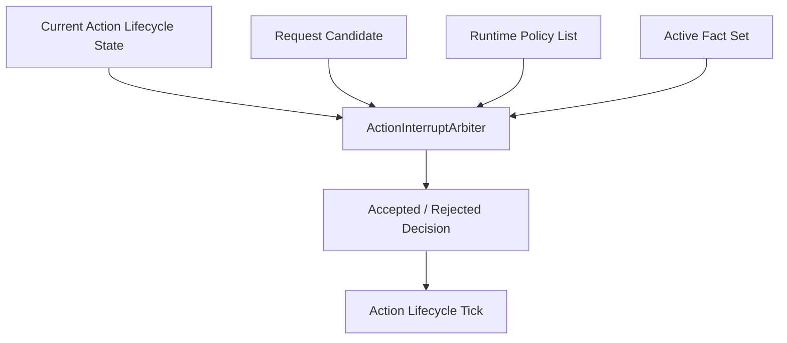

# Design: Action Transition Policy Matrix

## Context
Branch 图适合表达单个 Action 的局部选择，例如 `Block.Start`、`Block.Loop`、`Block.End`。跨 Action 关系如果也画成节点边，会让每个动作都能连到任意动作，最终变成 Animator 蜘蛛网。

项目已经有 Action interrupt policy 数据和仲裁器。本 change 不重做仲裁器，而是把跨 Action authoring 收敛成 matrix 视图和更严格的数据合同：matrix 负责描述准入关系，runtime 仲裁仍由 Action request provider、interrupt arbiter 和 action lifecycle 完成。

## Goals
- 让跨 Action 跳转关系集中在 policy matrix 中。
- 让 policy 只描述 from/to/request/priority/force/resistance/required fact。
- 让 policy 引用 timeline fact，不重复定义窗口时间。
- 保持 Branch 图只表达 Action 内部节点选择。
- 让后续 Block -> GuardCounter、Attack -> Dodge、Attack01 -> Attack02 都能通过同一策略表配置。
- 让 matrix editor 成为正式 policy data 的视图，而不是第二套 runtime graph。
- 明确本 Matrix 第一版只覆盖 `Action.* -> Action.*`，不把 Locomotion、TurnBack 或通用 state request 目标混入同一作者视图。

## Non-Goals
- 不实现具体 Block、Attack、Counter、combo 输入缓冲、hit detection 或 damage。
- 不新增新的中断仲裁 runtime。
- 不允许 matrix 直接切换 Action 或执行副作用。
- 不把 Locomotion 基础状态图改成依赖 Action policy matrix。
- 不恢复 FullBody 主树或跨 Action 全局 GraphView。
- 不借本 change 正式化 Locomotion / TurnBack matrix；现有状态请求策略可继续存在，但不是本 Matrix 作者视图的编辑目标。

## Data Model

### Matrix Row Authoring
建议形态如下，实际命名按现有 policy 类型统一：

```text
ActionTransitionPolicyRowAuthoring
  fromActionId
  toActionId
  requestKind
  requiredFactId
  minPriority
  force
  resistanceRule
  diagnosticsLabel
```

字段语义：

- `fromActionId`：当前 active action id，必须是 `Action.*` 或批准等价 action id。
- `toActionId`：目标 action id，必须是 `Action.*` 或批准等价 action id。
- `requestKind`：触发该跳转的请求类型，例如 Attack、Dodge、Counter。
- `requiredFactId`：准入所需事实，例如 `window.counter.open`。
- `minPriority`：请求最低优先级。
- `force`：是否允许强制覆盖 resistance。
- `resistanceRule`：只用于映射现有 runtime policy 已批准的 resistance 语义，不新增第二套 resistance 权威。
- `diagnosticsLabel`：可选调试显示，不参与 runtime 判断。

### Runtime Policy
Matrix row 编译到现有 `ActionInterruptPolicy`、状态请求策略 runtime policy 或批准等价纯数据 policy。

runtime policy 必须包含：

- from action id
- target action id
- request kind
- min priority
- force
- resistance rule 或批准等价字段
- required fact id 或批准等价 fact predicate

runtime policy 不得包含：

- GraphView edge
- EditorWindow state
- AnimationClip
- Animator / Animancer object
- Transform / CharacterController
- MonoBehaviour

## Authoring Flow


Editor 只读写 serialized policy data。保存 matrix 不会触发 runtime action switch。

## Runtime Flow


Action lifecycle 只消费仲裁结果。Matrix 本身不参与 runtime tick，也不成为新的 runner。

## Window Fact Rule
窗口时间必须由 timeline 或 state timeline policy 定义，例如：

```text
Timeline window:
  factId: window.counter.open
  startTick: 12
  endTick: 28

Matrix row:
  from: Action.Block
  to: Action.GuardCounter
  request: Attack
  requiredFactId: window.counter.open
```

禁止：

```text
Matrix row:
  from: Action.Block
  to: Action.GuardCounter
  request: Attack
  windowStart: 12
  windowEnd: 28
```

原因是窗口时间属于 timeline authoring；policy 只引用事实。否则同一个窗口会有两份 timing，后续修改动画时必然分裂。

## Decisions

### Decision: Matrix 是现有 policy 数据的作者视图
Matrix row 映射到现有 `ActionInterruptPolicy`、状态请求策略或批准等价 runtime policy。Editor 可以用表格展示 from / to / request / required fact / priority / force / resistance，但 runtime 仍只消费编译后的纯 policy 列表。

### Decision: 第一版 Matrix Scope 是 Action-to-Action
本 change 的 Matrix 作者视图只表达 `Action.* -> Action.*`。它可以编译到现有较泛的 policy runtime 类型，但 UI、validator 和测试必须拒绝把 Locomotion state、TurnBack state、Branch TimelineNode 或 GraphView node 当成本 Matrix row 的 from/to。若未来需要通用 state request matrix，必须另开 OpenSpec，重新命名和定义 scope。

### Decision: required fact 替代重复窗口时间
新增 Action-to-Action 中断窗口 timing 应由 Action Timeline、ActionTimeline fact source 或批准等价动作时间源产出 fact，例如 `window.counter.open`、`cancel.attack01.to.dodge`。policy row 引用 fact id，不再配置另一份 start/end。

### Decision: Branch 不直接跨 Action 跳转
Branch condition 命中 counter window 时，只能输出当前 action 内的 timeline/fact/cue。进入 `Action.GuardCounter` 必须由输入或 AI request、policy matrix 和 interrupt arbiter 完成。

### Decision: Matrix 编译器无副作用
Matrix compiler 只做数据转换、校验和 diagnostics。它不得调用 `ActionLifecycle`、`CharacterFramePipeline`、motion executor、animation presenter 或 blackboard writer。

### Decision: from/to 使用 Action ID，compiler 可映射到底层 policy id
Matrix authoring 口径必须使用 Action ID。如果现有 runtime policy 底层字段名仍是 state id，matrix compiler 可以做纯数据映射，但 editor、validator、spec 和测试不能把该底层名称解释为允许 Locomotion 或 Branch TimelineNode 进入本 Matrix。

## Validation Rules
- from action id 不能为空。
- to action id 不能为空。
- request kind 不能为空。
- min priority 不得小于 0。
- required fact id 若非空，必须能解析。
- required fact id 必须通过 condition/fact framework 的共享 fact resolver 或批准等价 compile context 解析。
- 新增 matrix row 不得定义 window start/end。
- 重复 row 必须可诊断；相同 from/to/request/requiredFact 可 warning，冲突 force/resistance 可 error。
- row 不得引用 Branch 内部 TimelineNode 作为 to action。
- row 不得引用 Locomotion 基础状态作为本 Matrix 的 from/to；现有状态请求策略不通过本 Matrix 作者视图编辑。

## Editor Shape
Matrix Editor 或 inspector adapter 应展示：

- From Action 下拉或搜索。
- To Action 下拉或搜索。
- Request Kind 下拉。
- Required Fact Id 输入或 picker。
- Min Priority 数字字段。
- Force toggle。
- Resistance 规则字段。
- Diagnostics 列。

Editor 不应该展示：

- Branch TimelineNode 节点图。
- 动画 clip track。
- motion executor 配置。
- Animancer layer。
- CharacterFramePipeline phase。

## Risks / Trade-offs
- 风险：旧 Dodge policy 仍有 elapsed time timing rule。
  - 处理：旧规则必须迁移为 required fact id、timeline fact source 或明确迁移诊断；正式 runtime 不保留 elapsed timing 兼容规则。
- 风险：matrix 视图让设计者误以为它是状态机。
  - 处理：UI 文案和 tests 明确它只是 policy authoring adapter，不显示 Branch 内部 timeline 节点，不执行 runtime switch。
- 风险：required fact id 缺少统一来源。
  - 处理：复用 condition/fact framework 的共享 fact resolver；缺失时 validator 报错。
- 风险：底层 policy runtime 仍使用 state id 命名，导致 Matrix scope 被误解。
  - 处理：Matrix authoring、editor label、validator 和测试统一使用 Action ID 口径，compiler 内部映射不外泄为作者语义。
- 风险：Attack combo 既可以看作同 Action variant，也可以看作多个 Action。
  - 处理：本 change 不决定 combo 建模；无论选择哪个建模，跨 Action 关系都走 matrix，Action 内部 variant 选择走 Branch/Condition。

## Migration Plan
1. 审计现有 Action interrupt policy 数据。
2. 定义 matrix row authoring contract。
3. 将 row 编译到现有 runtime policy。
4. 为 required fact id 增加校验。
5. 增加 Editor-only matrix adapter 或 window。
6. 用 TestHold -> TestCounter 证明跨 Action 配置路径。

## Test Strategy
- Compiler tests 覆盖单 row、多 row、顺序保持和 runtime policy 字段映射。
- Validator tests 覆盖空 from/to/request、负 priority、缺失 required fact、重复 row 和禁止 window start/end。
- Arbiter tests 覆盖 required fact active 时 accept、fact missing 时 reject。
- Editor adapter tests 覆盖新增、删除、重排、编辑和保存。
- Static boundary tests 覆盖 matrix editor/compiler 不调用 lifecycle、motion executor、animation presenter、blackboard writer 或角色帧入口。
- Structural tests 覆盖 Branch definition 不持有跨 Action target edge。
