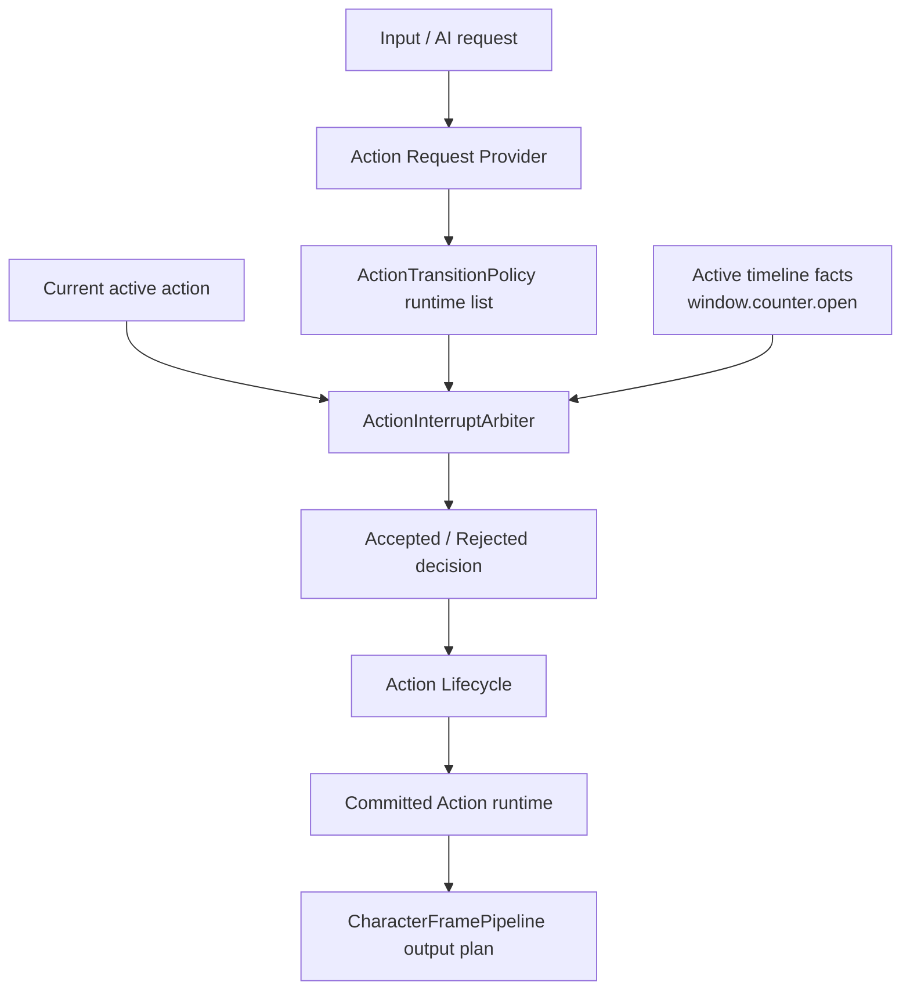
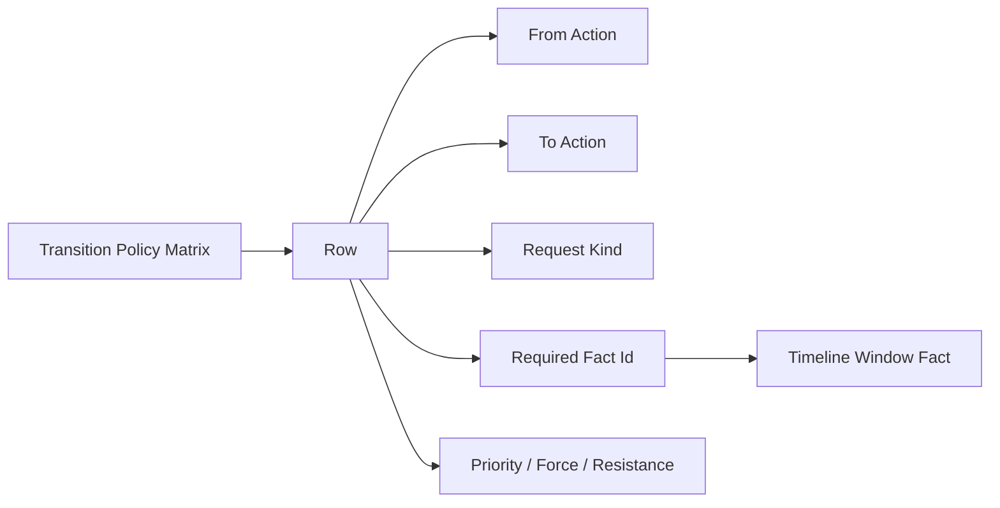

# Change: 正式化 Action 跳转策略矩阵

## Why
Action 内部 Branch 图只应负责当前 accepted action 内选择 TimelineNode。若 Block、Attack、GuardCounter、AttackCombo、DodgeCancel 等跨 Action 跳转直接画在 Branch 图里，会重新形成 Animator 式蜘蛛网，并绕开 request / interrupt / lifecycle 主线。

本 change 的目标是把“一个 Action 在什么窗口、什么请求、什么优先级下可以切到另一个 Action”集中成 Action Transition Policy Matrix。它是现有 Action interrupt / request policy 数据的作者视图和校验入口，不是新的状态机 runner，也不是 Branch Graph 的跨 Action 总图。

## Problem Details
- Branch 图适合表达 `Action.Block` 内的 `Start -> Loop -> End`。
- Branch 图不适合表达 `Action.Block -> Action.GuardCounter`，因为这已经是 Action lifecycle 切换。
- 如果跨 Action 边写进 Branch，设计者会在每个 Action 图上看到所有可能跳转，最终接近原生 Animator 的大蜘蛛网。
- 当前 `action-interrupt-policy-data` 已经定义策略集合、编译、校验和仲裁边界，但还缺一个更适合编辑跨 Action 关系的 matrix 口径。
- 当前 spec 也已经要求新增状态请求策略不重复定义窗口时间，本 change 要把 required fact id 变成 matrix 的正式用法。

## What Changes
- 新增或正式化 Action Transition Policy Matrix 编辑口径，作为现有 Action interrupt / request policy 数据的 Action-to-Action 作者视图。
- 本 change 的 Matrix row scope 仅覆盖 `Action.* -> Action.*` 跨 Action 准入；Locomotion / TurnBack / 通用 state request matrix 不借本 change 扩范围。
- Matrix row MUST 能表达 from action id、to action id、request kind、required fact id、min priority、force 和现有 resistance 语义。
- Matrix row MUST 编译为现有 `ActionInterruptPolicy`、状态请求策略 runtime policy 或批准等价纯 runtime policy。
- 跨 Action 跳转 MUST 通过 request provider、interrupt arbiter 和 action lifecycle，而不是 Branch 图直接跳另一个 Action。
- policy MUST 引用 timeline/window facts，不得重复定义同一窗口的 start/end timing。
- policy required fact id MUST 使用 `formalize-action-condition-fact-framework` 定义的共享 fact resolver / compile context，不能另建 matrix-only fact registry。
- Matrix Editor MUST 写回正式 policy 数据源，MUST NOT 保存 GraphView-only runtime 边。
- 增加自动测试和静态边界验证，证明 matrix 只是 policy authoring adapter，不是第二 runtime runner。

## Target Runtime Chain


## Target Authoring Shape


格挡反击的目标配置形态：

```text
from: Action.Block
to: Action.GuardCounter
request: Attack
requiredFact: window.counter.open
minPriority: 20
force: false
resistance: default action resistance rule
```

这行配置只表示“准入关系”。它不直接执行切换，不写 Branch node，不播放动画，不移动角色。

## Boundaries
- Source 层：仍由 request provider / Action source 提交请求候选。
- Action 层：本 change 只定义跨 Action 准入 policy，不实现 Block、Attack 或 GuardCounter 的具体动作内容。
- Claim / Slot 层：不改变 FullBody claim、BaseSlot、UpperBodySlot 的仲裁语义。
- Channel 层：policy 可读取 required fact id，但不新增 timeline fact writer。
- Presentation Layer：不触碰 Animancer Presenter、Timeline panel runtime、motion executor、VFX/SFX/Camera。
- State Request 边界：现有 `action-interrupt-policy-data` 可继续承载 TurnBack 或批准等价状态请求策略；本 Matrix 作者视图不把 Locomotion state、TimelineNode 或 Branch node 当作 to action。

## Non-Goals
- 不实现 Block、GuardCounter、Attack、连击、命中、伤害、受击或耐力系统。
- 不替换现有 `ActionInterruptArbiter` 主职责。
- 不把 Branch Editor 扩展成跨 Action 总图。
- 不把本 Matrix 扩展成 Locomotion / TurnBack / 通用 state request policy 总表。
- 不新增 motion executor、animation presenter、blackboard writer、状态机 runner 或角色帧入口。
- 不为了旧 Dodge elapsed timing 增加新的 fallback 配置。

## Dependency Order
1. 需要现有 `action-interrupt-policy-data` 主链路可编译并被 `ActionInterruptArbiter` 消费。
2. 建议先完成 `formalize-action-condition-fact-framework`，让 required fact id 校验有统一来源。
3. 本 change 完成后，`add-config-only-action-golden-path` 用 TestHold -> TestCounter 验证跨 Action 跳转。
4. 正式 Block / GuardCounter 只有在本矩阵和 config-only 金线完成后才应进入普通动作配置阶段。

## Impact
- Affected specs:
  - `action-interrupt-policy-data`
- Related changes:
  - `formalize-action-condition-fact-framework`：policy required fact id 复用 fact id 校验语义。
  - `add-config-only-action-golden-path`：TestCounter 使用 matrix 证明跨 Action 可配置。
- Affected code after approval:
  - Action interrupt policy SO / serialized adapter
  - Action interrupt policy compiler / validator
  - Action request / interrupt policy runtime model
  - 可选 Editor-only matrix window 或 inspector adapter
  - Action interrupt policy tests

## Success Criteria
- `Action.Block -> Action.GuardCounter` 这类关系能用 matrix row 表达，不需要 Branch 跨 Action 边。
- Matrix validator 会拒绝 `Locomotion.*`、Branch TimelineNode 或 editor node 作为本 Action-to-Action 作者视图的 target。
- Matrix row 编译后的 runtime policy 能被现有 `ActionInterruptArbiter` 或批准等价仲裁器消费。
- policy row 引用 `window.counter.open` 等 fact id，不重新配置 counter window start/end。
- 缺失 required fact id 时 validator 报错，runtime 不使用隐藏默认窗口。
- Matrix Editor 保存不会调用 lifecycle、motion executor、animation presenter 或 blackboard writer。

## Validation
- `openspec validate formalize-action-transition-policy-matrix --strict --no-interactive`
- 实施阶段需要定向 EditMode 测试覆盖 policy row 编译、required fact id 校验、matrix adapter 写回、仲裁器消费、Branch 不跨 Action 和静态边界。
