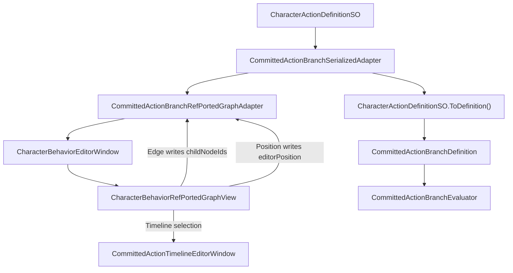

## Context
当前 Committed Action 数据链路已经使用本项目自己的模型：`CommittedActionBranchAuthoring` 保存 selector / condition / timeline 节点，compiler 输出 `CommittedActionBranchDefinition`，runtime 由 `CommittedActionBranchEvaluator` 解释。Timeline 编辑器已经有独立 Ref port timeline UI，Branch 节点树只负责选择或跳转到对应 TimelineNode。

缺口在 Branch 节点树编辑体验：旧实现是 `ScrollView branchGraph` 加若干 `Box card`，只展示节点和 child 文本，不是真正的节点编辑器。项目已经存在 `CharacterBehaviorEditorWindow` / `CharacterBehaviorRefPortedGraphView` 这条 Ref port 节点编辑器外壳，因此 Branch 不再新增第二套 GraphView 或重复菜单，而是作为该 editor shell 的一种数据源。

## Goals / Non-Goals
- Goals:
  - 复用现有 `CharacterBehaviorEditorWindow` / `CharacterBehaviorRefPortedGraphView` 作为唯一 Ref port 节点编辑器外壳。
  - 节点、端口、连线、拖拽位置和选择都通过 Branch graph adapter 写回 `CommittedActionBranchSerializedAdapter`。
  - 复用 Ref 节点编辑器的窗口结构、GraphView 交互、SearchWindow 创建节点、Node / Port / Edge 视觉资源意图。
  - 选中 TimelineNode 后打开或聚焦独立的 Committed Action Timeline Editor。
  - 删除 card/list 伪图形路径，不保留两个 Branch graph UI 或重复节点树菜单。
- Non-Goals:
  - 不复制 Ref runtime tree。
  - 不让 GraphView node 成为 gameplay node。
  - 不新增 Branch runtime 分支、fallback 配置或 sample-only action asset。
  - 不新增第二套 Branch node editor 窗口、重复菜单或专用 Branch GraphView。

## Ref 设计意图
Ref 节点编辑器提供的是工具交互形态：EditorWindow shell、GraphView canvas、Node、Port、Edge、SearchWindow、拖拽、缩放、框选和节点布局。可吸收的是 Editor-only UI 结构；不能吸收的是 Ref runtime tree、RunnableNode、TreeRunner、TimelinePlayer 或 PlayableGraph 执行语义。

## Target Data Flow

## Decisions
- Decision: Branch 编辑使用现有 `CharacterBehaviorEditorWindow` 的 Committed Branch mode 和 `CharacterBehaviorRefPortedGraphView`，不新增专用 Branch GraphView 或重复菜单。
  - Rationale: Behavior Editor 已经是 Ref port 节点编辑器外壳；新增 Branch GraphView 或 Branch 菜单会形成第二套节点编辑器入口。
- Decision: GraphView 只依赖 graph adapter，Branch graph adapter 再写入 `CommittedActionBranchSerializedAdapter`，不直接操作 runtime definition。
  - Rationale: adapter 已经是正式 serialized writeback 边界，能保证 editor view 和 compiler 使用同一份 action definition 数据。
- Decision: Edge 创建和删除写入 `childNodeIds`，child 顺序由 adapter 明确维护。
  - Rationale: runtime selector 顺序必须稳定，不得依赖 GraphView 非确定枚举。
- Decision: Timeline Editor 是独立窗口，不嵌入 Branch 节点树窗口。
  - Rationale: 节点树和 timeline 同屏过挤；TimelineNode 只负责从 Branch 图跳转到对应 Timeline window。
- Decision: 删除 `ScrollView branchGraph` card path。
  - Rationale: 这是当前错误形态；保留会让用户误以为仍有一个简化备用编辑器。

## Risks / Trade-offs
- Risk: GraphView edge 顺序不天然稳定。
  - Mitigation: adapter 写回 child 顺序时使用显式顺序，测试覆盖重连、删除和重排。
- Risk: Ref UI 资源可能包含项目路径或旧 USS/UXML 语法。
  - Mitigation: 只迁移必要资源，导入到本项目 Editor 目录，由 Unity 生成 `.meta`，静态测试拒绝 Ref 项目路径引用。
- Risk: GraphView 容易把 editor node 概念误写进 gameplay spec。
  - Mitigation: spec 明确 GraphView node 只是 Presentation Layer / Editor-only view，不是 gameplay source、claim、slot 或 runtime node。

## Open Questions
- `childNodeIds` 的可视化顺序是否需要首版提供拖拽排序 UI，还是通过断开重连顺序确定即可？本 proposal 默认首版必须稳定写回顺序，具体交互可在实现中选择最小可测方式。
