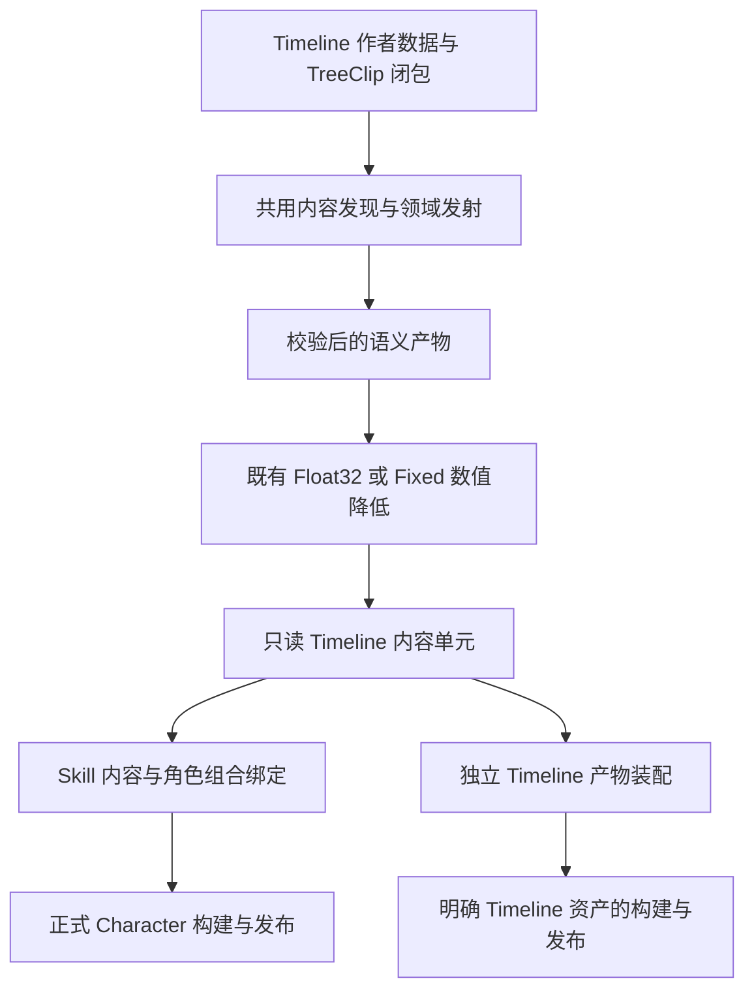

## Context

动机和范围见 [proposal.md](proposal.md)。2026-09-05 用户明确选择“Skill 和非 Skill 都能使用”，包含 C# 直接调用及 TreeClip，并强调当前 Timeline 很依赖 Character 管线。本设计将移除这些必要依赖作为交付条件；下文新增入口和类型均为目标设计，不代表当前代码已经提供。

### 已核对的当前链路

以下路径均相对于 `3cDemo/Client/3C_Client/Assets/GameScripts/Main/`。主重构正在修改同一工作区，实施时必须重新核对实际合同，不能按本次调查的行号覆盖文件。

| 现有位置 | 已有职责或依赖 | 必须怎样处理 |
|---|---|---|
| `Runtime/BTSMTL/Timeline/Scripts/TimelineData.cs`、`TimelineAsset.cs` | 已有统一数据及 shared 资产；inline/shared 有明确 owner | 保留一份数据模型和稳定作者 identity；补外部参数/绑定声明 |
| `Runtime/BTSMTL/Timeline/Scripts/BTSMTL.Timeline.asmdef` | 仍引用角色 RootMotion 与 Simulation Core | 本地作者数据、领域片段与 portable 执行按真实依赖分层；现有 asmdef 不证明独立 |
| `Editor/CharacterSimulation/Compilation/Semantic/CharacterAuthoringSourceCompilationModel.cs` | Timeline record 必带 TimelineNode、Graph route | 内容闭包与调用点记录分开，独立根无需伪造节点 |
| 同目录 `CharacterSemanticEmitter.cs` | 编译 Timeline 时从节点取 Graph identity、ActionContext，继续编译 TreeClip | 内容发射复用领域模块；调用方只负责绑定、来源与组合 |
| 同目录 `CharacterSimulationTimelineEmitterRegistry.cs` | 已有 Track/Clip emitter，但 Character 上下文集中装配 | 迁移为领域拥有的定义和执行登记；不复制第二目录 |
| `Runtime/Simulation/Core/Execution/TimelineControlRuntime.cs`、`TimelineControlContracts.cs` | 时间分段、循环、TreeClip、Action identity、Motion 与表现输出同处一个控制合同 | 时间与片段调度只拥有时间/生命周期；业务执行和实例有效性归对应模块 |
| `Runtime/Simulation/Core/Float32/Execution/Float32TimelineTarget.cs` 及 Fixed 对应文件 | 读写角色状态、解析 Action、推送 Blackboard 上下文、提交 Motion/Presentation | Character 适配继续做这些事，共用执行部分不再依赖该角色实现 |
| `Runtime/Simulation/Core/Float32/Execution/Float32OperationEvaluator.cs` 及 Fixed 对应文件 | 在角色求值器中构造 Timeline/Tree 控制，并组织技能阶段 | 继续由唯一角色事务推进，改用提取后的模块和状态视图 |
| `Runtime/BTSMTL/Timeline/Scripts/Tree/TimelineRunningTree.cs` | 禁止对象运行初始化，要求 compiled Character Program | 保持编译执行限制，去掉必须为 Character 产品的限制 |
| `Runtime/BTSMTL/Timeline/Scripts/Tree/TimelineTreeDecisionValidation.cs` | Decision 约束与角色 Frame declaration、ActionWindow 投影相关 | 共用纯决策规则与角色窗口投影分责；非 Skill 不伪造角色 Blackboard |

当前 Float32 target 在未声明 ActionContext 时允许继续，因此“每条 Timeline 都强制有 ActionInstance”并不准确。真正的独立性缺口是整个编译、状态、树调用和输出环境仍由 Character 提供。

### 与正在实施的目标关系

- `refactor-btsmtl-authoring-architecture` 仍拥有 C# 控制、SkillDefinition/SkillProgram、ActionInstance/SkillExecutionState、完整角色状态与 Document v5 的基础迁移。本变更消费这些合同，负责 Timeline 共用内容与执行拆分；不得把所有 Tree 控制代码整体迁回另一套技能运行时。
- `rebuild-btsmtl-preview-with-scene-play` 独占预览会话。它的角色预览仍选择 Skill/ActionInstance；本变更增加可供其消费的非 Skill 播放观察合同，场景启动和试验重建不归 Timeline 窗口。
- 相机只消费正式已提交来源及 producer generation。独立 Timeline 不自动获得相机控制权，不重写相机数学。
- `replace-btsmtl-ai-with-behavior-designer` 规划将游戏 AI 改为插件执行并删除旧 AI domain/Program。本变更不替它实施删除、不保留其拟退役入口，也不以非 Skill 调用绕过 AI 只产生正式角色输入的边界。首次对账时只有 proposal/design；后续已读取其实际 20 份 delta 中与本变更相关的 Document/MCP、Graph、程序集与 Pipeline 条款。它仍只有规划授权，不能把规范交接描述为 AI 已实施。

### 主重构接口交接

主重构先确立角色内 Skill/ActionInstance、调用路径与 activation generation 的正式 owner；Timeline 不定义第二份释放身份、状态布局或停止结果。下表的“先”是接口依赖，不要求主重构全部任务完成后才做 Timeline 的独立内容工作。

| 共享位置/合同 | 主重构交付与保留责任 | Timeline 接管范围 | 交接证据 |
|---|---|---|---|
| `OperationControlRuntime/Contracts` | 唯一树控制、嵌套调用、局部生命周期及停止语义；明确状态访问合同 | 从同一实现提取调用方无关部分，挂接 TreeClip；不另起技能/独立两套控制器 | 来源提交、接口签名、所有调用者和停止语义映射 |
| `ActionInstance/SkillExecutionState`、调用 generation | 角色释放身份、typed 状态布局、事务/codec/hash/恢复与 generation 归属 | 用状态视图接入该 owner；非 Skill 独立存储复用字段语义但不复制完整角色状态 | 状态字段/地址合同、generation 创建与结束时机、快照边界 |
| Float32/Fixed `TimelineTarget` 与技能求值器 | 保留 Actor/Action 查找、正式阶段、角色事务和输出端口 | 以共享时间/TreeClip 执行接管原调用，角色业务适配仍在原领域 | 两目标的提供提交、绑定输入输出、Decision/Commit 顺序 |
| `CharacterSemanticEmitter`、发现模型、SkillProgram 链接 | 角色/技能组合、调用实例和角色外部绑定 | 提取同一 Timeline 内容发现/发射，增加真实独立内容根与调用来源 | validated artifact 合同、内容/调用记录边界、source/state 链接位置 |
| Document v5 schema、事务与整包装配 | 基础 v5、唯一编码/事务、控制与技能作者 owner | 在同一体系增加 Timeline 根和分片装配，不复制 codec/事务/迁移器 | schema/能力目录版本、根路由、Mutation/Exporter/Reconciler 提供入口 |
| 场景预览会话 | 场景 owner 由独立 ScenePlay change 提供 | 只交付正式播放/观察合同与真实业务目标 | 以未来实际提供提交核对接口与身份；当前尚无新预览代码合同，不新增临时窗口播放器 |

同一共享文件正在被主重构修改时，Timeline 实现须先核对提供提交与边界；变更签名、状态 owner、generation 或阶段前，用 DESIGN_QUESTION 取得交接结论。已移交部分由 Timeline 迁移并同步所有调用者，主重构消费同一结果，不以新类名、复制文件、临时适配或并列 registry 规避冲突。缺少某项接口时可以继续不依赖它的工作，不为推进造一个占位版本。

## Goals / Non-Goals

**Goals:**

- 同一 Timeline 数据、片段类型与执行语义可以被技能及明确的非技能调用方使用；独立使用不需要 Character Definition、角色组件、Skill 或 ActionProfile。
- 两种调用方式共用内容编译、时间推进、树控制与停止实现，状态归各自真正的业务 owner。
- 作者只面对轨道、片段、资源、目标位置和业务参数。程序负责装配可用执行模块，绑定错误必须定位到具体片段或树节点。
- 保留技能原有多个/嵌套 Timeline、Decision/Commit、Float32/Fixed、动作中断及状态恢复语义。

**Non-Goals:**

- 不取消数据编译，不运行作者对象，不制作通用蓝图产品，不承诺任意 C# 方法节点或任意子图递归。
- 不把本次非 Skill 用例扩成完整机关、碰撞通行、任务系统、剧情、Audio/VFX 或网络同步系统。
- 不让独立执行器承接 Character 世界求解或替代 Action 准入；所需正式能力未安装时明确拒绝。
- 不实现运行中换 Program/代码版本、反向播放或任意 seek 改写 Gameplay；不新增预览时钟和完整角色的独立播放器。

## Decisions

### 1. 数据模型统一，业务行为由 Track/Clip 模块拥有

Timeline 数据保存稳定 identity、轨道、片段、区段、时间缩放和外部输入声明。Once/Loop 继续属于一次调用的播放选择；内容与调用身份分开。同一技能可以使用多条 Timeline，也可以仅使用 Tree。

| 层次 | 输入 | 输出/职责 |
|---|---|---|
| Timeline 本地作者数据 | 作者编排、时间、引用、参数声明 | 可共享的内容定义，不保存运行对象或播放状态 |
| Track 类型合同 | 允许的 Clip、目标/通道类别、重叠规则 | 创建/拖放/构建约束；同轨重叠的业务含义 |
| Clip 类型合同 | 时间区间、资源和 typed 参数 | 字段、绑定依赖、执行阶段及生命周期要求 |
| 片段领域模块 | 已绑定输入、当前片段时间、领域状态和输出端口 | 该业务的请求/采样/状态变化 |
| 时间执行模块 | 只读时间布局、本次播放状态、调用方给的时间增量 | 有序进入/采样/离开、cycle、完成和停止进度 |

每种 Track/Clip 的稳定 kind、参数 schema、允许组合、重叠规则和依赖来自同一领域定义。Editor 投影、Document 投影、emitter 与执行登记分别处于各自层，通过相同 kind 和合同版本关联；Runtime 不引用 Editor schema 对象，也不在 Tick 内反射发现实现。装配完成后目录锁定。

同轨重叠是拒绝、并行执行还是向下游提供混合样本，由领域合同决定。不同轨道之间的动画混合、镜头优先级和运动合成仍归原领域模块，不能由轨道数组顺序或通用“后者覆盖前者”决定。沿用已正确片段的现行规则，记录迁移前后合同；没有定义的组合在构建时失败。

**业务取舍：** 按业务各建一种 Timeline，允许每种拥有专用整体流程，但重复维护时间、编辑和停止规则；统一 Timeline 配合领域 Track/Clip，让作者复用编排经验，但需要提前说清可放内容和重叠含义。本次选择后者。轻/重震使用不同资源参数；持续镜头状态与一次震动保留不同生命周期类型。

### 2. 共用编译输入是内容闭包，调用点单独链接

新增只读 Timeline 内容单元，建议名 `TimelineProgram`。它保存时间布局、片段描述、树调用、常量、局部状态布局、绑定签名、依赖版本和 SourceMap。既有 SkillProgram 可以引用该内容单元；独立产物也使用同一单元。作者对象、场景引用和某个 Character 包的全局可变状态地址不能进入单元。

Character Definition 继续是角色产品的唯一组合根。独立 Timeline Build 显式接收 shared TimelineAsset、Numeric Target 和精确产物位置，使用相同 artifact envelope、codec、校验和原子发布基础；增加明确的 Timeline root kind/payload，不创建另一套 IR/store，也不让 Character builder 接受任意场景对象。

内容 identity 来自 Timeline/Track/Clip/Tree 稳定身份。调用来源是独立记录：Graph 调用带节点/子图路径，C# 调用带正式调用点 identity；两者不能用假 Graph 节点统一。外部变量和能力在内容签名中声明，调用点只负责将声明链接到角色或非角色的实际接口。共享内容改变时，受影响发布组必须一起重建和校验。

首次提取保留既有 occurrence 展开及非递归树语义；不新增优化器或机器码编译。内容 schema、Operation Set、Numeric Target、状态布局、Binding 合同和代码模块版本共同决定可用性；失配拒绝装载。新版本在新调用环境/Session 中采用，不替换活动实例的内容。

**业务取舍：** 直接解释作者图减少显式内容构建，但会把类型解析、状态和引用错误带到播放阶段，并新增一套运行规则；预先生成数据增加构建步骤，但便于提前检查、复用现有数值目标和恢复链。本次保留数据编译。它不等于 C# DLL 编译；参数内容更新和新增执行代码使用各自正式发布路径。

### 3. 上下文只带本次内容确实需要的东西

“注入上下文”在业务上的含义是：调用开门内容时指定东门，调用技能内容时沿当前角色的本次释放取得目标。作者不填写一串运行服务。

输入分为三个明确合同，不能拼成 `object Context`、任意对象字典或全局服务定位器：

| 合同 | 例子 | 建立时间及寿命 |
|---|---|---|
| 内容调用输入 | 目标身份、打开方向、显式倍率 | 本次调用开始时按声明绑定；值参数按值捕获 |
| 领域执行绑定 | 读取机关状态、写场景表现参数；技能中访问 Action/运动/表现的正式端口 | 由程序组合一次装配，开始播放时按内容需求预绑定 |
| 本 Tick 执行视图 | 时间增量、当前事实、当前事务的状态和输出访问 | 由调用方每次推进提供，不被片段跨 Tick 保存 |

绑定需求由全部可达 Track/Clip 与 TreeClip/子图节点汇总。每项都有稳定声明 identity、值/目标类型、读写用途和所需领域能力。启动前解析到 typed index/handle；不存在通过字符串名字或运行时转型碰运气的逐 Tick 查询。未连接的作者常量继续是常量，确实需要外部输入的项必须满足；不增加“缺少就找场景默认值”的配置。

Skill 调用适配从现有执行范围取得角色、ActionInstance 引用和已捕获目标，不复制目标快照、不重复输入准入信息、不创建第二 Action Context 真相。Action 的有效性与终止检测留在 Skill 适配中；通用时间执行不含 `ActionId`、`PredictionKey` 或角色生命周期判断。

TreeClip 的签名映射到同次 Timeline 绑定。子树值输入按签名捕获，运行中变化的电源等事实通过显式只读事实访问获得。局部变量、等待和停止进度归子树调用状态；子树不能取得自己未声明的输出能力。片段并发写同一目标必须遵守领域明确的合成或互斥规则。

**业务取舍：** 每种业务定制完整上下文类，初期读取方便，但公共执行容易依赖越来越多业务；显式声明并绑定实际依赖，作者只看到必要目标/参数，程序需要维护完整类型校验。本次选择显式绑定，并把装配工作放在调用方而非每个作者片段上。

### 4. 从 Character 中提取执行模块，而非复制角色管线

提取共用时间分段、片段调度与停止控制；Tree 扩展复用现有 operation control 的顺序、选择、并行、等待、局部状态机和停止语义。既有 Character 领域 operation 继续在 Character 模块内登记，不被迁入通用时间模块。

| 模块归属 | 正式输入 | 正式输出 | 不拥有的内容 |
|---|---|---|---|
| Timeline 执行核心 | 内容索引、时间数值操作、typed 状态视图、当前帧 | 时间推进、片段生命周期与播放结果 | Action、角色 Blackboard、Motion、Camera |
| TreeClip 扩展 | 编译子树、签名映射、调用状态和当前帧 | 决策候选或有生命周期的树执行结果 | Skill 释放和独立时钟 |
| Character Timeline 接入 | 当前 Actor/ActionInstance/事务、已锁定技能内容 | 原有窗口、运动、角色表现及诊断 | 新的 Commit、世界求解或角色 Update |
| 非 Skill Timeline 接入 | 精确内容、调用方 identity、目标/参数、已装配领域模块 | 本次播放状态、受限输出和诊断 | 伪造角色、Action、Character/World 状态写入 |

核心和 Tree 扩展使用调用方提供的状态视图：Skill 映射到 ActionInstance 内的 SkillExecutionState；独立调用使用调用方拥有的 typed Timeline 状态存储。共用字段和 codec 语义只定义一次，不能把完整 CharacterSimulationState 复制成另一种名字或在执行器隐藏跨 Tick 状态。

两个 Numeric Target 复用时间/停止控制，实现其既有数值、曲线和 typed state 访问。涉及代码模块登记的热更路径继续消费主重构的正式规则装配，不能新增动态插件查找器。

**业务取舍：** 让非 Skill 构造一个空 Character，能够快速复用现有管线，但机关被迫携带角色配置、动作和状态布局；提取内容执行及窄适配，修改范围较大，但非 Skill 的必要依赖才能真正消失。本次选择提取，旧角色链在接管完成后删除对应重复实现。

### 5. Skill 和非 Skill 明确拥有各自的一次执行

| 问题 | Skill 调用 | 本次交付的非 Skill 调用 |
|---|---|---|
| 谁开始 | 唯一 Action 准入后，技能内容执行到调用点 | 业务 C# 在准备好的调用环境请求开始 |
| 谁保存状态 | ActionInstance 内的技能执行状态 | 调用方拥有的 Timeline 实例状态 |
| 谁给时间 | 现有 SimulationTick | 该场景业务 owner 的正式帧推进入口 |
| 谁决定停止 | 技能/动作正式停止流程 | 调用方请求停止或 owner teardown |
| 谁接结果 | 现有角色领域模块及唯一提交链 | 已明确装配的场景表现参数接收模块 |
| 谁拥有身份 | Actor、ActionInstance、调用点、generation | 调用方 identity、播放 identity、调用点、generation |

两类调用均经相同 Prepare/Bind、Start、Advance、Status、Stop、Dispose 合同。独立 C# 入口并不自建线程、全局 scheduler 或隐藏 MonoBehaviour；Unity 适配只将自己 owner 的帧输入交给该入口。Skill 不经过独立 owner 的帧循环。

Skill 路径保持同 Tick 顺序：先为活动 Timeline 计算本 Tick Decision 窗口候选，再由角色代码正式决策，最后在技能阶段推进 Commit 内容；结果经原 Evaluate/WorldResolve/Finalize/Commit。Decision 不能返回 Running 或发出业务副作用。

非 Skill 的正式帧先准备输入/事实快照与待提交状态，执行纯 Decision，再执行 Commit 内容，成功后发布本帧状态及受限输出。Decision 只写本次调用的候选，不产生 ActionWindow。没有世界求解需求的本地场景表现无需装配 WorldSolver；声明世界/角色能力的内容必须绑定现有正式模拟环境，不能在该本地帧中直接修改 Gameplay。当前没有对应非角色 Gameplay 接入时，构建/绑定明确报告不可用，不自动补 Pass。

同一只读内容可以多次并发调用，播放头和 TreeClip 状态绝不能按资产 GUID 合并。已绑定调用的对象替换使用明确停止后重新开始，不能悄悄换对象；句柄过期后不能控制后续复用实例。

**业务取舍：** 所有内容都使用完整 Character 管线，可以统一依赖入口，但独立表现也要安装角色；按调用方提供时钟、状态和受限输出，可以用于非角色场景对象，但调用环境必须明确自己支持的能力。本次采用后者，Character Gameplay 保留唯一正式管线。

### 6. TreeClip 保留，范围由真实依赖决定

TreeClip 是可选片段扩展。只用时间曲线的内容不需要装配 Tree 扩展；包含 TreeClip 的内容必须带完整子树、节点能力、状态及停止支持，不能忽略片段或运行旧作者 clone。

可独立复用的纯值、条件、顺序、并行、等待、局部调用/状态机等能力使用共用树执行。角色攻击、GE、ActionWindow、角色 MotionWarp 等节点继续属于相应领域，并明确声明必需接口。非 Skill 并不禁止所有树，也不因此允许所有技能节点。

TreeClip 与子树采用相同父子停止语义。Once 达到终点后，必须完成活动片段的必要退出才返回完成；这里指领域离开/释放义务已完成，不隐式等待相机等表现领域自己拥有的视觉尾段。取消后禁止继续输出正常内容，允许必要清理；graceful 状态可继续推进并在 Skill 中完整恢复，force teardown 不等待动画或网络确认。循环按尾段、中间完整 cycle、头段顺序处理；一帧跨过完整片段仍需正确进入和退出，一次事件在对应 cycle 中不得漏发或重复。保持已有有效边界行为，不借迁移调整动画混合或 MotionWarp 数学。

**业务取舍：** 非 Skill 仅允许专用片段，程序维护条件流程，装配较少；允许 TreeClip，作者可以编辑条件和子流程，需要完整的编译树依赖与生命周期。本次按用户选择保留 TreeClip，并统一执行实现。

### 7. 用一个真实独立场景对象完成接线

交付同一条“面板展开”内容给两个明确绑定的场景表现对象使用：曲线片段输出标量展开程度，TreeClip 读取当前帧的 typed `Enabled` 事实并输出布尔显示状态，接收模块按这两个不同参数更新本目标的表现。C# 调用方提供目标身份和本次固定参数，两个播放可分别开始/停止；动态可用事实由正式帧输入提供。该目标只修改自己拥有的非碰撞表现变换，不参与角色骨骼、Gameplay Body 或世界碰撞。

为此增加有完整作者定义、emitter、typed 状态/输出和 Unity 接收方的场景表现参数领域模块。内容可配置的字段限定为该模块明确支持的标量/布尔参数，不使用属性名反射、任意对象写入或通用 C# 回调片段。同一目标同一参数在同一采样范围只允许一个写入来源；编译可确定的冲突在构建拒绝，不同并发调用的冲突在绑定时按目标参数占用拒绝，停止后释放本次占用。固定用途的曲线片段和树输出节点共用该领域模块；新节点登记不写入时间核心大 switch。

这是正式非 Skill 接入样例，随正式资源和声明的 composition 装配；不是临时 fixture、测试替身或隐藏预览场景。受控场景运行由 ScenePlay change 提供的唯一协调器负责，独立 owner 在普通运行时也使用同一个内容执行入口。预览方当前尚未交付新代码合同，相关接线需以实际提交为准，不能把设计目标视为现有实现或添加临时播放器。当前未安装的声音、真实开门碰撞或角色相机不会被样例冒充为已支持。

**业务取舍：** 使用完整开门玩法展示能力，需要额外决定碰撞、世界状态和网络所有权；使用有实际目标和条件逻辑的表现参数编排，可以验证独立时间/TreeClip/绑定闭包，业务范围更明确。本次选择后者作为有界交付，通用输出能力仍按正式模块扩展。

### 8. 编辑器和 Document 使用同一套作者合同

现有 Timeline 窗口仍负责本地时间和片段编辑。Skill 默认 inline，显式共享才提取 TimelineAsset；独立调用以 shared TimelineAsset 为明确内容根，不再增加另一种 Timeline 数据资产。外部输入面板只显示“作用目标、展开方向、倍率”等内容实际声明的项目；程序接口、状态槽和编译索引不进入作者主流程。

未绑定运行对象不阻止独立作者编辑；所需能力或实际目标缺失时，构建或开始播放的诊断应指向具体轨道/片段/树节点。运行观察必须明确选中调用方和本次播放，不能在两个实例间自动取第一个。Timeline 游标仍只定位作者内容或已记录历史。

独立 Timeline 引入正式 Document domain `Timeline`，根为精确 TimelineAsset。它复用主重构 v5 的 codec、manifest、整包哈希、Reconciler、事务、Mutation 和五工具；只增加 domain 分片装配，不引入 v6、v4 临时分支或另一个导入导出器。Timeline domain 包含根、时间数据、曲线、外部输入声明、TreeClip 及可达共享子图，目录规则复用已存在的严格文件族。

这是对主重构 domain 目标的显式范围扩展。CharacterController 继续拥有自己的 Skill inline 内容；其他 domain 的保留/退役按其正式变更决定。与新 AI 提案合并后的目标不含 AIController，Timeline 增量不能重新注册 AI 根、旧包 reader、AIProgram 或插件 AI Document。共享 Timeline 无论经 Character 包还是 Timeline 包修改，都指向相同正式资产和 owner；一个包提交后，另一个包以 live revision 得到 TreeDirty/Conflict，不能维护两份资产或忽略冲突。inline 内容只能由其现有 owner 的包编辑，提取 shared 仍走正式 Mutation。

实际门对象、当前角色、ActionInstance、运行服务和播放状态不进入 editable JSON；只读可用能力和产物身份进入 context。Timeline Build 是按精确资产的独立操作，apply 不自动 Build。现有五个生命周期工具仅扩展 domain 分派，不新增局部 Timeline/Clip MCP 编辑工具。

**业务取舍：** 让独立 Timeline 依附某个 Character Document，减少一个 domain，却强制存在无关角色根；增加同框架的 Timeline domain，需要完成根与分片闭包，但独立内容有真实作者入口。本次选择正式扩展同一 v5 文档体系。

### 9. 目录与程序集按依赖迁移

共用模块建议归属为 Timeline authoring core、portable Timeline execution、Tree authoring/execution extension、Character Timeline integration、Scene Timeline integration 以及各自 Editor 集成。实施时沿现有程序集职责确定最终目录，不能只拆文件而保留对角色总接口的依赖。

- portable 时间与基础状态合同不引用 Unity、TreeDesigner、Character/Action 业务或 Editor。
- Tree 扩展依赖 Timeline 合同和共用树控制；Timeline 核心不反向引用 Tree。
- Character 适配依赖共用执行及原 Character 模块，Scene 适配依赖共用执行和场景表现参数模块；两者不能互相依赖具体实现。
- 领域 Clip 的作者结构和 Editor emitter 由领域拥有；只读 runtime 描述由对应 portable 模块拥有。不能让通用 Timeline asmdef 因某种 Clip 而依赖全部角色模块。
- 稳定领域 kind 与作者 identity 保持；纯运行类型按新职责重命名。涉及 Unity managed-reference 类型位置变化时，经正式 Editor 迁移完整改写并验证引用，保留对应 `.meta`，不使用 `MovedFrom` 链、旧空壳程序集或 runtime 修复。无法安全迁移的实际资产冲突应交由用户决定。

### 10. 现行规范及并行目标对账

| 当前规范/目标 | 差异与本次处理 | 保持的边界 |
|---|---|---|
| `btsmtl-runnable-timeline-node` 把角色 State body、RootTree 前后作为全部调用解释 | delta 限定节点为 Graph 入口；Skill 顺序合并主重构目标；独立调用用新 capability | inline/shared、纯输入 port、Once/Loop、TreeClip 与 stop barrier |
| `btsmtl-gameplay-semantic-ir` / `btsmtl-compiled-simulation-program` 的 Character 唯一编译根 | Character 产品仍保留唯一根；共用内容允许明确的 Timeline 根和独立产物 kind | validated artifact、唯一 emitter、Numeric Target、原子发布 |
| `btsmtl-graph-core` 允许某些非 Character 对象解释器 | 明确本次所有 Timeline TreeClip 都不使用它，独立调用仍编译执行 | 不改无关通用树用途，不恢复 Character 作者 clone |
| `character-simulation-kernel` 的状态/求值/输出权限 | 增加共享执行接入约束，Timeline 状态仍参与当前唯一事务 | 世界状态、动作身份、网络恢复不迁入独立播放器 |
| `btsmtl-timeline-animation-authoring-surface` 支持无 Character 的本地编辑 | 保留并补输入声明、片段目录、独立播放观察 | 不增加素材曲线编辑权、不从 Live 推断作者目标 |
| 当前 Document v4、project.md 局部 v3，主重构目标 v5/两个 domain | 本次消费唯一 v5，并明确扩展 Timeline domain；基础 v5 仍归主重构 | 五工具、严格解析、整包事务、shared 冲突检测 |
| `btsmtl-runtime-diagnostics` 偏向 Actor/Action 实例 | 增加非 Skill 调用来源和播放 identity，不强制 Action 字段 | 稳定 SourceMap、按需只读观察、诊断不影响结果 |
| `unity-simulation-assembly-ownership` 要求原类型名/字段无条件保留 | 对此次需要真实类型迁移的 Timeline 内容增加明确编辑期迁移规则 | 唯一序列化身份、无兼容空壳/运行修复 |
| 主重构把 Timeline/Tree 的状态限定到技能实例 | 该限制保留在 Skill 适用范围；共用执行和独立 owner 是新增范围 | 不建立第二 SkillInstance，不重复实施角色控制 |
| ScenePlay 提案以 Skill/ActionInstance 观察 Timeline | 角色观察保持；由其负责提供的场景 owner 挂接本次正式非 Skill 合同 | 当前无新代码合同，不重建临时预览引擎，不以 seek 改 Gameplay |
| 相机 change 的 Action 来源合同 | 非 Skill 场景参数例子不消费角色相机；需要时必须另有正式来源合同 | producer generation、已提交命令、正确相机数学 |
| 新 AI 的 Document/MCP delta 删除 AIController/AIProgram 与游戏 AI Document | 本次原正文硬编码保留 AIController 与之冲突，已修正为只增加 Timeline、其他域按正式退役合同处理 | 插件 AI 不直接调用 Skill/非 Skill Timeline；共享 TreeClip/树执行不随 AI 删除 |
| 新 AI 的 `gameplay-simulation-pipeline` delta 将不可改写输入生产事实与可恢复消费状态分责 | 该 Source 边界不适用于剔除 Skill/Timeline 的模拟状态 | 影响未来模拟的播放/树状态仍进入角色事务与恢复，不能标成 ExternalSource 绕开 snapshot |

上述差异在本 change 的 delta 中表达；未安装前不改写 current specs/project.md 为已完成。与主重构/ScenePlay 共同修改同一 Requirement 时，安装以“主重构基础目标 + 本次适用范围扩展”的完整正文合并，不能按归档先后用旧正文覆盖。准备 apply 时核对实际提供接口；真实代码冲突报告用户，不代替其他窗口重写已正确实现。

实际重叠 Requirement 及拟合并方式：

| Capability / Requirement | 实际冲突或覆盖风险 | 完整合并目标及负责方 |
|---|---|---|
| `btsmtl-runnable-timeline-node`：`TimelineNode 生命周期映射 Timeline 播放`、`Timeline 请求入口来自正式执行上下文`、`TimelineNode 播放状态隔离` | 主重构正文将全部播放状态写成 ActionInstance 内的技能状态；独立调用没有 ActionInstance | Skill 子范围保留主重构 owner/事务，独立子范围由 Timeline owner 接管；Timeline 不重定义角色状态 |
| 同 capability：`保留 Timeline 驱动 Tree 链路` | 主重构说明技能阶段，若直接用它覆盖本提案会丢失非 Skill TreeClip | Skill 保留 Decision 在角色决策前、Commit 在技能阶段；非 Skill 使用同一树控制和声明的本地帧，不恢复作者对象解释器 |
| `btsmtl-gameplay-semantic-ir`：`Character Authoring 必须先编译为 Numeric-Neutral Semantic IR` | 把 Character 唯一组合根误解为任何内容都只能从角色构建 | 主重构保留角色根；Timeline 提取共用内容发射并增加独立根，不复制 emitter |
| `btsmtl-compiled-simulation-program`：`Character authoring 必须按显式 Numeric Target 生成 Simulation Program` | Skill/角色组合和独立内容打包若各写一份语义，形成两套执行数据 | 复用 validated 内容、Target 和正式发布基础；角色链接与独立根装配分责 |
| `character-simulation-kernel`：`Operation Evaluate 必须只有一个事务入口`、`Operation 领域模块必须拥有明确输出权限` | 将独立调用帧引回普通角色技能会绕过原角色事务 | 主重构保持唯一角色 Evaluate/Finalize 和输出边界，Timeline 只替换其中的共用执行调用 |
| `btsmtl-graph-core`：`BaseGraph 承载运行上下文但不承担执行生命周期`、`Graph 运行时初始化必须收敛到统一非虚入口` | 新 AI 删除专用树时误删公共控制，或将非 Skill TreeClip 改用另一对象解释器 | AI 只删除专属调用者和类型；仍有 Skill/Timeline 消费的共用实现保留并提取，Timeline 两类调用均编译执行 |
| `btsmtl-agent-authoring-document-sync`：`Agent Authoring Document必须是按需生成的持久化目录包`、`文档包必须分离可编辑authoring、只读context与service基线`、v5 迁移/失败恢复条款 | 主重构原两域、本次原三域与 AI 移除目标交叉；重复负责 v5 会形成两份迁移 | 主重构唯一实现基础 v5；Timeline 只加自身根/分片；AI owner 删除游戏 AI 根/正文；共用整包事务不分叉 |
| `btsmtl-agent-authoring-mcp-bridge`：`Bridge 必须复用正式 Agent compiler 与 BTSMTL authoring API`、`Definition 目标必须由调用上下文显式提供` | 后归档的文档可能重新恢复 AIController 路由 | 五工具同一分派，Timeline 只新增自身精确 root；已退役 AI 路由不得恢复，不增加插件 AI Document |

新 AI 的实际 delta 已完成以下标题复核：

- `btsmtl-agent-authoring-document-sync` 保留并修改 `Agent Authoring Document必须是按需生成的持久化目录包`，新增 `游戏AI作者领域必须完整退役且不影响其它Document领域`。最终组合为其非 AI 领域集合加本次正式 Timeline 根；共享时间/树内容和事务不能随 AI 删除。
- `btsmtl-agent-authoring-mcp-bridge` 保留 `Definition 目标必须由调用上下文显式提供`、`Document Apply必须执行hash门禁、预检和资产级事务`，仅由 AI delta 将 `MCP bridge必须透传同一Document Character与AI事务` 改名为 `MCP bridge必须透传同一Document整包事务`。Timeline 不重复 RENAMED，也不在后归档时恢复旧 AI 标题或 domain。
- `gameplay-simulation-pipeline` 的 `有状态 Pass 必须进入正式 Snapshot 或重建合同`、`Standard Local Pipeline 必须保持唯一正式单机执行链`、`Pipeline 失败必须保持外层事务原子` 继续保护角色模拟；ExternalSource 只容纳其影响已完整冻结为不可改写输入的生产者状态，不能用于藏起 Timeline/Skill 的未来模拟状态。

唯一 v5 基础仍由主重构 schema owner 实现和合并发布，Timeline 增量不另执行基础迁移，AI 退役也不再独立重跑 v4→v5。上述复核不授权 AI 实施，也不由 Timeline 接管插件输入、checkpoint 或网络工作。

### 11. 相机 Clip 接口交接

后续用户已明确取消 Camera 自己的网络历史恢复。当前交接以本地播放、更新、停止、混合和淡出为准：模拟纠正后，上游沿唯一表现输出链提交当前有效请求及失效来源的停止，Camera 使用既有混合与尾段处理。保留真实来源、generation、cycle、正常去重和 CameraBasis 输入，不要求 Camera 保存回滚快照或新增 Confirm/历史恢复接口。下方旧提交只用于追溯当时的接口问题，不能将后来取消的 Camera 恢复包作为前置依赖；角色和动画既有网络恢复仍保留。

接口审查来源为相机方案窗口 2026-09-05 的 DESIGN_ANSWER，检查目标为 `D:/Unity_Project_1/camera-zzz`、分支 `codex/rebuild-character-camera-from-zzz`、HEAD `462bb0e33`。下列当前实现与缺口由该 owner 按实际文件报告，本窗口没有据此宣称完成运行验证；最终签名和版本以相机领域后续正式提交为准，不建立第二事件格式。

相机方确认应保护的内容：Sequence/Response 和持续 Override/Zoom/Stretch/Shot 已与瞬时 Shake 分为不同 operation；Graph 和 Clip 已汇入同一相机 Producer Binding（`17b79c09c`）；相同 ProducerId/Generation 的持续更新不再 Retire 后重建（`5e3d8dec6`）；Camera 自己保存退休起点并沿表现帧推进尾段（`94bd9709d`、`80db5c7f3`）。旧“全部持续效果被降成一次 Cue”的审查不能继续当成当前缺陷。

| 传递内容 | Timeline/Skill 接入责任 | Camera 领域责任 |
|---|---|---|
| 资源与绑定 | 使用已编译相机 producer 绑定，不把 Unity 资源塞进共用 Tick | 唯一拥有强类型资源、Kind、目标槽、优先级、Sequence 进入/退出/中断策略与 Response 字段 |
| 已提交事件来源 | 保留 EventId、Actor、SimulationTick、activation、提交序列/通道，以及正式 Action/调用身份 | 使用真实来源解析资源和接收请求，不以资源 ID 代替实例身份 |
| 播放与循环身份 | 能区分 Actor、ActionInstance、内容调用点/调用实例、producer generation 和 cycle；复用主重构合同，不重复造字段 | 活动/退休效果和 Sequence/Response 寻址必须消费该完整身份；旧退出不能撤销新调用 |
| 进入与持续样本 | 从零权重进入仍传递生命周期；同实例更新不重启效果；一帧跨完整片段仍有进入/离开顺序 | 保存实例与必要绑定，正确接收同帧开始/结束；不能因最终权重零就抹掉全部进入事件 |
| 时间与权重 | SampleTime 保留明确的 Timeline 内采样时点含义，另带 cycle；Clip-local Weight/Ease 由相机领域片段执行器采样一次 | 资源自身包络、Shake 噪声、相机表现时间域由 Camera 处理；不能再采一次相同 Clip Ease |
| 瞬时触发 | 保留 EventId、真实播放来源、cycle、触发时间与 Intensity，按正式提交去重 | 一次消费；不能沿用当前部分入口中的零动作/零 generation 作为有效来源 |
| 退出与撤销 | 明确区分自然结束、取消/中断、事件撤回/替换与 force teardown；释放后停止正常采样 | 按原因精确处理来源，合法尾段独立继续；逐实例 force 清理不能重置其他实例 |

Timeline 的释放完成不等待 Camera 的普通 BlendOut/FadeOut，也不为尾段延长 ActionInstance；Camera 保留其必要的值/绑定和本地状态。整个 Camera owner 销毁才走全局 Reset/Dispose。若未来要让技能等待镜头完成，必须作为明确业务内容单独规划，不能从通用 Once 暗中推导。

相机方报告的待交付缺口及 owner：

| 实际文件/问题 | 交接要求 |
|---|---|
| `TimelineControlRuntime.SampleCameraShakeRequest` 和 Graph Camera Submit 的 generation/Action 来源不完整 | 主重构提供身份；Skill 接入完整捕获传递，相机输出格式由相机方提供，不将零值复制进新核心 |
| `CharacterCameraPresentationRuntime.Publish` 没有把 cycle/sample 传入内部请求，状态键忽略部分复合身份 | 相机方补请求/寻址合同和版本；Timeline 同步来源/时间字段 |
| 目前以 weight=0 表达退休，连续终止事件没有原因，缺少逐实例 force | 相机方补明确生命周期消费；Timeline 按该合同发停止，二者使用同一终止语义 |
| 跨完整短片段可能只发零权重，同帧进入/退出可能被待发队列一并移除 | 共用时间模块给出有序边界，相机适配和 consumer 保留次序；循环新实例与旧尾段不混用 |
| Sequence/Response 声明的权重/重叠尚未完整转成加权行为 | 相机领域完成自身合同，时间层只传递合法样本，不另写镜头混合 |
| Shake/Override/Shot 的部分资源编译器仍明确拒绝发布 | 保留明确失败，等待对应正式能力提交；不能以类型存在宣称可用或回退旧相机 |

相机片段字段/种类/资源/请求/producer binding/运行消费与尾段由 Camera owner 提供；Timeline 负责共用编译/时间/状态/TreeClip 和角色来源传递。共同文件包括 `Timeline.Camera*.cs`、Timeline/Graph emitter、Presentation Semantic Reader/ProjectionCompiler、TimelineControlRuntime/两目标输出、SimulationProgramSemantics、Document/diagnostics；修改同段前核对提供提交与接管范围。`Camera.Contracts` 当前使用 Unity 类型，不应成为 portable Timeline 核心的依赖。

### 12. ScenePlay 的精确消费边界

预览规划窗口 `01a06b14-b9e1-7a30-addc-7cfe81221589` 与实现窗口 `01a06b14-77b2-75a2-811c-f0bc169b062e` 负责 `btsmtl-scene-play-preview` worktree。其 2026-09-05 接口说明确认尚无新的预览代码合同提交。

Timeline 方须提供已提交的精确内容产物/根、业务 owner、播放 identity/callsite/generation、目标/参数绑定、开始/状态/停止/teardown 以及按需只读观察。内容 Advance 始终由业务 owner 的正式帧调用；预览协调器只控制场景与整体运行，不持有时间执行或直接求值内容。预览公开操作按原 change 的 Start/Pause/Resume/Reset/Stop，不新增预览单步接口；Unity 原生暂停/调度不能被解释为双方新增的 Step API。

`TimelineEditorWorkspaceView.cs` 和 `Tree/TimelineEditorMainWindow.cs` 的生命周期按钮与运行绑定归预览；内容编辑、绑定声明、独立根作者入口归 Timeline。共同区域先报告实际冲突，不覆盖整文件。角色场景的 SessionHost/Actor、ActionInstance、Skill 和 Character Build 限制继续有效；独立内容由 Timeline 正式合同表达，不伪造角色。

### 13. Clip 表现修正与技能模拟恢复

用户进一步明确，同一 Track 中某些动画可能不应随网络纠正倒退。本节把作者选择放在 Animation Clip 上，运行时按该 Clip 的一次播放处理；不增加通用 Clip 的“跳过所有网络恢复”开关。核对的 `887038f01` 中，动画 producer 仍由 Timeline/Track identity 组成，输出适配按 producer/generation 对账，尚未提供本节要求的逐 Clip 策略。

| 作者选择 | 网络修正后同次播放仍有效 | 业务取舍 |
|---|---|---|
| 跟随逻辑进度 | 动画模块按修正后的逻辑采样时间更新，使用既有过渡规则 | 动作画面更贴近修正后的技能阶段，但较大修正可能造成可见的进度变化 |
| 保持连续播放 | 保留本地已播放进度，继续使用现有表现时钟；不因重算而倒退或从头播放 | 画面连续，但这段动画的可见进度可能暂时偏离技能逻辑，适用于业务允许这种偏差的表现 |

两种选择都消费最终有效的动作分支。重算撤销某次播放时，动画模块按既有分支撤销和过渡规则退出该来源；正式技能取消、死亡或 owner 销毁仍按既有停止/淡出规则处理。保持连续播放不意味着保留已经失效的控制权，也不改变已确认终态的拒绝规则。旧内容通过正式迁移显式记录原有跟随逻辑策略，不增加运行时旧 reader 或缺失字段 fallback。

恢复角色快照时，Skill 的实例状态、Timeline/TreeClip 的逻辑状态以及伤害、位移等模拟结果继续进入原事务与恢复链。本节只决定动画消费这些结果时如何处理本地播放进度；不能用动画策略删除模拟状态或让动画播放头反向决定伤害、位移。相机按第 11 节的本地请求消费处理，不随本节增加相机恢复机制。

Track 保持原有动画通道、混合及重叠规则。编译内容在每个 Clip 上保留策略和稳定来源，消费链以真实调用来源、调用/激活 generation、cycle 和 Clip 来源识别本次播放；同一资产的重复释放、嵌套调用或循环不能共用本地播放记录。实现可以保留 Track producer，但不能在聚合时丢失 Clip 的选择；只把 producer 字符串改为 Clip ID 也不能代替本次执行身份。

字段必须沿同一领域合同进入作者界面、Document v5、Mutation、Validator、编译结果和动画消费。时间核心只提供时间、来源和生命周期，动画模块封装表现策略；不增加第二播放器、网络恢复器或诊断状态表。共享 Projection/AnimationSlot/IR 合同的具体类型及提交范围由现有 owner 交接，本节没有把尚未交付的 API 当成已存在。

本节与现行 spec 对账：

| 现行条款 | 本次处理 |
|---|---|
| `character-presentation-interpolation` 的“Rollback 动画同步必须来自同一 Gameplay 输入模拟” | 保留。仍从修正后的动作/Body 产生表现，不向网络协议增加 AnimationClip、normalized time 或最终 Pose 字段 |
| 同 spec 的“Rollback Action 分支必须以确认边界提交终态” | 保留。新增策略只区分仍有效播放的进度处理，不用普通 Release 冒充预测分支撤销，不复活已确认结束的 generation |
| `timeline-runtime-core` 的实例时间/停止规则与 `character-simulation-kernel` 的唯一事务 | 保留。Clip 的表现选择不改变逻辑播放头、Tree 状态和模拟恢复义务 |
| 当前 Track producer 聚合实现 | 存在能力缺口：尚未承载逐 Clip 策略。必须补齐身份与消费接线，不能用现有编译或双面板运行成功证明该能力已经完成 |

新增 delta 扩展现行表现条款，没有删除现行恢复要求。若把“保持连续播放”实现为跳过最终分支撤销或模拟恢复，将与上述现行 spec 冲突，不能作为本设计的实现。

## Risks / Trade-offs

- [仅抽象接口，依赖仍经参数或传递程序集回到 Character] → 以无 Character Definition/组件/Action 的实际样例及正式程序集引用检查为交付证据，追踪编译、状态、时间、树、输出六项依赖。
- [提取后出现两套时间或 TreeClip 逻辑] → Skill 和独立调用均接管同一实现后删除旧分支；重复的边界修复不能作为长期适配。
- [阶段移动导致同 Tick 窗口或停止回归] → 保留原决策位置和完整停止状态；正式已有回放比较动作阶段、窗口与输出，而非仅比较新旧 hash。
- [共享类型移动破坏序列化引用] → Editor 一次性迁移可达资产与 managed references，记录稳定 identity；未完整迁移不得发布新产物。
- [独立样例误写角色或物理对象] → 正式场景表现参数接收模块只接受明确声明的非碰撞表现目标，拒绝角色骨骼/Gameplay Body/碰撞控制绑定。
- [多个 Document 包引用同一共享资产] → 复用完整 owner/revision/hash 冲突检测和 Undo 事务，另一个包必须重新 checkout 或明确解决冲突。
- [主重构合同尚未安装或同期变化] → 记录消费提交和接口版本，逐模块接入；不得通过临时 v4 或复制缺失模块推进。

## Migration Plan

1. 锁定实际主重构合同和本变更可达作者资产，登记现有片段、树节点、来源、状态与受影响产物。规划期间只写本目录，不处理他人未提交实现。
2. 建立领域类型与外部输入合同，分离 Timeline 内容记录和调用点记录，迁移共用编译及正式产物根；实现前后始终只有一份 emitter 语义。
3. 提取时间/片段生命周期、可复用树控制和 typed 状态视图；Character Float32/Fixed 立即接回相同模块，保持原事务和正确数值算法。
4. 完成正式独立 owner、绑定、帧输入、输出与停止，以及场景表现参数领域模块和实际双目标内容。独立入口必须可在无 Character 配置下完成整个生命周期。
5. 同步现有 Editor、唯一 v5 Timeline domain、全部导出/对账/Mutation/校验和 diagnostics；完整迁移 shared/inline 内容与受影响程序集类型。
6. 通过正式 Development Center 收集精确源码/产物身份下的编译、已有技能回放和独立样例运行证据。跨结构允许身份变化，比较实际内容语义和结果，不新增测试代码。
7. 删除旧执行/绑定/来源接口和废弃配置，重建受影响发布组。与其他 active change 合并规范后才更新 current truth；实施完成与用户验收分开报告。

使用中文小步提交分隔合同/编译、执行接管、独立接入、作者同步与清理。撤回采用用户选择的完整相应提交和旧产物组，不能运行时自动切回旧 ABI、旧播放器或作者解释器；共享工作区中不得覆盖其他窗口改动。
