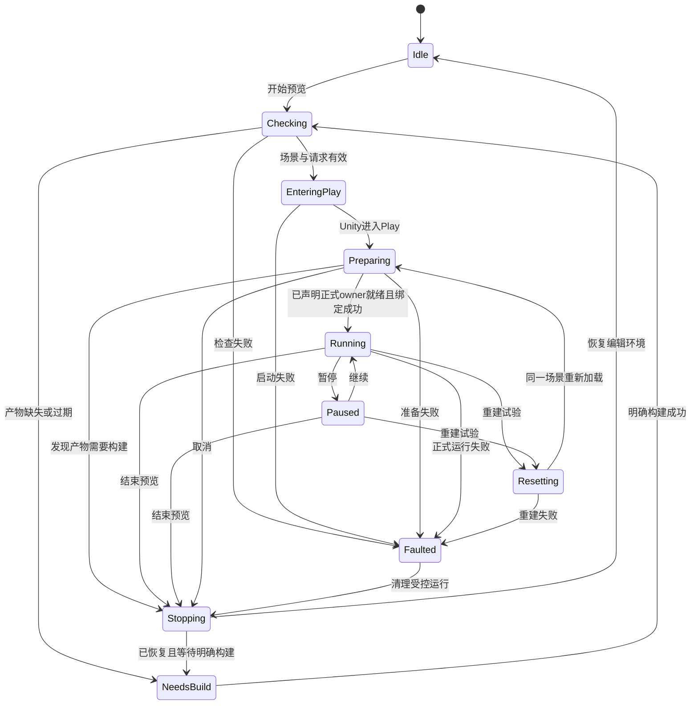
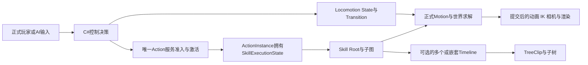
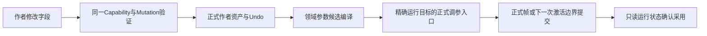

## Context

动机和范围见 `proposal.md`。2026-09-05 修订以已确认的角色代码控制、技能 Root、唯一 ActionInstance 和 Document v5 为目标接口，并消费已批准的 Timeline 非 Skill 独立使用方向。主重构与 Timeline 接口仍在实施，本文件不把目标表述为已安装事实。场景运行编排由本 change 独立拥有，非 Skill 内容执行不在本 change 的实现范围。

### 迁移前代码观察

| 位置 | 2026-09-04 已观察的行为 | 对本设计的影响 |
|---|---|---|
| `TimelineEditorWorkspaceView.cs` | 界面定时器推进 `TimelinePreviewSession`；进入或退出 Play 都暂停并清空目标 | 迁移播放控制与目标绑定，保留 Timeline 编辑、几何和绘制 |
| `TimelinePreviewRuntimeSession.cs` | 每个页面管理时间、会话 identity、目标和求值 | 删除完整角色预览的窗口级执行会话；编辑游标保留为视图数据 |
| `CharacterPipelineAuthoringPreviewController.cs`、`AnimationPreviewEngine.cs`、`AnimationPreviewAdapters.cs` | 独立组织预览 Action、Fact、Query、动画时钟及视觉位置 | 这些完整角色预览入口由场景真实 Actor 替代，不能只改类名继续运行 |
| `CharacterAnimationPreviewFixture.cs`、`CharacterPoseAuthoringBottomDock.cs` | Pose 页面创建预览场景和 fixture，并提供 Pose 调参与观察 | 保留作者面板和正式调参能力，删除私有场景及 fixture 驱动 |
| `EditorPlayModeSceneLauncher.cs` | 进入前打开场景并执行 prepare，退出后按一个路径恢复 | 扩展同一启动入口，处理独立场景、完整编辑场景布局与请求恢复；不能继续假定 prepare 的写入会在退出后自动撤销 |
| `SimulationSessionHost` | 唯一正式角色 Session owner，具有准备、运行、Quiesce、释放和重新初始化边界 | 角色预览使用同一实例类型和 Composition，不创建 Preview Kernel；不要求独立表现调用构造角色 |
| `CharacterPoseAuthoringBottomDock.SubmitTuningValue` | 先经正式作者 Mutation 修改资产，再向真实 Actor 提交参数候选 | 用户确认保留此方向；需要统一运行采用状态和跨窗口失效处理 |
| `CharacterSimulationBuildOrchestrator` | 编译 Semantic IR、表现计划、Numeric Target，发布资产；可补生成缺失或过期脚部分析 | Build 必须显式，独立记录阶段耗时，不能把分析生成和 C# 重载混称“图编译” |

上表是迁移前的代码阅读结果，不是故障复现或新的接口锁定依据。实现时按下述精确提交更新实际签名，不保留旧调用者作为兼容桥接。此前只查看过 Unity 主窗口，未复现用户报告的 BTSMTL 预览故障；没有独立数据编译耗时基线。

用户已确认：使用可配置的独立 Unity 场景；进入真实 Play Mode；正式运行链产生结果；运行中调参直接修改并保留正式作者数据，通过 Mutation 和 Undo 管理。

### 共享合同与实施基线

| 来源 | 已确认内容 | 本 change 消费边界 |
|---|---|---|
| `refactor-btsmtl-authoring-architecture`，`d99093011` | C# 控制、技能定义/Program、唯一 ActionInstance、Document v5 | 角色/技能作者入口、Build、绑定、调参和诊断都按目标合同接线 |
| 同 change，`3bf66c4ea` | C# 显式 StateMachine/State/Transition；控制状态转换与技能激活独立 | 普通移动不创建空技能，控制状态不镜像技能前摇/后摇 |
| 控制基础代码，`cbcd7fa42` | 基础控制合同已经提交 | 不据此宣称完整技能编译、v5、发布和实例观察均可用 |
| `rebuild-character-camera-from-zzz` 的已确认接口通知 | 场景预览 owner 归本 change；Camera 提供正式运行、Projection、Rig/目标/物理、重置与只读诊断 | 不新增相机预览会话、直接命令容器或状态 seek |
| `decouple-timeline-from-skill` 的已批准独立使用方向与接口协调 | 共用 Timeline 内容编译/执行、独立内容根、非 Skill 调用方/播放身份、唯一 v5 内 Timeline domain | 只接场景运行操作、正式调用方和只读观察；实际接口须记录其提供提交，不以规划类型名判断已可用 |

上述提交用于追溯已确认的决定。实际实现每一项消费接口时记录提供接口的精确后续提交、合同版本和可用产物；当前暂存区代码或某个孤立类型不能证明接口已接通。主重构持有控制/技能 Program 与状态、Document v5 基础及代码/operation 来源；Timeline 在同一体系内提供独立内容根、调用身份与 domain 增量。本 change 不再定义第二份格式、编译根或迁移器。

场景启动、请求恢复和共享 UI 可以按稳定公开合同开展。角色和非 Skill 领域各自的绑定、构建、v5 context 与来源映射分别在对应接口可用后接线，不等待整份主重构或 Timeline change 完成。缺失合同只阻止对应接线，不由预览代做非 Skill 运行，也不建立临时播放器。

## Goals / Non-Goals

**Goals:**

- 同一份正式角色配置在预览场景和游戏场景中执行相同的 Gameplay、世界求解、动画、IK 和已存在的相机表现逻辑。
- 作者能够选择场景与 Actor，再选择 SkillDefinition/作者调用点、观察准确 ActionInstance，支持 Tree-only 和多个/嵌套 Timeline；通过正式输入试技能、直接调参、重建试验和结束预览。
- 独立 shared Timeline 在其正式非 Skill 调用方可用后复用同一场景操作和观察入口，无需为场景表现内容配置无关 Character、Skill 或 ActionInstance。
- 场景、运行、视图和作者资产各有唯一 owner；切换页面不会更换播放器，也不会丢失整个试验。
- 从作者视角明确显示“在哪里试、正在控制谁、哪个参数已生效、为什么不能继续”。

**Non-Goals:**

- 控制 FSM、技能 Root/Program、ActionInstance、状态 ABI 与 Document v5 的迁移由主重构提供；本 change 消费新合同，不复制其编译器、解释器、发布和恢复逻辑，不重写正确的 Motion/KCC/Pose/IK/相机/渲染算法。
- 共用 Timeline 内容编译、独立 Build 根、非 Skill 执行生命周期/状态/输出和正式样例由 Timeline change 提供；预览不实现 Advance、TreeClip 调度或独立领域输出，也不通过假角色复用角色播放器。
- 不添加任意时间 seek、Gameplay 倒放、状态快照恢复或新的输入录制格式。已有 Capture 历史仍只读浏览。
- 不实现 C# 热更新，不安装插件，不自动关闭 Domain Reload 或 Scene Reload，不承诺启动毫秒数。
- 不修补 TrainingEnemy，不实现缺失的战斗或表现 consumer，不在本变更启动网络进程、匹配或多实例联调。
- 原生 Animation Window 的素材与注册曲线编辑、Blend Space 采样点/几何绘制仍是作者数据工具，不归入待删除的完整角色播放器。
- 离线动画分析、校准采样和明确标注未连接完整 Pose 的模块诊断 Fixture 保留原有用途，不接入完整角色播放按钮，也不按名字包含 Preview 就删除。

## Decisions

### 1. 场景文件保存试验条件，窗口只选择要运行的场景

采用正式 `.unity` 场景和其中的 Prefab 引用保存角色、目标、地形、光照、相机和初始条件。提供 `Assets/Scenes/Authoring/BtsmtlPreview.unity` 作为初始 Corin 场景；允许作者复制场景建立其它正式试验环境，窗口通过 `SceneAsset` 对象选择器明确选择。

场景内配置一个显式预览上下文，引用本场景声明的正式运行 owner，并通过对应领域公开合同发布目标、构建身份和就绪结果。上下文由 OnEnable/OnDisable 显式登记/撤销；协调器只接受本次请求加载的场景实例中唯一登记的上下文，不通过场景搜索、对象名或当前 Selection 猜目标。它不编译、不推进业务帧，也不持有作者或执行状态副本。

角色接入持有真实 `SimulationSessionHost` 和允许控制的角色引用；正式 Character Definition 装配 C# 控制 binding/参数与技能目录，Composition 明确选择 Numeric Target、Pipeline 和世界求解。角色运行包与 Projection 仍由正式组件引用。非 Skill 接入消费 Timeline change 提供的正式业务 owner、精确 shared 内容根/产物和显式目标/参数绑定；没有角色的场景不要求 SessionHost、Actor 或 WorldSolver，也不能借此取得 Character/World 写入权限。

窗口保存所选场景 GUID、稳定作者页面/调用路径及本地观察选择。运行前固定预览场景；角色列表只来自本场景正式登记并与 Session roster 对账的对象，非 Skill 列表只来自本场景显式声明的正式调用方。两类目标均不得使用其它场景的首个对象补齐。无有效预览场景仍可编辑资产，运行按钮显示缺失项。

启动前只能检查当前已知的精确作者上下文和场景引用，不能假定无需加载就能取得所有场景对象。场景上下文登记时还需发布各领域的精确内容根与构建目标，在相应 owner 准备前完成对账；角色目标按 Character Definition/Target 校验，独立内容按 Timeline 的正式根/Target/绑定合同校验。若加载后才发现缺失或过期产物，结束本次受控 Play、返回 Edit Mode 并展示实际目标的“构建并开始”；没有精确目标时不提供猜测性的 Build。所有运行目标必须匹配场景声明，不用当前窗口的内容根替换其它目标。

**取舍：** 场景文件配置能直接在 Unity 中布置空间，并复用现有 Prefab Override；独立 Profile 资产配置更便于程序化组合很多试验，但会增加环境和角色引用的装配层。本次选择场景作为唯一环境配置，不另存一份镜像 Profile。

### 2. 共享场景运行，分别绑定作者内容和实际调用

新增 editor-only 场景预览协调器，经共享操作合同对外提供 Start、Pause、Resume、Reset、Stop 和只读状态。协调器拥有请求 identity、场景准备状态和运行控制权限；角色 Simulation/Presentation 生命周期由正式 Host 拥有，非 Skill 播放由 Timeline 的正式业务 owner 拥有。两类运行都不由窗口提供时钟。

Graph Shell 只接收领域提供的按钮、状态和目标选择表面，不识别 Character、Action、Pose、非 Skill 内容或相机字段。技能工作区与 Timeline 复用同一场景操作合同。沿正式 diagnostics 与窗口本地 binding 消费结果；角色使用主重构后的 `RuntimeDebugSession` 合同，非 Skill 使用 Timeline 提供的只读调用观察，作者页面与运行实例分别定位：

| 上下文 | 精确定位信息 | 有效行为 |
|---|---|---|
| 角色作者配置 | Character Definition、控制模块 binding、可配置参数、版本 | 编辑合法配置，导航已登记代码来源；不提供角色总控 RootTree 或角色外层 Action/连招状态机编辑器 |
| 技能作者页面 | SkillDefinition、Skill Root、局部 Graph/StateMachine、稳定 inline/shared 调用路径 | Tree → Timeline → TreeClip → 子树按真实结构下钻，模板共享时仍区分调用点 |
| Actor 观察 | 场景 generation、Session、Actor、正式角色运行包/控制模块版本 | 观察 Locomotion、默认相机与整体表现，无活动技能也合法 |
| 一次技能释放 | Actor、ActionInstance、SkillProgram identity/版本、运行调用 generation | 观察该释放的 SkillExecutionState、局部变量、等待和停止结果，不创建 SkillInstance 生命周期 |
| 技能 Timeline 观察 | 该释放和完整调用路径下的 Timeline activation/playback、generation、cycle | 区分多个或嵌套 Timeline，以及 shared Timeline 的重复调用，不按模板合并播放头 |
| 独立 Timeline 作者页面 | 精确 shared TimelineAsset、稳定内容 identity/调用路径、正式产物 | 无 Character 或 Skill 也可编辑；内容、输入声明和独立根入口由 Timeline owner 提供 |
| 非 Skill 调用观察 | 场景 generation、正式业务 owner identity、播放 identity、调用点/调用 generation、产物版本及可用的 playback/cycle | 只读观察本次实际播放和 TreeClip 状态；不填写假 Actor、ActionInstance 或技能来源 |

先选 SkillDefinition/调用点表达作者想检查的内容，只有正式准入产生实际 ActionInstance 后才能绑定一次释放。ActionProfile 可被多个技能引用，不能用它唯一推断技能；无 Timeline 的技能照常显示 Root 与执行状态，多 Timeline 列出真实调用点供选择。普通移动和默认镜头观察停留在 Actor 层，不要求伪造技能。

独立 Timeline 选择精确内容根和场景已声明的正式调用方，再通过该调用方的公开业务入口请求开始，只有取得实际播放 identity 后才建立观察绑定。Timeline change 提供内容准备、绑定、开始、状态、停止/释放和按需只读观察；Advance 始终由业务 owner 的正式帧调用。未安装该合同或缺少目标/能力时只禁止对应试验，保留作者编辑，不由窗口运行作者对象或补造默认调用方。

同技能并发、同子图多次调用、非 Skill 内容多目标播放和重载后重建均需重新核对实例身份。原 ActionInstance 或独立播放结束、目标失效时显示终态/未绑定，不能改绑同模板的另一次调用。已有 Follow/Pin 按其明确语义应用，不能取列表首项冒充原实例。运行刷新仅更新只读值，保留焦点、未提交文本、selection、滚动和合法拖拽草稿；失效草稿按共享冲突规则处理。

关闭一个窗口只撤销它的观察 interest 和本地绑定；切换 Graph、Timeline、Pose Graph 或折叠 Bottom Dock 都不停止预览。明确点击“结束预览”或 Unity Stop 才结束运行。第二个 Start 在当前预览运行未结束时返回占用信息，不能静默换场景。已有不属于本协调器的 Play 只能走现有 Live 观察入口，不能被预览窗口自动暂停、重置或停止。

**取舍：** 每窗口一个运行便于同时做完全独立试验，但 Unity Play Mode 本身是实例级状态，容易出现窗口抢时钟和物理输出。实例级协调器使作者只有一次明确的运行，代价是同一 Unity 实例不能同时启动两个独立预览场景；多角色对照在同一正式场景中配置。

### 3. 扩展现有场景启动器，保持进入与恢复为一个操作

保留 `EditorPlayModeSceneLauncher` 为通用进入 Play 的唯一入口，将其从单个 active scene path 扩展为显式启动请求。优先使用 Unity 的 `EditorSceneManager.playModeStartScene` 指定预览场景，记录并恢复它原来的值；不在 Edit Mode 把角色位置、目标或 runtime 参数写进作者场景后再假设会自动恢复。

Scene setup 与启动场景切换使用 Unity 2022.3 的正式编辑器接口。普通 Scene/Prefab 引用继续由 Unity 序列化；不复制 `.unity` 文件作为临时运行路径。预览结束只恢复编辑环境，不对作者资产做整目录回滚。

启动器记录原来的完整 Scene setup，包括加载场景顺序、是否加载和 active scene。未保存场景按 Unity 正式保存流程处理，用户取消时整次启动取消。利用 Unity 的场景备份与恢复，必要的显式 Scene setup 恢复也由同一启动器完成；预览协调器不再实现第二份 OpenScene/RestoreScene 逻辑。

通过 `SessionState` 只保存跨 Domain Reload 必需的请求标识、场景身份、编辑场景布局、先前启动场景设置及目标定位信息；不序列化 Runtime、GameObject 实例引用、PlayableGraph、会话内状态或编译对象。EnteredPlayMode 后重新等待场景上下文及所声明正式 owner 就绪，角色要求 Session Active，非 Skill 要求其调用环境正式准备完成，再按身份连接。Exited/Entered Edit、取消、失败或请求失效都由同一请求清理，不能自动重放未完成命令。

失败信息独立保存为本次操作结果，恢复 Idle 不擦除失败原因。暂停采用 Unity 的实际暂停状态，继续由正式调度推进；本次不添加另一套 Preview Delta 或倍速时钟。

**取舍：** 在 Edit Mode 手动打开预览场景可以复用现有简单入口，但多场景和准备写入更难恢复。使用 Unity 启动场景机制能减少编辑环境切换，需补齐通用启动器的请求与重载恢复；原有 Launcher 调用者一同迁移到该请求合同，不保留两个启动实现。

### 4. 正式输入经C#控制与唯一Action服务进入技能Root

本节只约束角色接入：场景使用正式 Composition、Numeric Target、WorldSolver、Actor roster 和输入源配置。Gameplay Locomotion 由可复用 C# 显式 StateMachine/State/Transition 执行，控制配置只保存 binding/参数/版本；角色外层 RootTree 与 Action/连招状态机不再作为执行入口。每个 SkillDefinition 仍有技能 Root，Tree、Timeline、TreeClip、技能局部状态机与参数化嵌套子图完整保留。

控制选择技能，唯一 Action 服务负责准入、激活、替换、取消/打断和实例生命期，再将上下文交给技能 Root；技能完成、停止和清理由原合同回报该服务。Locomotion 控制转换与技能激活独立，移动状态中攻击不要求强制切控制 State，控制 State 退出也不隐式终止技能。图内局部状态不得反写控制 FSM，AI 继续只产生 CharacterSimulationInput。

所有模块在同一 Session/Pipeline、Evaluate/WorldResolve/Finalize 与 Commit 边界推进。已激活技能的 Decision TreeClip 先准备本 Tick 的窗口候选供控制读取，Commit 内容在正式技能阶段执行；窗口不插入新的 Tick、重做 Decision 或使用动画回调推进 Gameplay。

通过 Game View 的正常输入操作角色。技能试验按钮提交场景明确配置且角色正式声明的输入/请求，经 Control Source/Ingress 进入唯一输入 owner，再由 C# 控制和 Action 服务决定。按钮所选技能不是准入结果；只有正式来源/结果能关联实际接受的 SkillDefinition 和 ActionInstance。请求被拒绝、选择了其它技能或存在多个合法释放时显示真实结果并要求明确观察目标，不强制执行选中 Skill Root，也不直接创建 ActionInstance、动画 Selection、伤害、Motion、Warp 或相机效果。

技能没有合法输入映射、admission 拒绝、缺少目标等情况显示真实原因。UI 导航到技能定义、其真实作者调用点及已登记的控制代码来源，不能为了运行而补造角色图或触发规则。Locomotion、Blend Space、MM 的测试通过角色正式移动和输入产生对应 Fact/Query；数据编辑器显示采样权重或曲线形状时不输出角色 Pose。

**取舍：** 正式输入试验能看到状态条件、位移和动画共同产生的结果；直接触发某个内部节点更易快速看单个效果，但无法验证它真实如何进入和退出。本次选择正式输入，并把试验准备作为可见的场景配置。

### 5. 参数直接写作者资产，运行采用走原有原子更新协议

用户于本轮明确选择“直接修改并保留正式作者参数”。沿用 `CharacterPoseTuningAuthoringService` 与正式 Mutation；不增加试用资产、副本或保存预览参数按钮。

领域适配器按目标 Document v5 的共享 Capability 与实际已发布参数布局提供字段编辑资格，不由 UI 根据字段名猜测。字段分为已有支持的运行参数、需要 Build 的作者字段、纯编辑布局和只读运行观察。运行参数保持原有值域、作用域、NextFrame/NextActivation 与 `resetOwnerState` 语义；不得为完成此变更把所有数值强行改成可热更新。

SkillDefinition/技能参数、控制 binding/配置虽然在 v5 中可写，也不自动等于运行可热更新；技能 Program、控制代码语义/状态 schema 与 Session 已锁定的目录仍须正式 Build/发布后由新 Session 采用。主重构没有承诺局内无损换代码或换技能模板，预览不得添加该路径。现有 Pose 参数采用按其原作用域接入；控制运行 State、ActionInstance 进度、技能调用 frame 与生成数据只读。

角色 Pose 候选必须携带准确 Actor、已发布角色运行包/Projection、正式参数布局、稳定作者 owner 和候选 generation；运行侧复用现有 `CharacterPoseTuningCoordinator`，不修改共享 Program Image、Execution View 或静态 Projection。非 Skill 作者字段消费同一 v5/Mutation 体系与该领域的采用资格；没有正式局内更新合同的字段只提供构建采用，不借用 Actor Pose 调参端口。输入合法但运行应用失败时，作者修改与 Undo 仍成立，运行保持上一份已提交参数，UI 显示“作者数据已修改，运行未应用”及原因，不回退用户编辑。

UI 使用业务状态“已修改作者参数”“等待下一帧／下一次激活”“运行已采用”“需要构建”“运行应用失败”；revision/hash/generation 只在折叠 Diagnostics 中提供。单纯收到提交成功不能显示已生效，必须等待运行端确认。暂停期间可以保存作者参数，但只显示待生效，不在 Inspector 绘制中主动执行一帧。

Undo/Redo 同样从真实作者数据生成新候选，不从缓存恢复运行对象。共享 Profile 只提交到明确选中的 Actor，其它 Actor 不被暗中更新；资产的默认值对后续 Build 和运行有效，当前其它 Actor 的采用状态必须单独显示。结构修改、布局改变或外部资产变更导致已发布拓扑不匹配时，停止相应的可执行预览并要求显式构建，不能把它当成参数变更绕过。

**取舍：** 直接保存便于持续调好角色，也与现有 Pose 作者流程一致；独立试用再保存便于丢弃实验，但增加作者默认值、运行试用值和保存事务的区分。用户选择前者，系统通过 Undo 和明确生效状态支持撤回与排查。

### 6. 重建试验重载完整预览场景，普通游标只做编辑和观察

第一次进入 Play 后，重复输入和支持的参数调整无需退出。点击“重建试验”时保持 Play，停止接受本轮控制请求，使观察绑定失效，要求场景声明的各正式 owner 完成释放：角色经 Quiesce/Dispose 释放旧 Session，非 Skill 经其公开停止/teardown 释放播放、TreeClip 状态和目标占用。随后使用 Unity 的 Play Mode 场景加载接口重载选定的同一正式场景，由正式组合重新建立相应运行 owner；场景 generation 改变后重新解析所有窗口目标。协调器不代做任何内容退出或时间推进。

从暂停状态重建时保存作者的暂停意图。场景加载和正式 Preparation 需要推进的阶段可以由受控操作解除 Unity 暂停，期间关闭本轮试验输入；正式准备完成后恢复暂停，再允许作者继续。UI 在此期间显示“重建／准备中”，不能卡在暂停状态等待永远不会执行的 Preparation Tick，也不能用 Editor 手动调用业务 Update 绕过正式调度。

不能仅把角色移回出生点或清空时间：输入边沿、控制 State、ActionInstance 所有的 SkillExecutionState/调用 frame/嵌套 Timeline/停止进度、GE、世界实体、相机、动画 source、Foot/IK、事件订阅及诊断绑定均须在各自正式 owner 生命周期结束。场景采用专属物理环境和明确运行根；预览拥有的对象不能通过 DontDestroyOnLoad 逃离其清理边界。全局模块仍按项目生命周期注册/注销，不能在 Editor 对全局静态对象做任意反射清空。

重建前必须通过正式产物匹配检查。运行中调参后，作者默认值与已发布产物可能不同；若正式检查要求重新发布，则显示“需要构建并重启”，使用下一条决策的明确操作，不拿旧 Projection 创建新 Actor 后再补参数绕过构造校验。同一个已经存活且成功采用参数的 Actor 可以继续接收输入、重复动作，不需要为了每次动作重新进入 Play。

编辑游标可以定位 Clip、Curve 和作者内容，不再 Evaluate 角色。Capture 历史位置只选择历史 snapshot，不改变当前角色。实时运行标记使用真实 logic tick/visual time。原先依赖拖动游标查看任意角色时刻的功能明确撤除；以后需要确定性 seek，应另行基于完整正式输入及状态合同设计。

**取舍：** 只重置 Actor 更快，但容易漏掉目标、场景物理或效果状态；重载完整独立场景更容易得到可重复的初始条件，代价是一次场景重载。此选择不引入第二种运行算法，也不要求反复进入 Play。

### 7. 按正式内容根检查产物，明确构建和重启

“开始预览”只检查配置、已发布产物和运行环境，不隐式 Build。缺少或过期时给出该领域的精确内容根/Target 与原因，显示“构建并开始”。“构建并重启”是一个明确操作：结束受控 Play、恢复 Edit Mode、调用该领域的正式 Build、成功后再次启动原预览场景。角色调用精确 Character Definition/Target Build；独立 Timeline 调用其 owner 提供的精确 shared TimelineAsset/Target/发布目标构建，不伪造 Character Definition、TimelineNode 或 Skill Root。构建失败保留编辑状态和诊断，不自动进入 Play。

窗口运行观察保持只读；支持的参数在独立作者字段中编辑，需要 Build 的结构编辑在 Edit Mode 完成。其它入口或 Undo 引起结构变更时，同样失效当前绑定并要求明确构建。保存参数不等于发布 Program，这一点在状态中保持可见。

目标 `CharacterSimulationProgram` 是角色只读组合包，保存控制 binding/参数/语义与状态版本、SkillProgram 目录、既有策略与资源目录、完整状态布局和来源映射。C# 控制代码不翻译成角色 RootTree；技能作者内容仍经 Semantic IR、Float32/Fixed lowering 与正式发布。PipelineCompiler 和正式运行装配继续保留。

角色开始/重建检查消费主重构发布清单，覆盖控制代码实现及版本、角色包、每项技能/共享子图闭包、ActionProfile、Program/State schema、Numeric Target、能力与 Projection；不能只核对旧 Graph content hash 或角色壳 ProgramId。独立 Timeline 检查消费其正式内容闭包、状态/绑定合同、数值目标、能力与来源版本，不要求角色 Projection。共享内容改变时按正式发布组重新构建受影响产物；新内容只由新调用环境采用，活动播放不原地换 Program。缺少正式接口或产物时显示对应未就绪原因，不建立旧 v4/RootTree/ABI reader 继续预览。

在现有报告和任务结果中分别记录实际内容依赖检查、前端/确定性检查、Numeric Target lowering、组合与发布；角色路径另记录控制合同、分析复用/生成、表现计划及已有 PipelineCompiler 的实际准备工作，独立内容按其正式构建报告显示适用阶段。预览请求记录检查、进入 Play、对应 owner 准备、目标连接和场景重建耗时。C# 编译/Domain Reload 另按其真实来源报告，不称为内容数据编译；不为计时增加一条构建入口。只记录真实经过的阶段，未发生的角色阶段不套用到独立内容，并区分缓存复用与重新生成，不用轮询等待总时间代表编译本身。没有测量值显示未测量，不预设耗时目标，不为了“优化”删除确定性检查或修改算法。

**取舍：** 每次预览自动构建省去一次点击，但把潜在分析生成隐藏到播放操作中；明确构建使作者知道等待来自哪里，并保留现有发布边界。热更新插件只能作为以后独立评估的开发工具，不成为此方案依赖。

### 8. 作者、场景和运行数据保持单一归属

| 模块 | 输入 | 输出与唯一职责 | 不拥有 |
|---|---|---|---|
| 独立场景与预览上下文 | Prefab、环境、正式运行 owner 引用；角色输入或独立内容目标/参数绑定 | 可保存的试验条件、准确运行上下文登记 | Graph 镜像、Program 构建、业务帧推进 |
| 通用场景启动器 | 明确场景启动请求、原 Scene setup | Unity Play 状态转换与编辑环境恢复 | 角色执行、动画求值 |
| 场景预览协调器 | 作者命令、Unity 生命周期、正式就绪结果 | 请求状态、控制权限、场景 generation、阶段耗时 | Simulation/Presentation 状态、第二播放器 |
| 领域适配器 | v5作者 owner、Capability、对应领域的作者/运行身份、调用路径与产物 | 正式业务请求、编辑资格、支持的参数候选、来源导航 | Undo 副本、角色总控图、第二执行生命周期 |
| 正式 Session 与 Actor | 控制binding/参数、正式输入、技能目录与已发布产物 | C#控制、唯一Action服务、技能Root、世界求解、表现及合法调参 | Editor 选择、窗口、第二FSM或SkillInstance |
| 非 Skill Timeline 正式 owner（Timeline change 提供） | 已发布独立内容、调用输入、显式目标/能力、正式业务帧 | 共用内容执行、本次播放状态、停止/释放、受限输出和只读诊断 | 场景 Play 所有权、角色模拟事务、窗口时钟 |
| Diagnostics 与窗口本地绑定 | 正式代码/operation来源、已提交结果、领域实例/调用identity与interest | 控制代码、技能或非 Skill Timeline、Pose/相机观察 | 执行控制、假Graph节点、补算结果、作者数据写入 |
| Document v5 | 正式控制配置、技能、Presentation、独立 Timeline 与严格package | 主重构的唯一基础及各领域已批准增量、五生命周期、唯一Capability/Mutation/事务 | C#正文、生成Program、实例状态、场景对象绑定；不恢复已退役domain |

Editor 场景编排通过领域适配单向消费正式运行端口；角色适配依赖公共 Composition 与 Character 端口，非 Skill 适配依赖 Timeline 的正式调用/观察合同。公共 Simulation 和 Timeline 执行程序集不反向引用 Editor、BTSMTL 视图或具体表现实现；场景上下文的数据声明位于客户端 Unity 边界，没有新 portable Preview Program、Preview Pipeline 或 Preview Backend。

人工运行调参使目标 Document v5 基线呈现正常 TreeDirty/Conflict，不能自动改 package 或执行 rebase/apply。v5 基础、控制 binding/参数和技能分片由主重构拥有，Timeline domain 由 Timeline change 在同一 schema/事务内扩展；domain 集合消费各领域已批准并正式发布的增删，不写死两个 domain，不恢复已退役的游戏 AIController 或新建插件 AI Document。本 change 仅消费正式 owner、共享 Capability/Mutation 与已有五生命周期。shared Timeline 经 Character 包或 Timeline 包修改仍指向同一资产和 revision，另一包按既有规则呈现 TreeDirty/Conflict；inline 仍由原 owner 的包编辑。

技能、Presentation 与 Clip 作者字段的归属和原有事务不变。C# 正文、控制 state schema、生成 Skill/Timeline Program、ActionInstance/SkillExecutionState、独立播放状态、实际场景目标绑定、调用 generation 和执行来源 runtime 状态不能进入 editable；内容声明的外部目标/参数需求由 Timeline 正式作者合同表达。旧 v4 包不得由预览兼容读取，资产迁移后按精确根显式 checkout v5；工具的 Play Mode 门禁仍有效。预览新增字段资格描述如需对 Agent 可见，只进入 v5 的只读 context，并沿已有 Exporter/Codec/Reconciler/Mutation/Validator 与技能说明同步，不复制第二服务。

原生 Animation Window 的素材编辑目标继续通过已有 typed navigation context 显式提供，不能从 Live Actor 观察绑定反推，也不能给正式生产 Prefab 安装素材曲线接收器。运行期间涉及素材采样的编辑操作显示需要先结束运行；不能与真实 Actor 竞争同一物理动画输出。移除 `TimelinePreviewTarget` 类型时同步迁移导航签名，但保留原生素材编辑及其独立目标合同，不另造素材时间轴。

**取舍：** 把所有操作集中到一个窗口类容易首次接通，但后续每个作者页面都必须重复处理生命周期；将场景请求、领域命令、正式执行和只读观察分开，新增页面只适配现有端口，同时保留单一数据写入链。

### 9. 代码来源、技能来源与版本比较

沿主重构的统一执行来源合同区分代码和 operation：控制项显示稳定模块、State/Transition/操作及代码来源；技能项显示 SkillDefinition/SkillProgram、Root、Graph/Timeline/TreeClip/声明和稳定调用路径。状态来源由统一诊断 owner 发布，窗口不从类名、operation index 或播放头猜测，也不以不可编辑的代码控制伪造可编辑角色 Graph 节点。

角色绑定同时核对 Session/Actor、角色包/SkillProgram、ActionInstance、调用 generation 和产物来源；独立内容绑定核对场景 generation、业务 owner/播放 identity、调用点/generation 和 Timeline 产物来源。两者消费各自正式来源记录，不给非 Skill 补 Action 字段。一个 shared Timeline 在多次释放、子图或非 Skill 调用中运行时，模板相同不代表实例相同；历史 Capture 只显示匹配记录的来源版本，不能用新 Source Map 解释旧事件。缺少映射时显示不可用，不取第一个同名节点补齐。

同版本重复性继续按原 canonical identity 与正式结果检查。跨主重构版本的 ProgramHash、LayoutHash、EventId 和 source identity 可以改变，使用现有比较工具核对语义输入、Body、动作阶段、窗口和输出并记录映射关系。hash 不同不能独自证明回归；来源变更也不能作为忽略业务差异的理由。本次不新增录制格式、采样器或快照恢复实现。

**取舍：** 只保存 Graph/Node identity 能简化旧视图，但不能表达 C# 控制及同技能多次释放；沿统一代码/operation来源和实例合同增加明确绑定信息，作者可准确找到一次决策及其技能结果，不额外维护执行事实。

### 10. Camera提供正式能力，场景运行生命周期归预览

本 change 唯一拥有启动、暂停、重建和结束独立场景的请求。Camera 提供已经发布的 Projection、正式 Runtime/Factory、Rig、目标、物理绑定、重置/释放与只读诊断；相机的内部效果状态仍归其正式 Runtime，场景协调器不直接清镜头内部字段。

技能产生的相机请求继续由正式技能/Action 输出进入唯一 Presentation；普通跟随读取真实 Actor 状态和正式视角输入，无需创建空技能或 ActionInstance。Camera fixture 如为复用布景、目标或输入条件而保留，只配置场景初始条件或接入现有输入 owner，不直接向第二个 Camera 命令容器提交，也不驱动自己的动画/相机时钟。

Timeline 游标只编辑定位和浏览历史。试验重建经场景正式 Session/Actor 的释放重建自然重建相机；不实现单独 Camera seek，也不让 Camera Stop/Dispose 接管 Unity Play 生命周期。缺少需要的 Rig、Shot 目标或物理上下文由正式相机报告，预览显示失败，不用默认镜头补齐。

**取舍：** Camera 维护单独预览便于孤立调镜头，但会重新分离技能、Body 和相机的输入历史；场景运行复用正式相机，完整效果与角色保持同一来源，代价是需要配置真实场景条件。

### 11. 逐项对账现行规范与并行提案

| 来源 | 冲突或共享合同 | 本次处理与owner |
|---|---|---|
| 主重构 `character-control-runtime`、`btsmtl-skill-program-runtime`、Action服务合同 | 删除角色总控RootTree及外层Action/连招FSM；保留每技能Root和局部状态机 | 主重构拥有定义与迁移；预览只经输入、C#控制、唯一ActionInstance和技能执行链试验 |
| `btsmtl-compiled-simulation-program`、`btsmtl-runtime-diagnostics` 的主重构delta | 新角色组合包、技能目录、代码/operation来源和完整状态identity | 主重构唯一拥有schema；本change消费发布和来源结果，预览检查见本change场景规范，不复制第二delta/schema |
| `decouple-timeline-from-skill` 的独立内容根、运行与来源delta | 旧预览将 SessionHost/Actor、ActionInstance 和 Character Build 要求用于所有目标 | 本change限定其角色适用范围，非 Skill 消费 Timeline 正式内容根、调用方/播放identity/generation与只读观察；共用执行和独立运行仍归Timeline |
| `character-action-animation-authoring-workspace` 当前“有限Action动画必须提供统一作者工作面” | 旧文将无Timeline和多Timeline视为错误 | 本change该重叠MODIFIED块完整采用主重构的技能上下文及所有场景；两份合并结果一致，不恢复唯一Timeline限制 |
| 同工作区跨owner与实例上下文 | ActionProfile唯一策略、SkillDefinition拥有内容、运行实例与调用generation分离 | 保留主重构原文；场景预览只新增运行控制和真实观察 |
| `btsmtl-timeline-editor-preview` 的窗口session、target、隔离采样、seek与界面拆分条款 | 要求独立表现播放器、禁止Gameplay | 替换为正式技能/非 Skill 调用的场景运行观察，编辑游标/历史不执行，窗口只管理视图 |
| 同spec的“Timeline Live Debug 必须显示真实 runtime membership” | 只认Graph/Node来源不足以覆盖代码控制和多技能调用 | 本change补齐消费主重构来源合同，保留原membership、时间、Follow/Pin等场景 |
| 动画Pipeline/Layer/Selection、MM和Inertialization | 旧Action/Fact/Query fixture与非连续seek | 本change删除完整角色替代执行入口，保留正式算法、动作服务和每Actor状态 |
| Pose作者/运行、共享Shell/Framework | 已有独立owner、参数事务、窗口重载和焦点/草稿行为 | 保留并接入技能/v5/场景合同；不重写已经正确的交互或执行算法 |
| Composition/Unity程序集 | 公共基座模型无关；角色Session不能成为非 Skill 表现的必要依赖 | 角色使用公共入口和同一Pipeline事务；独立内容消费其正式owner，场景协调器不执行任一业务帧 |
| Document主规范/skill当前仍有v4说明，主重构delta仍列两个domain | 主重构提供唯一v5基础，Timeline新增domain，`replace-btsmtl-ai-with-behavior-designer`提议退役游戏AI domain | 各owner负责增删和发布，预览消费合并后的正式domain集合，不写死数量或恢复已退役领域，不新建reader/迁移器 |
| 原生Animation Window/Timeline素材导航及离线分析/校准 | 精确素材编辑目标与专属接收器；独立模块Fixture不输出完整角色 | 保留正式用途，不按Preview名字整块删除，不从Live绑定猜素材目标 |
| `character-animation-foot-analysis-artifact` 与迁移前Build代码 | spec禁止Definition Build生成分析，旧代码允许补生成 | 属已存在分歧；本change仅记录真实阶段，不改变分析owner或增加自动生成 |
| `openspec/project.md` 的旧角色图、v3/v4、隔离Preview说明 | 与主重构/v5及本change目标不一致 | 主重构更新共享架构，本change安装时仅合并预览部分；最新AGENTS的本机CLI规则优先 |
| Camera `design.md` 第9节、`tasks.md` 10.1–10.3、Timeline Preview delta | 仍要求TimelinePreviewSession、独立fixture/命令源和seek | Camera owner在原change改为正式提供者；本change独占场景运行，接口见决策10 |
| Camera Document段及其它Graph来源描述 | 仍引用v4和旧角色图来源 | Camera owner消费主重构v5及技能/代码来源；不由本次改写相机文件 |
| `refactor-character-pose-graph-architecture` 与 `add-acl-animation-runtime` | 已完成模块/事务/Tuning；ACL使用同一资源合同 | 使用精确已安装公开接口；不复制Pose或ACL预览路径 |

本次仅修改本 change。主重构、相机和其它窗口的文件不在本次写入范围；已确认的共享方向立即生效于本提案，具体代码签名由后续精确提交固定。规范安装时先合并各owner的共享条款再应用本change增量，不能用旧全文覆盖新合同。OpenSpec单份格式通过不等于其它change已经更新或接口全部可用。

`TimelineEditorWorkspaceView.cs` 与 `Tree/TimelineEditorMainWindow.cs` 中，场景生命周期按钮和运行观察绑定归预览；内容编辑、输入声明和独立根作者入口归 Timeline。共享文件只改己方职责所在段，同段改动先报告具体冲突，不整体替换。旧 `TimelinePreviewRuntimeSession`、`TimelinePreviewTarget`、`AnimationPreviewEngine/Adapters/Controller` 与 Pose fixture 的完整角色迁移删除归预览，不作为主重构或 Timeline 的独立完成条件。

## Risks / Trade-offs

- [Play 中修改 ScriptableObject 不会随退出自动回退] → UI 明确是正式作者参数；Undo 可撤回，绝不把资产变化当可丢弃场景状态。
- [作者值已经保存而运行采用失败] → 分别展示两种状态和失败原因，保留原子运行快照，不回退作者资产或静默显示成功。
- [场景重建漏掉全局订阅、输入边沿或资源] → 复用正式 Quiesce/Dispose 和重新登记合同，禁止对象逃离预览场景清理边界，不用编辑器反射清全局状态。
- [Domain Reload 导致窗口、协调器与目标失联] → 只恢复请求和稳定定位信息；重新等待正式登记，旧对象与 generation 一律失效，失败后恢复编辑环境。
- [共享Timeline不能唯一定位调用] → 作者路径与运行实例分别选择，技能按ActionInstance/调用generation，非 Skill 按业务owner/播放identity/generation；缺少对应正式关联就显示未绑定，不合成producer、假角色或取首项。
- [已有场景或并行任务正在运行] → 受控请求只操作自己的 Play；外部运行保持现有只读 Live 入口，不抢占。
- [首次 Build 还生成动画分析] → 分阶段计时并展示生成/复用情况；本次不承诺进入 Play 或编译性能数值。
- [调参后重建场景遇到作者与产物不匹配] → 明确要求构建并重启；当前 Actor 内重复输入保持可用，不旁路已有构造验证。
- [相机、Foot、Pose 和性能变更正在并行] → 核对实际文件与当前产物，独立小步提交；不回退其它任务改动，不把未完成模块作为预览所需的隐藏默认值。
- [Editor 与 Player 的配置/输入不同，或跨重构identity变化] → 记录模块版本、技能闭包、Target、场景和输入来源；同版本严格校验，跨版本比较语义输入、Body、动作阶段、窗口和输出。

## Migration Plan

1. 记录主重构控制/动作/技能、v5、来源及 Timeline 独立根/调用合同的精确提供提交，并盘点预览调用者；按接口依赖开展工作，不等待其它change全量完成，不代做角色图删除、v5基础迁移或非 Skill 内容执行。
2. 扩展唯一场景启动器和领域操作合同，增加预览场景上下文、协调器及显式输入端口；新实现接入前不把不可用按钮作为完成结果。
3. 以已迁移且有效的 Corin Prefab/Composition 建立独立场景，锁定正式控制binding和技能目录；完成Session准备、Actor选择、暂停/继续、完整场景重建和退出恢复。
4. 在主重构后的技能工作区和共享视图接入Tree-only、多/嵌套Timeline、代码控制观察及ActionInstance/调用generation绑定；原生素材、Pose/Blend Space/MM入口继续按各自领域接入，接通直接作者调参与运行确认。
5. 在同一迁移步骤删除被替代的类、字段、资源、菜单、旧 target 选择和 fixture 输入，确认只有正式场景路径。无法解释的调用者先定位业务归属，不以兼容开关保留。
6. 消费角色组合包/SkillProgram，以及 Timeline owner 已交付的独立根/产物、调用和观察；按领域接入精确Build、阶段计时和明确重启。v5与来源只消费同一正式体系的已发布增量，不恢复旧ABI或Document格式。
7. 按决策11核对主重构、Timeline、Camera、领域增删、Pose/ACL等重叠条款和资源引用，使用已有Validator与适用比较证据收口。本次代码修改按完整小步独立提交；回退只涉及本change提交，不覆盖其它窗口和用户随后修改，不保留双路径开关。

## Open Questions

业务保存、技能/控制分工、角色与非 Skill 调用身份、唯一v5和Camera/场景owner均已明确。待各接口提供者提交的具体签名、初始场景物件位置和真实耗时在实现时核对；只影响对应接线步骤，不授权绕过合同、代做其它领域运行或要求所有独立工作暂停。

Unity 生命周期依据：[进入 Play 的阶段](https://docs.unity3d.com/2022.3/Documentation/Manual/ConfigurableEnterPlayModeDetails.html)、[指定 Play 启动场景](https://docs.unity3d.com/2022.3/Documentation/ScriptReference/SceneManagement.EditorSceneManager-playModeStartScene.html)、[ScriptableObject 资产保存](https://docs.unity3d.com/2022.3/Documentation/Manual/class-ScriptableObject.html)。
