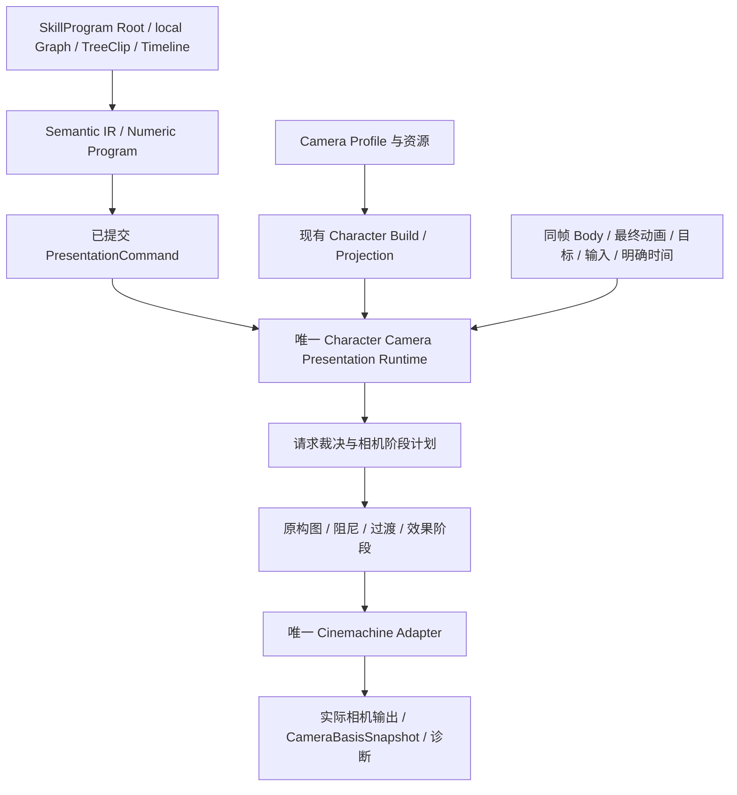

## Context

动机与范围见 [proposal.md](proposal.md)。本设计对应当前专用 worktree 的增量实现；代码和规范必须以已经提交的唯一链路为准，未闭合的来源行为继续保留失败诊断。

### 作者入口与 Preview 所有权

Camera 的作者入口只保留 SkillProgram Root、技能局部 Graph 和 TreeClip/Timeline。Camera finite producer 通过 SkillProgram 与新的 SourceMap 衔接，消费已提交的 PresentationCommand、ActionInstance 来源和 producer generation；C# Locomotion 控制拓扑不提供 Camera 图节点，也不维护平行控制图。

最终作者合同目标是 Document v5。Camera domain 继续拥有 Profile、Sequence、Effect、Curve、结构化引用语义和 typed Mutation；v5 owner 负责整包装配、manifest、schema、codec、hash、事务与反向发布。当前安装的 v4 仍是 current truth，本变更不创建 v4 Camera 过渡分片、v4 专用 codec 或第二套 Mutation。BTSMTL v5 实际接口未提交前，文档只记录依赖和边界，不写占位 v5 代码。

Preview 会话 owner 统一归 `rebuild-btsmtl-preview-with-scene-play`。它拥有会话、独立预览命令源、可复用 fixture 执行器和 seek 重建；Camera 只提供正式 Runtime、Projection、Rig/目标/物理绑定、Reset 和只读诊断。Timeline 游标只定位作者内容或观察历史，Gameplay 状态变化走正式运行或受控试验重建，seek 不直接改 Simulation，也不形成第二角色执行链。

### 单角色边界

BTSMTL Definition、SkillProgram Root、技能局部 Graph、StateMachine、TreeClip/Timeline 和 Presentation Camera Runtime 只为一个 Character 建立作者与运行归属。相机可以消费敌人、Boss 或多个目标的明确快照来构图，但不在本变更中实现队伍切人、主控 Actor 切换、跨角色相机接管或换人生命周期。C# Locomotion 控制拓扑不提供 Camera 图节点，也不维护平行控制图。`ChangeAvatar`、`SwitchIn`、`SwitchOut` 等来源身份只记录依赖，不能直接生成当前框架的运行路径。

当前 `CameraSequenceAsset`、typed Stage 和 Timeline 相机 Clip 是工程适配模型，不视为 ZZZ 原版作者编排结构的已证实还原。相机时间、循环和事件如何归入现有 BTSMTL Timeline，待后续设计确认；本设计只要求已经接入的请求和效果沿同一 Presentation 链运行。

| 来源身份/字段 | 当前实际依赖 | 本变更处理 |
|---|---|---|
| `CharacterCameraProfile.ChangeAvatarTransitionSeconds` | 进入 Profile/Projection 合同并参与合法性校验，当前没有运行时消费者 | 保留来源字段记录，不生成换人或跨角色相机路径，等待后续设计 |
| `SwitchIn`、`SwitchOut`、`ChangeAvatar` | 只存在于来源 metadata/事件或配置身份，当前单角色 Runtime 没有对应 owner | 只做来源对账，不自动创建主控切换、队伍切人或第二个 Camera Runtime |
| `SwitchInAttack` | 当前只作为 Corin 事件索引中的来源身份与时点证据 | 是否属于单角色攻击演出由后续设计确认，本轮不把名称解释为换人能力 |

### 已核实的 3C 接入点

下表路径以 `3cDemo/Client/3C_Client/` 为 Unity 工程根。

| 入口 | 当前行为 | 本变更处理 |
|---|---|---|
| `Assets/GameScripts/Main/Runtime/Character/Pipeline/Presentation/CharacterSimulationPresentationRuntime.cs` | 完成 Body 与最终动画后调用 Camera | 保留唯一顺序与外部协调边界 |
| `.../Presentation/CharacterCameraPresentationRuntime.cs` | 收集 producer/generation 请求、解析目标、按模式硬编码 FOV，再调用具体 Controller | 保留 committed 命令入口，内部接入完整相机核心，依赖正式接口 |
| `Assets/GameScripts/Main/Runtime/Character/Camera/Solver/CameraPipelineResolvers.cs` | 旧状态只统计 blendProgress；旧 Cue 仅 FovKick 真正改变输出；新 Cue 先扣寿命 | 替换为 Sequence evaluator 与按效果 owner 拆分的生命周期执行，不沿旧逻辑增加空枚举 |
| `.../Camera/Runtime/CinemachineCameraRigAdapter.cs` | 持有单 FreeLook，写 axis/target/lens，调用一次 Brain.ManualUpdate，从活动输出读 basis | 作为最终 Adapter；原算法要求的承载通过此处接入 |
| `.../CameraContracts/CameraRigAdapterContract.cs` | 存在接口，但 Camera Runtime、输入和多个 Host 仍依赖具体 Adapter | 补齐应用、重置、结果读取合同，调用方只依赖所需窄接口 |
| `.../Pipeline/Graph/CameraRuntimeNodes.cs` 与 `BTSMTL/Timeline/Scripts/Timeline.Camera.cs` | 有节点/轨道，但资源大多为字符串、固定 Mode/CueKind 与内联数值 | 只从 SkillProgram Root、技能局部 Graph、TreeClip/Timeline 接入，迁为强类型资源引用和完整生命周期合同；C# Locomotion 不提供 Camera 图节点 |
| `Assets/GameScripts/Main/Editor/CharacterSimulation/Compilation/Presentation/CharacterPresentationProjectionCompiler.cs` | 从 Graph/Clip 生成现有 CameraBinding | 接入独立相机计划编译模块，仍由现有 Build 原子发布 |
| `BTSMTL/Timeline/Editor/Scripts/Preview/TimelinePreviewRuntimeSession.cs` | 已有正式 Preview 会话，尚无完整相机资源/历史接线 | 扩展同一会话的相机能力，不增加第二套播放器 |

### 原资料的确认程度

来源入口是 `Assets/AssetArt/Animation/ZZZ/可琳/Corin资源复刻清单.md`。字段级资源在 `D:/ZZZ_Dump/output/corin_replication/20260904_config_decoded_v1/`，事件索引为 `20260904_corin_attack_event_index_v3.json`，部分 Shot/Timeline 对象身份在 `20260904_config_typetree_v2/`。这些路径只用于明确的离线取证/导入，不进入 Player。

- 已确认配置：81 项 Shake、18 项 Zoom、18 项 Stretch、4 项 Override 及相机事件时点。
- 已确认静态职责：`PipelineCameraAvatarConfigData`、`CameraModuleAvatarDataConfig`、`CameraSequence<T>`、单点/多点/实体取景、位置/旋转阻尼、`BlendFromCurrent`、`MoveByBlending`、`WorldBasicCameraData` 与 Cinemachine 承载类型。
- 尚未确认：完整基础 Profile 数值及依赖、部分共享曲线/Shot 的最终资源、每帧所有阶段的确切顺序、具体 Cinemachine 写入与回读点、特殊时间值和若干枚举/组合规则的消费者语义。

最后一组是第一阶段必须解决的取证工作。它决定具体算法参数和平台调用，不改变本设计已确定的唯一 Presentation 入口、模块职责、作者资源和统一输出边界；未闭合前不发布“完整移植”的正式配置。

## Goals / Non-Goals

**Goals:**

- 每项原相机行为都有明确输入、运行 owner、输出、作者字段和来源证据；配置与实际求值一起迁移。
- Gameplay 决定何时提交请求；相机本地决定如何表现；Cinemachine 只执行其被分配的承载职责。
- 作者能在原工作区选择资源、编排时点、编辑真实 owner 的曲线、明确 Build、预览和追查结果。
- 同一 Profile、同一编译计划、同一相机求值模块服务正式 Runtime 与显式 Preview，所有原演出效果具备结束和打断语义。

**Non-Goals:**

- 不在来源证据未闭合时发布声称完整的算法、Corin 运行资源或 Unity YAML；已建立的代码只允许已闭合能力通过，未闭合能力必须给出明确错误。
- 不复制 ZZZ 的无关游戏管理器、账号、UI 和剧情系统；已纳入 Shot 的镜头执行、绑定和依赖仍必须完整支持。
- 不重写现有 Body/动画/Gameplay/网络求解，不新增相机网络状态，不创建独立 Camera Simulation Session，不实现队伍切人或跨角色相机接管。
- 不创建“简化移植版”、兼容开关、默认补齐配置、额外更新回路、独立 Camera Workbench 或运行中直改参数通道。
- 不新增测试工程或测试代码，实施任务不包含用户手动验收。必要的取证数据、编译诊断和完整性报告属于实现产物。

## Decisions

### 1. 按原行为和同版本依赖闭包移植

建立来源对应表，每条记录至少包含：原版本、资源/函数身份、内容 hash、字段或分支、输入输出、坐标和时间语义、先后依赖、3C 作者 owner、编译字段、运行消费者、编辑器入口、证据状态。原证据不可变；导入后的 Unity 资源是唯一可编辑作者真相。后续作者修改必须显示其与导入基线的差异，原资源重新导入时不得自动覆盖作者改动。

第一阶段把原调用分成可定位的阶段，追到最终写入/回读实例。Shake/Stretch 的正负、相对/绝对值、`HoldTime/LastTime = -1`、IgnoreWorldTimeScale、优先级退出开关、tag 互斥与曲线 key，均通过消费者确认；不能统一 Clamp 或依据名称推断。

业务取舍：直接迁行为保留原镜头节奏，成本是必须补足依赖与函数证据；按画面调一套相似配置能更快展示，但无法证明打断、慢放和叠加一致。用户已经选择完整移植，本变更只接受前者，不把证据缺口转换成范围缩减。

### 2. 作者资源与运行计划分开

新作者装配根为 `CharacterCameraProfile`，由 `CharacterPipelineDefinition` 引用。Profile 引用 `CameraSequenceAsset`、`CameraOverrideTrackAsset`、`CameraZoomAsset`、`CameraStretchAsset`、`CameraShakeAsset`、`CameraShotAsset`、`CameraCurveAsset`，并声明基础参数、目标槽位与允许资源目录。名称是本方案的目标类型名，不表示这些类型已经存在。

| 作者对象 | 负责的数据 | 不负责的数据 |
|---|---|---|
| Camera Profile | 默认 Sequence、球面/轨道组、输入/锁定/碰撞规则、资源和目标槽位装配 | 活动技能、当前 orbit、当前 Unity 实例 |
| Sequence | 原算法对应的有限取景/构图/转场组合及参数引用 | Gameplay flow、Timeline 播放器、任意 C# 脚本公式 |
| Override | 原轨道、screen composition、Follow/LookAt 偏移和进出曲线 | 技能触发时点 |
| Zoom / Stretch / Shake | 各自原数值、时间、曲线、空间、覆盖和释放规则 | 另一效果的未声明字段、相机 Transform |
| Shot | 镜头资源、正式绑定需求、相对姿态、lens/clip plane、进出场规则 | 独立优先级栈和自主更新 |
| Camera Curve | 完整关键点、插值与切线、明确时间/值域 | Timeline-local Weight/Ease 副本 |
| 技能局部 Graph 节点 / TreeClip/Timeline Clip | 请求种类、精确资源引用、时点/区间、强度或权重、目标上下文 | 复制一份原效果参数 |

Sequence 使用有限类型和组合描述原算法。其阶段种类由正式 capability 注册，编译器检查输入输出与允许组合；作者不能任意重排物理阶段来绕过原语义。它不进入 Pose Graph，也不复活已删除的动画素材 Sequence。

业务取舍：独立资源便于多个技能共享同一种镜头并统一调参，但作者修改共享资源会影响多个引用者，因此必须提供引用导航；把全部数值放进每个 Clip 能单独微调，却会复制原配置并使同一效果逐渐分叉。本设计使用独立资源，必要差异创建有明确业务名称的新资源。

### 3. 以深模块承接原算法，根协调器只管顺序

| 模块 | 输入 | 输出及拥有状态 |
|---|---|---|
| `CharacterCameraPresentationRuntime` | committed 命令、同帧 Body/动画、输入、时间、显式 bindings | 唯一相机调用与生命周期协调；不内联各类镜头公式 |
| 请求生命周期模块 | producer、generation、EventId、Publish/Replace/Retire | 有界活动请求、事件去重/退休关系和明确原因 |
| 目标与输入采样模块 | visible Body、最终骨骼、目标槽位、候选目标、本地物理场景、设备输入 | 本帧值输入与目标可用性；不决定 Gameplay 锁定或改 Body |
| Sequence 模块 | 不可变序列计划、活动请求、值输入 | 活动序列、取景/构图结果、位置/旋转阻尼与过渡历史 |
| 效果模块 | 已编译 Override/Zoom/Stretch/Shake/Shot 描述、命令和明确时间 | 各效果阶段/尾段、按已确认阶段参与的 typed 修正 |
| 平台查询端口 | 计划指定的碰撞/平台阶段与显式场景 | 值结果或原 Cinemachine 阶段的明确执行请求 |
| `CinemachineCameraRigAdapter` | 唯一 `CameraFramePlan`、显式 Rig/Shot bindings | 一次平台更新后的 `CameraRigResult`；只拥有平台资源 |
| 诊断发布模块 | 上述同帧完成结果与 source map | 不可变诊断快照；不参与裁决或求值 |

所有模块通过明确值合同通信。核心不得持有场景 Transform、InputAction、Editor asset 或 Cinemachine 类型；Unity 数据在入口采样。可以复用项目已有数学类型，不为本地相机创建第二套 Numeric Target 框架。

`CameraFramePlan` 表达已求值的构图、镜头参数、取景目标、镜头/平台阶段请求、来源与重置语义；`CameraRigResult` 表达实际完成的活动输出。平台所需的字段只能在对应原职责下存在，不能提供“直接姿态模式/旧 FreeLook 模式”供运行时兜底切换。

业务取舍：分模块能单独解释“请求还活着”“构图算错”“平台重复平滑”三种问题；将它们放进一个 Controller 接线短，但会再次把业务生命周期和 Cinemachine 混在一起。这里保留一个根调用者，并用窄接口分离计算，不增加新的公开总管。

### 4. 一条每帧链，内部顺序以原证据固定

图中“效果阶段”不是断言 ZZZ 一定在所有阻尼之后统一叠加。第一阶段必须逐函数补出精确阶段表，记录 Override、Zoom、Stretch、Shake、collision、Shot blend 在何处读写何种值。编译后的阶段计划只执行该已确认顺序，同一字段的覆盖和累计规则固定在相应算法模块中。

`CharacterSimulationPresentationRuntime.CompletePresentationFrame` 继续在最终动画发布后调用 Camera。默认 Follow 使用同一 visible Body 和初始绑定偏移；骨骼目标从最终动画采样；多实体取景通过显式可见目标输入提供。不从 logic Transform 重建另一套插值，也不把原上下运动阻尼变成 Body 台阶过滤器。

业务取舍：按原阶段移植能保留同时发生多种效果时的构图；把所有效果统一追加在最后容易接线，但可能改变 FOV/距离联动和碰撞后的画面。本设计选择原阶段，并通过编译校验保持一条执行链。

### 5. 原计算归属保留，Cinemachine 只运行被分配的阶段

核心拥有 ZZZ 自己实现的算法，Adapter 继续使用 ZZZ 原本委托给 Cinemachine 的能力。每个阶段记录唯一 owner、输入和输出；同一位置阻尼、旋转阻尼、碰撞、Shake 或 Shot 过渡不允许在两端重复。

具体 VCam 类型、数量和扩展组件由第一阶段的原写入链确定，并成为正式 Rig/Shot binding 描述；不先假定“一个 FreeLook 能包办”或“全部写 Transform”。不同 Shot 可以拥有被同一 Adapter 管理的明确承载实例，但不能拥有自己的更新脚本或请求栈。Brain 的推进只由同一最终调用执行一次。

输出完成后从实际活动输出取得 basis，删除从未活动 FreeLook 单独读 yaw/pitch 的链。输入适配器只取得只读 basis 接口；Performance、Host 和预览重置通过正式初始相机状态合同进入根 Runtime，不能直接改 FreeLook axis。

业务取舍：保留原算法能控制动作镜头节奏；保留原 Cinemachine 委托能复用对应组件行为。全部自算会扩大重写范围，全部交给当前 FreeLook 又会改变原行为，因此本方案按原职责逐阶段决定，不提供两套可选 backend。

### 6. 请求、效果与时钟分别拥有明确生命周期

持续请求以 producer/generation 标识，瞬时效果以稳定 EventId 区分；原动作关联不得继续恒为零。沿现有 command disposition 消费 Publish/Replace/Retire，根入口的有界索引处理重复命令，不创建跨网络模型的无界历史 ledger。

请求退休与效果尾段不是同一件事。依据已确认规则，退休可以 Cut、进入 BlendOut、保留震动尾段或等待正式来源结束；被压制期间时间是否推进、重入是否复用、同 tag 是否替换，也必须迁入原规则。新旧 generation 分开持有，不能用显示名删除全部实例。

`CameraFrameInput` 明确包含：本帧表现时长、原行为要求的受缩放/未缩放时间、动作锚点、暂停/重置原因、输入、目标和值结果。来源由现有 Presentation Frame context 和正式命令合同扩充，不能由核心自行读 Unity Time，也不能把缺少时间输入替换成零或再次乘 time scale。

前后状态取样顺序处理零时长、跨帧短事件、首次作用、循环和退出。Curve 资源保存原数学，有限内置曲线只有与原曲线严格等价时才能替代；不能仅按名字映射到常见 Ease。

业务取舍：显式时钟和实例需要更多合同字段，但能解释慢放、连击、取消时的镜头；单一 delta 加资源名容易实现，却会让不同效果互相结束或重复触发。这里以原行为决定字段，不增加没有消费者的通用生命周期选项。

### 7. 编译接入同一 Semantic IR 与 Projection 发布

保持现有链：`Definition -> Frontend -> validated .csir -> Presentation Semantic Contract -> {请求的 Numeric Target, Presentation Projection} -> 原子发布`。相机计划由独立 Camera Projection compiler 模块生成，作为同一 `CharacterPresentationProjection` 的一个拥有明确 schema 和依赖 hash 的字段；不另建 `.camera` artifact loader 或第二份 Character Build。

SkillProgram Root、技能局部 Graph 与 TreeClip/Timeline 节点引用强类型资源，portable operation 只保存命令语义、producer/source mapping 与明确目标合同。Projection 编译阶段解析真实作者资源并形成 dense binding。相机纯资源参数与资源选择进入 Presentation dependency；命令种类、时点和生命周期进入 Gameplay semantic。仅改既有震动幅度不会改变 Gameplay ProgramHash，移动 Timeline 事件则会改变相关语义。

编译预检包含：来源依赖是否闭合、字段是否有消费者、算法类型/阶段是否合法、资源/curve/target 类型匹配、时间和坐标语义完整、容量明确、Shot/物理能力需求完整。Float32/Fixed 必须实现同一个新 operation 版本；不保留旧 ABI 相机 payload 解码分支。

业务取舍：复用现有 Build 保证角色动作与相机引用总能对上，代价是相机编辑后也要明确构建 Projection；单独加载作者资产便于即时修改，却使 Preview、Runtime 与 Numeric Target 合同失去一致身份。本设计保持明确构建，并在 UI 显示 Stale 与错误来源。

### 8. 作者工作流进入现有编辑器

默认入口是明确 Character Definition 的既有工作区。Navigator 增加“相机”资源目录，Details 显示当前 Profile/资源，Graph Canvas 继续显示 Gameplay 图；现有底部区域装配相机 Preview、引用与诊断。独立打开资源时可编辑真实资源，只有显式绑定角色/预览目标后才能构建上下文预览；不按场景或名字猜角色。

作者流程如下：

1. 在 Definition 装配 Camera Profile，并在资源目录配置默认构图、锁定、输入和目标槽位。
2. 选择或创建 Sequence/Override/Zoom/Stretch/Shake/Shot。Details 只展示该类型有效字段，明确米、度、秒、帧率和局部/世界空间。
3. 在 SkillProgram Root 或技能局部 Graph 选择序列/效果请求节点；在对应 TreeClip/Timeline 放置资源区间或瞬时事件。菜单、端口、Details、Compiler 和 Agent 使用同一 capability。
4. Timeline 内只编辑本 Clip 的 Weight/Ease；共享效果曲线通过真实资源入口编辑，Timeline 可只读叠显并导航，不能拖动后隐式复制。
5. 通过明确 Definition Build 发布；在显式目标上启动 Preview，或选择真实实例进入只读 Live。
6. 从画面诊断点回资源、节点或 Clip，看到当前参数与已发布版本差异后继续编辑。

Sequence 的组合列表和资源 Details 属于相机领域 presenter，不往通用 Shell 塞相机业务。复用已有 Curve Lane 的几何/交互，资源曲线使用自己的 owner adapter。所有重操作在正式命令调度器执行；OnInspectorGUI、selection 和窗口恢复只读取轻量快照。

业务取舍：复用作者工作区让技能时点与镜头资源连在一起，成本是需要补齐领域 adapter；单独相机窗口可以独立开发，却让作者在多个入口间查绑定。本设计只扩展原工作区，不新建专用工作台。

### 9. Preview 使用统一 ScenePlay owner 和正式相机模块

Preview 会话、独立预览命令源、可复用 fixture 执行器和 seek 重建统一由 `rebuild-btsmtl-preview-with-scene-play` 拥有。Camera 不创建 `TimelinePreviewSession` 的第二 owner，不复制会话、命令、fixture 或 seek 状态；它只向统一 owner 提供正式 Runtime、Projection、Rig/目标/物理绑定、Reset 和只读诊断接口。共享代码签名尚未实际提交前，本变更只记录这项依赖，不写桥接或占位接口。

ScenePlay 明确提供 Camera fixture：初始镜头、角色/目标轨迹、用户视角输入、原效果时间来源、事件顺序、随机种子和必要物理场景。播放、受控试验重建和 seek 都由 ScenePlay owner 调度；Camera Runtime 按 fixture 输入推进，Timeline 游标只定位作者内容或观察历史，不直接修改 Simulation。较长重建分片执行、可取消，并显示准备状态；没有明确可复现输入时显示需要绑定的内容，不用当前场景状态伪装同一历史。

Live Debug 使用已有正式诊断 provider，窗口本地 Follow/Pin 选定 Actor、producer/generation 与 Projection。Preview/Live 互斥和物理输出租约由统一 Preview owner 管理；Camera 只报告 Rig、目标、物理场景或 Projection 缺失。Stop/Dispose/重绑/domain reload 的会话清理由 ScenePlay owner 执行，Shot 和碰撞仍走 Camera 正式接口。

业务取舍：统一 ScenePlay owner 能让动画、相机和场景输入共用一份会话历史，代价是 Camera 不能自行提供一个快速预览入口；保留 Camera 自有 session 虽然接线短，却会形成第二套命令源和 seek 重建。这里选择单 owner，直到共享接口实际提交前不增加临时桥接。

### 10. Camera 迁入最终 Agent Document v5

当前安装的 Document v4 仍是 current truth。本变更不先扩展一整套 v4 Camera 分片，也不写 v5 占位代码；先完整盘点现有 v4 Camera 语义、资源身份和引用边界，最终由 v5 owner 统一装配 Camera domain。Camera domain 继续拥有 Profile、Sequence、Effect、Curve、结构化引用语义和 typed Mutation；v5 owner 负责整包 manifest、schema、codec、hash、事务、反向导出和五个生命周期工具的整体响应。

最终 Camera 目标分片、Catalog、SkillProgram producer、技能局部 Graph/TreeClip/Timeline 请求、目标槽位、Curve Channel、Exporter、严格 Codec、Reconciler、Validator、Undo、反向导出和依赖/context hash 必须由 v5 owner 组织为一个整包。现有 Pose `profile.json` 不承载相机参数，AI domain 不获得 Camera 可写分片。已确认的 v4 Camera 语义必须完整迁入 v5，不提供 v4 reader、v4 Camera codec、兼容字段或第二套 Mutation。

离线 ZZZ 解码只产生带来源身份的导入数据；待 BTSMTL v5 实际接口提交后，正式 Import 命令才将其降低为同一作者目标/Mutation 计划并由唯一事务发布。人工导入和 Agent apply 复用 owner、Validator 与事务服务，不能成为两个写入系统。Import/apply 不 Build，Build 仍是独立明确命令。当前只同步边界、失败诊断和依赖，不把未安装能力写成 current truth。

业务取舍：把整包装配交给 v5 owner 能让 Camera 与其它领域共享一个 schema、hash 和回滚边界，代价是 Camera 首次接入要等待共享接口；先做一套 v4 Camera 能更快产生文件，却会制造迁移和双 codec。这里选择最终一次性收口。

### 11. 原子切换正式链并清理旧接口

模块可以按依赖分小步提交，但未装配的新模块不称为可用相机。正式运行入口只能在 Profile、编译、Runtime、Adapter、编辑器和内容闭合后一次切换；不存在运行时开关选择新旧相机。

| 旧项 | 正式去向 |
|---|---|
| `ResolveFieldOfView(CameraMode)` 和硬编码 FreeLook base 参数 | Camera Profile 与 Sequence/效果资源 |
| 只统计 blendProgress 的旧相机状态求值 | 实际维护进入/退出/中断的 `CharacterCameraSequenceEvaluator` |
| 旧效果协调器的 FovKick-only 与空 Shake/Recoil/Custom 分支 | 按 Override/Zoom/Stretch/Shake/Shot owner 分离；旧引用逐项映射到有语义资源，不能无声丢弃 |
| Runtime 依赖 `TimelineCamera*` 作者枚举 | 编译时唯一映射，Runtime 只读取相机计划合同 |
| 旧具体 Controller / FreeLook 的公开依赖 | `CinemachineCameraRigAdapter`、只读 basis 与根 Runtime 的正式初始状态/重置接口 |
| 旧资源字符串与未使用字段 | 强类型引用；确认无引用后删除数据与序列化字段 |
| Editor/Runtime 内联相机配置 | Profile/资源及生成 Projection |

除相机目录外，必须更新 `UnityCharacterSimulationInputAdapter`、`UnityFixedCharacterInputAdapter`、各 Local/Fixed/Rollback Host、Control Source、Factory、GameplayLab Builder 和已有性能输入/初始相机采样链。它们只迁接口与绑定，不改本来正确的输入解析、回放调度、Body 或网络逻辑。`CameraRuntimeNodes.cs` 内包含共用 OperationNode/ValueNode 基类，清理相机节点时不得误删其它节点仍使用的基类。

业务取舍：一次切换会要求相关资产和调用者同时迁完，但结果只有一个运行入口；保留旧接口便于分批接线，却会留下不能解释的双路径。本设计采用小步提交、完整切换，失败通过精确提交回退到上一个完整状态，而不是增加 fallback。

### 12. 与现行规范和并行变更对账

| 当前规范/事实 | 对比结果 | 本变更处理 |
|---|---|---|
| `character-camera-pipeline` 的 modifier 禁止 resolver 计算 position/rotation/orbit | 与原算法核心求值冲突 | 删除旧 requirement，增加完整效果规范并修改 Adapter 分工 |
| 同 spec 强制 Cinemachine 负责全部 orbit/damping，指定旧具体 Controller | 与按原职责分配及接口迁移冲突 | 修改完整 requirement，要求一项计算一个 owner |
| 同 spec 固定有限 Mode 与默认 FreeLook | 无法表达正式 Profile/Sequence | 删除旧仲裁 requirement，新增正式默认序列与真实混合，保留原场景语义 |
| 同 spec 的 CameraSequenceClip/CameraResponseClip 曲线合同 | Clip 类型迁移且共享效果曲线不属于 Clip | 修改 requirement；保留 Weight/Ease 原 owner 和 Curve Lane，增加资源曲线边界 |
| 同 spec 的 basis 从稳定输出采样 | 保持，现代码实际读具体 FreeLook 不足 | 补充同帧实际活动输出要求 |
| `btsmtl-compiled-simulation-program` 的唯一 Frontend/Projection/Build | 保持，缺少完整 Camera payload 约束 | 只增加相机专属依赖/计划条款，不改其已修改的 Pose Program requirement |
| `btsmtl-timeline-editor-preview` 的显式 target、会话隔离、禁止 Gameplay Preview | Camera 方案原先把 TimelinePreviewSession 当成自己的会话 owner | 改为由 `rebuild-btsmtl-preview-with-scene-play` 统一拥有会话、命令源、fixture 和 seek；Camera 只提供正式运行模块、绑定、Reset 与只读诊断，不写桥接 |
| 同 spec 的 Continuous Curve Catalog 明确要求旧 CameraStateClip | 与删除旧类型的迁移冲突 | 修改完整 requirement，保留动画/Motion 原场景，将相机曲线迁入正式 Clip，资源曲线仅只读导航 |
| `btsmtl-agent-authoring-document-sync` 的 v4、唯一整包事务 | 目标要求最终转为 v5，且 v5 接口尚未提交 | 只记录 v4 Camera 语义迁入 v5 Camera domain、v5 owner 整包装配和唯一 codec/Mutation；不建立 v4 Camera 过渡路径或 v5 占位代码 |
| `graph-authoring-editor-shell` / `graph-authoring-domain-framework` | 与复用 Shell 和能力目录一致 | 在新增 Camera authoring spec 限定领域扩展，无须复制或更改通用框架原则 |
| `btsmtl-timeline-editor-preview` 禁止动画 Sequence 模式 | 与 CameraSequence 仅为相机资源不冲突，但 Camera 不得拥有第二 Preview 会话 | 明确命名与资源领域，Preview 只由 ScenePlay owner 调度，不恢复旧动画模式 |
| `add-discrete-stair-presentation` 修改默认相机跟随 requirement | 必须保持同一最终 Body 输入 | 本 delta 不修改该 requirement；原相机上下阻尼只作用于镜头，不能成为第二条 Body 台阶修正 |
| 当前 Pose、PIK、Performance 等 active change 和工作区修改 | 存在共享目录/接口交集，无权覆盖已有正确实现 | 实施前重新对照精确文件 diff；只迁相机调用，真实冲突交给用户决策 |
| `openspec/project.md` 将 Camera 标为已闭合 Presentation consumer | 入口已经闭合，不代表 ZZZ 功能齐全 | 实施收口时补充完整 Camera Profile/Sequence 链与来源状态，不提前写为已安装 |

## Risks / Trade-offs

- [关键原行为尚未追通] → 先完成来源阶段表、特殊值和输出实例取证；允许保持未完成并报出精确缺口，不允许替代公式默默上线。
- [静态配置混入不同版本或缺少共享曲线] → 锁定同版本身份与依赖闭包，正式导入预检失败时不发布半套资源。
- [两端重复阻尼或混合造成镜头拖滞] → 每个阶段一个 owner，编译计划与实际诊断同时显示阶段及最终输出。
- [动作时间与表现时间不同] → 明确时间上下文与锚点，保留原特殊时间语义，禁止自行读全局 Time 或重复缩放。
- [共享资源修改影响多个技能] → 引用目录展示影响范围，Document/Import 锁定实际 owner 与 revision，不自动覆盖外部修改。
- [Preview seek 和 Shot 资源准备较重] → 明确准备命令、分片执行、可取消和物理输出租约，不在 OnInspectorGUI 做重操作。
- [大量相机接口调用者漏迁] → 以精确符号和资产引用清单覆盖 Host、Input、Builder、Performance、Preview 与相关场景，不只搜索 Camera 文件夹。
- [原数学能复现但平台版本造成输出差异] → 第一阶段记录原/当前组件版本与分工，沿 Adapter 定位差异；不得通过全局额外平滑掩盖。

## Migration Plan

1. **来源与合同**：补齐版本、函数/字段/阶段/实例、曲线与资源闭包，发布只读来源对应表；确定所有时间/坐标/枚举语义及唯一平台分工。
2. **作者与编译基础**：加入 Profile/资源模型、能力目录、Mutation 和 Camera Projection compiler，完成两个 Numeric Target 的请求合同与同一 Build 校验。新模块尚未装配期间不宣称正式能力已上线。
3. **完整求值与 Adapter**：实现取景/轨道、输入/锁定、阻尼/过渡、全部效果、Shot/碰撞、时间和生命周期，形成唯一输出与诊断。
4. **编辑器与 Document**：接入 SkillProgram Root、技能局部 Graph、TreeClip/Timeline、Curve、统一 Preview/Live，并完成 v4 Camera 语义到 v5 owner 边界的对账；v5 实际接口未提交前不写占位 Import/Codec/Mutation。
5. **内容与统一切换**：逐项迁移 Corin 资源和全部相机事件，补齐 Profile/Shot/曲线依赖，迁移所有调用者及明确场景绑定，删除旧相机数据和执行代码，使用精确 Definition Build 发布完整组。
6. **收口**：通过来源完整性报告、正式 Compiler/Validator、引用清单和版本一致性确认无悬空模块或旧路径；待 v5 与 ScenePlay 实际接口提交后，再更新 current spec、project context 与 skill，当前 change 不把未安装能力写成 current truth，后续由用户按项目规则验收和归档。

每一步形成独立中文提交，不夹带其它任务的代码或资产。若需要撤回，回退本变更对应的完整作者/代码/生成发布组；存在用户或其它任务交叉修改时先报告冲突，不使用全仓回退或在运行时保留兼容模式。
