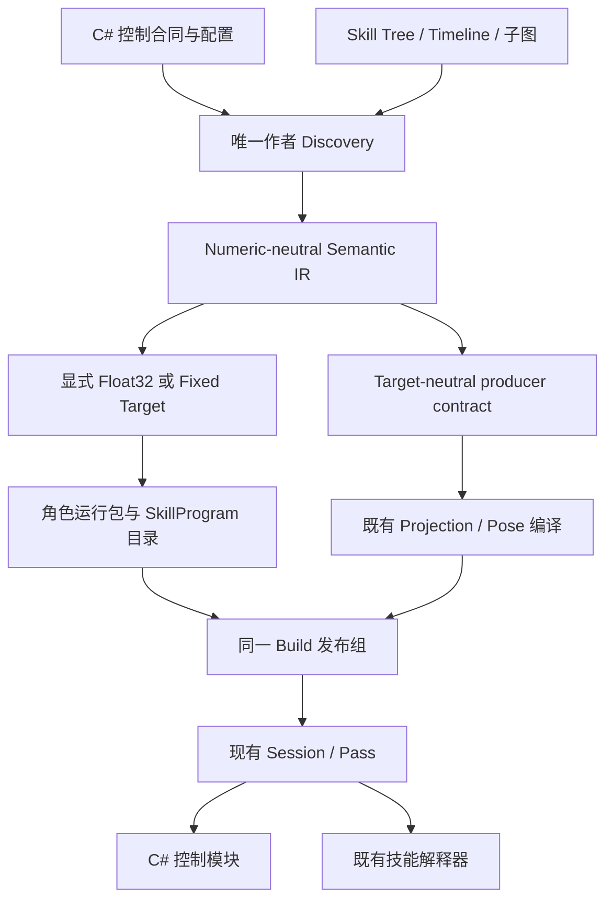

## Context

本设计重写 `refactor-btsmtl-authoring-architecture`，规划基线为 2026-09-05。动机与完整能力清单见 proposal。原“只拆 Editor 大类，保持作者模型、Program ABI 和角色图行为不变”的范围已被替代。

当前链路已有四项可直接延续的基础：

1. [CharacterSemanticEmitter](D:/Unity_Project_1/3C/3cDemo/Client/3C_Client/Assets/GameScripts/Main/Editor/CharacterSimulation/Compilation/Semantic/CharacterSemanticEmitter.cs:114) 会将图、子图和 Timeline 降低为 operation、控制边、声明及来源。
2. [OperationControlRuntime](D:/Unity_Project_1/3C/3cDemo/Client/3C_Client/Assets/GameScripts/Main/Runtime/Simulation/Core/Execution/OperationControlRuntime.cs:329) 已用 C# 解释执行 Sequence、Selector、Parallel、Loop 和局部状态机；现有编译与解释执行并不冲突。
3. [PipelineTransactionCoordinator](D:/Unity_Project_1/3C/3cDemo/Client/3C_Client/Assets/GameScripts/Main/Runtime/Simulation/Core/Pipeline/PipelineTransactionCoordinator.cs:96) 统一拥有调度、恢复、多 Tick 执行和提交。网络 Pass 已在 C# 层，迁移不需要重造网络循环。
4. 当前 State、Program/Layout identity 和网络 checkpoint 按整个 Character Program 布局组织，不能直接拔掉角色图后宣称状态恢复仍然完整。

工作区的 Pose、Foot Placement、性能、输入录制、渲染和项目说明存在其他任务未提交修改。它们作为实施基线被保护；本次规划只写当前 change。TrainingEnemy 已有明确资产阻塞和禁止顺手迁移的约束，不能用它作为本次迁移成功的前提。

## Goals / Non-Goals

**Goals:**

- 角色级行为选择由 C# 控制模块表达，BTSMTL 负责重度技能内容；Tree、Timeline、子图与技能局部状态机都保留。
- 纯作者数据经过唯一构建链成为只读运行数据，运行时只使用现有解释执行路线。
- 保留一个 ActionInstance 生命周期、一份角色状态事务、一条 Session／Pass 推进链，以及既有世界和表现消费者。
- 让同一技能模板被多个 Actor、多个合法释放实例、多个子图调用点复用时具有明确状态隔离。
- 将作者、编译、解释器、控制规则、状态和发布模块按实际业务分责，完成旧角色图路径和格式清理。

**Non-Goals:**

- 不实现弹道、命中／伤害、全战斗闭环、新网络模型、网络装备业务或尚缺的 Cue／Audio consumer；不创建对应空模块和占位 Pass。
- 不做通用蓝图、任意 C# 反射调用节点、运行时 C#／IL 生成、第二 AST 解释器，也不把 NodeCanvas／FlowCanvas 接入玩家核心。
- 不改变已有 KCC、MotionWarp、GE、装备事务、Pose、IK、相机和渲染算法；不接管其它 change 的正确实现。
- 不实现对局中无损替换代码、迁移旧 ABI 快照或自动升级运行中技能。
- 不实施独立场景预览、旧预览播放器删除和运行调参权限扩展；这些仍由预览 change 负责。

## Decisions

### 1. 技能内容与一次释放使用不同身份，继续沿用 ActionInstance

| 概念 | 拥有的数据 | 输入与输出 | 生命周期 |
|---|---|---|---|
| 角色控制模块 | C# 显式 Locomotion StateMachine／State／Transition、技能选择规则、参数／状态合同和稳定代码来源 | 正式输入、Body／GE／装备／动作观察 → 控制状态转换、移动意图、独立动作请求 | 按 Actor 装配；可变状态进入 Character State |
| SkillDefinition | 稳定 SkillId、ActionProfile 引用、入口图、参数签名、技能依赖 | 作者内容 → validated skill semantic unit | 作者资产，不保存释放状态 |
| SkillProgram | 技能 operation、Timeline、子图调用布局、常量、资源／producer 引用及 source map | 只读执行定义 → 被解释器读取 | 按内容和 Target 共享 |
| ActionInstance | 既有 ActionId／InstanceId、来源、目标、PredictionKey、phase、生命周期与 Equipment Context；新增精确 SkillProgram 引用 | 唯一准入与 transition → 一次释放的身份和状态 | 继续是释放的唯一 owner |
| SkillExecutionState | 本实例的节点游标、局部状态机、Timeline、子图 frame、变量、generation、等待和停止进度 | Program＋本 Tick 输入 → 新状态、动作内部结果和输出 | 归属于 ActionInstance，参与同一事务 |
| CharacterSimulationProgram | 角色静态运行包：控制模块 binding、技能目录、ActionProfile、GE／Equipment／Body Motion 描述及组合状态布局 | 显式 Build → Session 的不可变 ProgramCatalog | 仍是角色组合／发布单位，不再包含角色 RootTree 控制入口 |

SkillDefinition 的执行图表达技能内容，ActionInstanceId 表达一次释放。二者不得互相替代。技能实例状态不是第二份 action lifecycle；不恢复旧 `AbilityAsset.BodyGraph -> IAbilityBody` 对象执行路径，不新增与 ActionInstance 并行的 SkillInstance manager。

**取舍：** 全部改名并另建技能事务会产生较大迁移面且重复已有能力。这里保留仍有明确业务含义的 ActionProfile／ActionInstance，将技能执行状态放入唯一释放 owner；原本只服务角色图的类型和字段则按新职责改名或删除。

### 2. 控制使用 C# 显式状态机，状态转换与技能激活分开

Gameplay Locomotion 使用明确的 C# StateMachine／State／Transition 结构，维护移动模式及其转换。输入消费、技能候选选择、连段／取消与装备路由由控制代码组织，经唯一准入及 Action lifecycle 服务完成。不新增统管 Locomotion 与技能的角色总状态机，也不另建维护相同控制事实或技能阶段的并行逻辑状态机。

| 结构 | 输入与职责 | 输出及所有权 |
|---|---|---|
| StateMachine | 读取当前控制状态、正式输入与角色事实，按确定顺序协调状态推进及转换 | 当前控制 State 与转换结果；不拥有技能播放进度 |
| State | 表达当前移动模式的 Enter／Tick／Exit 行为，例如地面移动、空中控制；可按当前输入形成技能请求 | 运动意图及显式请求；不直接操作 Timeline、运动组件、场景或网络 |
| Transition | 声明稳定身份、来源、目标、纯条件、优先级和稳定评估顺序 | 选中的控制状态转换；条件求值不消费输入、不激活技能、不执行退出效果 |

状态转换按既有同 Tick 语义执行明确的 Exit／Enter。技能请求和控制 Transition 是两个独立操作：State 可以在持续 active 时请求技能，准入通过不强制切换 Locomotion；离开 State 也不隐式结束技能，需要打断时必须显式提交动作停止请求。两种操作确需同时发生时，由同一正式决策阶段明确组织顺序，不通过 OnEnter 隐式推断一次技能释放。

例如边走边攻击，Locomotion 继续维护移动状态，ActionInstance 内的技能推进前摇、攻击窗口和后摇；动作的运动占用与位移贡献经过现有 Motion arbitration／合成链处理。只有实际移动模式改变时才执行对应控制 Transition，不建立 MovingAndAttacking 或 Attack1 前摇／后摇等重复控制状态。技能完成、取消与停止结果作为正式事实或结果参与控制决策，不自动重置 Locomotion。技能本身的伤害公式等已有业务实现继续通过正式领域叶子表达。

Gameplay 控制状态机、技能内部局部状态机和 Presentation PoseStateMachine 各自拥有不同数据。PoseStateMachine 仍只按表现事实选择与混合姿态，不为了 Idle／Start／Loop／Stop／Turn 动画增加同名 Gameplay 控制状态。

控制模块声明不可变合同：ModuleId、语义版本、参数／状态 schema、Input／Request 接口、所需能力与可引用的技能／producer 集合。Build 将 binding、参数和 schema 纳入角色运行包；运行时显式装配匹配实现。算法不伪装为一个万能图节点，也不被重新生成成角色状态机图。

可变控制状态由模块声明的 typed layout 存放在 CharacterSimulationState 中，覆盖当前 State identity、业务需要的进入 Tick、确实跨 Tick 的转换进度及输入缓存等字段。模块对象不保存影响下一 Tick 的私有游标、计时器或当前动作镜像；已有 Body／Tag／Action 事实直接读取，不再复制一份。恢复只还原这些状态，不重新触发 Enter／Exit 或补发技能请求；后续实际推进与重算才按统一生命周期执行。Float32 与 Fixed 通过已有 Target 数值／状态端口复用业务决策语义，不能各自复制一套角色控制规则。

普通移动无需为了获得身份创建空技能；有明确释放生命周期的攻击、闪避等继续使用 ActionInstance。AI 的 RootTree／AIIntentProgram 保持独立，唯一可写边界仍为 CharacterSimulationInput。

**取舍：** 显式 State／Transition 便于程序员审查移动模式、转换条件及同 Tick 顺序，代价是控制结构调整需要代码发布。技能请求与控制状态转换分开，使移动中攻击和技能变化不要求扩张一套组合状态；相应的准入、打断与运动占用必须通过正式动作和 Motion 规则明确表达。技能内容仍可独立编辑与复用。

### 3. Tree、Timeline、子图和技能局部状态机是正式作者能力

技能入口使用 Tree，可以启动 Timeline、调用子图、运行并行／顺序／选择／循环或技能局部 StateMachine。Timeline 的 TreeClip 继续承载 Decision 或 Commit 内容。两者复用同一控制语义和模拟 Tick，不拥有各自的 Update／播放器／网络循环。

子图签名显式声明输入、输出和局部变量。调用开始时按值绑定输入；完成时按声明返回结果；被中止的调用不向父图提交未完成输出。持续读取的外部事实通过显式上下文读取表达，不使用隐式可写引用。共享子图可独立编辑，但每个调用点有稳定身份；inline 子图默认由当前作者 owner 持有，显式共享仍使用现有 Extract Shared／Make Inline 路径。

首次迁移沿用现有按调用 occurrence 解析子图和连接入口的方法。纯定义／常量可以去重，执行位置和状态布局不得只按共享资产 GUID 合并。本次不新增递归调用；子图依赖环在 Build 失败，显式 Loop 节点继续表达重复执行。不同技能之间的组合引用与子图递归必须分别校验，合法连段不能被误报为子图环。

C# 控制 StateMachine 组织 Gameplay 移动模式；技能内部 StateMachine 只组织当前技能实例的阶段和子流程，不能直接写入控制 State 或替代其 Transition。技能可提交正式请求并由控制阶段处理，不恢复角色外层 Action category／连招状态机。技能状态行为、OnEnter／Root／OnExit、graceful／force stop 的既有有效语义继续复用。

**取舍：** 限制子图递归让状态容量、调用路径和恢复含义可预先确定，代价是递归算法需要用明确循环或领域代码表达。完整 Tree 能力保留，不将技能工具降成只有动画时间点的配置器。

### 4. 保留数据编译与解释器，收缩编译职责

正式构建链为：

Semantic IR 包含角色控制模块合同和技能语义根；不会包含 C# 代码正文、角色 RootTree 或 Equipment Persistent／Route 图 root。数值字面量、技能 operation、子图参数绑定、变量／状态声明、producer、Motion／GE 请求等继续经过同一 semantic contract。Target 只处理数值、布局与已登记能力。

Float32 与 Fixed 的共同业务流程必须在共享模块中实现。Action 的准入、来源检查、replacement 与 stop barrier、输入消费、请求暂存、最终提交以及 lifecycle 转换不因数值表示不同而复制。两端适配器提供 typed 状态读写及实际需要的数值操作，共享流程决定调用顺序和业务结果；两套 Program、状态布局与 codec 保留各自的 Target 身份。提取时保持现有已正确的同 Tick 顺序、实例／技能／generation 身份及恢复语义，不能借合并流程改变取消或提交行为。

**取舍：** 共用流程使一次准入或取消规则修改只改一个业务实现，减少两个 Target 演化不一致的风险；代价是维护少量明确的状态与数值端口。不同数值精度、布局和编码仍分别实现，不把所有 Target 能力塞进万能 Context，也不通过巨型基类或要求具体角色规则承担 Target 泛型来隐藏重复流程。

SkillProgram 的构建工作明确为：引用和类型校验、子图 occurrence／参数绑定、时间与曲线整理、局部状态布局、操作／常量索引、能力合并、版本与 source map。保留稳定编号和初始化期索引，不追求新增优化器、机器码生成或新的中间语言。

技能内部使用自己的定义索引域；角色输入、事实、GE／Equipment与其他外部资源通过显式typed binding链接，不能把某个角色包的全局可变slot固化到共享SkillProgram。角色包仍负责组合和发布，实例存储仍归属当前Actor／ActionInstance。

角色运行包保持 ProgramCatalog 的不可变组合职责，新增控制模块及各 SkillProgram 的精确身份。现有 `.csir`／`.csim` store、精确重读、Unity wrapper 与同组 Projection 发布继续使用一个正式流程，并升级受影响 schema／ABI。新的角色包内不再存在旧 RootTree entry；不得提供检测失败后改跑作者图的入口。

代码模块或技能能产生的有限动画 producer 必须在构建时声明并合并成 target-neutral contract。Pose 的内部程序、数学和消费顺序保持已有实现，只迁移来源描述和绑定。

**取舍：** 直接解释作者数据可以减少一种数据表示，但仍需解决类型、引用和状态隔离。重度技能和既有实现使预构建 Program 更合适；代价是继续维护 Build 与来源映射。保持编译不代表保留所有旧角色图能力。

### 5. 模板共享、释放隔离和停止必须一起设计

状态寻址由稳定模板位置、ActionInstanceId、调用点及 activation generation 共同确定。运行时可使用预构建 index／typed handle，但不能只用 GraphId、NodeId 或 TimelineAssetId 区分两个实例。两个 Actor、同 Actor 合法并发释放、同一子图多次调用都需要独立状态。

每个 ActionProfile 的准入策略仍可拒绝并发；状态模型必须支持被策略允许的并发，不能暗中强制每个 SkillId 只有一个播放槽。实例容量和构建出的嵌套状态预算必须显式声明，超出时使用正式失败／准入结果，不截断子图或静默丢请求。

父级停止必须传播到本实例所有 Running 子图、Timeline、等待、局部状态机及临时资源 owner。graceful stop 未完成时保留可恢复的停止进度；force stop 仍按现有明确定义释放。Action 已 terminal 时，停止中的技能只能执行清理，不能继续产生新的正常动作输出。下一释放不能继承旧参数、作用域或未结束任务。

技能变量属于当前技能／调用 frame；代码控制状态由模块声明。技能可读正式只读角色事实，通过 typed request 请求角色变化，不通过通用 Blackboard Set 改写 C# 控制状态。GE、Equipment 和 World Body 仍各自只有一个正式 owner。

**取舍：** 完整实例隔离比“同技能只允许一个实例”复杂，但它是嵌套、并行与后续多执行主体复用的必要边界；不把这项能力留到弹道加入后补救。

### 6. Step 顺序和动作请求保持一个入口

保留 Ingress → Schedule → 零到多个 Step → Egress → Commit。每个 Step 内保持以下业务顺序：

1. 正式输入／typed ingress进入当前事务，建立控制与技能可读的输入事实。
2. 已激活技能按当前 Tick 准备 Decision TreeClip 的 Frame candidate；Decision 仍不能 Running、启动动作或产生场景副作用。
3. C# 控制模块读取输入、committed 观察和合法当前 candidate，推进显式控制 StateMachine 并独立处理技能候选。控制 Transition 按声明条件及顺序选择；动作启动／停止经唯一准入和 lifecycle 入口处理，两者不互相隐式触发。
4. 技能 Tree／Timeline／局部状态机在其 Action Context 中执行，生成 Motion、GE／Equipment 事务请求和有限表现输出；结束的 owner 按现有 Frame／scope 规则失效。
   技能完成和停止结果在当前Evaluate内反馈给同一控制模块的收尾逻辑，以保留原同Tick控制／输出关系；不会重复采样输入、创建第二外层Tick或绕过后续动作候选的正式决策阶段。
5. 既有 Motion 合成及 Body Motion Prepare 形成每 Actor 一个完整请求；WorldResolveBatch 统一求解；Finalize 提交角色、Body 和事实。

技能内部子图调用不创建新的 ActionInstance。需要进入另一项技能时，只生成明确的后续动作候选／请求，由下一次正式角色决策阶段处理；Commit 中不得递归运行另一个角色控制器。为了维持同 Tick 连段响应，原来依赖窗口的候选应在 Decision 阶段形成，不能迁成动画回调或延后一渲染帧。

动作准入、Required Tag、TargetRequirement、目标快照、Equipment Context、terminal／non-terminal 区分及 ActionWindow 投影继续复用现有规则。任何数学或时序变化都必须列为显式行为差异，不能混在编译重命名里。

### 7. 装备能力迁移到代码路由与技能绑定

保留唯一 Equipment Profile、Slot／Route／Feature／Parameter catalog、换装事务、Tag／GE contribution 和不可变 Action Equipment Context。Feature 的角色级 Persistent／Route 图入口迁成明确的控制模块 binding 和技能引用；现有技能内装备参数读取、换装提交等合法领域操作保留。

可发布装备功能的源数据转换必须同时更新引用、编译目录、代码绑定和 diagnostics。不能把旧 Feature Graph 塞进一个 C# 回调继续 tick，也不能让 ActionInstance manager接管装备选择。尚未闭合的 Corin 装备样例、装备 Document 扩展和网络装备业务不在本次补齐范围；本次只迁移已安装核心的接口与已有效的数据。

**取舍：** 保留现有装备事务避免重做正确逻辑；失去的是用 Feature Graph 组织角色级路由的能力，换来控制代码与技能内容的明确分工。

### 8. 状态、网络与发布身份覆盖完整组合

Character State 继续使用 typed、不可变 committed storage 与唯一 Target Transaction，包含控制状态、ActionInstance／SkillExecutionState、GE 与 Equipment。临时求解请求、当前数值端口 scratch 和表现对象不进入 snapshot；跨 Tick 的子图游标、调用参数、停止进度与 MotionWarp 状态必须进入。

ProgramHash／LayoutHash 除技能布局外必须覆盖控制模块语义版本、参数和状态合同。Actor snapshot、authority baseline、full／delta checkpoint、Rollback history／hash 和恢复校验同步升级。网络持续使用实例身份和已发布 layout，不传作者图、C# 对象或每 Tick 重发技能模板。

同一外层身份同时覆盖代码合同和技能数据。模块未安装、技能闭包缺失、版本／Target／状态 schema 不符时在 Active 前失败；禁止选择旧程序集、旧 ABI 或默认技能。C# 代码与两个 Target 的组合仍需满足相同业务合同。

原 Pipeline Compiler 的 producer／consumer、状态所有权和恢复能力检查继续存在。Prediction Remote Actor仍为观察体，不因本机改用 C# 控制就创建远端技能实例；Relay仍不计算 Gameplay。

**取舍：** 本次允许 Program／State／checkpoint ABI 变化，接受旧快照和旧对局不能续接。跨新旧实现比较使用同输入下的业务结果，不要求不同布局的 bytes 或 hash 相同。

### 9. 可更新规则通过正式模块装配，局内不换版本

共享合同、解释器和数值／世界核心保持主包／portable 稳定层。需要更新的 C# 角色策略及技能领域叶子集中到显式规则程序集，使用稳定模块／节点 kind 和已声明 typed 合同登记实现；装配目录在 Session 创建前完成，运行期间不反射搜索、不注册未知节点。

规则程序集纳入现有 HybridCLR 构建、依赖和资源加载流程，服务端产品发布同语义版本的 portable 实现。AOT 层只引用合同，通过正式装配取得实现；不得直接依赖热更程序集。新增叶子若需要新的核心 ABI／原生能力，必须随对应产品代码发布，不能以动态节点目录绕过能力校验。

规则实现只依赖portable合同，不引用Unity对象或Fantasy transport；发布清单同时记录代码内容身份与逻辑模块语义版本，避免仅改版本字符串就被视为同一份已发布实现。没有载荷变化的World／模型外层codec不因本次迁移被人为升级，实际受影响的Program／State／checkpoint格式逐项登记新版本。

技能数据仍经显式 Build、资源发布与精确加载采用。Session 固定代码语义版本、技能目录、Target 与状态布局；新版本在下一次 Session 创建时采用。已有领域明确支持的 Live Tuning 仍走其正式参数采用规则，不等同于更换 Program 或代码。

**取舍：** 规则代码可更新提高调整能力，但会增加依赖、AOT 泛型／裁剪、服务端版本和发布闭包维护；本次复用现有热更基础，不更换热更框架，不承诺运行中的无损替换。

### 10. 作者模块与 Document 保持一个真相

| 模块 | 正式输入 | 正式输出／所有权 |
|---|---|---|
| 技能定义与签名 | ActionProfile、入口图、子图参数、共享资源引用 | 唯一 SkillDefinition 与依赖闭包 |
| Flow／局部状态机 | 允许的节点 kind、role 和 typed 配置 | 共享 Capability 声明、创建／配置 Mutation |
| Timeline／TreeClip／Motion | 时间、曲线、上下文、已有领域参数 | 唯一 Timeline 作者数据与 semantic emitter |
| 领域叶子模块 | 输入／输出／状态与 capability 合同 | 构建定义和精确运行实现；不拥有发布或窗口 |
| Document 分片与对账 | 同一 live projection、完整 v5 目标与只读引用索引 | 完整 typed 计划、相同 Undo／rollback／reverse export |
| 编辑工作区 | 精确角色配置、技能定义和当前页面 | 编辑命令、子图导航、只读实例观察 |
| Build／Projection 协调 | validated IR、代码合同、Target、现有 Presentation 输入 | 唯一原子发布组；不重复 Pose 算法 |

公共 Graph Authoring Framework 不依赖具体 Character／AI／Skill／Pose DTO。各领域投影到同一个 Capability Catalog 和 Port Shape Projector，UI、Clipboard、Document、Mutation、Validator 共用。不能用拆 partial 或新增万能 Context 代替职责迁移。

Document v5继续使用 CharacterController／AIController 整包 domain。CharacterController 表达该角色的正式内容配置，不再表示一张可执行角色 RootTree。增加 `editable/skills/<canonical-id>/definition.json`；技能可达 Graph／Timeline 复用原有严格文件族与 local identity 配对规则。角色 editable 改为已登记控制模块 binding、允许作者配置的参数和技能引用；代码实现、状态 schema、运行数据及 generated artifact保持只读。新增分片家族的发现、解析、Exporter、Reconciler、Mutation、Validator、reverse export和 hash必须一起完成。

v4 package需要在资产转换后重新 checkout为v5；删除旧 reader／writer／schema branch，不提供并行格式。AI body和Presentation分片不增加新的写入口，五个MCP生命周期及精确Definition Build保持；更新作者技能中的代码地图和字段约束。

Graph／Node kind不可原地改变的现有规则继续有效。若旧角色图不能在原kind下作为技能内容合法复用，迁移必须创建具有新identity的技能图，再经正式Mutation转移内容与引用，删除旧图；保留ActionProfile、输入、资源等仍有相同业务含义的identity，并交付明确的新旧来源映射。不得伪装为layout-only修改或保留别名。

### 11. 工作区围绕技能定义、调用点和释放实例组织

角色入口显示 C# 控制模块／参数及可用技能目录；代码控制流程没有可编辑角色图页面。技能页面提供 Tree／Timeline／局部状态机、子图签名和面包屑，保留 inline/shared 来源与唯一 owner。作者可从 ActionProfile、SkillDefinition、调用点和动画 producer相互导航。

运行观察必须区分 SkillDefinition／SkillProgram、Actor、ActionInstanceId、子图调用点／generation。多个实例播放同一Timeline时只显示明确选中的目标，不能取第一实例或混合播放头。C#控制来源显示模块／代码来源，技能来源显示图节点／Timeline位置，不伪造图节点表示代码状态机。

保留原提案的窗口重载恢复、选择／滚动／字段草稿保护和本地订阅释放。现场值刷新不重建整棵控件树，重计算不进入 OnInspectorGUI。

场景预览只消费本次接口：精确角色与技能选择、正式动作输入、只读实例来源与支持的调参合同。其场景创建、播放控件、运行权限和旧fixture删除仍在独立预览change。当前预览不可用时明确显示状态，不另造SkillPreviewRuntime。

### 12. 目录和命名迁移遵循领域所有权

| 现有职责聚集处 | 迁移后的边界 | 必须删除的旧内容 |
|---|---|---|
| Character Root／State／Equipment Host 图及相关节点 | Character Control 模块、typed 控制配置与技能 binding | 角色 RootTree entry、角色级图激活节点、Equipment Persistent／Route flow root |
| FixedActionRuntime／Float32ActionRuntime | 一份共享 Action 事务流程＋各 Target 的窄状态／数值适配器 | 两端重复的准入到请求提交、replacement、输入消费及生命周期转换分支 |
| CharacterSemanticEmitter 与中央节点发射登记 | 角色组合 Discovery＋技能语义发射模块 | 将 C# 控制重新发射为角色图的分支、重复节点表 |
| CharacterSimulationProgramBuilder | 通用 IR 写入、索引和一致性约束；领域模块提交已确定的语义记录 | Builder 内的角色控制／技能选择／Timeline 特例和重复领域分派 |
| OperationControlRuntime | 技能组合控制、局部状态机与执行范围生命周期各自成模块，共用同一状态和调度入口 | 角色 RootTree 调度、中央类内混合的业务族实现、重复激活／停止处理 |
| TimelineControlRuntime 与 Timeline 发射 | 独立 Timeline change 拥有公共 Timeline 执行／发射；本 change 消费正式技能调用接口 | Character 对作者对象解释器的调用、第二 TreeClip scheduler |
| CharacterSimulationProgram／State／Kernel | 角色静态运行包、声明式控制状态、技能目录与实例执行 | 唯一角色 root handle、控制状态镜像、旧 ABI reader |
| BtsmtlGraphAuthoringCapabilities 与 Editor 中央回调 | Flow、Skill、Timeline、参数／变量、领域叶子作者模块 | 原中央特例、旧角色图菜单、转发 alias |
| Agent Package Codec／Reconciler／Planner | v5 分片模块＋唯一整包准备／事务 | v4 分支、角色图正文与局部 apply |
| Action Workspace、Tree／Timeline窗口 | 技能工作区和共享 Shell | 假角色图页面、按模板混合多个实例的观察 |
| 外层 Projection组装 | 保留现有内容模块，只替换技能producer来源与合同 | 角色State path决定动作producer的旧来源假设 |

仅为技能服务的新增类型使用 Skill 前缀；ActionProfile／ActionInstance保留其策略与释放含义；CharacterSimulationProgram保留角色组合包含义。字段名、目录和文档必须与这些职责一致，不保留 obsolete forwarding type。AI／Pose复用的Graph基础不能按BTSMTL目录整块删除。已明确由独立预览change删除的旧播放器不能被本次重复实现或作为技能运行路径。

#### 结构完成条件

本次重构包含下列实际职责迁移，不能只交付新接口或新增文件。表中的现有类型用于定位待处理代码，最终名称按迁移后的业务含义确定。

| 现有聚集处 | 模块的输入与输出 | 中央入口最后保留什么 |
|---|---|---|
| FixedActionRuntime／Float32ActionRuntime | 精确技能请求、catalog／profile、当前 Action 与准入事实 → 准入结果、待提交请求及实例生命周期变化 | 仅 Target 状态／数值适配；ActivateFromControl、TryCommitPendingControl、ApplyActionTransition 及终止流程中与数值无关的分支归共享实现 |
| CharacterSemanticEmitter | 已发现的控制 binding、技能 Graph、变量与领域依赖 → 同一 IR 的操作、声明、来源及依赖记录 | 角色／技能装配和正式模块调用；Graph 业务族、变量／装备／GE 绑定、Timeline 发射按领域迁出，不保留镜像节点表 |
| CharacterSimulationProgramBuilder | 发射模块提供的 typed 语义记录及稳定引用 → canonical IR 表、索引和完整性诊断 | 通用写入与一致性约束；不识别 Corin、装备 Route 或具体技能来决定业务流程 |
| OperationControlRuntime | 已编译 topology、当前实例执行状态、typed 执行端口 → 节点状态、局部状态转换及执行范围启停 | 唯一控制分派与公共遍历骨架；组合节点、局部状态机和范围启停的实现由明确模块承担，不新增 scheduler 或实例状态镜像 |
| AgentAuthoringPackageMapper、AgentDocumentReconciler 及 Package Codec／Planner | 同一 v5 整包、live projection、Capability 与只读引用索引 → typed 内容、领域差异及完整有序 Mutation 计划 | 整包解析／映射／对账协调和跨分片引用；控制配置、技能、Graph、Timeline、Presentation 的字段规则由各自内容模块处理，仍只有一次 apply／Undo／rollback／reverse export |

每个对应任务完成时必须同时说明：原中央类删掉了什么业务责任；新模块接收什么、产出什么；正式调用者已如何迁入；原实现、废弃字段和旧入口是否删除。类／文件行数变化只作为辅助证据；纯 DTO 集合不因文件长而机械拆分，较短的类也不能混合多个业务所有权。

只把方法搬进 partial、由原中央类继续控制全部细节的转发 helper、吸收所有依赖的 Context、巨型继承树，或两套同义流程同步修改，均不满足完成条件。新增一个已有业务族中的能力应修改所属模块及必要的唯一注册，不应再次在窗口、Codec、Mapper、Reconciler 和 Compiler 中各补一套相同字段／能力判断。

模块化不得分裂已确定的运行和作者链：共享 Action 流程仍写同一 ActionInstance；各发射模块仍写同一 IR；Document 分片仍先形成完整计划，再进入唯一事务。已经分配给独立 Timeline、Pose、IK、Camera 或预览 change 的实现由对应 owner 修改，本 change 只迁移自己拥有的装配与消费接口，不把拆大类扩展为改写其它领域算法。

构建通过证明可编译，Replay 证明指定输入下的行为，二者都不能单独证明上述结构已完成。任务 3.2、3.6、4.1、5.3、9.1、10.2、10.3、12.5 和 13.4 必须附上各自的职责迁移及删除证据；尚未迁出的部分明确保留未完成状态。

### 13. 现行规范与并行 change 对账

| 现行约束／并行工作 | 本次处理 | 不能丢失的内容 |
|---|---|---|
| btsmtl-gameplay-semantic-ir 的 Character／Equipment graph roots | 修改为代码控制合同＋技能执行根 | 唯一IR、精确数值来源、共享Target语义 |
| btsmtl-compiled-simulation-program 的完整角色图及固定ABI | 改角色组合包与SkillProgram，升级受影响ABI | canonical bytes、stale拒绝、原子发布、Pose独立 |
| character-action-instance-runtime 禁止技能定义持有执行图／禁止ActionTree | 改为允许纯数据技能作者图，网络身份仍来自ActionInstance | 旧Ability对象接口不恢复，实例身份和目标快照不变成模板身份 |
| character-action-activation-flow 强制Graph operation激活 | 改由代码控制调用唯一动作事务，技能请求统一排队 | 单一准入、RequiredTag、显式停止、terminal区别 |
| character-action-authoring-closure 的角色图request入口 | 改技能定义与控制binding入口 | ActionProfile唯一策略、TreeClip窗口、Motion主链 |
| btsmtl-sm-node-authoring／runnable-timeline 的角色Root时序 | 图内状态机限为技能局部流程；Gameplay Locomotion迁为C#显式State／Transition；Decision先于角色代码决策 | Tree、Timeline、局部State和停止语义；不复制外层动作状态机 |
| character-pipeline-blackboard 的所有角色变量都由图声明 | 控制状态改代码schema；技能变量沿声明与调用frame | 无字典镜像、Frame投影、GE唯一真值 |
| Equipment Feature Persistent／Route graph与Host opcode | 替换为代码binding和技能引用 | 装备事务、Tag／Effect贡献、Context和已有数值逻辑 |
| Kernel／Pipeline／Composition | 扩展代码合同、技能状态和能力校验 | 四阶段、多Tick、唯一WorldResolve／Commit |
| Prediction／Rollback | 同步完整控制与技能state，升级恢复schema | Remote观察体、Relay-only、各自数值／Solver边界 |
| Graph Framework／Shell／Workspace／Diagnostics | 技能domain与实例来源；保留原窗口行为改进 | 共享画布、唯一Mutation、只读观察 |
| Document v4及MCP／AI合同 | v5迁移技能作者正文；工具生命周期与AI输入边界保留 | 一份hash、一份计划、完整事务、Presentation独立owner |
| agent-character-controller-synthesis／character-state-timeline-authoring-loop | 同步Agent生成目标与Corin样例的角色代码／技能划分 | 现有输入、连段、取消、窗口和有限动画结果；不重做正确Foot／Pose资产 |
| character-state-timeline-authoring-loop 的RootTree内Locomotion与Action状态机 | Gameplay Locomotion保留显式状态机结构并迁入C#；外层Action状态机改为技能请求／动作事务，不增加角色总状态机 | 移动状态转换和技能激活各有正式入口；技能局部状态与Presentation PoseState不合并 |
| agent-ai-controller-synthesis／MCP Bridge／Presentation作者／Pose编译中的Document v4引用 | 仅改为v5并保持原正文的其他约束 | 不扩展AI行为、不修改Pose算法和已正确的作者能力 |
| rebuild-btsmtl-preview-with-scene-play | 在其后续实施前对账技能选择、动作请求及实例来源用语 | 本次不承担场景启动／旧播放器删除，预览不重写控制／技能 |
| 预览change仍声明Document v4或原角色图调用点 | 接入新接口时必须同步为v5及技能调用点；本次规划不改写该独立change | 不能在后续安装预览delta时恢复旧包格式或RootTree |
| refactor-character-pose-graph-architecture 及相关current spec工作区差异 | 直接复用当前实际Program Image、事务和Tuning接口 | 不回退正确修改，不复制Pose程序，不改算法 |
| 相机／ACL／Foot／性能及装备后续change | 仅更新必要消费接口，算法和剩余业务各归其owner | 无独立预览替代链、无新测试／采样器／网络装备功能 |

已发现的说明冲突另记：project.md 的作者段落仍有“canonical v3”表述，但现行Document spec、skill和Pending Work明确为v4；本次以v4作为迁移输入，实施安装v5时同步清理这些说明。project.md旧“永远禁止batchmode”与用户最新AGENTS允许指定路径本机CLI的规则冲突，本计划遵循最新用户规则，CI禁令保持。规划不覆盖当前已修改的project.md。

## Risks / Trade-offs

- [旧角色图承载隐含顺序] → 按输入、窗口、准入、停止、Motion、装备和输出逐项迁移；保留同Tick顺序，不能只翻译节点名。
- [并发或子图调用共享状态] → 以ActionInstance和调用generation隔离，使用完整typed恢复；模板只读。
- [换成C#后私有字段漏出快照] → 控制模块只能通过声明状态端口读写跨Tick数据；模块装配与状态coverage在Build／Composition检查。
- [控制状态与技能阶段重复建模] → Gameplay Locomotion使用显式State／Transition；技能阶段只归ActionInstance内执行状态，激活技能不强制控制切换，恢复不重放Enter／Exit副作用。
- [新旧hash不能直接比较] → 新版本内检查重复运行一致性；跨版本比较业务输入／Body／动作阶段和输出，显式记录来源identity迁移，不把ABI变化误判为行为回归或反过来忽略业务差异。
- [规则程序集未被Player或服务端完整装配] → 同一发布清单固定语义版本、依赖、Target能力和技能闭包；缺失时拒绝Active，不使用旧代码继续运行。
- [重构侵入正确Pose／KCC实现或其他任务改动] → 锁定工作区差异与接口，必要冲突报告用户裁决，不重写算法。
- [强制等待独立预览导致范围再次膨胀] → 本次以正式运行接口和现有观察能力交付；场景预览按独立change收口。

## Migration Plan

1. 建立精确工作区与有效作者／产品基线，记录保护清单、角色图到代码／技能的业务映射，以及当前已无效的TrainingEnemy等目标。使用现有重复Replay结果确认基线可解释。
2. 定义并接入角色控制合同、技能定义／签名、实例状态和新版角色运行包。所有迁移阶段只对完整转换的模块切换正式调用者；不建立可选择的新旧runtime。
3. 迁移Tree／Timeline／子图编译与解释器，完成控制状态、ActionInstance、技能state、Equipment和两个Target codec／layout。
4. 将Gameplay Locomotion迁为C#显式StateMachine／State／Transition，将外层动作选择与装备路由迁为独立技能请求规则；删除旧角色图及外层动作状态机，保持正式输入、准入、Frame窗口、Motion和停止顺序，不新建角色总状态机。
5. 在同一Session Pipeline内切换Kernel调用，更新checkpoint、snapshot、hash、模块装配和产品发布闭包。
6. 完成Document v5、技能工作区、来源诊断和有效资产转换；显式构建新的完整发布组，删除旧控制图引用、reader、菜单与不再使用的代码。
   作者资产转换必须早于旧serialized字段和原作者读取代码的清理：先利用既有正式读取／Snapshot记录旧源，以唯一typed Mutation构造新控制binding和技能目标，再完成引用迁移与旧字段删除。此过程不接受旧版本Document、不新增独立migrator或第二资产写入服务；尚未转换的根保持明确Invalid，不运行旧角色图兜底。
7. 使用已有Validator、portable／Editor编译、正式Replay／Proof及产品检查核对完整链路，安装delta并更新项目口径和作者skill。跨版本只比较明确定义的业务观测，不要求原Program bytes不变。

回退仅指撤销某个完整、独立的小步提交或回到已保留的发布版本；不在最终产品中保留旧ABI reader、兼容开关或双路径。代码迁移可能在未完成时明确编译失败，不用临时桥接掩盖未闭合边界。只有全部选定正式入口与新数据闭合后才可宣称迁移完成。
