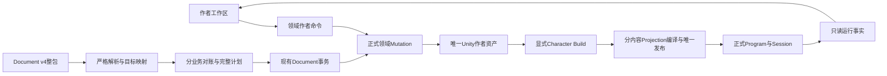

## Context

动机与范围见 [proposal.md](proposal.md)。本设计以 2026-09-04 阅读到的工作区为调查依据；仓库包含其他任务的未提交修改，因此当前 HEAD 不能独自重建实际运行状态。本文件中的目标模块是设计名称，不表示实现已经存在。

### 已核实的代码边界

代码根为 `D:/Unity_Project_1/3C/3cDemo/Client/3C_Client/Assets/GameScripts/Main/`。下表行数为调查时单个类在所属文件中的行跨度，含空行和嵌套类型；它只用于定位集中职责，不是拆分完成指标。

| 当前类型／文件 | 规模 | 本次处理的职责 |
|---|---:|---|
| `AgentAuthoring/AgentAuthoringPresentationReconcilerV4.cs` 内 `AgentAuthoringPresentationReconciler` | 3284 | Pose Graph、状态机、资源绑定、Linked Pose、Clip Curve与Profile对账、对象转换和引用解析 |
| `AgentAuthoring/AgentDocumentMutationReconciler.cs` 内 `AgentDocumentReconciler` | 2744 | Character、AI、Graph、状态机、黑板、Action与Timeline对账 |
| `AgentAuthoring/AgentAuthoringPresentationPackageCodecV4.cs` 内 `AgentAuthoringPresentationPackageCodec` | 2699 | 分片读写、合法文件集合、local分片发现、结构与关系校验 |
| `AgentAuthoring/AgentAuthoringTargetMapper.cs` 内 `AgentAuthoringPackageMapper` | 2235 | Document物理分片与内部目标的双向映射 |
| `Authoring/PoseGraph/CharacterPresentationPoseGraphEditor.cs` 内 `CharacterPresentationPoseGraphEditorWindow` | 2182，另有partial | 工作区装配、导航、创建、选择、校验定位、Build、运行观察与调参状态 |
| `Authoring/SharedGraph/BtsmtlGraphAuthoringCapabilities.cs` | 1993 | 节点登记、字段校验、创建配置、端口、显示和Document描述投影 |
| `Authoring/PoseGraph/CharacterPoseAuthoringBottomDock.cs` 内 `CharacterPosePreviewViewport` | 1615 | 只整理其中既有作者调参、选择与只读观察；fixture、时钟和执行输入仅作为外部边界识别 |
| `Authoring/ActionWorkspace/ActionAnimationAuthoringWorkspaceWindow.cs` | 1508 | 关系解析、Timeline装配、Details、导航、Build、Preview与Live |
| `Editor/CharacterSimulation/Compilation/Presentation/CharacterPresentationProjectionCompiler.cs` | 文件3051 | 来源目录、producer、混合、脚部分析投影、Pose编译输入、相机／Cue及装备组装 |

表中 `AgentAuthoring/` 与 `Authoring/` 位于 `Editor/CharacterPipeline/`。`BaseTreeWindow.cs` 和 `BaseTreeView.cs` 分别包含多个已分离的类型，不能把整个文件行数误报成单个巨型类。

共享 `GraphAuthoringEditorShell`、Canvas、Details、Navigator、Capability与Port Shape已存在。Tree窗口使用Shell；Pose与Action窗口复用部分组件但仍自行装配较多流程。`TimelineEditorWorkspaceView` 重复订阅时间定位刷新，并有重复Pause／Dispose；`BaseTreeWindow.Update` 在编译时直接Close，创建阶段还调用关闭通知。Action工作区每次Preview求值可清空并重建底部控件。上述是静态代码事实，不是卡顿根因或性能收益的实测。

旧完整角色Preview的时钟、fixture、独立位移求值和资源接管由 `rebuild-btsmtl-preview-with-scene-play` 负责替换。本变更只整理既有作者与观察能力并保持当前行为，不先重构一遍将被删除的播放器，不承担场景预览接入。两份change可以分别完成与验收，共享文件发生变化时只做接口对账。

`openspec/AGENTS.md` 已由用户删除。本次遵循根AGENTS、当前技能和CLI返回的spec-driven规则，不恢复该文件。

## Goals / Non-Goals

**Goals:**

- 每种节点作者规则、每类Document对账和每种Projection内容有一个明确实现所有者；入口通过窄合同组合，不读取模块私有状态。
- 人工操作、Agent目标状态与编译继续基于同一正式作者语义；内部拆分保持现有身份、默认值、顺序、值域、错误合同和生成内容。
- 窗口保留视图状态，领域模块处理业务命令，正式运行拥有状态演进；运行刷新不夺走作者输入。
- 被替代的Editor实现及转发接口随调用者迁移删除，文件名与最终类型职责一致。
- 保持现有作者、调参和观察入口的行为，整理后的接口可由其他独立change消费；本变更不新增工作台、播放器或事务服务。

**Non-Goals:**

- 不改变Gameplay、Pose、Foot、Pelvis、FBBIK、相机、ACL、网络或物理算法，不接管对应active change的行为任务。
- 不改变Unity作者资产模型、序列化节点类型、Graph／Timeline ownership、stable identity、Document v4正文或五个MCP生命周期；内部Editor类型改名不作为数据格式升级。
- 不实施场景预览的启动、播放切换、Actor统一接入、试验重建、运行权限调整或旧播放器／fixture删除；不新建预览协调器、Replay播放器、采样器、评分器或构建发布流程，不安装插件，不改变Enter Play Mode设置。
- 不把大类拆成多个partial、万能Context或按任意字符串分发的service作为完成结果；不设统一行数上限或用文件数量衡量质量。
- 不删除仍被现行graph-core合同允许的整套通用解释器。其产品用途尚未决定；本变更只清理已被新Editor模块实际取代且引用闭合的实现，不修改TrainingEnemy资产。

## Decisions

### 1. 一份作者真相，按输入到结果组织模块

人工编辑继续使用原领域事务入口，Document在其外层保持整包Undo／rollback／save／reverse export。两种入口消费相同Capability和正式Mutation，不要求人工单字段编辑先生成Document。底层handler不自行创建第二Undo、保存资产或写回package。

模块边界使用已有业务类型或新建的窄typed输入／结果。一个模块不得取得完整窗口、完整事务service、可写其他模块状态或无约束的 `Dictionary<string, object>`；需要跨模块资料时传明确只读引用索引或上一模块结果。只在模块装配边界检查登记完整性，在正式输入／提交边界校验变化，不在每次重绘重复扫描整个角色。

**取舍：** 按技术动作拆成通用Reader／Writer／Manager便于统一机械操作，但动作、状态与资源规则仍容易跨多个service散落。按业务内容拆分让一次功能修改聚集在同一模块，代价是需要显式表达跨业务引用。这里采用业务模块，严格JSON解析、稳定排序、Undo等机械能力继续复用既有公共实现。

### 2. 节点作者模块拥有局部规则，共享目录只汇总

`BtsmtlGraphAuthoringCapabilities` 中的具体节点登记和配置分支迁入以下模块。它们最终投影到现有 `GraphAuthoringCapabilityRegistrationRoot`／`GraphAuthoringCapabilityCatalog`，不形成第二目录。

| 业务模块 | 输入 | 输出与拥有的规则 |
|---|---|---|
| 控制流 | 已登记节点类型、typed配置 | Sequence／Selector／Parallel／Loop等局部字段、创建和配置 |
| 状态与条件 | 状态／条件节点声明、合法graph role | 系统anchor、状态引用、条件配置与节点局部校验 |
| 输入与黑板 | 当前Definition输入合同、变量引用 | 读写节点声明、精确绑定、值类型与Get／Set端口判别字段 |
| Action | 现有request／profile／context引用 | 准入、激活、生命周期节点及合法资源配置 |
| Motion | 现有移动参数、曲线引用 | 位移模式、执行模式、参数组合及正式配置操作 |
| AI | AI Definition、受控Character合同 | 感知、记忆、目标、Intent节点的作者规则 |

模块声明稳定kind、允许role、typed字段、默认值、固定／条件／动态端口和正式配置操作。条件端口仍只由唯一 `GraphAuthoringNodePortShapeProjector` 求形状；UI、Document、Clipboard、Validator不得各自识别节点mode。描述格式转换留在对应UI或Document投影层，公共图作者接口不依赖Agent package DTO。

节点创建和属性配置经原有正式API完成；模块不能拥有Undo或重建Program。Frontend继续调用已安装的Semantic emitter，不把本次作者拆分扩展为Gameplay节点编译器重写。Pose继续使用已完成的 `CharacterPoseNodeDefinitionModule`，不迁入BTSMTL运行节点继承体系。

装配使用明确模块集合，一次拒绝重复kind、字段或端口身份。查询只消费装配后的只读目录，不按文件名、类型扫描顺序或菜单显示名决定规则。迁移时保持现有公开catalog内容及canonical顺序，类型注册顺序不能影响导出或编译结果。

**取舍：** 每个节点一个独立插件便于单节点替换，但会增加大量装配入口；一个全域大类便于浏览，却使不同业务持续相互影响。这里按节点业务族组织，实现复杂的节点再在族内拥有自己的声明对象，共享目录只登记和查找。

### 3. Document按业务分工，整包计划与事务保持唯一

| 层 | 正式输入 | 正式输出 | 不拥有的内容 |
|---|---|---|---|
| Package Store | 精确root、manifest、文件集合 | 已严格读取的整包及同步基线 | 节点配置、运行时状态 |
| 分片Codec与Mapper | 单类已声明分片、共享Capability | typed目标、canonical文件、结构错误 | 文件级apply、保存资产 |
| Graph／State／Blackboard／Action／Timeline／AI对账模块 | 当前规范投影、完整目标、引用与planning symbol | typed差异及依赖、机器诊断 | Undo、Build、AssetDatabase写入 |
| Presentation对账模块 | Profile、Pose Graph、状态机、绑定、Linked Pose、Clip Curve目标 | 原正式Presentation事务组与Clip计划 | 第二Presentation apply、生成数据修改 |
| Mutation lowering | 原draft／typed差异、已解析引用 | 原immutable计划与preflight输入 | 对外operation协议、隐式查找root |
| Document Application Service | 完整计划、锁定hash、精确domain | 同一资产事务结果和canonical reverse export | 单片提交、自动Character Build |

分片Codec按Graph／Timeline／Presentation Profile／Pose Graph／PoseStateMachine／Linked Pose／注册Clip Curve分组。Store仍唯一发现允许的local文件对；分片模块只描述该类完整文件集合及解析规则，不能发布manifest或按目录前缀放行未知文件。canonical segment、负localFileId、未知字段拒绝、Curve完整字段、readonly context和整包hash都保持当前合同。

对账入口保留现有 `AgentDocumentPreparation` 等完整准备结果及Gameplay／Presentation事务组合，不另建对外Patch格式。复用当前Index、Resolver与planning symbol；按一次请求冻结的输入组织只读上下文，不让每个模块重新扫描所有Unity资产。

顺序由明确依赖决定：先解析完整目标及身份，再建立合法owner／新实体symbol，随后计算实体配置、引用和连线变化。端口形状改变必须保留现有“先移除失效边，再配置节点，再建立合法边”的顺序；删除owner必须先处理其引用与子内容。Timeline Channel与Action producer、Source Slot与Binding、Linked Implementation与Entry Graph等跨模块关系在整包目标中解析，不能依赖另一个模块已经修改Unity对象。保留业务有序数组和原计划相对顺序，不按新文件／模块名重新排序。

每个模块只产生自己的typed结果；跨模块约束在完整目标或计划边界校验。已有纯AI schema normalization、受控Character产物过期、layout-only不改变语义revision、apply失败完整回滚等分支必须原样保留。五工具的Play／编译／AssetDatabase门禁和hash锁定不因内部拆分放宽。

**取舍：** 分片各自提交可以减少单次处理范围，但会失去跨Graph／Timeline／资源引用的原子性；整包事务需要先准备全部依赖，却能保证作者只看到完整成功或完整失败。本设计保留整包事务，只缩小其内部实现的职责。

### 4. 工作区区分共享文档事实、窗口状态和运行绑定

| 状态所有者 | 输入 | 输出 | 生命周期 |
|---|---|---|---|
| 文档定位与领域上下文 | 精确Definition／owner、stable document与containment route | 当前作者文档及允许命令 | owner／revision变化时重新解析 |
| 窗口本地视图 | 当前页面、元素身份、滚动／缩放／折叠 | 当前页面的选择与布局 | 随窗口保存和释放 |
| 领域页面Presenter | 只读文档投影、选择、Capability | Navigator／Details内容与typed命令 | 随页面绑定，不拥有运行 |
| 已发布状态投影 | 明确产物与作者来源 | Available／Stale／需要Build及原因 | 依赖变化或显式构建后刷新 |
| 窗口运行观察绑定 | 显式target、source map、Follow／Pin | 当前合法committed事实 | target结束或identity变化时失效 |

Graph Shell只装配通用区域、画布、选择与命令表面。Tree／AI／Pose的页面路由、节点创建和业务Details由各domain adapter拥有；Timeline保留自己的时间轴交互表面，不能为了共用窗口而转换为Graph或改变Graph breadcrumb合同。Action Workspace保留精确Definition／Action／call-site关系解析，并复用同一导航、观察和状态服务。

现有 `GraphAuthoringEditorShell` 及其组件原地提取可组合的区域／生命周期宿主，原Shell成为该实现的正式Graph窗口入口；Pose与Action窗口使用相同宿主和领域适配，不复制区域装配。时间轴作为区域内容接入，不强迫它继承GraphView。提取前后只能有一套区域与生命周期实现，不新增并行Workbench或保留旧新布局选择。

重载前保存稳定定位信息与已提交视图状态，暂停命令并按原手势规则取消未提交操作；重载后重新解析owner和页面。找不到原实体时展示失效原因并允许显式回到有效上级，不恢复旧对象、不自动选择替代角色、不重放命令。删除 `isCompiling -> Close()` 和创建时发出关闭回调的路径。

刷新分为作者内容变化、layout变化、选择变化、运行值变化和产物状态变化。前两类只重建实际受影响的投影；选择变化重绑Details；运行值变化只更新已存在的只读字段。Snapshot通知不能 `Clear()` 整个编辑区域、改变焦点或重复提交命令。隐藏面板延迟到再次展开时读取当前事实，是否撤销诊断interest仍由已有资格合同决定，不能借UI优化改变采样结果。

**取舍：** 一个全局选中角色和页面让首次接线简单，但会破坏多窗口独立观察；完全独立的工作区则反复解析相同业务关系。这里共享只读文档／产物查询能力，窗口独立保存页面、选择和观察实例；不合并或重设当前Preview／Live会话的运行所有权。

### 5. 调参从视口提取，保持作者保存和运行采用的区别

从 `CharacterPosePreviewViewport` 提取正式作者值读写、参数块构造、精确Actor提交及采用状态跟踪。实现继续调用 `CharacterPoseTuningAuthoringService`、现有Candidate Compiler和Runtime `CharacterPoseTuningCoordinator`；不增加另一套参数字段目录、运行原子事务或回退算法。

输入为正式字段身份与typed值、作者owner、已发布参数布局、明确的目标Actor；输出分别为作者修改结果、候选提交结果和运行确认。UI只显示这些结果，不生成candidate revision、不枚举Program私有表推测字段归属，也不在重绘时重新编译参数块。字段到owner／layout entry的映射由领域模块从已有Capability和Tuning Layout建立；运行输入必须携带原有Program、Projection、布局与Actor身份。

以修改状态转换时长为例：Details提交字段命令；原Mutation校验并保存作者值；调参模块按当前布局构造候选；Actor在原定NextFrame／NextActivation边界采用；运行事实确认后UI才显示已生效。保存成功但运行拒绝时保留作者值、Undo和上一份运行参数，并显示两者不同。Undo／Redo同样从最终作者值生成候选。布局或结构变化失效时显示需要Build，不改写旧Projection来容纳新字段。

本节只提取当前已经存在的Preview／Live调参实现，保持原目标解析、字段资格、保存与采用规则。场景运行中的统一Actor接入、多Actor采用规则、运行权限调整和“构建并重启”由场景预览提案实施，本变更不预先接入或模拟这些能力。Document五工具的Play门禁保持，人工参数修改只形成正常TreeDirty／Conflict，不自动apply或rebase。

**取舍：** 把参数提交留在视口中容易直接取得目标，但其他页面必须复制同样流程；把所有角色默认值和运行参数放进全局管理器又会混淆作用对象。本设计采用明确owner与Actor输入的领域调参服务，运行历史仍由原Runtime拥有，窗口只持有自己的观察绑定。

### 6. Projection外层按产物内容编译，保留一次构建与发布

输入仍是 `CharacterPresentationProjectionCompileRequest`：已验证Semantic IR、现有作者编译模型、明确分析结果与Rig等正式依赖。输出仍是现有Projection编译结果及诊断。

| 内部模块 | 消费的资料 | 产生的结果 |
|---|---|---|
| Pose Source Catalog | 正式Slot／Binding与Profile引用 | 按原规则分配的dense source index与精确资源映射 |
| Action Producer Projection | Semantic producer、Timeline与call-site | 原有限Action producer条目和channel集合 |
| Source／Blend Space Projection | 来源目录、Rig与显式分析结果 | 原source计划、Blend Space计划及关联索引 |
| Blend Catalog Projection | Pose作者配置、Rig | 原Curve／Profile目录、路由与混合payload |
| 既有领域投影 | 相机／Cue／装备／Linked Pose／MM当前合法输入 | 当前已安装的对应payload；优先复用已存在模块 |
| Projection Composition | 上述typed结果、既有Pose Compiler输出 | 原Projection、Tuning Layout及发布前完整校验 |

来源索引由一处目录按原稳定顺序分配，各模块只解析它，不能各建dense索引或按注册顺序重新编号。继续调用 `CharacterPoseCompilerModule` 和它已经完成的Pass链。现有 `AnimationPhasePlanCompiler`、脚步事件推导和Foot Analysis投影即使移动文件，也保留原计算、边界和调用顺序；不乘机更换新PIK算法或调整分析生成政策。

静态调用顺序保持当前依赖，不建立动态编译插件调度器。每个模块拥有临时构建状态并返回完整typed结果，不共享一个可写的大型CompilationContext。错误继续携带原机器code与来源；无效模块结果不得参与发布。

保留当前Projection构造、Tuning Layout构造、完整验证和原子发布先后顺序。Tuning Layout必须在正式产物发布前完成；本变更不升级Image、ABI或重写已封存Program。重命名内部编译类型不应改变SourceRevision、SemanticHash、ContractHash、索引、canonical bytes或资产引用。

**取舍：** 把每种产物拆成独立发布流程可以分别构建，但角色动作、动画来源和资源引用容易对应到不同版本；把全部处理继续留在一个Compiler中又让新功能修改影响无关内容。本设计拆内部计算，继续一次依赖闭合、一次正式Build和发布。

### 7. 目录和类型按最终职责迁移

不新建程序集来制造隔离。通用作者接口与交互留在现有BTSMTL Editor程序集；Character／AI适配与Agent包格式留在现有 `ThirdPersonClient.Editor`，公共层不反向依赖Character、AI、Agent DTO、动画运行类型或具体Network Model。领域模块作为现有装配根的显式成员。

| 现有文件／职责 | 目标归属 | 清理方式 |
|---|---|---|
| `BtsmtlGraphAuthoringCapabilities.cs` 的节点分支 | `Authoring/SharedGraph/Nodes/` 下的业务族模块；公共接口在BTSMTL现有Framework | 保留唯一目录；全部调用者迁移后删除中央配置分支与转发alias |
| `BtsmtlSharedGraphAuthoringAdapters.cs` 中多个职责类型 | 原 `SharedGraph/` 下的Document、Connection、Mutation、Clipboard、Details模块 | 移动已有实现，不创造另一套Graph／Port／Mutation数据 |
| `AgentDocumentMutationReconciler.cs` | `AgentAuthoring/Reconciliation/AgentDocumentReconciler.cs` 及各业务模块 | 文件与现有真实类型名一致，入口只组织整包准备 |
| `AgentAuthoringPresentationReconcilerV4.cs` | `AgentAuthoring/Reconciliation/Presentation/`，保留一个组合入口 | 分离Graph、状态机、Source Binding、Linked Pose、Clip Curve、Profile对账与对应解析 |
| `AgentAuthoringPresentationPackageCodecV4.cs`、`AgentAuthoringTargetMapper.cs` | `AgentAuthoring/Package/` 下的Codec与Mapper模块 | schema仍为v4；删除误导的文件／类型差异和重复格式映射，不保留旧reader |
| `AgentMutationPlanner.cs` 内lowering目录 | `AgentAuthoring/Planning/` 下按既有Mutation业务族组织 | 原计划类型和preflight保留，登记入口不保存所有业务实现 |
| `AgentAuthoringDocumentTransactionServiceV4.cs`、`AgentAuthoringDocumentV4Exporter.cs` | 与当前真实类型 `AgentAuthoringDocumentApplicationService`、`AgentAuthoringDocumentExporter` 对应的文件 | 只按实际职责调整组织与名字；事务生命周期不分散 |
| `BaseTreeWindow.cs` 内导航／overlay控制 | 现有Tree Editor下明确的Navigation／Diagnostics模块 | 正式窗口保留薄装配；不因纯移动改变菜单和资产打开入口 |
| Pose窗口与 `CharacterPresentationPoseGraphEditor.Tuning.cs` | Pose页面导航、命令、发布状态、调参领域模块 | 保留正式EditorWindow类型；移除已提取的字段、业务分支与不再需要的partial |
| `CharacterPoseAuthoringBottomDock.cs` | 既有作者调参、目标显示和只读观察模块 | 保持当前调用与行为，不迁移fixture／时钟；其后续替换归独立预览change |
| `ActionAnimationAuthoringWorkspaceWindow.cs` | Action关系解析、页面Presenter、只读运行投影、显式命令适配 | 窗口不再构造业务快照和编译候选，不再逐帧重建整组控件 |
| `TimelineEditorWorkspaceView.cs` | 保留Timeline交互／几何／绘制模块，缩小窗口binding和刷新职责 | 删除重复订阅／Pause／Dispose并保持现有播放行为；播放控件改接场景不在本次范围 |
| `CharacterPresentationProjectionCompiler.cs` | 现有 `Compilation/Presentation/` 下的Sources、Producers、Blending与Composition模块 | 使用已有Linked／MM等模块；最终Compiler仅组织明确依赖 |

这是职责及目标目录图，不要求一个DTO一个文件。命名以业务职责为准；纯Editor类型和文件可直接改名并迁移调用者。Unity脚本文件移动保留对应 `.meta` 身份，既有序列化节点类型、正式EditorWindow类型、菜单／资产打开入口和仍使用的资源身份不随内部整理重命名。

本变更的删除清单包括已替代的中央分支、旧Editor接口、无调用者转发、重复订阅、创建时关闭通知、整块运行刷新和旧文件名。旧完整角色播放器、Motion预览求值、Fact／Action／Query fixture及其资源只能随场景预览变更的完整切换删除。原生Animation Window素材编辑、曲线绘制和离线分析仍有独立业务用途，不按名称含Preview就删除。

### 8. 行为保持以完整输入和正式结果为依据

实现前记录该迁移单元实际使用的代码提交及未提交差异、作者资产与引用、Program／Projection／Numeric Target、Rig、场景／collision身份、输入trace和比较规则版本。只记录HEAD或沿用很早的Foot输入目录不构成完整基线。

在同一版本先用同一正式输入获得可重复的完整运行，再比较候选与固定基线、上一保留小步。记录正式Proof、完整输入消费、运行错误及原始诊断；没有用户明确要求时不新增测试工程、播放器、分析器或验证脚本。

| 对账对象 | 本变更预期 | 不可接受的解释 |
|---|---|---|
| 作者资产与Document | 无编辑操作时canonical内容、identity、editable/context hash不变；相同操作有相同最终目标和事务效果 | 以新文件布局掩盖丢字段、默认值变化或局部apply |
| 规范化编译产物 | 相同正式输入下Semantic IR、Program、Projection及索引顺序一致 | 重新生成身份后直接接受差异，或调整浮点容差掩盖变化 |
| Gameplay与Body | 相同Numeric Target、输入和初态下原动作状态、时间与Body结果保持 | 用轨迹直接写Transform代替正式执行 |
| Presentation与Foot | 对齐正式logic／presentation／source时间后比较来源、Foot／Pelvis／Goal、Solved与Physical | 按不同表现帧率的行号强行配对，或只比较总分 |
| 窗口 | 本delta规定的编译恢复、焦点、选择和刷新改进允许变化 | 窗口恢复自动Build、执行动作或写业务数据 |

运行实例重新创建产生的会话身份可按正式Actor与source映射对账，但稳定作者身份、activation generation、reset次数和语义事件不能被任意重标。当前普通角色Replay和Performance Replay的相机输入控制范围不同；相机或表现逐帧对账必须记录或固定相应输入与时间条件。缺少覆盖时报告缺口，不声称Replay覆盖全部作者交互或全部运行能力。

规划期间曾出现Capture生成完整文件但日志报错的产物，之后其他任务已提交错误门禁与预测边界修复。本变更不据旧日志宣称当前仍被同一错误阻塞，也不据修复提交宣称基线已通过；实施时以该次完整正式结果重新确认。期间其他任务若改变IK、相机或ACL行为，先分别验收其预期差异并重新明确基线，不把它们算成本次结构重构效果。

**取舍：** 只比较最终骨骼文件少，但难以区分输入、采样和求解差异；分层保存输入到结果的证据需要更多产物，却能把问题定位到真实边界。这里复用已有分层事实和比较机制，性能数值只在相同环境与配置下解释，不承诺本次拆类带来固定比例提升。

### 9. 与现行规范和active change对账

| 当前规范／规则 | 核对结论 | 本变更处理 |
|---|---|---|
| `graph-authoring-editor-shell` 的唯一区域／画布／domain adapter | 已有共享基础，部分窗口仍自行组织相同流程 | 原地提取并统一装配；不重新写GraphView或第二Shell |
| 同spec的 `Workspace布局状态必须是editor-only且不污染authoring` | 当前重载恢复仅为可选，代码还在编译时Close | 唯一MODIFIED requirement：加强为稳定位置恢复，保留布局不污染作者数据约束 |
| 同spec的只读diagnostics与正式mutation | 约束保持，刷新不应抢占作者交互 | 新增交互连续和单次本地生命周期场景，不改变运行算法 |
| `character-action-animation-authoring-workspace` | typed Action关系和所有权保持，窗口恢复／连续刷新约束不足 | 只增加对应作者行为要求，不改Action、Timeline、Clip、Slot归属 |
| `graph-authoring-domain-framework` 与 `btsmtl-componentized-node-authoring` | 唯一Capability、领域隔离和节点模块基础保持 | 内部节点模块化放design/tasks；沿现有Port Shape与Pose Definition，不重复修改业务spec |
| `btsmtl-agent-authoring-document-sync`／MCP bridge | v4整包、五工具、严格解析、唯一事务和Play门禁保持 | 纯内部Codec／Mapper／Reconciler拆分；无新schema或工具，因此不制造新的delta |
| `btsmtl-graph-core`／AI／节点生命周期 | 正式Character走Program；通用解释器仍有独立许可 | 作者view binding与运行状态不相混；不把内部清理扩成通用执行能力删除 |
| `btsmtl-compiled-simulation-program`／Semantic IR／Pose Plan compilation | 显式Frontend、Projection与Numeric Target发布以及已安装Pose架构保持 | 只拆外层Projection组织，不改确定性检查、ABI或发布事务 |
| `btsmtl-timeline-editor-preview` 与Action Workspace的表现专用Preview | 与场景运行方案明确冲突，当前主spec尚未切换 | 由场景预览change唯一替换；本delta不重述旧执行规则，也不授权另一播放器 |
| Foot Analysis显式生成与当前Build补生成行为 | 既有规范／实现差异已经被场景提案记录 | 本次提取编译模块不改变该政策；不得把隐式分析扩大到选择、窗口恢复或预览 |
| Skill与reference中的旧文件／类型地图 | 若干文件仍带V4，真实类型已无后缀；已有部分地图名字过时 | 实现时随最终目录更新代码地图与技能引用，v4外部合同不变 |

因此只有两份delta specs。节点、Document和Projection拆分保持现行外部行为，其具体实现约束放在设计与任务中，不凭内部文件移动新增业务Requirement。Action Workspace主spec仍含TBD Purpose，本次不借delta覆盖其Purpose，也不在规划阶段修改current文件。

| active change | 它继续拥有的工作 | 与本变更的交接 |
|---|---|---|
| `rebuild-btsmtl-preview-with-scene-play` | 场景、实例级运行控制、输入、播放控件改接、统一Actor、运行权限、试验重建、旧完整预览删除 | 本变更只整理现有作者实现；其第6／7／9节任务全部留在预览change。双方按实际已安装接口适配，不共享实施勾选，不将预览完成设为作者重构的门禁 |
| `refactor-character-pose-graph-architecture` | 已有Node Definition、Compiler Pass、Actor状态、根事务、Tuning与诊断事实 | 本次只整理作者窗口和外层编译组织；沿最终公开接口，不恢复旧Executor／CaptureViewLease或复制节点规则 |
| `rebuild-character-foot-ik-from-zzz-pik` 与旧stabilize | 新算法、输入来源、几何、骨盆、配置和诊断语义 | 新PIK已明确改变旧数值目标，本次不能同时要求其新算法保持旧Foot输出；按实际采用版本固定本次结构基线，不接管旧相反任务 |
| `rebuild-character-camera-from-zzz` | 相机算法、资源、Graph／Timeline合同和领域Projection | 本次为既有相机投影保留明确模块边界；未来新Camera payload由相机change接入。其旧fixture／seek与场景方案的冲突交回场景统一计划 |
| `add-acl-animation-runtime` | 正式Source backend、资源、Scalar／属性混合和唯一最终发布扩展 | 消费它实际已安装的公开作者与Projection合同；不复制解码、表情绑定或另一资源表 |
| 采样／分析／性能changes | 字段与schema、采样资格、构建插桩、Capture门禁和比较器 | 本次只消费正式结果；不修改评分补偿差异，不恢复已删除的采样桥接 |

以上对账只处理共享代码的接口变化，不建立“必须等场景预览完成”的功能依赖。作者重构以现有作者功能的职责整理和行为保持独立验收；预览change以其正式场景运行和旧链删除独立验收。相同文件上已存在正确修改时保留，出现相反需求或不可合并接口时列出业务取舍交由用户决定，不能直接覆盖。

## Risks / Trade-offs

- [把旧大类搬成一个万能Context] → 每个模块只接收表中定义的typed输入，状态只能由对应业务所有者写入；调用方不得读取模块内部字典或阶段游标。
- [分模块后创建／删除顺序改变] → 将跨owner、端口变更和local symbol依赖保留在完整计划中，并使用现有Document dry-run／往返与正式Validator对账。
- [窗口刷新覆盖作者正在输入的值] → 区分作者revision与运行snapshot变化，只刷新只读显示；owner真变更走既有冲突／取消边界。
- [共享Profile修改被误认为所有Actor已应用] → 作者保存结果与每个明确目标的运行采用分开，沿原目标身份与确认事实显示。
- [Projection提取改变dense索引或数学] → 保留原目录排序与函数计算，按同输入canonical产物和分层运行结果核对；不以新hash自动认可差异。
- [作者重构重新包含场景预览实施] → 本次任务不包含场景控制、播放切换、统一Actor和旧播放器删除；只核对既有公开接口，后续场景能力由独立change接入。
- [通用解释器或素材工具被当作旧Preview误删] → 删除必须有实际调用者与资源闭包依据；整套解释器产品去留、原生素材编辑及离线分析不在本次删除范围。
- [其他任务在回放中改变代码／场景] → 每次运行记录精确工作目录与Unity实例；同一实例的Build／Refresh／Play／切场景按明确运行所有权执行，同机性能采集避免竞争负载。
- [只看到Completed便当作基线] → 同时核对正式运行错误、完整输入、Proof和原始采样；缺失证据不计通过，也不在本change增加替代验证路径。

## Migration Plan

1. **确定迁移单元。** 核对本次具体文件、当前提交与未提交差异、已有正确接口、正式资产和数据合同；记录每个单元的输入／输出、调用者和删除清单。使用当前稳定角色与既有Replay建立该单元基线，不选TrainingEnemy。
2. **节点模块。** 先定义现有Framework中的窄作者模块接口，再逐业务族迁移登记、字段和配置调用者；每族切换时删除对应中央分支，目录对外投影不变。保留唯一装配根。
3. **Document模块。** 按分片、对账、lowering的依赖迁移一个完整业务闭包，保持同一Application Service与计划入口；每个闭包用现有严格解析、dry-run、apply／Undo和反向导出结果对账，不让分片各自提交。
4. **外层Projection。** 从已有typed输入和输出边界提取内容模块，逐个保持canonical产物；最后Compiler只组织原顺序及统一结果。该步骤不依赖场景预览已完成。
5. **工作区与调参。** 提取共享区域、定位与视图生命周期，以及领域页面、发布状态、调参和只读投影；修复本delta的编译恢复、刷新和重复通知。只整理会保留的能力，不增设旧Preview替身。
6. **交付每个闭合提交。** 文件／类型改名、调用者迁移、旧Editor实现删除与对应证据一起形成中文小步提交。只回退本次闭合迁移的实际提交及依赖，不保留运行时old/new选择；存在后续共享修改时先对账冲突，不使用破坏性git操作。
7. **独立完成作者重构。** 完成现有编译、Validator、Document和Replay的适用门禁；核对最终代码与本change两份delta及保持项，按实际实施状态更新current spec、代码地图与技能引用。场景预览未实施不阻止本change完成，不以旧播放器尚未被另一change替换判定本次清理失败。规划阶段不执行安装或归档。

这是一组技术依赖，不替用户决定IK、相机、ACL与BTSMTL的业务实施优先级。当前change的架构选择已明确；通用解释器整体删除、新Replay覆盖能力和其他系统的算法取舍属于独立范围，不作为未回答的问题混入本实施清单。
