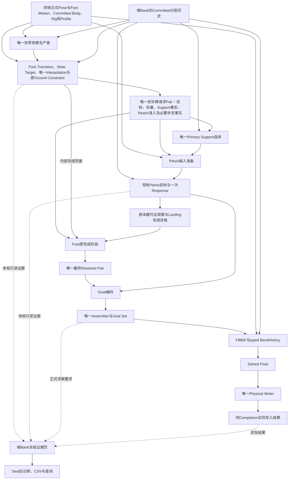

# IK权威数据流与控制权设计

## Context

维护目标是让“修改一种行为”主要落在该行为的Owner；增加解释证据不改变运行状态，改变评分不改变运行行为。

本次首先收口权威数据和控制权，诊断简化是配套。权威按具体事实与阶段定义：原动画对输入姿态权威，Observation对本次查询权威，Goal对求解要求权威，Physical对实际写入权威。中间事实不等于无效数据，但不能冒充后续结果或因为同为Vector3就交换使用。

当前外层已经只调用唯一Foot Module，并通过根Bank提交Foot、Goal与Bend。内部`EvaluateFrame`仍需要理解脚需求、初步Resolved、Pelvis选择、可达观察、Landing完成及多份诊断投影。末端Goal夹紧已经删除，不再列为本次待搬移职责；问题是初步与最终结果的类型含义仍不清楚。

核对入口：

- `Assets/GameScripts/Main/Runtime/Character/Pipeline/Presentation/FootPlacement/CharacterFootPlacementModule.cs`：Evaluate、Pelvis调用、逐腿可达观察、Finalization与Goal编码。
- 同目录`CharacterFootLifecycle.cs`、`CharacterFootSwingMotionBuilder.cs`、`CharacterFootLifecycleContracts.cs`：初步结果、凭据、最终结果和过程证据。
- 同目录`CharacterFootInterpolationRuntime.cs`：从过程Fact读取方向历史。
- `Assets/GameScripts/Main/Runtime/Character/Pipeline/Animation/PoseConstraints/CharacterFinalIkFullBodySolver.cs`：参考姿态准备、BendHistory消费、Vendor方向读写及Reset。
- `Assets/GameScripts/Main/Editor/CharacterPipeline/Diagnostics/`：Sampler、Analyzer、Publisher和当前版本合同。

以上路径均相对Unity项目根`3cDemo/Client/3C_Client`。实施前重新读取源码与资源identity；不能把无关GM/Input改动造成的产品身份变化自动当作IK行为变化，也不能伪造官方Proof匹配。

## 2026-09-01行为基线

- 唯一源码基线为用户指定的 `ad3527e103cc3235a63e8a1c1dbd26df5155e0ba`。233436提供该行为的回放证据，205014提供交叉对照；不得把当前HEAD自动升级为基线。后续无关工作不回退，实际接口差异单列对账，不把它们带入IK行为变更。

- 正式恢复包：`Diagnostics/FootPlacementRuns/20260831-233436-894-d1564c7fa0b442f6aef02bb470ca0b1b`，对照已保留的`20260831-205014-114-dc157fde9c004846a72e9cd1fa1b5b01`。恢复代码`a6eceac`，确认记录`ad3527e`。
- 两包均1043输出帧、2086脚行、1215列。1191列逐值一致，24列仅身份换代且映射双向无冲突。233436的正式Proof对其前次232702匹配1044输入帧；与205014的结果一致性来自独立逐列对账。
- 保留`9da24a5`后的Reach观察政策：逐腿几何和交集不硬改Pelvis/Foot；每腿在当前加权Pelvis位移下是否可达，仍用于原Landing完成资格。
- 保留`a40b71f`的膝向运输：可靠当前动画保留符号，经原腿轴到目标腿轴的旋转取得请求；Stable保存运输前动画方向，Applied保存实际请求。退化分支继续原历史政策。
- 保留Swing包络、Foot Height、Contact世界残差、旋转、正式权重、骨盆响应与现有Profile。SmoothKnee和Current Support替换Swing包络已被否决，不是待补全的前置工作。
- 保留facts71/diagnosis40/quality-score3作为行为对照口径，以及已经安装在工作区的紧凑分析存储。格式若因本次迁移真实变化，应明确记录版本差异，不把分数变化当作行为收益。
- R825–827深折叠、部分接触间隙和穿透等已知表现问题不阻止结构对账，但不得在本change中顺手改变目标或权重解决它们。该基线不代表全身质量通过。

## Goals / Non-Goals

### 目标

- 每项业务决定和可变字段都有唯一Owner，消费方不从非权威过程记录重新推导同一决定。
- 用完整数据流、读写权限和现存读取迁移清单落实边界，不能只改类型名而保留原旁路。

- 明确初步请求和Landing完成后的最终结果，缩小调用者必须理解的阶段知识；保持当前Goal层不修改业务位置。
- 每个持久值只有一个写入Owner和明确Reset语义。
- 保留诊断证据，减少同一字段重复定义和转抄。
- 保持同一Module、根Bank、Interpolation、Pelvis Response、Goal Set、FBBIK和Writer。

### 非目标

- 不重新实现或撤销现有Ground Path修复，不恢复Current Support替换Swing包络的失败候选。
- 不改变Foot/Pelvis正常帧公式、作者权重、状态准入、Ground约束、Reach观察或配置，不恢复已删除的Reach硬执行。
- 不借拆分建立通用IK框架、插件式状态机、全局Blackboard或第二缓存生命周期。
- 不修改TrainingEnemy、外层Pose Program架构和PostCommit诊断错误处理。

## 权威数据流

图表示数据依赖，不增加运行时Pass。原Pre/Post Transition、Interpolation和Ground Constraint先后保持基线，Foot完成阶段不再次推进时间。唯一完成反馈是“当前Pelvis位移上的本腿可达性 -> 原Landing完成检查”；不扩展成Foot/Pelvis反复迭代，不重新积分，不反向修改原Pose或Body。

### 修改权限表

| 数据或决定 | 权威来源/唯一修改者 | 合法消费者 | 禁止越权 |
|---|---|---|---|
| Gameplay Body、Grounded与移动计划 | 已提交Simulation输入 | Presentation只读 | Foot/Pelvis/Solver不反写Body，不制造Gameplay事实 |
| 原动画Pose、Foot Motion、作者权重与Rig/Profile | 同帧正式动画输入和准备结果 | Foot、Pelvis准备、Solver | 不从最终骨骼或诊断反推源Pose，不补第二套配置 |
| 世界命中、Landing与Current Support观察 | 既有查询/观察生产者和明确缓存Owner | Foot求值与请求准备 | Pelvis、Solver、诊断不重查，不用旧观察冒充本帧 |
| 离散State、Contact边沿和Anchor命令 | Transition Resolver判定，Transition Runtime唯一应用；Landing记录由Landing Runtime拥有 | State Target及原完成阶段 | Module、Pelvis、Goal不直接写State/Anchor，完成凭据不成为第二状态源 |
| 选中位置目标与Requested Direction | State Target Resolver | 唯一Interpolation | 不从Motion诊断重新选目标，不由Goal Encoder选接触面 |
| 连续位置、Residual、Response scalar与Applied Direction | 唯一Interpolation及其分型历史 | 原Ground Constraint、请求生产者 | Target/Pelvis/诊断不推进历史；Ground Constraint只产出本阶段结果，不倒写插值历史 |
| Foot权重和加权脚几何 | Foot输出Owner按作者输入和既有Ready/Suppress/Contact政策一次解析 | 请求消费者、最终Resolved和Encoder | 下游不因修正量、角色行为或诊断缺失重算权重，不用临时Goal再反算一份输入 |
| Support事实与Reach观察准入 | 唯一Foot请求生产者 | Primary选择与Pelvis准备 | 下游不混读SwingMotion.State、Step和Resolved重判 |
| Primary Support及保留历史 | 现有Primary Selector | Pelvis准备与证据页 | Pelvis响应、Solver、诊断不另选主支撑脚 |
| Stride/Pelvis业务输入 | 同一请求与Primary结果的唯一准备阶段 | 现有Pelvis求值 | 只迁移当前条件，不包装整份Foot Context/Raw Landing/完整Path继续传下去 |
| Pelvis目标、输出、速度和位置权重 | 现有Pelvis Owner与一次Response | Reach观察、Encoder和证据页 | Foot收口、Reach观察不改Spring，不恢复硬执行 |
| 逐腿可达性与Landing完成资格 | 既有Reach观察基于请求和当前加权Pelvis位移；Foot Transition决定是否完成 | Foot原完成阶段 | 观察不夹脚、不硬压骨盆，诊断同名布尔不进入准入 |
| 最终Foot结果与Goal | Foot完成阶段发布Resolved；Encoder只编码；Assembler只汇聚 | FBBIK | 不在Goal层重选State/Support或改变权重，不把初步请求当最终结果 |
| Solved Pose与Physical结果 | FBBIK只写Pending Pose；Writer唯一写骨骼并记录结果 | 正式发布与诊断 | 不用Goal冒充实际骨骼，不新增Toe/后处理Writer |
| 根事务与诊断 | Root独占Prepare/Seal/Discard；诊断单向读取 | 外部只读消费者 | Root不执行Foot数学，诊断不控制状态、目标或权重 |

权限通过收窄输入视图、方法职责和可变状态可见性落实，不靠多层重复检查。Solver内部既有Profile与Goal Application数学保持，本次不借权限表修改已明确排除的PoseBone特殊应用规则。

### 现存混用读取的迁移清单

| 当前路径 | 问题 | 迁移后的唯一依据 |
|---|---|---|
| Module的IsLandingReachCandidate同时读Step、Motion.State和Resolved | 从多个视图重新判定，Foot请求本身不能说明准入决定 | 请求生产者合并当前实际条件，一次发布typed准入；消费方只读，不简化阈值或事件条件 |
| CreateFootGoal再ResolveWeightedGoalSole形成Pelvis输入 | 临时Goal反算值与Resolved已有几何并存，来源不清楚 | 将当前真正被消费的加权计算归入请求生产者，保持空间换算和顺序，Pelvis读同一有效Sole |
| ResolveIntent混用Step、NextLanding、Path Accepted与Resolved | Pelvis准备需要理解Foot多个内部来源 | 请求公开最小typed步态/落点可用事实，唯一准备结合Primary执行原业务，不传整份Context |
| SwingMotionResult同时带Swing几何、后续State与诊断字段 | 无法仅凭类型区分运行输入和过程证据 | 保留算法实际消费的阶段结果，状态过程数据进入只读证据；Pelvis/Goal不读过程State |
| CorrectionResponseFact.ResponseDirection被下一帧读取 | 本帧解释记录兼任持久历史 | Interpolation独占明确Applied Direction历史，Fact只记录前后变化 |
| 空正式历史时读取bend.direction | Vendor可能保存未进入Bank的旧方向 | 正式准备结果和typed BendHistory唯一决定方向，Vendor只保存本次工作值 |
| Goal、加权目标、Solved与Physical互相代称 | 无法确定数值代表要求还是实际结果 | 明确阶段、空间和是否应用权重；同Completion分别保存，不互相补值 |

若两份同义数值不完全一致，先对账基线中真正进入Pelvis、Goal或Writer的消费链；不能凭字段名叫Resolved就认它正确，也不能留下两份可任选的“权威”值。保持基线行为所需的数值顺序明确保留，新发现的行为冲突单列给用户决定，不在结构迁移中暗选一个更好看的结果。

基线中的实际消费值用于回归对照，不等于该数据来源天然具有业务控制权。权威来源由正式输入和上表中的生产职责确定。若改用正确来源会改变输出，必须单列为行为修正，说明原来源、正式来源、数值差异和业务影响；不能为保持基线而永久保留非权威读取或兼容双读，也不能把真实变化隐藏成纯重构。

## Decisions

### 1. 模块内部区分初步请求、可达观察与最终结果

拟定内部术语为`CharacterFootPlacementRequest/Pair`；逐腿可达输入继续复用现有`CharacterFootPelvisReachObservation`及其实际本腿完成判断，最终输出继续使用`CharacterResolvedFootResult/Pair`。优先迁移和改名既有初步结果，不复制两套同义字段，也不为已删除的夹紧行为建立`CharacterFootReachOutcome`或“受限输出”类型。这些都是内部数据合同，不新增Pose Graph节点、运行链或对外提交步骤。

| 阶段 | 输入 | 输出 | 唯一责任 |
|---|---|---|---|
| Foot求值 | 同帧动画、正式Foot Motion、世界Observation、上一Committed历史 | typed脚需求与内部完成凭据 | Transition、Target、唯一Interpolation各自推进既有职责 |
| Primary Support与Pelvis | 请求中的Support/Reach视图、当前动画与Body、现有设置 | Primary结果、Pelvis结果和每脚可达观察 | 原有支撑选择、共同目标、软姿态偏好、一次响应及独立几何观察 |
| Foot收口 | 原请求、完成凭据及本腿可达性 | 最终Resolved Pair与过程证据 | 完成原Landing资格判断，不夹脚、不反写骨盆 |
| Goal编码 | 最终Resolved Pair、Pelvis Result、正式空间绑定 | 三个Goal Contribution值 | 只编码位置、旋转和权重，不再决定Reach或修改业务目标 |

请求必须携带Frame、Completion、Rig、Side与Event身份，明确未加权目标和按作者权重得到的有效目标。Primary/Pelvis只读取所需的Support Eligibility、Support Intent、误差、Event、有效脚位置和typed Reach，不读取Foot State、Lock Mode、Anchor历史、Interpolation或Diagnostics。

内部完成凭据可以保留Finalization所需的本帧计算事实，但只能由Foot Lifecycle消费；不得被Pelvis、Goal、根Runtime或诊断评分器当成第二份可变状态。

保留当前求值先后与数学：先处理Foot，再进行一次`ResolvePelvis`，用本腿在当前加权Pelvis位移下的可达性完成原Landing判断，随后编码最终目标。Reach不夹取Spring目标或输出、不清边界速度、不阻止Release回零、不强开权重，Primary Support没有硬执行例外。不能借整理引入另一种腿长算法、增加响应、重算Support或迭代多次。

可达观察必须保留本腿请求身份、当前加权位移与原资格结果。原资格不满足时继续阻止原Landing完成，不把“删除硬执行”扩大为“所有脚自动完成Landing”；同时不夹紧该脚目标、不改作者权重、不通过骨盆补偿保证所有目标可达。

可达性只作为现有Transition Resolver的准入输入，State仍由唯一Transition Runtime更新。Pelvis和Ground Constraint不能直接写离散State，不新增另一份状态选择。

最终Resolved中的Final Ankle、Final Rotation、Effective Sole/Ankle与Correction保持当前Foot/Heel/Toe几何和权重计算。初步结果只表示完成判断之前的输入；最终结果仍是Goal输入，不是FBBIK或Physical Writer已经达到的骨骼位置，不增加“最终必然可达”的保证。

身份、有限值和布局校验复用已有生产/消费边界。合法typed请求进入内部流程后不逐层重复检查相同字段；如确有新的交接不变量，将其归入现有唯一校验Owner，不增加一层中转类再附带一套防御检查。

### 2. 运行状态与本帧证据分责

| 状态类别 | 写入Owner | 后续读取者 | 重置来源 |
|---|---|---|---|
| 离散状态与Contact边沿 | Transition Runtime | Target与后续Transition | 既有Foot Reset合同 |
| Verified Landing与预测跟踪 | Landing Runtime | 请求准备与Foot Lifecycle | 既有Landing身份变化和根Reset |
| 残差、响应标量、已应用方向 | Interpolation Runtime | 下一帧Interpolation | 既有分域切换和明确Reset |
| 骨盆输出与速度 | 既有Pelvis Response | 下一帧同一Response | 既有Pelvis释放与Reset |
| 腿方向历史 | FBBIK Adapter的typed BendHistory写入 | 下一帧同一Solver | 明确的Solver Reset及正式准备结果 |

`CorrectionResponseFact.ResponseDirection`中下一帧会读取的方向迁入显式运行历史。Fact只保存本帧的前值、目标、采用值、原因与结果，不承担下一帧状态。该迁移必须保持当前方向限制、数值推进、ContactWorldResidual、Release移交和所有重置理由不变。

不因为字段名字包含Fact就全部删除；必须逐字段检查运行消费者。明确没有消费者且已确定不用的旧字段、构造参数和转抄链直接删除，不保留占位值。失败实验留下的任务未勾选不代表其字段仍应保留；尚有有效业务所有权争议的字段先提交具体差异，不自行恢复或接通。

`PreviousVisibleOutput`及Weighted Goal Sole正式接管仍由`stabilize-character-foot-path-and-landing`拥有。本change不启用、否决或复制该行为；其合法Committed引用可作为输入，但不能用本change重新解释其连续性语义。

根Bank继续唯一决定Prepare、Seal、Discard。业务Owner只更新Pending记录，不新增独立Committed identity；持久结果可用性与Pending事务开放状态分开解释。

### 3. Solver Reset单独按行为修正处理

目前普通帧已经有typed BendHistory，但历史为空且动画方向不可靠时会读取Vendor的可变`bend.direction`。正式清空Bank后若该字段未恢复，就会继承Reset之前的方向。

本提案建议沿用“清空Solver历史”的原始含义：初始化与完全Reset均从同一正式Rig参考姿态、Profile准备过程建立typed方向初值。参考方向必须由现有准备过程精确取得并保存在项目拥有的只读准备结果中，带有匹配的Rig/准备身份；不得新增默认世界轴、近似方向或运行时Transform搜索。准备几何无法建立合法方向时显式失败。

正式参考方向与已经发生过的运行历史必须分型。存在准备初值不代表`HasStableDirection`或`HasAppliedDirection`已经成立；初始化后遇到可靠动画方向时，必须保持原首次帧选择，不因参考初值提前启用历史半球限制。只有本次正式求值实际写入的历史才能成为下一帧Committed历史。

Solver每次求解只从当前Pose、Goal、Profile、正式准备结果与根Bank历史设置Vendor工作字段，之后才调用Vendor Update。Vendor对象可以复用，但它上次遗留的值不能决定本帧输入。

不扩大Reset范围：Foot Reset、Body流重置和Solver Reset目前各有调用责任，本change不能把所有Foot Reset都变成额外的Solver Reset。现有明确要求清空Solver历史的路径、初始化和调参清历史路径必须统一重建方向；需要跨Reset保留历史的其它业务必须显式提出，不能暗中保留Vendor字段。

该项与已保留的`a40b71f`膝向运输不同。本change必须保留可靠动画分支的有符号腿轴旋转、Stable/Applied含义及退化分支现有选择；不能恢复旧可靠动画半球翻转，也不增加SmoothKnee尾段。普通已建立历史的帧应保持原行为；完全Reset后退化输入不再继承旧Vendor方向是本次允许且必须单列的行为变化。205014/233436中的四个退化帧已有运行历史，不能拿它们冒充空历史Reset覆盖。

### 4. 诊断按业务分组，采样列绑定只声明一次

`compact-foot-diagnostic-publication`已完成单次解析、Analyzer向Publisher直接传递内存事实，以及`diagnoses/analysis.json`、`details.jsonl`、`details-index.json`和按原CSV字节范围读取的查询链。本change必须复用这些实现，不再输出展开的`facts.json`、复制全量报告对象、增加第二Reader或重新设计存储格式。

运行Owner在计算时产生不可变证据，按接触、插值响应、支撑、Reach/Pelvis组织。不再把同一组响应字段先平铺进一个过程记录，再逐项平铺到第二个过程记录和公开Diagnostics。

Root Pending Diagnostics页继续固定容量冻结同帧证据，Writer只补入它实际拥有的骨骼写入事实。Seal后的Gizmo、CSV、Trace与Watch读取Committed页，不重算业务。这不改变外层Frame Transaction及PostCommit Fault政策；相关外层审查风险不因本change完成而被宣称已修复。

Editor建立一份当前版本的typed采样列绑定。每个绑定声明稳定列名、数据类型、单位、所属业务组、有效性条件、typed写入与读取映射。同一有序绑定产生Header、单行写值、Analyzer读取及必需列校验；保留现有单次CSV解析和字节索引生成。定义检查只在明确初始化入口完成，原始文件检查只在现有唯一读取边界完成，不在每个字段/记录转交时再做同义校验，不在OnInspectorGUI做重操作。

Runtime不读取列名、Dictionary或反射。Editor可以缓存解析索引与typed委托；解析仍沿唯一Sampler/Analyzer/Publisher，没有另一个“通用导出器”。大几何页保持独立紧凑表，不摊进每脚主行；没有语义变化的几何列不借机改格式。

列绑定只统一搬运，不统一或复制业务数学。运行公式仍由Runtime拥有，质量判断仍由既有Analyzer/Diagnosis拥有。普通新增证据字段不要求修改评分规则或Publisher；格式identity由一个正式定义提供给当前写入器、读取器和Publisher。

只有布局或语义真实变化时升级当前格式版本。当前已不存在“夹紧前转成夹紧后”的迁移，不能为此凭空升级ABI或制造一组旧/新列。若初步/最终阶段的字段含义确实改变，明确改名或升级版本；若只是内部记录和列映射整理，保持现有列名、顺序、值与版本。被实际替换的reader、别名和补零路径删除，历史原包及结果保留；不会因旧包版本不同就删除原始证据，也不新增兼容reader。

### 5. 方案取舍

下表比较实现组织方式，不替用户判定实施优先级。提案建议项仅在用户批准本change后生效。

| 决策 | 同级可行方案 | 业务收益与代价 | 本提案建议 |
|---|---|---|---|
| Foot/Pelvis协作 | 一个内部联合求值方法；或typed初步请求/观察/完成结果协作 | 联合方法调用少，但更换骨盆策略需要阅读更大实现；typed协作保留独立负责人，但需维护阶段含义 | 在现有Foot深模块内明确阶段和控制权，复用现有可达观察，不增加硬裁决层 |
| Solver完全Reset | 恢复正式参考方向；或保留明确声明的连续方向状态 | 前者利于重生、重载与可复现初始化；后者利于不间断动作，但Reset必须带保留语义且状态不能真正清空 | 现有清历史路径采用前者，不新增连续Reset模式 |
| 采样映射 | Editor静态typed列绑定；或由唯一schema生成固定Header/Writer/Reader源码 | 前者无需生成器和第二编译步骤，改列集中但有Editor委托分发；后者产物可直接调用，需额外维护生成器、生成时机与产物检查 | 静态typed列绑定，仅影响Editor采样，不进入角色热路径 |
| 正式诊断布局 | 内部按业务组保存、导出时展开；或各阶段独立快照再合并 | 前者减少重复字段，跨阶段共享一帧证据；后者便于单独订阅但增加快照关联与冻结成本 | 同一帧内分组，复用已完成的唯一冻结、紧凑发布和索引读取 |

## 所有权与接入顺序

本提案与现有active变更保持独立文件目录，不接管它们未完成的行为工作。

1. `refine-character-pelvis-response`任务已完成，以其第16步撤除硬Reach后的行为为准，保留233436组合中的共同目标、软姿态偏好、一次响应及当前配置；不得恢复其失败候选。
2. `stabilize-character-foot-path-and-landing`继续拥有Foot行为。直接重叠的初步/最终结果和旧Reach条款须先对账；未完成任务不能一律当作实施依赖，已否决候选不补做。位置basis和Goal Sole有效后续范围如仍有争议，单独报告，不借重构接管。
3. `add-animation-relative-knee-response`仅保留失败实验记录，不作为前置。保护stabilize已接受的膝向运输，不因失败change未完成而阻止结构工作或恢复SmoothKnee。
4. `consolidate-foot-diagnostic-scoring`继续拥有评分；`compact-foot-diagnostic-publication`的紧凑存储已完成。本次字段映射保持七维权重、分母、Evidence/Health、Unavailable、事件完整性与既有查询接口。
5. `refactor-character-pose-graph-architecture`继续拥有外层Constraint调用、Program和Publication边界。本change不引入其拟建外层类型；后续重构消费本次结果合同，不恢复旧字段。它不是本次内部整理的前置条件。
6. GM/Input/Editor装配的并行修改不应混入IK提交。代码工作按实际文件范围隔离；共用Unity、构建产物或正式回放时必须串行协调，不要求整个仓库无关任务全部结束。

current与active现有“Pelvis只读取Resolved Pair”必须统一明确为“Pelvis读取初步typed脚需求，保留可达观察参与原Landing完成，之后形成最终Resolved”。不增加第二种同名Resolved，也不将旧类型做兼容包装。

`stabilize`的Pelvis delta标题仍带“并保持双腿可达”，正文仍要求公共硬区间和末端夹脚；`project.md`也有旧硬安全表述。这些内容已落后于用户认可的撤除决定，实施/归档时必须按当前观察政策统一，不恢复硬执行保证。旧标题、Support输入和Landing完成要求归入本次新requirement，已接受的行为不能因后归档delta被覆盖。本轮不改其它active或用户正在编辑的project.md；若发现新的实际业务冲突，再提交具体差异供用户决策。

## 验证与交付

- 提案仅执行OpenSpec严格校验和文本差异检查，不运行Unity、Character Build或.NET构建。
- 实施采用独立小步中文提交：最终结果收口、Interpolation历史搬移、Solver Reset修正、诊断分组、采样映射迁移分别可追溯，不将行为实验夹在机械迁移中。
- 结构迁移以233436为直接结果对照，205014为保留行为交叉证据，使用同一正式录制及相同输入/Body/时序比较Goal、Pelvis、状态、Bend、实际骨骼与全部42项诊断；不把已知缺陷当作本次新增回归，也不以总分上升代替对账。
- Solver Reset以既有可执行的初始化/Reset入口核对相同正式输入与准备结果，不用普通行走回放冒充已覆盖Reset退化输入。没有对应运行证据时明确标注未覆盖，不新增测试框架或临时替代入口。
- 采样映射迁移在独立分析输出目录对原始数据做字段级比较，同时保持紧凑明细、随机索引和原始帧查询；格式检查沿现有唯一入口执行，不重复扫描或多层防御，不补值掩盖。
- 只有实施任务真实完成后才能勾选；构建时遵守项目的禁用build server参数并立即shutdown，禁止Unity batchmode。

## Open Questions

- 本提案无需新增业务参数。实施时若发现某项正常帧行为无法在保留数值顺序的前提下完成责任搬移，应作为明确行为决策交给用户，不能以“重构误差”自行接受。
- 初始化与Reset的正式方向若不能由现有参考姿态准备过程精确重建，必须报告缺失状态；不能用近似初值绕过当前Vendor状态所有权要求。
